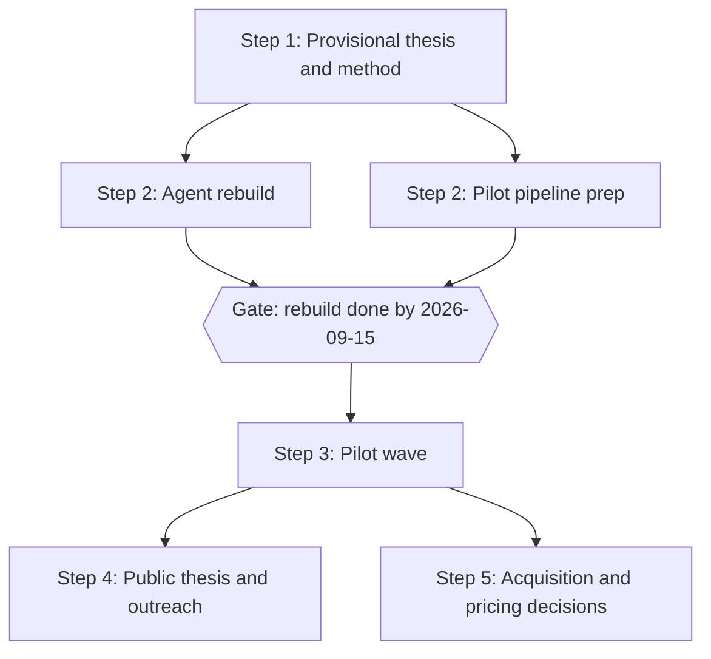

# Revelio Revamp - Plan

## Goal Capsule

- **Objective:** Sequence the Revelio revamp: consolidate existing research into a provisional thesis and method, rebuild the product as an adaptive exploration agent inside a one-month timebox, pilot it with career explorers, mature the thesis into a public one-pager, then decide acquisition and pricing on pilot evidence.
- **Product authority:** This plan. The founder's braindump and the docs/research corpus are inputs; the AI-drafted 2026-08-11 direction docs hold only where re-affirmed here.
- **Open blockers:** None. Pilot gate numbers (candidates, loops, dates) are founder-confirmed defaults, adjustable without re-scoping.

---

## Product Contract

### Summary

Revamp Revelio from a one-shot report generator into an adaptive exploration companion — an agent the user converses with across sessions — through five sequenced steps: provisional thesis, timeboxed agent rebuild with a parallel pilot pipeline, pilot wave, public thesis with field outreach, and evidence-based commercialization decisions.

### Problem Frame

Revelio was built a year ago around a one-shot flow: an 8-question questionnaire produces three purpose paths and a static action plan, exported as a report. The product has had zero real users; acquisition was attempted once, with a single unanswered LinkedIn message. The December 2025 research is desk research and synthetic-persona testing (docs/research/2025-12-26-synthetic-user-feedback.md); no demand evidence exists in either direction.

The founder — himself a member of the target audience — does not believe the current product is good enough to sell. It fails his bar in three ways: outputs are static and cannot be iterated in dialogue; experiment design is generic, with no grounding in current real-world information; and the adaptive companion that guides exploration over time — judged the real, uncracked value — does not exist. The current system prompt also assumes the user "already know[s] but ha[sn't] articulated" their purpose (server/ai/prompts.ts:174), while the accumulated research concludes that decisive self-knowledge is generated by acting, not recovered by reflection.

The rethink exists but is unstructured: a 39-thread braindump spanning thesis, product form, method design, pricing, outreach, and go-to-market. The binding constraints are a solo founder at 10–15 hours/week beside a day job, and a moat thesis — a codified evidence-based method plus demonstrable results from a tight feedback loop — that cannot materialize without users.

### Key Decisions

- **Rebuild before pilots** (session-settled: user-directed — chosen over pilot-first manual validation: the current product fails the founder's own belief bar, and he will not sell what he does not believe in). Governs R3–R9.
- **Deadline gate over user-count gate** (session-settled: user-directed — chosen over gating on acquired users: the deadline is within the founder's control). Governs R3.
- **Input gates ride alongside the deadline** (session-settled: user-approved — pipeline gates bind on actions in the founder's control, countering the risk that the build absorbs the year). Governs R10–R11.
- **Beachhead: career explorers like the founder** (session-settled: user-directed — chosen over students-now and over a criteria sprint: honest dogfooding, no gatekeepers, fastest feedback loop). Governs R6, R10, R16.
- **Thesis first, as provisional consolidation** (session-settled: user-directed — moved from post-pilot writeup to step one: the thesis states the method the rebuild embodies). Governs R1–R2.
- **Agent experience over web-app flow** (session-settled: user-directed — chosen over improving static generation: dialogue, iterable outputs, and persistent memory are both the 2026 baseline and the personalization mechanism). Governs R4–R5, R7.
- **Plan shape: two-track build month, thesis as asset** (session-settled: user-approved — chosen over a sequential relay and over a full public-essay program: no dead weeks after the build, without becoming a content project). Governs R10–R11, R14.
- **AI-drafted research is input, not decision** (session-settled: user-directed — the 2026-08-11 direction doc's conclusions hold only where the founder re-affirmed them in this plan). Pure framing; no governed Rs.

### How This Work Fits Together

<!-- ce-section: work-relationships -->

This plan owns the revamp's sequencing, scope, and gates. Each step is expected to get its own enrichment (ce-plan on this artifact, or a dedicated plan) when it starts; the breakdown below is the current understanding, not a committed roadmap.

- Step 1 — Provisional thesis and method. Can proceed immediately; enables Step 2 as its method spec.
- Step 2, build track — Agent rebuild. Depends on Step 1's method statement; ends at the R3 deadline gate.
- Step 2, pipeline track — Pilot pipeline. Can proceed independently of build content; shares the R3 gate date.
- Step 3 — Pilot wave. Depends on both Step 2 tracks.
- Step 4 — Public thesis and outreach. Depends on Step 3 evidence.
- Step 5 — Commercialization decisions. Depends on Step 3; draws on the first-customer research in docs/research/. Still to decide there: beachhead expansion, pricing, channels.

### Actors

- A1. Founder — solo builder-operator at 10–15 hours/week; also a member of the beachhead and the product's reference user.
- A2. Pilot explorer — an employed adult asking "what should I work on?"; recruited directly without gatekeepers; uses the agent and runs real-world experiments between sessions.
- A3. The Revelio agent — the rebuilt product: conversational, memory-bearing, guiding the discovery loop.
- A4. Field contacts — the Stanford Life Design network and Bill Gurley; Step 4 outreach targets, approached with prototype and pilot evidence in hand.

### Requirements

**Step 1 — provisional thesis and method**

- R1. Consolidate the existing research corpus (docs/research/) into a one-page provisional thesis covering four elements: the spiky point of view, the founding story, the vision/mission, and why this approach shows promise where others have fallen short (model: Alpha School's one-pager framing).
- R2. The thesis states the method the product embodies — generate hypotheses from reflection, design representative experiments, observe fascination and energy, update direction, commit provisionally — precisely enough to serve as the rebuild's method spec.

**Step 2, build track — agent rebuild (timeboxed)**

- R3. The rebuild is complete by 2026-09-15; scope is cut to fit the date, never the reverse.
- R4. The rebuilt product is an agent the user converses with: any output (ikigai statement, hypothesis, experiment) can be questioned, modified, and iterated in dialogue rather than regenerated from scratch.
- R5. The agent has persistent memory across sessions: it retains the user's ikigai statement, hypotheses, experiments, and observations, and its next recommendation reflects them. This requires users to be recognizable across sessions (no user identity exists today).
- R6. Experiment design is personalized and grounded: proposals fit the explorer's real constraints, test fascination with the actual practice rather than its image, and draw on current real-world information (e.g., web search).
- R7. Input is a text box with an optional microphone button reusing the existing speech-to-text capability; text remains the primary output.
- R8. The ikigai-statement foundation remains the entry experience; the rebuild replaces what follows it (static paths and action plan) with the companion loop.
- R9. Companion loop v1: the agent can guide one full discovery loop — articulate a hypothesis, design an experiment, capture the observation on return, and update the direction.

**Step 2, pipeline track — pilot pipeline**

- R10. Before 2026-09-15, a named list of at least 5 pilot candidates matching A2 and a drafted pilot invitation exist (defaults; the founder may recalibrate numbers without re-scoping).
- R11. Pilot invitations go out within 7 days of the rebuild landing.

**Step 3 — pilot wave**

- R12. A pilot counts as successful when the explorer completes one full discovery loop (per R9). Default target: 5 completed loops by 2026-10-31.
- R13. Each pilot's evidence is captured — hypothesis, experiment run, observations, and what changed in their direction — and preserved to feed the thesis and product iteration.

**Step 4 — public thesis and outreach**

- R14. The provisional thesis is matured with pilot evidence into a public one-pager.
- R15. Outreach to A4 begins only after a working prototype and at least one pilot story exist; the public thesis is the outreach vehicle.

**Step 5 — commercialization decisions**

- R16. After the pilot wave, an acquisition-and-pricing decision phase runs on pilot evidence plus the first-customer research (docs/research/first_10_customers_transcript.txt, docs/research/first_users_transcript.txt, docs/research/startup_school_first_customers_transcript.txt); the beachhead-expansion question (students, parents, schools) is decided there, not before.

### Key Flows

- F1. Discovery loop conversation (the core product behavior)
  - **Trigger:** A pilot explorer (A2) opens a session with the agent — their first or any later one.
  - **Steps:** Agent recalls stored context (R5) → converses to form or refine the ikigai statement (R8) → proposes direction hypotheses and iterates them in dialogue (R4) → co-designs one representative experiment within the explorer's constraints (R6) → the explorer leaves and runs it in the real world → on return, the agent captures observations and updates the direction (R9) → deepen, alter, or drop.
  - **Outcome:** The explorer leaves each session with a testable next step; the agent's picture of them is richer than the session before.
  - **Covers:** R4–R9.

### Acceptance Examples

- AE1. **Covers R4.** Given the agent proposes three direction hypotheses, when the explorer says one feels prestige-driven rather than fascinating, then the agent revises that hypothesis in the same conversation — it does not regenerate a whole new report.
- AE2. **Covers R5, R9, R13.** Given an explorer designed an experiment two weeks ago, when they return, then the agent recalls the hypothesis and experiment, asks what happened, records the observation, and updates its recommendation — without the explorer re-entering prior context.
- AE3. **Covers R3, R10, R11.** Given the rebuild lands 2026-09-12, when the pipeline gate is checked, then at least 5 named candidates and a drafted invitation already exist, and invitations are out by 2026-09-19.
- AE4. **Covers R15.** Given the rebuild is done but no pilot has completed a loop, when the founder is tempted to contact Stanford or Gurley, then outreach waits — the gate is prototype plus at least one pilot story, not the prototype alone.

### Success Criteria

- Founder-belief bar: at the R3 gate, the founder — as a member of the beachhead — would personally pay for and keep using the rebuilt product.
- Adaptive-value signal: pilots' return sessions produce information that visibly changes or strengthens their next decision — the test of the companion hypothesis against a one-time report.
- Year outcome: by end of 2026, real users have completed loops and the R16 decisions are made on evidence rather than conjecture.

### Scope Boundaries

**Deferred for later**

- Beachhead expansion (students, parents, schools) and any B2B motion — a Step 5 decision made on evidence.
- Pricing and payment: pilots run free; willingness-to-pay is a Step 5 question. No payment code exists today and none is built in the rebuild.
- Longer-horizon cadence (weekly check-ins, multi-loop journeys) beyond loop v1.
- Formal evals and rubrics for the method — built once pilot evidence shows what is worth measuring.
- A public essay program beyond the single one-pager.

**Outside this product's identity**

- MCP, CLI, or plugin form factors — the agent lives in Revelio's own product, usable by non-developers; agent-infrastructure surfaces would narrow the beachhead to developers.
- A comprehensive "career operating system" — the product is the discovery loop until the loop is validated.
- Prestige-optimized recommendations — the method selects for fascination with the practice over status of the outcome.

### Dependencies / Assumptions

- Assumption: the founder is representative enough of the beachhead for dogfooding to be a valid quality signal; pilot evidence is the check on this.
- Assumption: 10–15 hours/week holds through the fall; the timebox and default targets are sized to it.
- Assumption: the existing research corpus is sufficient for the provisional thesis — no new research phase precedes Step 1.
- Assumption: pilots run without payment; incentives, if any, are decided during pipeline prep.
- Dependency: the existing speech-to-text capability (docs/plans/2026-04-19-001-feat-speech-to-text-plan.md) for R7.

### Outstanding Questions

**Deferred to Planning**

- Agent runtime, framework, and system architecture — the highest-priority planning question, to be researched and reasoned from first principles rather than from the founder's hunch. The Vercel AI SDK (already in use, hosted on Vercel) is one candidate, not the default, and the option set is likely incomplete.
  - **Starting points:** https://eve.dev/docs/getting-started (also a Vercel product), https://developers.openai.com/api/docs/guides/agents, https://developers.openai.com/api/reference/responses/overview.
  - **Carries the system-design questions:** database placement, per-user memory storage (markdown-file hunch weighed against the existing Postgres store), and cross-session identity (shared/schema.ts sessions are anonymous today; R5 requires identity).
- Model selection and prompt-eval approach for the rebuilt prompts, including replacing the current "job titles" output style.
- Reuse vs replace: how much of the existing client and server survives inside the one-month timebox — partly downstream of the architecture decision above.

No Resolve-Before-Planning items remain.

### Sources / Research

- The founder's braindump (39 threads, outside the repo at ~/Andres/Revelio.md) — organized into this plan; see the Appendix disposition map.
- docs/research/2026-08-11-what-to-work-on-research.md and docs/research/2026-08-11-what-to-work-on-product-direction.md — AI-drafted synthesis and direction; inputs only, per Key Decisions.
- docs/research/2025-12-24-user-research.md and docs/research/2025-12-26-synthetic-user-feedback.md — desk research and synthetic personas; no real-user evidence exists anywhere.
- docs/research/2026-04-11-private-schools-product-direction.md and docs/research/2026-05-03-runnymede-and-parents-product-direction.md — prior directions; neither was executed.
- First-customer transcripts for Step 5: docs/research/first_10_customers_transcript.txt, docs/research/first_users_transcript.txt, docs/research/startup_school_first_customers_transcript.txt.
- Alpha School one-pager model: https://alpha.school/blog/inside-alphas-olympic-level-project-for-high-schoolers/ — spiky point of view, "best in the world" vision framing, and the why-now argument.
- Code anchors: server/ai/prompts.ts:174 (the "already know" assumption the rebuild removes); shared/streaming-schemas.ts (no hypothesis, evidence, or confidence representation); client/src/components/questionnaire/questions.ts (8 free-text questions); no payment code anywhere; no user accounts (shared/schema.ts, sessionId-keyed).

---

## Appendix

Braindump disposition map — where each theme cluster landed:

| Braindump cluster | Disposition |
|---|---|
| Thesis, mission, story, "teach a class" command | Step 1 (R1–R2); matured publicly in Step 4 (R14) |
| Agent form, voice, conversational extraction, web search | R4–R7; MCP/CLI forms excluded (Scope Boundaries) |
| Method design: question count, fascination vs passion, energize/drain, distinct paths, anti-prestige, "why do you work" | Method-spec content for Step 1 (R2) and the rebuilt prompts (R6, R8); mechanics deferred to planning |
| Follow-ups, check-ins, "a project's goal is learning" | Loop v1 (R9, R12–R13); longer cadence deferred |
| Pricing placement and level | Step 5 (R16); deferred boundary |
| First customers: individuals vs schools, feedback loop | Beachhead decision (Key Decisions) plus Step 5 (R16) |
| Outreach: Stanford, Gurley, friend-or-foe timing | R15 gate |
| Craft: model upgrade, evals, rubrics, restriction-light tools | Outstanding Questions (planning) and the post-pilot evals boundary |
