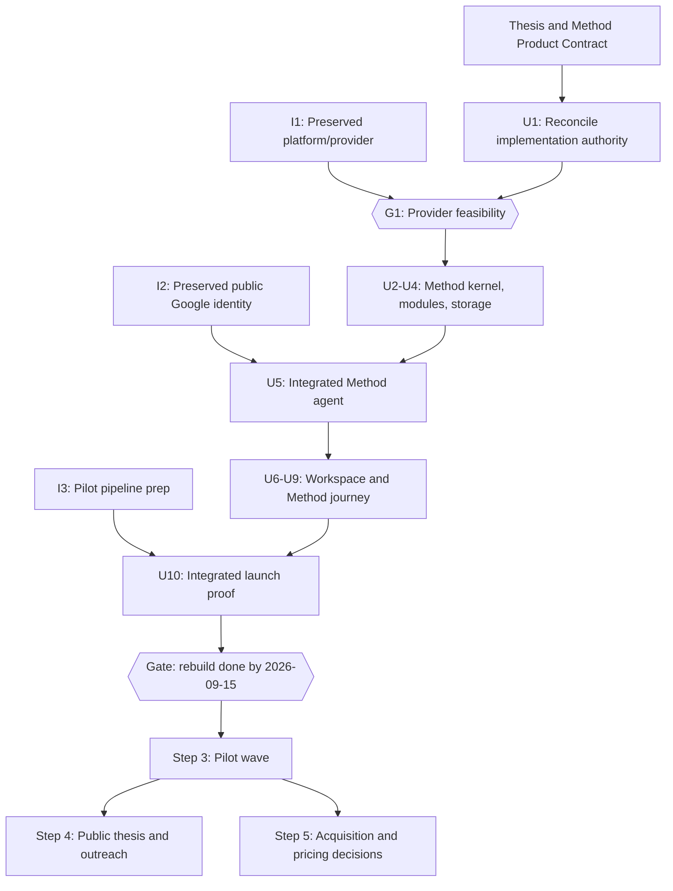
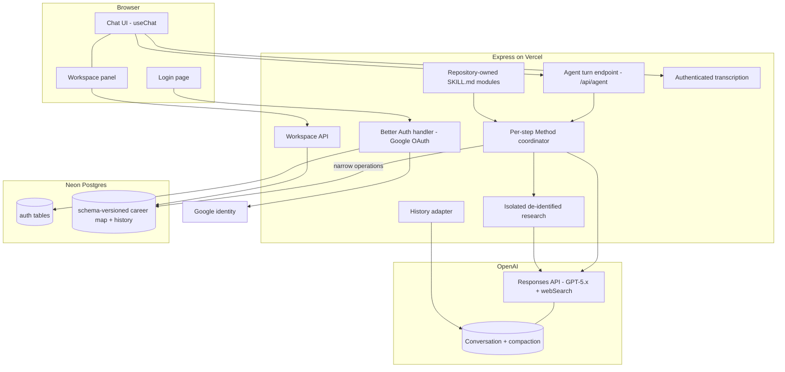
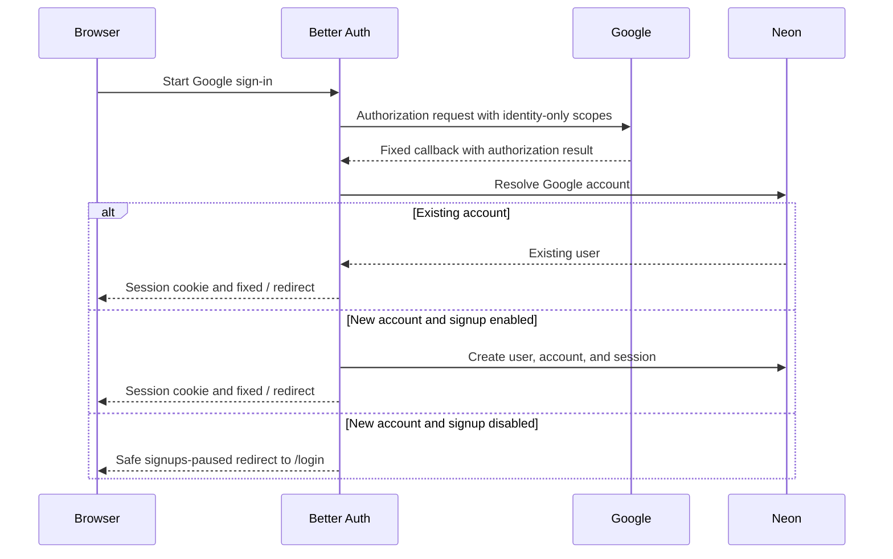
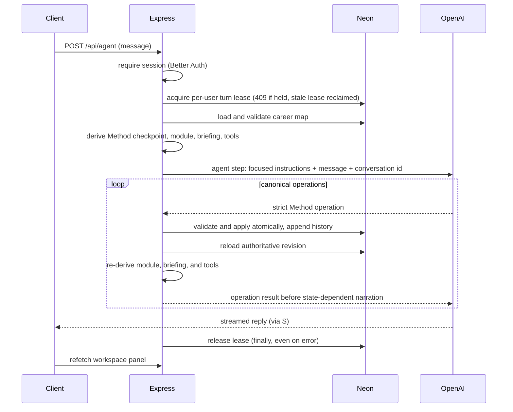
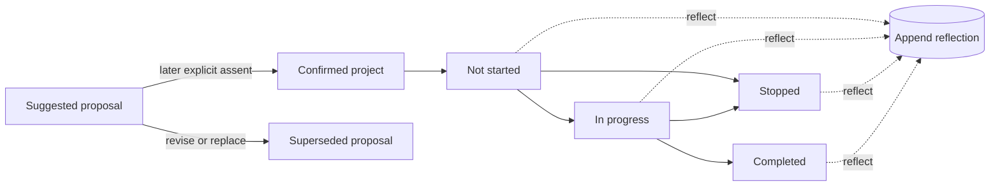

# Revelio Revamp (Claude) - Plan

## Goal Capsule

- **Objective:** Implement Steps 1–2 of the Revelio revamp to the 2026-09-15 gate: preserve the settled product shell, identity, provider, deployment, and legacy behavior; rebuild the default product around the complete Revelio Method; and prepare the pilot pipeline. Steps 3–5 stay sequenced gates, to be enriched on pilot evidence.
- **Authority hierarchy:** This plan is the implementation authority. `docs/thesis.md` is the Method authority. The tracked Product Contract at `docs/plans/2026-08-29-1133-feat-revelio-method-plan.md` must be present at that exact path and expose Method R1–R48, Method F1–F5, Method AE1–AE14, and Method KTD1–KTD12; it translates the thesis and founder-settled Method decisions into normative behavior and is incorporated here by reference. This plan owns sequencing and the preserved infrastructure contract. The explicit R9 commitment-state interpretation, R20 locale-relative canonical-copy rule, and R21 limit on custom quota policy reconcile cross-contract differences and amend the incorporated Product Contract for implementation; otherwise the thesis wins on Method philosophy, the Method Product Contract wins on product behavior, and this plan wins on implementation sequencing.
- **Execution profile:** Solo founder at 10–15 hours/week plus coding agents. The timebox governs optional polish, not silent contract erosion: preserve the 2026-09-15 gate by cutting only explicitly deferrable or non-normative scope. Removing or weakening any bound Method R/F/AE, unit verification, or Definition of Done item requires an explicit plan amendment.
- **Stop conditions:** Stop and surface — do not guess — if (a) G1 cannot preserve the provider, lease, stream, abort, idempotency, Conversation, per-step Method refresh, and compaction contracts together, (b) the AI SDK v7 upgrade breaks the legacy assessment flow beyond the fallback in I1, or (c) a new production dependency beyond those named in this plan seems needed (repo rule: ask first).
- **Tail ownership:** The founder owns gate dates, Method sign-off through the thesis and live transcripts, and pilot operations (I3, Revamp AE4). Code units are agent-executable.

---

## Product Contract

Reconciled 2026-08-29. The Revamp R/F/AE IDs as amended through the active plan's 2026-08-17 decisions keep their delivery, platform, access, rollout, and legacy-product meaning. Method behavior is governed by the Product Contract in `docs/plans/2026-08-29-1133-feat-revelio-method-plan.md`, subject only to the explicit R9, R20, and R21 reconciliation amendments; references in this plan are qualified as **Method R…**, **Method F…**, **Method AE…**, and **Method KTD…** so they cannot be confused with this plan's Revamp IDs. The Method contract is bound rather than copied here, and `docs/thesis.md` remains its philosophical authority. Any old active-plan unit names inside the bound Method artifact—such as its “current U2,” “U7a/U7b,” or Reconciliation Map rows—are pre-reconciliation mapping labels only; the Implementation Units in this active plan are the sole live unit IDs and sequencing.

This reconciliation replaces the earlier ikigai statement, direction path, experiment, generic confirmation, and continue/switch/new assumptions with Why I Work, Purpose Paths, Path Projects, What You Learned, user-owned Next Moves, meaningful peer exposure, and Side Doors. It preserves public Google identity, OpenAI Conversations and compaction, one active turn, the React/Vite + Express + Neon + Vercel stack, request-level provider safeguards, and the anonymous `/legacy` product.

### Summary

Revamp Revelio from a one-shot report generator into an adaptive exploration companion that carries the complete Method across sessions: form a provisional Why I Work, choose among three Purpose Paths, learn through Path Projects, decide the Next Move, and enter a provisionally chosen path through Side Doors. The settled infrastructure and parallel pilot pipeline support that Method rather than redefining it.

### Problem Frame

Revelio was built a year ago around a one-shot flow: an 8-question questionnaire produces three purpose paths and a static action plan, exported as a report. The product has had zero real users; acquisition was attempted once, with a single unanswered LinkedIn message. The December 2025 research is desk research and synthetic-persona testing (docs/research/2025-12-26-synthetic-user-feedback.md); no demand evidence exists in either direction.

The founder — himself a member of the target audience — does not believe the current product is good enough to sell. It fails his bar in three ways: outputs are static and cannot be iterated in dialogue; experiment design is generic, with no grounding in current real-world information; and the adaptive companion that guides exploration over time — judged the real, uncracked value — does not exist. The current system prompt also assumes the user "already know[s] but ha[sn't] articulated" their purpose (server/ai/prompts.ts:174), while the accumulated research concludes that decisive self-knowledge is generated by acting, not recovered by reflection.

The rethink exists but is unstructured: a 39-thread braindump spanning thesis, product form, method design, pricing, outreach, and go-to-market. The binding constraints are a solo founder at 10–15 hours/week beside a day job, and a moat thesis — a codified evidence-based method plus demonstrable results from a tight feedback loop — that cannot materialize without users.

### Key Decisions

- **Rebuild before pilots** (session-settled: user-directed — chosen over pilot-first manual validation: the current product fails the founder's own belief bar, and he will not sell what he does not believe in). Governs R3–R9.
- **Deadline gate over user-count gate** (session-settled: user-directed — chosen over gating on acquired users: the deadline is within the founder's control). Governs R3.
- **Input gates ride alongside the deadline** (session-settled: user-approved — pipeline gates bind on actions in the founder's control, countering the risk that the build absorbs the year). Governs R10.
- **Beachhead: career explorers like the founder** (session-settled: user-directed — chosen over students-now and over a criteria sprint: honest dogfooding, no gatekeepers, fastest feedback loop). Governs R6, R10, R16.
- **The thesis is the Method authority** (session-settled: user-directed — the completed `docs/thesis.md` states the philosophy the rebuild embodies; the Method Product Contract translates it into testable behavior without authoring a second thesis). Governs R1–R2 and all Method R1–R48.
- **Agent experience over web-app flow** (session-settled: user-directed — chosen over improving static generation: dialogue, iterable outputs, and persistent memory are both the 2026 baseline and the personalization mechanism). Governs R4–R5, R7.
- **Plan shape: two-track build month, thesis as asset** (session-settled: user-approved — chosen over a sequential relay and over a full public-essay program: no dead weeks after the build, without becoming a content project). Governs R10–R11, R14.
- **AI-drafted research is input, not decision** (session-settled: user-directed — the 2026-08-11 direction doc's conclusions hold only where the founder re-affirmed them in this plan). Pure framing; no governed Rs.
- **Adaptive, coverage-guided Foundation over a fixed questionnaire** (session-settled: user-directed — ask one short question per turn, reuse rich answers, and probe only until the evidence supports a Why I Work suggestion). Governs R8 and Method R5–R12.
- **English-only UI, language-mirroring agent** (session-settled: user-approved — chosen over maintaining the en/es i18n surface on the new product: pilots run in English; the model mirrors the user's language natively, so the i18n machinery buys nothing). Governs R20.
- **Three Purpose Paths, picked without interference** (session-settled: user-directed — the agent proposes three distinct, equally weighted ways to serve the confirmed Why; the explorer discusses, combines, modifies, or replaces them and explicitly chooses one. The agent recommends only when asked). Governs R9 and Method R13–R17.
- **One first Path Project; three later choices** (session-settled: user-directed — onboarding gets one thoughtfully designed project for collaborative refinement; after a learning loop, explore-further produces three equal project options and the explorer chooses one). Governs R9 and Method R18–R25, R48.
- **The explorer owns the Next Move** (session-settled: user-directed — evidence informs but never predicts the choice; no fixed project count, duration, score, or recommendation decides whether to explore further or commit provisionally). Governs R9 and Method R26–R33.
- **Public access behind Google identity** (session-settled: user-approved — chosen over invite-only magic links: a manual access gate adds acquisition and email-infrastructure work without current usage or abuse evidence; session-derived ownership, request-size bounds, one-turn concurrency, user interruption, billing alerts, and kill switches cover the observed pilot risk without limiting normal use). Governs R19, R21, AE6, AE10, AE11.

### How This Work Fits Together

<!-- ce-section: work-relationships -->

This plan owns the revamp's sequencing, scope, and gates and incorporates the Method Product Contract by reference. Steps 3–5 get their own enrichment when they start; their breakdown below is the current understanding, not a committed roadmap.

- Step 1 — Thesis and Method authority. `docs/thesis.md` is complete; U1 reconciles this implementation authority with the Method Product Contract.
- Step 2, infrastructure track — Platform preparation and identity (I1, I2) preserve the settled shell, public Google access, provider, and `/legacy` contracts.
- Step 2, Method track — G1 and U2–U10 implement the complete Method, with the first full learning loop as the initial emphasis.
- Step 2, pipeline track — I3's private candidate list and invitation proceed independently and share the R3 gate date; erasure-runbook finalization and its dry run wait for I2, U4, and U5.
- Step 3 — Pilot wave. Depends on both Step 2 tracks. Not unitized here.
- Step 4 — Public thesis and outreach. Depends on Step 3 evidence. Not unitized here.
- Step 5 — Commercialization decisions. Depends on Step 3; draws on the first-customer research in docs/research/. Not unitized here.

### Actors

- A1. Founder — solo builder-operator at 10–15 hours/week; also a member of the beachhead and the product's reference user.
- A2. Pilot explorer — an employed adult asking "what should I work on?"; recruited directly without gatekeepers; uses the agent and runs real Path Projects between sessions.
- A3. The Revelio agent — the rebuilt product: conversational, memory-bearing, guiding the Method lifecycle and learning loop.
- A4. Field contacts — the Stanford Life Design network and Bill Gurley; Step 4 outreach targets, approached with prototype and pilot evidence in hand.

### Requirements

**Step 1 — thesis and Method authority**

- R1. `docs/thesis.md` is the founder-approved Method authority. Pilot evidence may revise it later; implementation does not author a replacement thesis.
- R2. The tracked Product Contract at `docs/plans/2026-08-29-1133-feat-revelio-method-plan.md` must be present at that exact path and is bound in full as Method R1–R48, Method F1–F5, Method AE1–AE14, and Method KTD1–KTD12. It translates the thesis into testable behavior; this plan owns its implementation sequence and does not paraphrase it into a competing method specification.

**Step 2, build track — agent rebuild (timeboxed)**

- R3. The rebuild is complete by 2026-09-15. Optional polish and explicitly deferred surfaces are cut to fit the date; no bound Method requirement, flow, acceptance example, unit verification, or Definition of Done item is cut without an explicit contract amendment.
- R4. The rebuilt product is an agent the user converses with: Why I Work, Purpose Paths, Path Projects, learning, Next Moves, peer exposure, proof, and Side Doors can be questioned and refined in dialogue under Method R1–R48 rather than regenerated as a static report.
- R5. The agent has persistent memory across sessions: it retains the canonical Method state and lineage defined by Method R41–R46, and its next turn derives from that state. Stable server-derived identity owns the map; conversation and product memory remain separate stores.
- R6. Research and Path Project support are personalized and grounded under Method R14, R17, R19–R25, R34–R40, and R46. Current-world research uses de-identified, server-owned requests and cited provenance; it never filters for prestige or performs an external action for the explorer.
- R7. Input is a text box with an optional microphone button reusing the existing speech-to-text capability; text remains the primary output.
- R8. The entry experience forms the Foundation and a provisional Why I Work exactly as Method R5–R12 specify: one short question per turn, minimum sufficient coverage, doing evidence before consumption evidence, explicit confirmation before paths, and practical constraints kept outside the Why itself.
- R9. The companion supports the complete Method lifecycle in Method F1–F5: three unranked Purpose Paths; one collaboratively refined first Path Project; on-demand project guidance; What You Learned at any work status; a user-owned Next Move; three follow-on project options when exploring further; meaningful peer exposure before provisional commitment; proof; and three Side Doors. The user's “commit provisionally” Next Move first records `commitment_intent`; `provisional_commitment` is created and Side Doors begins only after the Method R34–R35 peer guard passes. The pre-guard “commit” edge in the Method lifecycle diagram is interpreted as intent, not completed commitment. Canonical state, not elapsed time or transcript parsing, determines what resumes.

**Step 2, pipeline track — pilot pipeline**

- R10. Before 2026-09-15, a named list of at least 5 pilot candidates matching A2 and a drafted pilot invitation exist (defaults; the founder may recalibrate numbers without re-scoping).
- R11. Pilot outreach is interest-led: the founder contacts suitable candidates as interest or a credible opportunity appears, without a fixed send deadline, canary schedule, or batch requirement.

**Step 3 — pilot wave**

- R12. A pilot counts as successful when the explorer completes one full learning loop through a user-owned Next Move (Method F1–F3, plus Method F4 only when peer exposure is triggered or commitment is chosen). The settled default target remains 5 completed loops by 2026-10-31. Separately, the founder reviews the first five completed or deliberately abandoned pilot sessions before expanding access so abandonment evidence can improve the Method without counting as completion. A session is deliberately abandoned only when its explorer or the founder records that decision explicitly; elapsed time, inactivity, or a timer never infer it. That review uses a privacy-safe founder artifact with an opaque session id, the explicit decision and actor, and minimum necessary status/operation metadata—not private reflection or transcript content.
- R13. Each pilot's canonical evidence is preserved with provenance and lineage — Foundation evidence, path and project revisions, reflection sessions, Next Moves, peer exposure, commitment, proof, Side Doors, and route outcomes as applicable — so later learning can inform the thesis and product without rewriting the basis of earlier decisions.

**Step 4 — public thesis and outreach**

- R14. The current thesis is matured with pilot evidence into a public one-pager without changing its Method authority implicitly.
- R15. Outreach to A4 begins only after a working prototype and at least one pilot story exist; the public thesis is the outreach vehicle.

**Step 5 — commercialization decisions**

- R16. After the pilot wave, an acquisition-and-pricing decision phase runs on pilot evidence plus the first-customer research (docs/research/first_10_customers_transcript.txt, docs/research/first_users_transcript.txt, docs/research/startup_school_first_customers_transcript.txt); the beachhead-expansion question (students, parents, schools) is decided there, not before.

**Cross-cutting product behavior (added at this enrichment)**

- R17. The explorer can inspect and correct the canonical Method state alongside the conversation. Deterministic components render the Foundation, three comparable Purpose Paths, the active Path Project, What You Learned, Next Move, sources, and lightweight later-stage state under Method R41–R43. Suggested/Confirmed agreement remains separate from work, reflection, selection, and evidence status. Desktop keeps chat and Your Map side by side; phones keep the two-tab layout.
- R18. Canonical changes are never recovered by parsing prose. Every accepted fact, proposal, revision, confirmation, selection, work update, reflection, Next Move, peer exposure, commitment, proof item, Side Door, and route outcome uses the narrow validated operations and auditable confirmation contract in Method R41–R46 before state-dependent narration can claim the change occurred.
- R19. The rebuilt product lives at the canonical `/` route: signed-in visitors use the chat-and-map workspace there, while signed-out visitors are sent to `/login`. The agent accepts any Google account while the founder-controlled signup switch is enabled; disabling signup blocks new accounts without preventing existing users from signing in. The legacy questionnaire starts at `/legacy` and remains anonymous; its existing results, action-plan, API, and data behavior stay intact.
- R20. The new `/` product and `/login` UI are English-only; the legacy questionnaire retains its existing en/es UI, and the agent converses in whatever language the explorer writes in. For Method R22, R26, and R29, an English conversation uses the exact canonical English sentence; a non-English conversation uses a faithful concise translation in the explorer's language. The exact-string verification gate is therefore English-locale exactness plus semantic-equivalence fixtures for any tested non-English locale.
- R21. Normal signed-in use has no fixed daily action allowance and no Revelio-specific numeric loop-stop or tool-call quota policy. The native G1 route uses the pinned AI SDK's standard loop behavior; if G1 selects the one-Response-per-step fallback, it uses the equivalent finite step budget recorded in G1's receipt. Canonical state may still change the available tools and active Method module on each step. Provider safety stays request-level and operational: bounded text/audio inputs, one active turn per user, a visible Stop control, the ability to interrupt a streaming reply by sending a new message, a billing alert, and the `AGENT_ENABLED` emergency switch. Missing or false `AGENT_ENABLED` fails closed before an agent turn or direct workspace domain-operation write can acquire a lease, load or write map/history/turn state, or call a provider; authenticated read-only history and map access remain available. An interruption cancels provider and tool work before the next message starts. The anonymous legacy routes keep their existing behavior until observed abuse justifies a targeted control.

### Key Flows

- F1. Method lifecycle conversation (the core product behavior)
  - **Trigger:** A pilot explorer (A2) opens Revelio for the first time or returns with canonical Method state.
  - **Steps:** The server derives the active checkpoint → loads the matching repository-owned Method module, focused briefing, and narrow tool set → converses naturally while validated operations persist consequential changes → reloads state and refreshes the next module after each committed operation. The user journey and branch semantics are Method F1–F5.
  - **Outcome:** The explorer leaves each session with a clear current decision or useful next action, while the map preserves what was learned and why later choices were made.
  - **Covers:** R4–R9, R17–R18; Method R1–R48 and Method F1–F5.
- F2. Foundation and first Path Project (entry into F1)
  - **Trigger:** A Google-authenticated explorer signs in for the first time; no Method state exists for them.
  - **Steps:** `/` presents a deterministic welcome without calling a model → adaptive Foundation coverage produces a Suggested Why I Work → the explorer refines and confirms it → three equal Purpose Paths are proposed and the explorer chooses one → one first Path Project is collaboratively refined and accepted with the exact Method R22 framing.
  - **Outcome:** Confirmed Why, selected Purpose Path, and accepted first Path Project with evidence and provenance in the career map.
  - **Covers:** R4–R9, R17–R18; Method F1–F2 and Method AE1–AE6.
- F3. Google sign-in and return
  - **Trigger:** A visitor opens the canonical `/` entry.
  - **Steps:** The client resolves session state without showing the wrong surface → a signed-in visitor uses the product at `/`; a signed-out visitor enters `/login` and chooses Google sign-in → Google returns to the fixed Better Auth callback → Better Auth resolves or creates the account according to the signup switch → the client returns to `/`, now showing the product. A returning Google account resolves to the same Better Auth user and career map; sign-out ends the current session.
  - **Outcome:** One stable, server-derived user identity owns every new-product request; provider tokens never enter agent context.
  - **Covers:** R5, R19.

### Acceptance Examples

- Method AE1–AE14 replace the former behavior-level Revamp examples and are incorporated in full from the Method Product Contract. Method units cite those IDs directly; this plan does not maintain paraphrased duplicates.
- AE3. **Covers R3, R10, R11.** Given the rebuild lands and the pipeline gate is checked, then at least 5 named candidates and a drafted invitation already exist; the founder contacts suitable candidates as interest or a credible opportunity appears, without a seven-day or canary deadline.
- AE4. **Covers R15.** Given the rebuild is done but no pilot has completed a loop, when the founder is tempted to contact Stanford or Gurley, then outreach waits — the gate is prototype plus at least one pilot story, not the prototype alone.
- AE6. **Covers R5, R19.** Given signup is enabled and a new visitor completes Google sign-in, then one Better Auth user, account, and session are created and the product loads at `/`; signing in later with the same Google account resolves to that same user and career map.
- AE10. **Covers R19.** Given new signups are disabled, when an unseen Google account completes OAuth it is denied with safe retry copy, while an existing Revelio account using Google can still sign in.
- AE11. **Covers R21.** Given a signed-in explorer continues a long conversation on the same day, then no arbitrary daily allowance blocks normal use; the native G1 route follows the pinned AI SDK defaults, while a selected one-Response-per-step fallback uses its receipt-recorded equivalent finite step budget. Oversized input, a simultaneous second turn, or the emergency switch still fails safely. When a reply appears stuck, Stop cancels it, and submitting "You seem stuck" while it streams cancels that reply before sending the new message.

### Success Criteria

- Founder-belief bar: at the R3 gate, the founder — as a member of the beachhead — would personally pay for and keep using the rebuilt product.
- Adaptive-value signal: pilots' return sessions produce information that visibly changes or strengthens their next decision — the test of the companion hypothesis against a one-time report.
- Year outcome: by end of 2026, real users have completed loops and the R16 decisions are made on evidence rather than conjecture.

### Scope Boundaries

**Deferred for later**

- Beachhead expansion (students, parents, schools) and any B2B motion — a Step 5 decision made on evidence.
- Pricing and payment: pilots run free; willingness-to-pay is a Step 5 question. No payment code exists today and none is built in the rebuild.
- Proactive reminders, timers, guilt-inducing check-ins, and re-engagement email. Multi-loop journeys are in scope when the explorer chooses them; automatic cadence is not.
- Invite allowlists, magic-link email, passwords, and additional social providers — Google identity is the only sign-in method in this build.
- A controlled custom domain and Google OAuth brand/production verification — required before broad commercial launch, but not for this pilot because the External Google project stays in Testing and requests only identity scopes.
- A production eval platform. Verification uses deterministic invariant tests plus versioned golden transcripts and the Method contract's qualitative rubric; no new eval-framework dependency is added before pilot evidence shows it is needed.
- A public essay program beyond the single one-pager.
- Migrating auth to Neon Managed Better Auth if/when it reaches GA with a documented first-class Express path (see KTD8).
- A Spanish product UI; retiring the old app's en/es machinery happens when the old app itself is retired.
- A general version-history UI for the career map (history and lineage are stored from day one; focused basis-review and repair-required states are in scope, a full history browser is not).
- Pilot-ops reporting (e.g., a stall report over active Path Projects) — a Step 3 concern once pilots exist; no timer or proactive reminder belongs in the Method build.

**Outside this product's identity**

- MCP, CLI, or plugin form factors — the agent lives in Revelio's own product, usable by non-developers; agent-infrastructure surfaces would narrow the beachhead to developers.
- A comprehensive "career operating system" — the product is the complete Method through lightweight Side Doors, with the first learning loop as the implementation emphasis.
- Prestige-optimized recommendations or unsolicited rankings — the explorer owns consequential choices, and the agent recommends only when explicitly asked.

### Dependencies / Assumptions

- Assumption: the founder is representative enough of the beachhead for dogfooding to be a valid quality signal; pilot evidence is the check on this.
- Assumption: 10–15 hours/week holds through the fall; the timebox and default targets are sized to it.
- Assumption: the founder-approved `docs/thesis.md` is sufficient Method authority for implementation; pilot evidence, not another pre-build research phase, is the next planned challenge to it.
- Assumption: pilots run without payment; incentives, if any, are decided during pipeline prep.
- Dependency: the existing speech-to-text capability (docs/plans/2026-04-19-001-feat-speech-to-text-plan.md) for R7.
- Dependency: an OpenAI API account with billing (KTD3, KTD4), a Google Cloud OAuth web client configured for the exact local and production callbacks, and Vercel secrets. These are founder-provisioned in Stage 0; no OpenAI hard spend limit is required for this pilot.

### Outstanding Questions

The origin's three deferred-to-planning questions are resolved in the Planning Contract: agent runtime and architecture (KTD1–KTD7 plus Method KTD1–KTD12), model selection and modular prompt approach (KTD3, G1, U3), and reuse-vs-replace (KTD1). Remaining questions, all deferred (non-blocking):

- Which exact GPT-5.x snapshot to pin — G1 compares candidate snapshots that are current at build time and records its passing set and selected snapshot in the durable receipt. U3 may select only from that set; introducing a new snapshot reopens G1 and updates the receipt. Conversational latency is a selection criterion: U3's golden transcripts double as the comparison harness, and a faster passing snapshot beats a slower flagship.
- Compaction threshold tuning (KTD4) — begin with the provider behavior proved in G1 and adjust from real turn sizes during dogfooding without weakening the safe-boundary rule.
- Pilot incentives — decided during I3, not a build input.

### Sources / Research

- The founder's braindump (39 threads, outside the repo at ~/Andres/Revelio.md) — organized into this plan; see the Appendix disposition map.
- `docs/thesis.md` — philosophical and Method authority.
- `docs/plans/2026-08-29-1133-feat-revelio-method-plan.md` — bound Method Product Contract, technical reconciliation, and governing Method R/F/AE/KTD IDs.
- `docs/research/2026-08-28-side-doors-career-entry.md` — Side Doors method and entry-route research.
- docs/research/2026-08-11-what-to-work-on-research.md and docs/research/2026-08-11-what-to-work-on-product-direction.md — AI-drafted synthesis and direction; inputs only, per Key Decisions.
- docs/research/2026-08-25-vocation-competitor-dossier.md — point-in-time commercial competitor research; sharpens the differentiation around representative-work evidence without changing pilot scope or treating competitor pricing as willingness-to-pay evidence.
- docs/research/2025-12-24-user-research.md and docs/research/2025-12-26-synthetic-user-feedback.md — desk research and synthetic personas; no real-user evidence exists anywhere.
- docs/research/2026-04-11-private-schools-product-direction.md and docs/research/2026-05-03-runnymede-and-parents-product-direction.md — prior directions; neither was executed.
- First-customer transcripts for Step 5: docs/research/first_10_customers_transcript.txt, docs/research/first_users_transcript.txt, docs/research/startup_school_first_customers_transcript.txt.
- Alpha School one-pager model: https://alpha.school/blog/inside-alphas-olympic-level-project-for-high-schoolers/ — spiky point of view, "best in the world" vision framing, and the why-now argument.
- Code anchors: server/ai/prompts.ts:174 (the "already know" assumption the rebuild removes); shared/streaming-schemas.ts (no hypothesis, evidence, or confidence representation); client/src/components/questionnaire/questions.ts (8 free-text questions); no payment code anywhere; no user accounts (shared/schema.ts, sessionId-keyed).
- Planning research sources are cited inline on the KTDs they justify.
- Auth sources verified 2026-08-17: Better Auth Express, Google provider, PostgreSQL adapter, rate-limit, and test-utils documentation at https://better-auth.com/docs; Google Auth Platform audience rules at https://support.google.com/cloud/answer/15549945; Vercel request-header behavior at https://vercel.com/docs/headers/request-headers.

---

## Planning Contract

The architecture was researched from first principles per the origin's planning question, with candidates verified against live documentation in August 2026. Facts below marked "verified" were checked against current docs or source; anything time-sensitive should be re-checked briefly at build time.

Consolidated 2026-08-14 (user-directed): a thin layer of reliability protections merged in from the parallel codex plan (docs/plans/2026-08-14-codex-1824-feat-revelio-agent-rebuild-plan.md) — live provider spike, retry idempotency, version-checked writes, compaction guard, markdown/citation rendering policy, agent kill switches, staged outreach, reviewed production migration, erasure runbook, Node 24 pin, and the native PostgreSQL auth adapter. The write model stays conversational write-through with the Suggested/Confirmed boundary (no approval cards). The 2026-08-17 auth amendment replaces the former invite and email mechanics in place.

Reconciled 2026-08-29: KTD1–KTD4 and KTD7–KTD10 remain settled and authoritative. KTD5 and KTD6 are amended below to host the Method kernel and its operations. Method KTD1–KTD12 in the bound Method Product Contract govern the domain model, module loader, isolated research, deterministic presentation, and per-step refresh without changing this plan's provider, identity, concurrency, deployment, or legacy ownership.

### Key Technical Decisions

- KTD1. **Platform-retaining rebuild.** Keep the React/Vite client, Express server, Neon Postgres, and Vercel hosting; delete only the dead report-generation files enumerated in I1, preserve the working legacy questionnaire per KTD9, and build the agent inside the shell. (session-settled: user-approved — chosen over a greenfield Next.js rebuild or the vercel/chatbot template: the template was verified to ship four artifact subsystems, next-auth beta, and an AI-Gateway default that would all need gutting; the shell is not what failed, and nothing in this rebuild needs Next.js.) Governs the origin's reuse-vs-replace question.
- KTD2. **Agent runtime: Vercel AI SDK agent loop on v7.** Use the SDK's agent abstraction (`ToolLoopAgent`) with custom tools, streamed to the existing Express response via the SDK's UI-message stream helpers; the client uses `useChat` from `@ai-sdk/react`. Platform-prep commit `15841f8` moved the repository to `ai` v7 and matching `@ai-sdk/*` v4 packages; I1 now verifies and preserves that landed baseline. (session-settled: user-approved — chosen from a first-principles field over: OpenAI Agents SDK for JS (loop is fine but the streaming-UI and React story is thinner); Eve (a hosted-agent platform, wrong shape for an in-product companion); Mastra and LangGraph (workflow-framework weight this single-loop product does not need); a thin hand-rolled `openai` SDK loop (re-implements streaming, tool orchestration, and client wiring the SDK already owns). The incumbent won on merits, not on migration cost, which the founder ruled out as a deciding factor.) The latest v6 remains the recorded emergency fallback only if a newly discovered v7 regression makes the preserved legacy chain infeasible; exercising it requires an explicit plan amendment rather than treating the landed upgrade as pending. Repository-owned Method `SKILL.md` modules are loaded by the application per Method KTD3; this does not move skill execution to OpenAI-hosted Skills.
- KTD3. **Model: OpenAI GPT-5.x via the `@ai-sdk/openai` Responses provider, with the built-in web-search tool.** OpenAI's `webSearch` provider tool composes with custom function tools in the same loop (needed for R6: grounded Method research plus career-map writes; Method KTD10 adds a server-owned, de-identified research operation without changing provider ownership). (session-settled: user-directed — the braindump directs "Change to gpt 5.5 or 5.6 model"; chosen over staying on Gemini: verified that Gemini's `google_search` tool cannot be combined with custom function tools — open bug vercel/ai#8258 (https://github.com/vercel/ai/issues/8258), with Google gating the combination behind a Gemini-3-only preview API — which would force two-pass workarounds for R6.) G1 tests candidate snapshots and records a passing set plus the selected pinned snapshot in its receipt; U3 may use only that passing set. A later U3 proposal to introduce a snapshot outside it reopens G1 and updates the receipt before the snapshot is used.
- KTD4. **Conversation transcript lives in OpenAI Conversations, with server-side compaction.** Each user gets one OpenAI conversation object; turns pass its id through first-class `@ai-sdk/openai` Responses provider options (`conversation`, `store: true`), so OpenAI persists and threads the transcript. The small Method base instructions, active Method module, and focused career-map briefing are request-scoped: refresh them on every model step as `providerOptions.openai.instructions`, and leave `ToolLoopAgent`'s top-level `instructions` unset because the I1 live spike proved that agent-level instructions become stored developer/system conversation items. Enable Responses-API compaction through `providerOptions.openai.contextManagement` with `compactThreshold: 1000` initially; the live API accepted that threshold and emitted a compaction item. Apply compaction only on step 0 of a new turn, after the prior tool loop has completed, and omit it from later tool-result continuation steps: forcing compaction while a client function-tool call was pending produced `400 No tool call found for function call output` in the I1 spike. G1 must prove that per-step Method instructions and tools can refresh after a committed result while preserving this safe boundary, or select the explicit one-Response-per-step fallback. Current provider documentation does not specify that plain user/assistant messages are excluded from compaction, so no product behavior may rely on that former caveat; the exact content selection remains provider-controlled and unverified. U5 owns a session-protected history adapter: it resolves the provider Conversation id only from the authenticated user's server-side mapping, never accepts a user or Conversation owner/id from the client, paginates `GET /v1/conversations/{id}/items` to exhaustion, and allowlists only user/assistant display content while excluding provider-internal system, developer, compaction, reasoning, and tool items. U6 owns hydration of those normalized UI messages. Deleting a conversation does not cascade to its items; I3's erasure runbook must paginate and delete every item before deleting the conversation itself. (session-settled: user-directed — the user chose OpenAI-side transcript storage and explicitly wants compaction: "openai's compaction is great, we definitely want to make use of it"; chosen over BYO `UIMessage[]` persistence in Postgres: no transcript-persistence code to build and compaction comes free; accepted tradeoff: the transcript is readable only through OpenAI's API and couples that surface to the vendor — the career map, the durable product asset, stays in our database per KTD5.) Sources: OpenAI Conversations, Responses, and compaction documentation at developers.openai.com, plus the I1 live provider spike and G1; verified 2026-08-17.
- KTD5. **Product memory: one schema-versioned Method career-map document per user in Neon Postgres.** The `career_maps` JSONB document remains the durable product memory, but its runtime model is composed from domain schemas for Foundation evidence and Why revisions, Purpose Path sets, Path Project cycles, reflections, peer exposure, Next Moves, commitment, proof, Side Doors, sources, and route outcomes. A `schemaVersion` governs document compatibility separately from the row revision used for compare-and-swap writes. Canonical records preserve source provenance, basis revisions, decision lineage, and append-only history; changing a basis marks the full downstream closure for review without deleting completed work or evidence. Storage validates the complete map on load and before commit; an unsupported or invalid document fails closed into repair-required and never enters a model briefing. A focused markdown projection is compiled for the active Method checkpoint rather than assuming the map stays one page. Conversation memory and product memory remain separate stores: KTD4 owns what was said; this KTD owns what is canonically true. The one-document + history choice, Neon ownership, and OpenAI conversation-id mapping remain unchanged. Implements R5, R13, R17, R18 and Method R11, R16, R23, R33, R38, R41–R46; incorporates Method KTD1, KTD2, KTD7, and KTD8.
- KTD6. **Every canonical change uses a narrow domain operation with auditable conversational confirmation.** Generic upserts, unrestricted workspace patches, and generic `mark_confirmed` are replaced by one versioned operation surface shared by agent tools and deterministic UI actions. Exact-three Purpose Path sets, exact-three follow-on Path Project sets, exact-three Side Door sets, path selection with sibling parking, project replacement, evidence/reflection append, peer exposure, commitment, proof, route selection, and transitive invalidation are atomic where their invariant spans multiple records. Model-created interpretations and proposals enter as Suggested; a confirm or select operation may target only one pending revision rendered in a completed prior assistant turn or an explicit UI action. The reducer rejects same-turn self-confirmation, stale or edited targets, ambiguous multi-target assent, and illegal transitions while keeping assent conversational. Each committed operation bumps the row revision, appends one idempotent history result, reloads canonical state, and re-derives the Method module, focused briefing, and available tools before the next model step. State-dependent prose is withheld until the operation result is known; aborted or rejected work cannot be narrated as committed. This preserves write-through durability and the KTD7 turn contract while implementing Method KTD4–KTD6 and KTD12.
- KTD7. **Turn durability and concurrency contract.** Tool execution errors are returned into the loop as tool results (the agent sees the failure and can retry or tell the user), never thrown across the stream. One turn per user at a time, enforced with a per-user lease in Postgres: the lease carries an expiry above the platform's 300-second function cap, is released in a finally path after completion, error, or user cancellation, and a stale lease is reclaimed by the next turn — a crashed turn can never lock a user out. Retries are idempotent at two levels: the client sends a generated message id with each turn, so a network retry attaches to the existing turn record instead of starting a new one; and each applied map write records its tool-call id in the change history with a per-map uniqueness guard, so a duplicated tool result cannot apply twice. Attaching never re-streams or re-invokes the model: a retried message id whose turn is still in flight gets the in-progress response (409 with turn status), and one whose turn already completed gets a small completed marker directing the client to refetch history and the workspace panel. A concurrent turn gets HTTP 409 and the client shows "one conversation at a time." A user interruption is sequential rather than concurrent: the client aborts the current fetch, Express bridges the closed request into an `AbortSignal` for the agent and tools, the turn is marked cancelled and its lease is released, then any queued new message is submitted with its own id. Tool writes committed before cancellation remain authoritative and deduplicated; an in-flight database transaction is atomic; the partial assistant reply is visibly marked "Stopped" and is never treated as a conclusion by itself. Stream resumption remains off because the AI SDK documents it as incompatible with manual abort; history and the workspace are refetched after cancellation. Workspace domain-operation requests count as turns for locking: they take the same per-user lease and version check, get 409 while a turn is in flight, and the client disables panel actions while a reply streams. No generic PATCH, DELETE, or raw-document mutation route exists. The client refetches the workspace panel after every completed or cancelled turn so R17's view never goes stale against tool writes.
- KTD8. **Auth: direct Better Auth 1.6.29 with Google OAuth on Express.** Install and pin Better Auth in I2, configure only the Google provider, and use its documented PostgreSQL adapter with a `pg.Pool` against Neon's pooled connection string; promote the repo's existing `pg` devDependency to production instead of using the incompatible Better Auth Drizzle adapter, whose 1.6.29 peer range requires `drizzle-orm ^0.45.2` while this repo uses `^0.39.1`. Better Auth owns an `auth` PostgreSQL schema through a pool-level search path, while Drizzle remains explicitly scoped to `public`; this isolates migrations without a fragile table-name exclusion list. Mount the Express v4 handler before both body parsers in `server/app.ts`, and derive protected-route sessions from request headers. The Google project stays External and in Testing for the pilot, requests only Google's identity scopes (`openid`, `userinfo.email`, and `userinfo.profile`; Better Auth emits the equivalent authorization names `openid email profile`), and uses fixed callbacks at `http://localhost:5001/api/auth/callback/google` and `https://revelio-me.vercel.app/api/auth/callback/google`; Google's current Sign in with Google exception lets any Google account use that identity-only Testing client without a test-user allowlist, warning, or seven-day expiry. Preview deployments are signed-out smoke surfaces because Google does not support wildcard callbacks. `AUTH_SIGNUPS_ENABLED` fails closed when absent or invalid and maps to provider-level signup disabling: new accounts stop, existing accounts still sign in. Account linking stays disabled while Google is the sole provider, `account.encryptOAuthTokens: true` encrypts stored OAuth tokens, and provider tokens never enter client payloads, logs, or agent context. Better Auth's IP rate limiter uses database storage; production trusts only Vercel's overwritten `x-forwarded-for`, while development and tests use the socket address instead of a client-supplied forwarded chain. It protects `/api/auth/*`; KTD10 owns the separate request-level provider safeguards. Session cookies retain HttpOnly, Secure-in-production, and SameSite=Lax defaults, and CSRF, origin, and OAuth state checks stay enabled. Better Auth CLI migration SQL is generated with the matching 1.6.29 CLI, reviewed on a disposable Neon branch, and applied separately from Drizzle. (session-settled: user-approved — chosen over invite-only magic links: no observed usage or abuse justifies the extra access, email, scanner, and allowlist machinery; chosen over Neon Managed Better Auth: it remains Beta and does not provide a documented first-class Express server path. A future migration remains plausible because both use Better Auth concepts.) Sources: https://better-auth.com/docs/integrations/express, https://better-auth.com/docs/authentication/google, https://better-auth.com/docs/adapters/postgresql, https://better-auth.com/docs/concepts/rate-limit, https://support.google.com/cloud/answer/15549945 — verified 2026-08-17.
- KTD9. **The rebuilt product lives at `/`; the anonymous app is preserved at `/legacy`.** `/` renders the authenticated chat-and-map workspace or sends a signed-out visitor to `/login`; there is no separate `/explore` product route. The existing questionnaire flow starts at `/legacy`; its current results and action-plan routes, tables (`assessment_sessions`, `purpose_paths`), anonymous identity model, APIs, and provider behavior continue per R19. Old assessment data is retained; no migration of it into career maps.
- KTD10. **Provider safety uses SDK defaults plus user interruption, not a Revelio usage policy.** Signed-in explorers can use the agent normally without user- or IP-based daily counters, a custom numeric loop-stop, or a custom tool-call quota. On G1's native route, U5 leaves the pinned AI SDK's standard agent-loop behavior unchanged (currently a 20-model-step default) instead of adding a custom numeric condition; canonical state may still determine the active module and per-step tool availability. The loop ends when the model gives a final answer, the SDK default is reached, the user interrupts, a real error occurs, or the platform request ends. If G1 selects the one-Response-per-step fallback, its durable receipt records an equivalent finite step budget and the fallback verification/Definition of Done use that recorded budget rather than claiming SDK-default behavior. The new provider routes enforce bounded text and audio inputs before provider work, reuse KTD7's one-active-turn and cancellation contract, emit privacy-safe operational logs, and honor the fail-closed `AGENT_ENABLED` switch before an agent turn or direct workspace domain-operation write can touch lease, map, history, turn, or provider state; authenticated read-only history and map access remain available while disabled. The founder watches the OpenAI billing alert during the pilot. The anonymous legacy provider routes remain unchanged until observed abuse justifies a targeted control. (session-settled: user-directed — chosen for simplicity over speculative persistent quotas or custom loop rules: there is no observed usage or abuse, and the pinned SDK already supplies a reasonable default.) Implements R21. Sources: https://ai-sdk.dev/docs/agents/loop-control, https://ai-sdk.dev/docs/advanced/stopping-streams — verified 2026-08-17.

### High-Level Technical Design

Component topology:

Google sign-in (directional; Better Auth owns OAuth state and callback validation):

One agent turn:

Path Project state is orthogonal rather than one serialized lifecycle (Method KTD7):

- **Proposal agreement:** Suggested → Confirmed, Superseded, or Parked.
- **Work status after confirmation:** Not started → In progress, Stopped, or Completed; scope revision does not imply a fit verdict.
- **Reflection:** append-only What You Learned sessions may open while work is Not started, In progress, Stopped, or Completed and never overwrite the work or agreement status.

Purpose Paths have their own lifecycle: a valid set always contains exactly three equal Suggested options; an explicit selection activates one and parks two atomically. Why, path, project, learning, peer, commitment, proof, and Side Door records retain basis revisions so later changes invalidate dependent conclusions for review without deleting evidence. The normative lifecycle and branch semantics are Method R10–R40 and Method KTD2, KTD5–KTD9.

### Stage 0 — Founder provisioning

Stage 0 prepares external services without changing application code. Before I1 and G1, confirm OpenAI billing, configure a billing alert, and make `OPENAI_API_KEY` available locally; no hard spend limit is required. Install and authenticate the Neon CLI now; create the disposable database branch when I2 generates the auth schema. Before I2, create a Google OAuth web client with an External + Testing audience, identity-only scopes, and the local callback at `http://localhost:5001/api/auth/callback/google`. Before U10, add the production callback at `https://revelio-me.vercel.app/api/auth/callback/google` and prepare the production Vercel secrets. Better Auth itself is not a Stage 0 install: I2 pins the dependency, implements it, and reviews its migration in one unit. A controlled domain and Google's production brand verification remain a later, non-blocking milestone.

### Sequencing

U1 is the authority gate and must land before any new Method code. I1, I2, and founder-owned I3 preserve the existing platform, identity, and pilot-operation tracks; they may proceed independently where their original dependencies allow. G1 follows U1 and I1 and owns the pre-kernel provider stop condition. The fixture-only Purpose Paths prototype in U6 may start after U1 in parallel with G1.

After G1 passes, U2 defines the model-free Method kernel. U3 validates the first three repository-owned modules against an in-memory reducer while U4 implements durable storage, turn/lease records, and focused briefing. I2 must be available before U5 joins the kernel, modules, storage, provider loop, and authenticated route. U6 connects the deterministic workspace after U2 and U5 and cannot finalize the Purpose Paths layout before the prototype contract is selected. U7 ships Foundation through the first accepted Path Project; U8 closes the learning loop and peer guard; U9 adds the lightweight Side Doors tail; U10 proves and deploys the integrated journey. The critical path is U1 + I1 → G1 → U2 → U3/U4 → U5 → U6 → U7 → U8 → U9 → U10. I2 is a hard prerequisite for U5. I3's private candidate list and invitation begin immediately, while its cross-store erasure drill waits for I2, U4, and U5; all I3 evidence is required by U10.

---

## Implementation Units

Method-unit summaries below incorporate the same-ID unit contracts in `docs/plans/2026-08-29-1133-feat-revelio-method-plan.md` by reference, including their complete approach, edge cases, test matrices, and verification. The active plan adds the preserved infrastructure prerequisites and deployment tail. Qualified Method IDs are normative; unqualified R/AE/KTD IDs remain Revamp IDs.

| ID | Title | Key files | Depends on |
|---|---|---|---|
| I1 | Platform preparation and legacy-safe provider upgrade | `package.json`, `server/env.ts`, provider spike | — |
| I2 | Identity and public Google sign-in | auth server/client files, `client/src/App.tsx` | I1 |
| I3 | Pilot pipeline and erasure artifacts | `docs/pilots/` | — for invitation; I2, U4, U5 for erasure drill |
| U1 | Reconcile the active revamp authority | this plan | — |
| G1 | Prove the provider boundary | provider spike, `package.json` | U1, I1 |
| U2 | Build the Method kernel | `shared/career-map/` | U1, G1 |
| U3 | Load and evaluate the first Method modules | `server/ai/method/`, evaluation script | U2, G1 |
| U4 | Persist and brief the full career map | storage, shared schema, briefing | U2 |
| U5 | Integrate stage-specific tools into the agent loop | agent, tools, route | U3, U4, I2, G1 |
| U6 | Prototype and build deterministic Method presentation | prototype, explore components/page | U1 for prototype; U2, U5 for connected UI |
| U7 | Ship Foundation through first Path Project | first three modules, workspace tests | U5, U6 |
| U8 | Close the learning loop and peer guard | guidance, reflection, peer modules | U7 |
| U9 | Add the lightweight Side Doors tail | Side Doors module and state renderer | U8 |
| U10 | Prove and deploy the complete Method journey | e2e, evaluation, Vercel config | U7–U9, I3 |

### I1. Platform preparation and legacy-safe provider upgrade

- **Goal:** Verify and preserve the landed React/Vite, Express, Neon, Vercel, AI SDK v7, OpenAI Responses/Conversations, and anonymous legacy baseline while completing only its remaining configuration and preview evidence. Serves Revamp R3, R19–R21 and KTD1–KTD4, KTD9, KTD10.
- **Method requirements:** Method R41, R44–R46 only for provider and module compatibility; no Method behavior is implemented here.
- **Files:** Landed in `15841f8`: `package.json`; `package-lock.json`; `.nvmrc`; `server/env.ts`; `.env.example`; `scripts/openai-provider-spike.mjs`; deletion of `server/ai/wrapper.ts`, `server/ai/schemas.ts`, `server/ai/types.ts`, `client/src/lib/gemini.ts`, and `server/cache.ts`; removal of unused `express-session`, `passport`, `passport-local`, `connect-pg-simple`, `memorystore`, and their unused `@types` packages. Remaining I1 edits are limited to `server/env.ts` and `.env.example` for `AGENT_ENABLED`, plus any small regression correction proven necessary by verification.
- **Approach:** Treat platform-prep commit `15841f8` as the current baseline, not pending work: `engines.node` is `24.x`; `.nvmrc` exists; `ai` is v7 with matching `@ai-sdk/*` v4 packages; Zod is `^3.25.76` and remains on v3 because `zod-validation-error@3` peers on v3 and `server/env.ts` uses the removed `error.errors` API; Groq transcription and the legacy Google provider remain; `@ai-sdk/openai` and the spike exist; and only the enumerated dead code/dependencies were removed. Verify that baseline under Node 24 and confirm `process.version` on a Vercel preview. Preserve latest v6 only as KTD2's explicit emergency fallback. Existing optional `OPENAI_API_KEY`, `GOOGLE_CLIENT_ID`, `GOOGLE_CLIENT_SECRET`, `BETTER_AUTH_SECRET`, `BETTER_AUTH_URL`, and `AUTH_SIGNUPS_ENABLED` values keep safe defaults so unprovisioned agent/auth services cannot take down `/legacy`; add `AGENT_ENABLED` with the same fail-closed property. I2 and U5 fail fast at their call sites when required credentials are empty, and both switches fail closed. Secrets live only in encrypted Vercel environment variables and never in the repo or logs. The existing spike continues to prove Conversation threading, request-scoped instructions, completed-turn compaction, mixed built-in/custom tools, and non-cascading Conversation deletion. G1 extends it with the Method-specific boundary rather than moving those settled facts.
- **Test scenarios:** The existing Vitest, build, and legacy Playwright journey pass; the legacy questionnaire still streams end to end from `/legacy`; the spike creates, continues, compacts, inspects, and fully deletes its own provider data.
- **Verification:** `npm run check`, `npm test`, `npm run test:e2e`, `npm run build`, `npm run spike:openai`; a Vercel preview confirms Node 24.

### I2. Identity and public Google sign-in

- **Goal:** Preserve stable public Google identity, the fail-closed signup switch, server-derived ownership, and the canonical-route split. Serves Revamp R5, R19 and Revamp AE6, AE10 per KTD8 and KTD9.
- **Method requirements:** Method R41 for ownership of canonical state; otherwise this is a platform prerequisite.
- **Files:** `package.json`; Better Auth schema SQL; `server/auth.ts`; `server/auth-middleware.ts`; `server/app.ts`; `server/env.ts`; `.env.example`; `drizzle.config.ts`; `client/src/lib/auth-client.ts`; `client/src/pages/login.tsx`; `client/src/App.tsx`; focused auth tests.
- **Approach:** Preserve the original identity contract unchanged: pin Better Auth 1.6.29; use Google as the only provider and a dedicated PostgreSQL adapter in the `auth` schema; mount the handler before body parsers; derive protected identity only from the server session; keep identity-only scopes and the exact local/production callbacks; fail `AUTH_SIGNUPS_ENABLED` closed for new accounts while allowing existing users; encrypt OAuth tokens; keep provider tokens out of client payloads, logs, and agent context; retain Better Auth CSRF, origin, state, cookie, and database-rate-limit protections. `/` is the authenticated product, `/login` is the signed-out entry, and the anonymous existing journey starts at `/legacy` with no migration into Method maps.
- **Test scenarios:** Preserve the original auth matrix: new/repeat Google sign-in, scope set, encrypted tokens, trusted address source, OAuth failure paths, signup disabled behavior, session cookie/logout/401, mount order, canonical routing, and anonymous legacy routes.
- **Verification:** `npm run check`, `npm test`; manual local Google smoke with an account outside the Cloud project falsifies the identity-only External + Testing assumption before U5. U10 still owns the stable production callback smoke.

### I3. Pilot pipeline and erasure artifacts

- **Goal:** Preserve the interest-led pilot pipeline and founder-run cross-store erasure contract. Serves Revamp R10–R11, Revamp AE3, and KTD4, KTD8.
- **Method requirements:** Method R41–R47 for the canonical records and sources the runbook must remove; no Method behavior is implemented here.
- **Dependencies:** Candidate-list and invitation drafting have none. Finalizing and dry-running the cross-store erasure runbook depends on I2, U4, and U5.
- **Files:** `docs/pilots/invitation.md`; `docs/pilots/erasure.md`; the private named-candidate list remains outside git.
- **Approach:** Keep at least five candidate names outside the repository, draft one invitation pointing only to the canonical `/` product, and follow interest rather than a canary calendar. The erasure runbook revokes sessions and removes Better Auth identity/provider records, the map and history including sources/drafts/leases/idempotency records, and every paginated OpenAI Conversation item before the Conversation itself. Partial cross-store failure remains pending until all stores confirm deletion.
- **Verification:** Revamp AE3 gate check on 2026-09-15 and a dry run of the erasure checklist against non-production fixtures.

### U1. Reconcile the active revamp authority

- **Goal:** Amend the active implementation plan so one authority describes the new Method without disturbing settled infrastructure decisions.
- **Governing Method:** Method R1–R48, Method F1–F5, Method AE1–AE14.
- **Files:** `docs/plans/2026-08-14-claude-feat-revelio-revamp-plan.md`.
- **Approach:** Replace conflicting vocabulary, Method requirements, map shape, generic tools, monolithic prompt, return flow, test scenarios, and Definition of Done; preserve KTD1–KTD4 and KTD7–KTD10; amend only KTD5 and KTD6 for the Method kernel and operations; bind `docs/thesis.md` and the tracked, present-at-path Method Product Contract instead of duplicating either. The named reconciliation amendments are R9's commitment-state interpretation, R20's locale-relative canonical-copy rule, and R21's prohibition on daily allowances and custom numeric loop-stop/tool-call quota policies—not canonical-state-derived per-step tool availability.
- **Test scenarios:** None — this unit changes planning authority, not runtime behavior.
- **Verification:** A role-based document review confirms that the tracked Method Product Contract is present at the exact bound path and exposes Method R1–R48, Method F1–F5, Method AE1–AE14, and Method KTD1–KTD12; it finds no remaining conflict among that contract, the thesis, and this plan; every changed active unit cites its governing Method requirements.

### G1. Prove the provider boundary before the Method kernel

- **Goal:** Falsify the load-bearing OpenAI and AI SDK assumptions before U2 creates durable Method architecture.
- **Governing Method:** Method R41, R44–R46; Method KTD3, KTD4, KTD10, KTD12.
- **Files:** `scripts/openai-provider-spike.mjs`; `package.json`; `docs/evidence/revelio-provider-boundary.md` (new durable receipt naming the selected route, provider/model/SDK versions, assertions, result, and supporting commit or PR).
- **Approach:** Extend I1's spike to test native per-step refresh and the explicit one-Response-per-step fallback; isolated research without Conversation context; source handles, result identifiers, citation content, and optional titles; state-result narration gating; same-turn confirmation-to-next-module transitions; abort; idempotency; and safe compaction. Compare the candidate GPT-5.x snapshots current at build time with the same assertions, and record the passing set and selected pinned snapshot in the receipt. If the fallback is selected, record its equivalent finite step budget there too. Because durable turn/lease tables do not exist until U4, G1 uses an explicit in-memory lease/idempotency harness that exercises the same acquisition, replay, abort, and terminal-result contract; U5 later proves the real PostgreSQL composition.
- **Stop condition:** If neither loop route preserves lease, streaming, abort, idempotency, Conversation ownership, same-turn module/tool refresh, and safe compaction together, stop before U2 instead of silently weakening the Method.
- **Verification:** `npm run spike:openai` passes against the selected pinned provider; the durable receipt records the candidate passing set, selected route, selected snapshot, any fallback step budget, and supporting evidence before U2 begins. U5 repeats the assertions after integration.

### U2. Build the Method kernel

- **Goal:** Define browser-safe canonical state, narrow operations, reducer guards, lineage, and the derived checkpoint selector before database or model integration.
- **Governing Method:** Method R10–R18, R23, R26–R34, R36–R48; Method F1–F5; Method AE4, AE7, AE9, AE11–AE14; Method KTD1, KTD2, KTD5–KTD9.
- **Files:** `shared/career-map/*.ts`; reducer and selector tests.
- **Approach:** Compose the map from domain schemas; implement atomic operations and full-map validation; preserve basis revisions, provenance, idempotency, exact-three sets, and transitive invalidation; derive the active module and pending decision rather than storing a linear stage. Implement test-first. The full Method U2 contract is incorporated by reference.
- **Test scenarios:** Cover exact-three path/project/Side Door sets, user selection, project numbering, reflections independent of completion, Next Move branches, peer gating, lineage invalidation, idempotent replay, stale/illegal transitions, and selector totality with model-based state-machine tests.
- **Verification:** All Method kernel tests pass without database or model; exported schemas remain browser- and server-safe.

### U3. Load and evaluate the first Method modules

- **Goal:** Replace the monolithic prompt with a validated loader and prove Form the Foundation, Create Purpose Paths, and Design a Path Project before product integration.
- **Governing Method:** Method R1–R22, R41, R44–R46; Method F1–F2; Method AE1–AE6; Method KTD3, KTD4, KTD12. Also implements Revamp R20's language-mirroring agent contract.
- **Files:** `server/ai/method/base-instructions.ts`; registry and loader; the first three `SKILL.md` bundles; loader tests; `scripts/eval-revelio-method.mjs`; `package.json`.
- **Approach:** Load exactly one registered repository-owned module from canonical state; keep voice, anti-prestige, untrusted-data, brevity, language mirroring, and write-before-summarize invariants in the small base instructions; evaluate scripted conversations against the real model with an in-memory reducer; record model, module, and content versions. Use only a snapshot in G1's recorded passing set. Do not expose filesystem discovery or OpenAI-hosted Skills to the model.
- **Test scenarios:** Cover adaptive minimum-sufficient Foundation, doing-before-consumption fallback, ten-year meaning only when missing, confirmed Why before paths, three equal distinct paths, revision/replacement/combination without ranking, one first project, wanted outcome or firsthand beneficiary, and the Method R22 canonical line. A Spanish opening receives a Spanish reply with the faithful R20 translation, and an explicit user language change is mirrored on the next turn.
- **Verification:** Loader and production-bundle smoke tests pass; three live Foundation-to-first-project samples satisfy every hard invariant and at least two satisfy the qualitative rubric without retries.

### U4. Persist and brief the full career map

- **Goal:** Store Method state with atomic history, idempotency, ownership, schema compatibility, repair handling, cited provenance, and focused briefing.
- **Governing Method:** Method R11, R17, R23, R26–R40, R41, R45–R46; Method F1–F5; Method AE7, AE10–AE13; Method KTD1, KTD5, KTD7–KTD10. Also implements the durable schema/storage half of Revamp KTD7.
- **Files:** `shared/schema.ts`; shared Method schema and `shared/career-map/`; `server/storage.ts`; `server/storage.test.ts`; `server/storage.performance.test.ts`; `server/ai/briefing.ts`; `server/ai/briefing.test.ts`; reviewed migrations.
- **Approach:** Extend KTD5's one-document + append-only-history storage through the U2 reducer. Add the per-user expiring turn lease and the user + client-message-id turn record with pending, completed, cancelled, and failed terminal states; implement atomic acquire/release, stale-lease reclaim, attach-without-reinvoke, and idempotent completed-result recovery before U5 uses them. Separate `schemaVersion` from row revision, apply compare-and-swap + unique operation identity in one transaction, validate full post-state and load state, persist source provenance and research attempts, project only the active checkpoint, and fail unsupported/invalid records into repair-required. Inspect the real database baseline before choosing direct creation or an exact fixture-backed migration. Before freezing the durable shape, benchmark realistic long-lived fixtures and record falsification bounds for serialized size, full-map validation time, transaction latency, and concurrent writes; crossing a bound triggers an append-only child-record or event/summary design review before pilot writes.
- **Test scenarios:** Cover atomic revision/history, same-payload replay and different-payload rejection, cross-user isolation, invalid-row repair, migration baseline, dependent invalidation, full erasure, source/provenance round-trip, and focused briefing that includes only relevant confirmed basis, open work, pending decisions, and required parked records. Lease/turn tests cover acquisition conflict, expiry and reclaim, release on every terminal path, attach to in-flight without reinvocation, completed-result recovery, cancellation, and duplicate message/operation identities under races after lease expiry.
- **Verification:** `npm run check`, focused storage/lease/idempotency/integration and performance tests, recorded falsification bounds, reviewed migration SQL, and a zero-invalid-record audit on the pre-pilot baseline.

### U5. Integrate stage-specific tools into the agent loop

- **Goal:** Join the Method kernel, registered modules, focused briefing, isolated research, and strict operations to the settled authenticated streaming route.
- **Governing Method:** Method R17, R24, R35, R39–R46; Method F1–F5; Method AE10, AE13; Method KTD3–KTD6, KTD10, KTD12. Also owns the protected server half of Revamp R7 and the history/workspace contracts in Revamp R5, R17, R21.
- **Files:** `server/ai/agent.ts`; `server/ai/tools.ts`; `server/ai/research.ts`; `server/ai/history.ts` or the equivalent Conversation-items adapter; `server/routes/agent.ts`; `server/app.ts`; Method coordinator, route, and logging tests; U4's turn/lease storage.
- **Approach:** Preserve KTD2–KTD4, KTD7, and KTD10 while deriving one active module, focused briefing, and narrow strict tool set per model step. Fail closed on missing or false `AGENT_ENABLED` before an agent turn or direct workspace domain-operation write can acquire a lease, load or write map/history/turn state, or call the provider; authenticated read-only history and map access remain available while disabled. Route agent and workspace changes through U2 operations; expose authenticated workspace-read and domain-operation endpoints under the same lease/version contract, never generic map mutation. The protected history route derives the provider Conversation id only from the authenticated user's server mapping, accepts no client-supplied owner or Conversation id, paginates items to exhaustion, and allowlists only user/assistant display content while excluding internal provider items; expose a protected bounded-audio transcription endpoint while leaving legacy `/api/transcribe` unchanged. Exempt the new agent/history/workspace namespace from the existing response-body logger, which otherwise records the first 120 characters, and emit only allowlisted request id, opaque user/turn/operation ids, route, status, duration, provider, revision, and error class—never prompts, map/history payloads, briefings, operation arguments, source bodies, provider bodies, or assistant text. Refresh all state-dependent context after every result; isolate and de-identify web research; persist only handle-resolved claims; hold state-dependent prose behind the operation result barrier. Use G1's native route or explicit fallback without changing Conversation ownership, safe compaction, lease, cancellation, or idempotency; if the fallback is selected, use the finite budget recorded in G1's receipt rather than claiming the SDK default.
- **Test scenarios:** Cover same-turn Why-to-path and path-to-project refresh, no same-turn self-confirmation, ambiguous/stale assent rejection, natural no-write conversation, search de-identification and injection resistance, cited provenance, narration after authoritative result only, cancellation boundaries, conflict re-derivation, exact agent/UI parity, and absence of external-action tools. Deterministic mocked provider-options traces prove request-scoped instructions on every step, `contextManagement` only on step 0, unset top-level `ToolLoopAgent` instructions, no focused briefing item exposed through normalized Conversation history, and no pending-tool 400 when mixed web-search/custom-tool work is followed by a new-turn compaction. Server integration tests cover 401, cross-user access and identifier tampering, deleted mappings, empty bootstrap, multi-page ordering without truncation, post-compaction history, exclusion of internal system/developer/reasoning/tool/compaction items, payload-free provider failures, authenticated workspace reads/operations, protected audio bounds and session failure, and unchanged anonymous legacy transcription. Disabled-mode mutation coverage proves that missing or false `AGENT_ENABLED` allows only authenticated read-only history/map access and creates no revision, operation history, turn, lease, or provider call. Sentinel prompt/map/history/source/provider text never appears in logs or error responses, while allowlisted metadata remains diagnostic.
- **Verification:** Agent/route tests pass; `npm run spike:openai` repeats G1's selected route, snapshot, and any fallback budget after integration; existing interruption, privacy-safe logging, input bounds, kill switch, Conversation, compaction, and retry contracts still pass.

### U6. Prototype and build deterministic Method presentation

- **Goal:** Turn validated state into a concise, accessible workspace without parsing chat or fixing the Purpose Paths layout before testing it.
- **Governing Method:** Method R15, R16, R18, R31, R37, R38, R41–R43, R47, R48; Method AE4, AE5, AE9, AE11, AE13, AE14; Method KTD11. Also implements Revamp R7, R17, and the UI half of R20.
- **Files:** `docs/prototypes/revelio-purpose-paths/`; `client/src/pages/explore.tsx`; `client/src/components/explore/*.tsx`; `client/src/hooks/use-speech-to-text.ts`; component tests; `client/src/App.tsx`.
- **Approach:** Use `ce-prototype` immediately after U1 to compare a small number of fixture-only Purpose Paths presentations and record the selected contract. Then render only validated canonical state with progressive disclosure, equal-weight option sets, explicit pending/conflict/research/repair states, accessible focus and status behavior, the existing desktop split, and mobile Chat/Your Map tabs. Hydrate chat through U5's exhaustive Conversation history adapter, distinguish an empty bootstrap from fetch failure, and refetch history/map after every completed, cancelled, replayed, or conflicted turn. Record an interaction-ownership matrix for every canonical operation—Foundation/Why revision, Purpose Path revision/replacement/combination/selection, first and follow-on project changes, work status, reflection, Next Move, peer insight, commitment intent/completion, proof correction/confirmation, Side Door selection, and route outcomes—giving each an equivalent deterministic affordance or an explicit conversation-only reason. Wire those controls to U5's shared domain-operation endpoints under lease/revision handling, and wire the existing speech-to-text hook to the authenticated bounded-audio endpoint so successful text enters the draft without affecting legacy callers. The new UI stays English; `/legacy` retains en/es. No runtime-generated HTML or visualization skill is used.
- **Test scenarios:** Cover exact-three equal paths, singular first project versus three follow-on choices, reflection at every work status, branch-specific Next Moves, lightweight proof/Side Doors, sanitized sources, complete interaction ownership and chat/map parity, refinement without implicit confirmation, all UI recovery states, keyboard/focus/status semantics, responsive draft preservation, and repair-required blocking. Empty bootstrap, failed fetch, paginated long history, post-turn/cancel/conflict refetch, and stale-version draft preservation have distinct fixtures. Mic cases cover unsupported browser, permission denial, recording/processing, successful draft insertion, empty/failed transcription, and mobile draft preservation.
- **Verification:** The prototype choice and interaction/state matrices are recorded; component, semantic, keyboard, screen-reader, and responsive checks pass.

### U7. Ship Foundation through the first Path Project

- **Goal:** Integrate the first three modules so a new explorer can confirm Why, choose among three Purpose Paths, and accept one collaboratively designed first Path Project.
- **Governing Method:** Method R1–R23, R41–R46; Method F1–F2; Method AE1–AE6, AE13; Method KTD1–KTD6, KTD11, KTD12. Also verifies Revamp R20 language mirroring through integrated live transcripts.
- **Files:** the first three Method `SKILL.md` bundles; briefing; explore components; module, route, transcript, and component tests.
- **Approach:** Persist Foundation evidence as it arrives; keep synthesized Why and agent-created options Suggested until valid later assent; preserve exact-three path sets and user-controlled revision/selection; keep one first-project proposal under collaborative refinement; emit the Method R22 framing once immediately before first-project acceptance—exact canonical English in English conversations, a faithful concise translation otherwise per R20—and resume every incomplete checkpoint from canonical state.
- **Test scenarios:** Method AE1–AE6 and AE13, plus reload/compaction at incomplete coverage, Suggested Why, unselected paths, revised/replaced paths, and first-project refinement; recommendation only after explicit request; rejected first projects retain one proposal and the same number.
- **Verification:** Deterministic and live harnesses complete Foundation through first-project acceptance, and the workspace matches canonical state after reload and compaction.

### U8. Close the learning loop and peer guard

- **Goal:** Support project execution, reflection at any point, a user-owned Next Move, three follow-on projects, path switching, and meaningful peer exposure before commitment.
- **Governing Method:** Method R23–R35, R41–R46, R48; Method F2–F4; Method AE7–AE10, AE13, AE14; Method KTD2, KTD5–KTD9, KTD12.
- **Files:** Guide a Path Project, Interpret a Path Project and Next Move, and Find Relevant Peers `SKILL.md` bundles; briefing; agent and explore components/tests.
- **Approach:** Resume active work by default and allow explicit reflection/peer interrupts; help without doing the evidence-producing core work; store multiple qualitative reflections without scores or completion gates; separate desire-to-continue from the formal Next Move; produce three equal follow-on options only after a completed learning loop. Choosing commit records `commitment_intent`; only explorer-confirmed decision-relevant peer exposure may transition it to `provisional_commitment`, without requiring outreach or nagging.
- **Test scenarios:** Method AE7–AE10, AE13, AE14; reflection before, during, after stopping, or after completion; evidence-basis immutability; no fit inference from skill growth alone; both continue branches; path switch; commitment pending on missing exposure; passive first-person exposure; and exact resume at every checkpoint. A golden turn where the explorer asks Revelio to perform the project's evidence-producing core work keeps that action with the explorer while offering bounded research, planning, teaching, troubleshooting, or scope reduction.
- **Verification:** One golden journey completes both Next Move branches; model-free tests prove peer gating, follow-on cardinality, reflection independence, and basis lineage.

### U9. Add the lightweight Side Doors tail

- **Goal:** Let an early explorer who commits provisionally confirm proof, compare three researched entry routes, select one, prepare a contribution, and interpret route outcomes without an elaborate dedicated workflow.
- **Governing Method:** Method R33–R40, R41–R47; Method F5; Method AE11–AE13; Method KTD5, KTD8–KTD12.
- **Files:** Enter Through Side Doors `SKILL.md`; briefing; tools; lightweight later-stage renderer; shared, route, agent, and component tests.
- **Approach:** Draft proof only from canonical work/evidence and require confirmation before route research; store research attempts separately; create a canonical route set only from exactly three credible current routes tied to the confirmed proof revision; preserve equal weight and user selection; keep external actions human-controlled; record route evidence separately from Path evidence.
- **Test scenarios:** Method AE11–AE13; unsupported proof remains absent; fewer than three routes creates no padded set; source-backed insufficient attempts persist; proof revision marks routes for review; drafts remain unsent; reload resumes every commitment/proof/route checkpoint.
- **Verification:** The lightweight commitment transcript and deterministic state renderer cover proof through route evidence with cited provenance and no external-action capability.

### U10. Prove and deploy the complete Method journey

- **Goal:** Demonstrate the R3 gate in production: one complete learning loop, the early-commit Side Doors branch, resumption and cancellation safety, public Google identity, and unchanged anonymous `/legacy` behavior.
- **Governing Method:** Method R1–R48, Method F1–F5, Method AE1–AE14; preserves Revamp R19–R21 and Revamp AE6, AE10, AE11.
- **Files:** `tests/explore.spec.ts`; `tests/journey.spec.ts`; `scripts/eval-revelio-method.mjs`; `package.json`; `vercel.json`; release evidence.
- **Approach:** Keep deterministic reducer/storage/route/UI tests as the invariant gate and live transcripts as the behavioral gate. Maintain a requirement-to-check roll-up that names the check and evidence for every Method R1–R48, Method F1–F5, and Method AE1–AE14. Exercise the full first loop and a separate early-commit journey through peer exposure, proof, three Side Doors, route selection, and route evidence. Re-run interruption, safe compaction, reload, responsive workspace, production bundle loading for all seven modules, Better Auth, provider switches, and `/legacy` regression. Playwright uses Better Auth's official test utilities through an explicitly non-production auth factory; it exposes no HTTP login bypass and refuses to run in production. Before enabling Method writers, run `npm run db:gen`, review the generated SQL, then run `npm run db:migrate:prod`; separately generate, review, and apply the pinned Better Auth 1.6.29 schema SQL. The integrity gate includes zero-invalid-record audit, transaction fault injection, repair handling, writer-disable rollback, and cross-store erasure retry; after U9's final schema lands, re-run the structural erasure-completeness check against that final schema before pilot Method writes. Keep `vercel.json`'s 300-second function limit, the stable production Google callback, identity-only External + Testing configuration, signed-out-only preview smoke, encrypted Vercel secrets, billing alert, and fail-closed switches. Deploy with the agent off; smoke `/legacy`, signed-out `/`, Google auth with an account outside the Cloud project, migrations, and switch behavior; enable `AGENT_ENABLED`; complete one founder Method loop; then begin interest-led outreach. If the founder loop fails, turn the agent off before diagnosis; no canary timer or daily allowance is introduced.
- **Test scenarios:** Method U10's complete deterministic and live journeys, with the requirement-to-check roll-up covering every Method R/F/AE; reload/compaction at every checkpoint; deepest-state Why revision and downstream review; failure after commit with idempotent recovery; an explicit explorer/founder abandonment decision recorded in the privacy-safe R12 review artifact (with no inactivity inference); desktop/mobile parity; production module packaging; explicit fail-closed `AUTH_SIGNUPS_ENABLED` and `AGENT_ENABLED` smoke, including disabled-mode agent/domain-operation mutation attempts that leave revision, operation history, turn, lease, and provider-call counts unchanged while authenticated read-only history/map access succeeds; stable Google callback; mic transcription into the authenticated composer; English `/` and `/login`; Spanish input and a user language change mirrored by the agent; and unchanged en/es legacy journey. A dedicated Playwright case submits a second message while a reply streams and proves first-request provider/tool cancellation, a Stopped partial reply, lease release, one new message id, and history/map refetch before the second turn.
- **Verification:** `npm run check`, `npm test`, `npm run test:e2e`, `npm run build`, reviewed migrations, `npm run spike:openai`, founder-reviewed golden journeys, and production smoke against the founder-belief bar.

---

## Verification Contract

| Gate | Command or evidence | Applies to | Done signal |
|---|---|---|---|
| Authority coherence | Role-based document review | U1 | The tracked Method Product Contract is present at the exact bound path and exposes Method R1–R48, Method F1–F5, Method AE1–AE14, and Method KTD1–KTD12; the thesis, contract, and active plan contain no unresolved live instruction; the three explicit R9/R20/R21 reconciliation amendments have named precedence, protected infrastructure decisions are unchanged, and every changed unit names its Method coverage or states that none applies. |
| Platform and type safety | `npm run check` | I1, I2, U2–U10 | Existing platform code plus shared schemas, operations, tools, UI messages, and components compile without errors. |
| Deterministic unit/integration tests | `npm test` | I1, I2, U2–U9 | Legacy, auth, reducer, selector, loader, registry, storage, briefing, operation order, agent, route, and component scenarios pass; hard invariants do not depend on a live model. |
| Method golden transcripts | `npm run eval:method` | U3, U7–U9 | Three synthetic live samples per core journey record provider/model/module versions; hard rules pass every run and at least two meet the qualitative rubric without retries. |
| Provider capability | `npm run spike:openai` | I1, G1, U5 | Conversation threading, native or fallback per-step refresh, isolated research, source provenance, result-gated narration, same-turn transitions, cancellation, idempotency, safe compaction, and cleanup are proven against the G1-selected pinned provider; the receipt records the candidate passing set and, for a one-Response-per-step fallback, its equivalent finite step budget. |
| Browser journey | `npm run test:e2e` | I1, U10 | Complete learning-loop, Side Doors, responsive workspace, auth, and unchanged anonymous legacy journeys pass. |
| Production build | `npm run build` | I1, U3, U6, U10 | Client/server bundles build; legacy still packages; three Method bundles load at U3 and all seven load at U10. |
| Career-map shape benchmark | `server/storage.performance.test.ts` with recorded bounds | U4 | Realistic long-lived fixtures stay inside declared serialized-size, validation-time, transaction-latency, and concurrent-write bounds, or the durable design is reviewed before pilot writes. |
| Data integrity | Reviewed Drizzle SQL and disposable-branch integrity drill | U4, U10 | Fresh schema and any real predecessor fixture pass; zero invalid/orphaned records, exact-once fault injection, repair-required handling, writer-disable rollback, and erasure failure/retry are proven; U10 reruns a structural erasure-completeness check against U9's final schema. |
| Auth schema | `npx auth@1.6.29` SQL generation, review, and disposable-branch apply | I2, U10 | Better Auth remains isolated in the `auth` schema and the stable callbacks, signup switch, session ownership, and token protections work. |
| Purpose Paths presentation | `ce-prototype` artifact plus founder selection | U6 | One deterministic equal-weight comparison contract is selected before final component styling. |
| Workspace UX/accessibility | Component assertions, manual screen-reader check, and e2e | U6, U10 | Recovery, hierarchy, keyboard operation, focus restoration, announcements, neutral comparison, and desktop/mobile behavior match U6. |
| Pilot operations | Founder artifact review and erasure dry run | I3 | Candidate list exists privately, invitation is ready, and cross-store erasure can be completed and retried without leaving personal data behind. |
| Production release | Reviewed migrations, requirement-to-check roll-up, and founder smoke | U10 | Google sign-in, switches, one complete founder Method loop, `/legacy`, the deployed Vercel function, and check/evidence coverage for every Method R/F/AE pass before outreach. |

Golden transcripts assess decisions and state writes rather than generic phrasing. Method R22, R26, and R29 must appear in the required place: exact canonical text in English samples and faithful semantic-equivalence fixtures in any tested non-English locale per R20. Each passing sample records the active module, exposed tools, operation, resulting map revision, provider/model/module versions, and concise reply shape. Any state, confirmation, privacy, external-action, safety, canonical-copy/translation, permanent-calling, destiny, fit-score, prestige-ranking, unsolicited-recommendation, or agent-performed evidence-producing core-work violation fails immediately; tone, one-question brevity, and semantic distinctness use the Method contract's two-of-three qualitative threshold. Deterministic tests remain the release gate for invariants, ordering, resumption, conflicts, and failure paths.

---

## Definition of Done

- U1 has reconciled this plan before Method code lands; I1–I3, G1, and U2–U10 satisfy their contracts as written; any reduction requires a dated plan amendment before the gate, and the critical path lands by 2026-09-15 under Revamp R3.
- `docs/thesis.md` remains the founder-approved Method authority; the tracked, present-at-path Method Product Contract remains the normative source for Method R1–R48, Method F1–F5, Method AE1–AE14, and Method KTD1–KTD12 as explicitly reconciled for commitment-state naming, locale-relative canonical copy, and the R21 quota-policy limit by Revamp R9, R20, and R21.
- Every Method requirement, flow, and acceptance example is covered by a named deterministic, transcript, prototype, or end-to-end check, while Revamp AE3, AE4, AE6, AE10, and AE11 retain their process/platform gates.
- A new explorer can confirm Why I Work, compare and revise three equal Purpose Paths, select one, accept one first Path Project, reflect at any work status, and make a user-owned Next Move.
- Explore-further presents three equal follow-on Path Projects and activates only the explorer's explicit choice; provisional commitment requires confirmed meaningful peer exposure without requiring direct outreach.
- An early committed explorer can confirm proof, compare three researched Side Doors, choose one, prepare an approach, and record route evidence separately from Path evidence.
- Natural chat is never parsed to recover canonical state. Every consequential conclusion is applied through a validated, versioned, auditable operation, and state-dependent narration waits for the authoritative result.
- Every committed operation refreshes the map, derived Method module, tools, and focused briefing before the next model step; cancelled, rejected, conflicted, and replayed work preserves exact-once canonical truth.
- The deterministic workspace renders only validated state, preserves equal-weight choices, uses the selected Purpose Paths presentation, and has tested loading, conflict, rejection, insufficient-results, repair, keyboard, screen-reader, focus, and responsive states.
- Raw Conversation or career-map context never enters web search; de-identified search claims retain resolvable cited provenance and no tool authority; failed or insufficient research creates no invented or padded entity.
- Logs and retained evaluation artifacts contain no personal reflection, Foundation constraint, map, briefing, operation-argument, source-body, or provider-response payloads.
- Every map passes full-document validation; every logical operation has at most one matching history result; migration, repair, rollback/roll-forward, and cross-store erasure failure/retry drills pass before pilot Method writes, including U10's structural erasure-completeness check against U9's final schema.
- `/` serves the public-Google-authenticated Method experience; `/legacy` preserves its existing anonymous UX, schemas, prompts, provider behavior, APIs, and data with no migration into Method maps.
- Normal signed-in use has no daily allowance, custom numeric loop-stop, or tool-call quota and retains request bounds, one active turn, user interruption, billing alert, `AGENT_ENABLED`, and `AUTH_SIGNUPS_ENABLED`; canonical state may still alter per-step tool availability. Native G1 routing retains the pinned AI SDK defaults, while a selected one-Response-per-step fallback uses its G1-recorded equivalent finite step budget.
- `npm run check`, `npm test`, `npm run eval:method`, `npm run spike:openai`, `npm run test:e2e`, and `npm run build` pass under the thresholds above; reviewed production migrations, the U10 requirement-to-check roll-up for every Method R/F/AE, and founder smoke succeed.
- Cleanup is complete: I1's dead code is gone, and no generic Method upsert bypass, runtime-generated visualization path, monolithic Method prompt, abandoned provider experiment, orphaned transition, dual Method code path, or dead prototype code remains.

---

## Risks & Dependencies

- **AI SDK v7 upgrade ripples into the legacy flow.** Mitigated by I1's explicit fallback to latest v6; both majors carry what this plan needs.
- **Provider-options drift (Conversations, compaction, per-step refresh).** These surfaces move; I1 proved the settled provider facts, G1 must prove the Method-specific native and fallback routes, and U5 repeats the chosen contract after integration. If neither route preserves KTD4 and Method KTD12 together, stop before U2.
- **Compaction expectation.** The provider controls which prior content is retained verbatim or represented through a compaction item; no behavior assumes item categories. U7–U10 test the invariant that validated canonical state and the current focused briefing outrank stale transcript content after safe-boundary compaction.
- **Vendor coupling on the transcript.** The conversation history is readable only via OpenAI's API. Accepted deliberately (KTD4); the career map — the durable asset — stays in Neon, and R13's pilot evidence lives there, not in the transcript.
- **Auth mount-order regression.** Any future middleware reshuffle in server/app.ts that moves `express.json()` above the auth handler silently breaks sign-in; I2 adds a comment at the mount site naming the constraint.
- **Google OAuth configuration and production status.** The pilot can use External + Testing with only Google's identity scopes, but adding scopes or moving the consent screen to In production changes the policy path. I2 asserts the outgoing scope set. Before a later public-production/brand-verification milestone, acquire a controlled domain and publish the required homepage and privacy policy; that is not a Stage 0 pilot blocker.
- **OAuth callback drift and previews.** Google callbacks are exact: local is port 5001 and production is the stable `revelio-me.vercel.app` URL. Wildcard Vercel previews are unsupported, so U10 treats them as signed-out smoke surfaces rather than partially configured auth environments.
- **Public-signup abuse and provider cost.** Removing the invite gate increases theoretical reach, but no observed usage or abuse justifies a persistent quota or custom loop policy during the pilot. The native route retains the pinned AI SDK's standard loop behavior; an explicit one-Response-per-step fallback uses only its G1-recorded equivalent finite step budget. KTD10 bounds individual text/audio requests, KTD7 permits one active turn per user and supports cancellation, the founder watches the billing alert, and `AGENT_ENABLED` plus `AUTH_SIGNUPS_ENABLED` provide reversible stops. Add a targeted control only if real usage shows a specific abuse pattern; no daily allowance or hard OpenAI spend limit is required now.
- **Better Auth churn.** It was acquired by Vercel in July 2026; the library is active and self-hosting is unaffected, but pin the version and read release notes before upgrading during the build window.
- **Semantic judgment cannot be reduced to a schema.** Coverage sufficiency, distinct paths, project quality, reflection interpretation, and explicit assent remain model judgments. Narrow operations, provenance, deterministic guards, and transcripts make them inspectable without pretending they are deterministic.
- **Same-turn transitions can use stale Method context.** KTD6 and Method KTD12 require a canonical reload and module/tool/briefing re-derivation after every result; G1 and U5 prove the provider route before downstream behavior relies on it.
- **Strict schemas can force invented content.** Operations stay narrow, unsupported fields remain absent, and failed/insufficient research never pads an exact-three set. Full-map validation and repair-required prevent invalid state from reaching the model.
- **Basis revisions can orphan active work.** KTD5 preserves history and marks the entire dependent closure for review instead of deleting evidence or silently carrying decisions forward.
- **Method modules can disappear from a serverless bundle.** The fixed registry validates startup and production packaging; U3 proves the first three bundles and U10 proves all seven.
- **Privacy of career and identity data.** Pilots share personal reflection; KTD4's `store: true` retains the transcript at OpenAI, the career map and cited sources live in Neon, and Better Auth stores identity/session/provider records. I3's erasure runbook covers all stores, revokes sessions, removes provider tokens and Method state, tracks partial failure to completion, and keeps candidate names out of the repo.
- **Pilot observability.** With ~5 users there is no monitoring stack; the ops surface is Vercel function logs (stall reporting is deferred to Step 3 — Scope Boundaries). U5 logs turn failures with the user id and error class so a pilot's broken session is diagnosable from logs alone.

---

## Appendix

Braindump disposition map — where each theme cluster landed:

| Braindump cluster | Disposition |
|---|---|
| Thesis, mission, story, "teach a class" command | `docs/thesis.md` (Revamp R1–R2); matured publicly in Step 4 (R14) |
| Agent form, voice, conversational extraction, web search | R4–R7; MCP/CLI forms excluded (Scope Boundaries) |
| Method design: question count, fascination, energy, distinct paths, anti-prestige, Why I Work | Bound Method R1–R17; repository modules in U3 and U7 |
| Model upgrade ("gpt 5.5 or 5.6") | KTD3 |
| Path Projects, guidance, "a project's goal is learning," What You Learned | Method R18–R33; U7–U8; proactive cadence deferred |
| Peers and provisional commitment | Method R34–R35; U8 |
| Proof and Side Doors | Method R36–R40; U9 |
| Pricing placement and level | Step 5 (R16); deferred boundary |
| First customers: individuals vs schools, feedback loop | Beachhead decision (Key Decisions) plus Step 5 (R16) |
| Outreach: Stanford, Gurley, friend-or-foe timing | R15 gate |
| Craft: skills, structured outputs, deterministic visuals, evals | Method R41–R47; U2–U6; deterministic tests plus golden transcripts in the Verification Contract |
