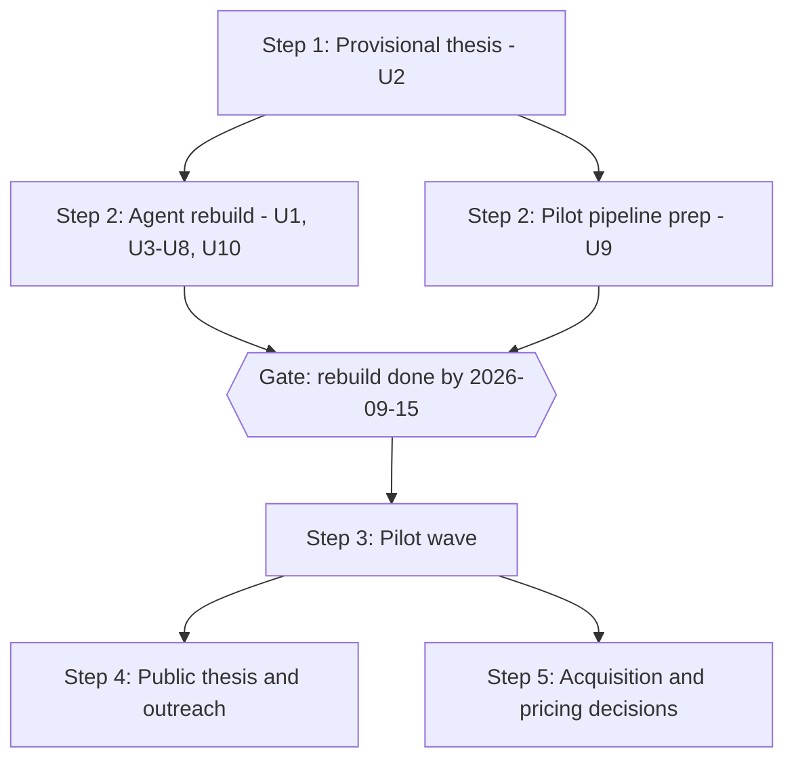
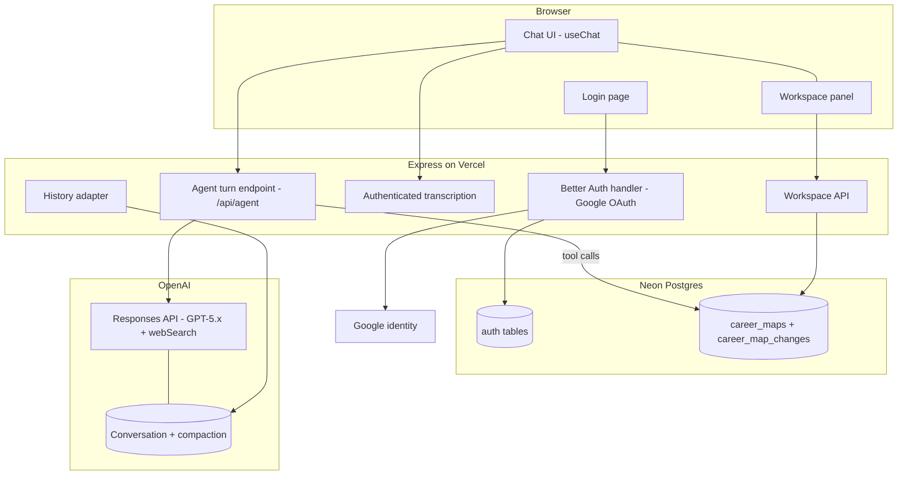
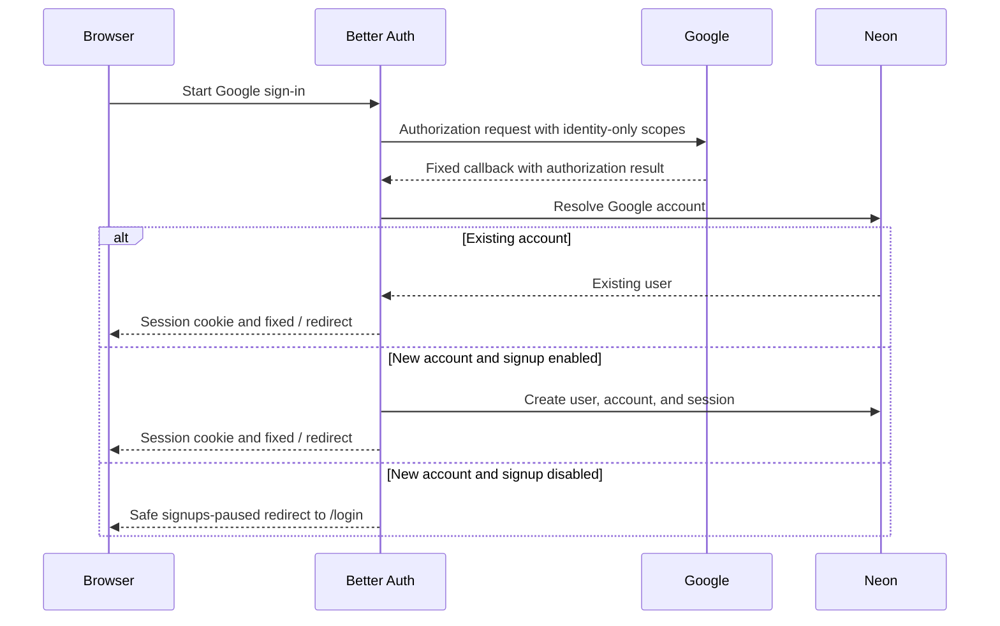
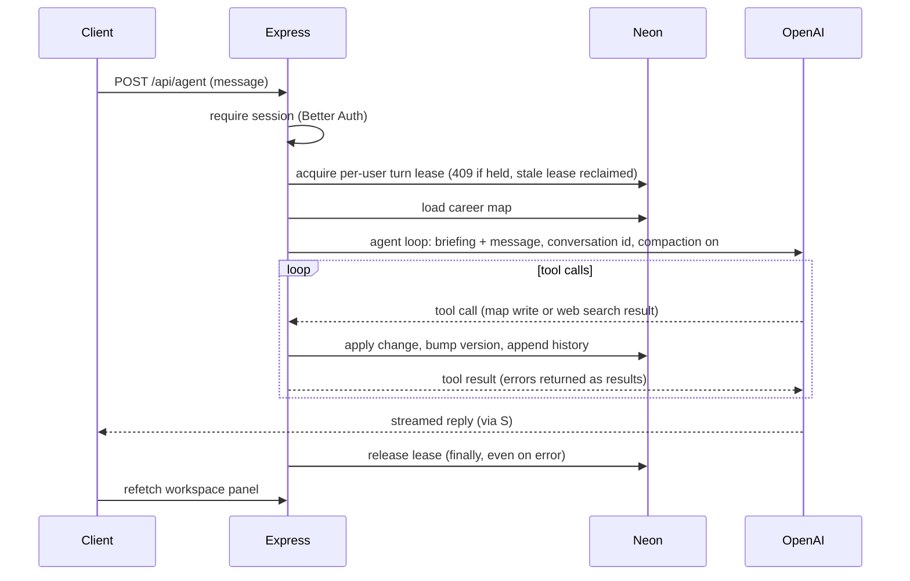
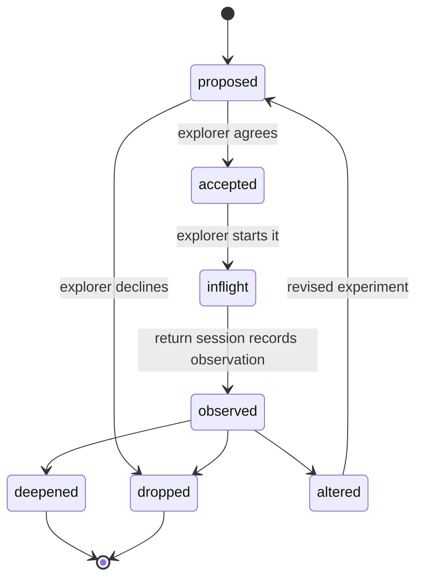

# Revelio Revamp (Claude) - Plan

## Goal Capsule

- **Objective:** Implement Steps 1–2 of the Revelio revamp to the 2026-09-15 gate: consolidate the thesis (Step 1), rebuild the product as an adaptive exploration agent, and prepare the pilot pipeline (Step 2, both tracks). Steps 3–5 stay sequenced gates in the Product Contract, to be enriched on pilot evidence.
- **Product authority:** This plan. It carries the origin Product Contract (docs/plans/2026-08-12-001-feat-revelio-revamp-plan.md) forward with session-settled amendments; where they differ, this plan governs this implementation.
- **Execution profile:** Solo founder at 10–15 hours/week plus coding agents. The timebox governs scope (R3): when a unit threatens the date, cut the unit's scope, never the date.
- **Stop conditions:** Stop and surface — do not guess — if (a) the OpenAI Conversations or compaction API differs materially from the facts pinned in KTD4, (b) the AI SDK v7 upgrade breaks the legacy assessment flow beyond the fallback in U1, or (c) a new production dependency beyond those named in this plan seems needed (repo rule: ask first).
- **Tail ownership:** The founder owns gate dates, thesis sign-off, and pilot operations (U2, U9, AE4). Code units are agent-executable.

---

## Product Contract

Carried from the origin plan. Amendments at this enrichment, all session-settled: R8 rewritten (adaptive interview entry), R17–R20 added, two Key Decisions added, F2 and AE5–AE6 added, Outstanding Questions resolved into the Planning Contract. AE7–AE8 added at doc review (user-approved). Founder review 2026-08-15 (user-directed): R9 and F1 amended to the three-path direction model, one Key Decision added, AE1 rephrased to paths, AE9 added, and the map-status term "settled" renamed to "confirmed" throughout. Founder review 2026-08-17 (user-approved): invite-only magic-link access was replaced by public Google sign-in, R19 and AE6 were rewritten, R21, F3, AE10, and AE11 were added, and downstream auth and erasure work was updated. A later founder review that day (user-directed) removed fixed daily provider allowances and the timed canary/invitation window; R11, R21, AE3, AE11, KTD10, and the downstream units now specify interest-led outreach and request-level safety only. Everything else is verbatim.

### Summary

Revamp Revelio from a one-shot report generator into an adaptive exploration companion — an agent the user converses with across sessions — through five sequenced steps: provisional thesis, timeboxed agent rebuild with a parallel pilot pipeline, pilot wave, public thesis with field outreach, and evidence-based commercialization decisions. This enrichment makes Steps 1–2 executable.

### Problem Frame

Revelio was built a year ago around a one-shot flow: an 8-question questionnaire produces three purpose paths and a static action plan, exported as a report. The product has had zero real users; acquisition was attempted once, with a single unanswered LinkedIn message. The December 2025 research is desk research and synthetic-persona testing (docs/research/2025-12-26-synthetic-user-feedback.md); no demand evidence exists in either direction.

The founder — himself a member of the target audience — does not believe the current product is good enough to sell. It fails his bar in three ways: outputs are static and cannot be iterated in dialogue; experiment design is generic, with no grounding in current real-world information; and the adaptive companion that guides exploration over time — judged the real, uncracked value — does not exist. The current system prompt also assumes the user "already know[s] but ha[sn't] articulated" their purpose (server/ai/prompts.ts:174), while the accumulated research concludes that decisive self-knowledge is generated by acting, not recovered by reflection.

The rethink exists but is unstructured: a 39-thread braindump spanning thesis, product form, method design, pricing, outreach, and go-to-market. The binding constraints are a solo founder at 10–15 hours/week beside a day job, and a moat thesis — a codified evidence-based method plus demonstrable results from a tight feedback loop — that cannot materialize without users.

### Key Decisions

- **Rebuild before pilots** (session-settled: user-directed — chosen over pilot-first manual validation: the current product fails the founder's own belief bar, and he will not sell what he does not believe in). Governs R3–R9.
- **Deadline gate over user-count gate** (session-settled: user-directed — chosen over gating on acquired users: the deadline is within the founder's control). Governs R3.
- **Input gates ride alongside the deadline** (session-settled: user-approved — pipeline gates bind on actions in the founder's control, countering the risk that the build absorbs the year). Governs R10.
- **Beachhead: career explorers like the founder** (session-settled: user-directed — chosen over students-now and over a criteria sprint: honest dogfooding, no gatekeepers, fastest feedback loop). Governs R6, R10, R16.
- **Thesis first, as provisional consolidation** (session-settled: user-directed — moved from post-pilot writeup to step one: the thesis states the method the rebuild embodies). Governs R1–R2.
- **Agent experience over web-app flow** (session-settled: user-directed — chosen over improving static generation: dialogue, iterable outputs, and persistent memory are both the 2026 baseline and the personalization mechanism). Governs R4–R5, R7.
- **Plan shape: two-track build month, thesis as asset** (session-settled: user-approved — chosen over a sequential relay and over a full public-essay program: no dead weeks after the build, without becoming a content project). Governs R10–R11, R14.
- **AI-drafted research is input, not decision** (session-settled: user-directed — the 2026-08-11 direction doc's conclusions hold only where the founder re-affirmed them in this plan). Pure framing; no governed Rs.
- **Adaptive interview over fixed questionnaire** (session-settled: user-directed — chosen over keeping the 8-question form as the entry: the braindump asks for fewer fixed questions with the model probing until it has what it needs; the interview is the first demonstration of the agent's method). Governs R8.
- **English-only UI, language-mirroring agent** (session-settled: user-approved — chosen over maintaining the en/es i18n surface on the new product: pilots run in English; the model mirrors the user's language natively, so the i18n machinery buys nothing). Governs R20.
- **Three direction paths, picked in dialogue** (session-settled: user-directed, founder review 2026-08-15 — the agent proposes three paths at a time, each explaining why it could fit, the presentation the old product's purpose paths got right; the explorer discusses, modifies, or requests replacements until picking one to start; a direction update may continue the path, switch to a parked one, or form a new one). Governs R9, F1, AE1, AE9.
- **Public access behind Google identity** (session-settled: user-approved — chosen over invite-only magic links: a manual access gate adds acquisition and email-infrastructure work without current usage or abuse evidence; session-derived ownership, request-size bounds, one-turn concurrency, user interruption, billing alerts, and kill switches cover the observed pilot risk without limiting normal use). Governs R19, R21, AE6, AE10, AE11.

### How This Work Fits Together

<!-- ce-section: work-relationships -->

This plan owns the revamp's sequencing, scope, and gates, and makes Steps 1–2 executable now. Steps 3–5 get their own enrichment when they start; their breakdown below is the current understanding, not a committed roadmap.

- Step 1 — Provisional thesis and method (U2). Proceeds immediately; its method statement is the prompt spec for U7a.
- Step 2, build track — Agent rebuild (U1, U3–U8, U10). Ends at the R3 deadline gate.
- Step 2, pipeline track — Pilot pipeline (U9). Proceeds independently of build content; shares the R3 gate date.
- Step 3 — Pilot wave. Depends on both Step 2 tracks. Not unitized here.
- Step 4 — Public thesis and outreach. Depends on Step 3 evidence. Not unitized here.
- Step 5 — Commercialization decisions. Depends on Step 3; draws on the first-customer research in docs/research/. Not unitized here.

### Actors

- A1. Founder — solo builder-operator at 10–15 hours/week; also a member of the beachhead and the product's reference user.
- A2. Pilot explorer — an employed adult asking "what should I work on?"; recruited directly without gatekeepers; uses the agent and runs real-world experiments between sessions.
- A3. The Revelio agent — the rebuilt product: conversational, memory-bearing, guiding the discovery loop.
- A4. Field contacts — the Stanford Life Design network and Bill Gurley; Step 4 outreach targets, approached with prototype and pilot evidence in hand.

### Requirements

**Step 1 — provisional thesis and method**

- R1. Consolidate the existing research corpus (docs/research/) into a one-page provisional thesis covering four elements: the spiky point of view, the founding story, the vision/mission, and why this approach shows promise where others have fallen short (model: Alpha School's one-pager framing).
- R2. The thesis states the method the product embodies — generate hypotheses from reflection, design representative experiments, observe fascination and energy, update direction, commit provisionally — precisely enough to serve as the rebuild's method spec.

**Step 2, build track — agent rebuild (timeboxed)**

- R3. The rebuild is complete by 2026-09-15; scope is cut to fit the date, never the reverse.
- R4. The rebuilt product is an agent the user converses with: any output (ikigai statement, path, experiment) can be questioned, modified, and iterated in dialogue rather than regenerated from scratch.
- R5. The agent has persistent memory across sessions: it retains the user's ikigai statement, direction paths, experiments, and observations, and its next recommendation reflects them. This requires users to be recognizable across sessions (no user identity exists today).
- R6. Experiment design is personalized and grounded: proposals fit the explorer's real constraints, test fascination with the actual practice rather than its image, and draw on current real-world information (e.g., web search).
- R7. Input is a text box with an optional microphone button reusing the existing speech-to-text capability; text remains the primary output.
- R8. The ikigai-statement foundation remains the entry experience, now formed through an agent-led adaptive interview — no fixed question count; the agent probes across fascination, skills, values, economic reality, and constraints until it can propose a statement. The rebuild replaces what followed the old form (static paths and action plan) with the companion loop. (Amended at this enrichment; original R8 kept the entry outcome but predated the interview decision.)
- R9. Companion loop v1: the agent can guide one full discovery loop — propose three direction paths, each explaining why it could fit the explorer (the presentation the old product's purpose paths got right, now iterable in dialogue); the explorer discusses, modifies, or requests replacements until picking one to start; the picked path's working hypothesis is articulated; an experiment is designed and run; the observation is captured on return; and the direction is updated. Return behavior is based on unfinished work, not elapsed time: when an explorer opens Revelio with an accepted or in-progress experiment that has no observation yet, their next turn picks it up. A direction update is one of: continue on the same path, switch to a parked path (postponed or dropped, recalled from the map with its original rationale), or form a new one. (Amended at founder review 2026-08-15; the original stated the loop without the three-path shape.)

**Step 2, pipeline track — pilot pipeline**

- R10. Before 2026-09-15, a named list of at least 5 pilot candidates matching A2 and a drafted pilot invitation exist (defaults; the founder may recalibrate numbers without re-scoping).
- R11. Pilot outreach is interest-led: the founder contacts suitable candidates as interest or a credible opportunity appears, without a fixed send deadline, canary schedule, or batch requirement.

**Step 3 — pilot wave**

- R12. A pilot counts as successful when the explorer completes one full discovery loop (per R9). Default target: 5 completed loops by 2026-10-31.
- R13. Each pilot's evidence is captured — hypothesis, experiment run, observations, and what changed in their direction — and preserved to feed the thesis and product iteration.

**Step 4 — public thesis and outreach**

- R14. The provisional thesis is matured with pilot evidence into a public one-pager.
- R15. Outreach to A4 begins only after a working prototype and at least one pilot story exist; the public thesis is the outreach vehicle.

**Step 5 — commercialization decisions**

- R16. After the pilot wave, an acquisition-and-pricing decision phase runs on pilot evidence plus the first-customer research (docs/research/first_10_customers_transcript.txt, docs/research/first_users_transcript.txt, docs/research/startup_school_first_customers_transcript.txt); the beachhead-expansion question (students, parents, schools) is decided there, not before.

**Cross-cutting product behavior (added at this enrichment)**

- R17. The explorer can see the agent's picture of them — statement, paths, experiments, observations — alongside the conversation, and can correct or delete entries; the agent's next turn reflects the correction. Agent-created ideas are visibly labeled "Suggested" until the explorer agrees, then "Confirmed." An experiment separately shows its progress as "Not started," "In progress," or "Done," so agreement is never confused with execution. Before the agent has learned anything, "Your Map" shows a friendly empty message — "Your map will take shape as we talk" — rather than a blank panel. Desktop shows chat and "Your Map" side by side; phones use two simple tabs, "Chat" and "Your Map," so neither surface is cramped.
- R18. Conclusions reached in conversation are never lost: anything the agent treats as concluded (statement accepted, path picked, experiment designed, observation captured) is persisted before its turn completes.
- R19. The rebuilt product lives at the canonical `/` route: signed-in visitors use the chat-and-map workspace there, while signed-out visitors are sent to `/login`. The agent accepts any Google account while the founder-controlled signup switch is enabled; disabling signup blocks new accounts without preventing existing users from signing in. The legacy questionnaire starts at `/legacy` and remains anonymous; its existing results, action-plan, API, and data behavior stay intact.
- R20. The new `/` product and `/login` UI are English-only; the legacy questionnaire retains its existing en/es UI, and the agent converses in whatever language the explorer writes in.
- R21. Normal signed-in use has no fixed daily action allowance. Agent replies use the pinned AI SDK's standard loop behavior rather than a Revelio-specific step or tool-call policy. Provider safety stays request-level and operational: bounded text/audio inputs, one active turn per user, a visible Stop control, the ability to interrupt a streaming reply by sending a new message, a billing alert, and the `AGENT_ENABLED` emergency switch. An interruption cancels provider and tool work before the next message starts. The anonymous legacy routes keep their existing behavior until observed abuse justifies a targeted control.

### Key Flows

- F1. Discovery loop conversation (the core product behavior)
  - **Trigger:** A pilot explorer (A2) opens a session with the agent — their first or any later one.
  - **Steps:** Agent recalls stored context (R5) → converses to form or refine the ikigai statement (R8) → proposes three direction paths with why each could fit, iterated in dialogue — discuss, modify, or replace — until the explorer picks one to start (R4, R9) → co-designs one representative experiment for the picked path within the explorer's constraints (R6) → the explorer leaves and runs it in the real world → whenever they next open Revelio with that experiment still unfinished, their next turn picks it up, captures observations, and updates the direction (R9) → continue the path, switch to a parked one, or form a new one.
  - **Outcome:** The explorer leaves each session with a testable next step; the agent's picture of them is richer than the session before.
  - **Covers:** R4–R9.
- F2. First-session interview (entry into F1)
  - **Trigger:** A Google-authenticated explorer signs in for the first time; no career map exists for them.
  - **Steps:** `/` presents a deterministic welcome without calling a model → the explorer's first message starts the agent turn → the agent asks adaptive questions across fascination, skills, values, economic reality, and constraints (R8) → answers persist into the career map as they land (R18) → agent proposes an ikigai statement → explorer refines it in dialogue (R4) → accepted statement is stored → agent transitions to path proposal (F1).
  - **Outcome:** A statement and interview evidence in the career map; the explorer is inside the discovery loop.
  - **Covers:** R4, R7, R8, R17, R18.
- F3. Google sign-in and return
  - **Trigger:** A visitor opens the canonical `/` entry.
  - **Steps:** The client resolves session state without showing the wrong surface → a signed-in visitor uses the product at `/`; a signed-out visitor enters `/login` and chooses Google sign-in → Google returns to the fixed Better Auth callback → Better Auth resolves or creates the account according to the signup switch → the client returns to `/`, now showing the product. A returning Google account resolves to the same Better Auth user and career map; sign-out ends the current session.
  - **Outcome:** One stable, server-derived user identity owns every new-product request; provider tokens never enter agent context.
  - **Covers:** R5, R19.

### Acceptance Examples

- AE1. **Covers R4.** Given the agent proposes three direction paths, when the explorer says one feels prestige-driven rather than fascinating, then the agent revises that path in the same conversation — it does not regenerate a whole new report.
- AE2. **Covers R5, R9, R13.** Given an explorer designed an experiment two weeks ago, when they return, then the agent recalls the hypothesis and experiment, asks what happened, records the observation, and updates its recommendation — without the explorer re-entering prior context.
- AE3. **Covers R3, R10, R11.** Given the rebuild lands and the pipeline gate is checked, then at least 5 named candidates and a drafted invitation already exist; the founder contacts suitable candidates as interest or a credible opportunity appears, without a seven-day or canary deadline.
- AE4. **Covers R15.** Given the rebuild is done but no pilot has completed a loop, when the founder is tempted to contact Stanford or Gurley, then outreach waits — the gate is prototype plus at least one pilot story, not the prototype alone.
- AE5. **Covers R17.** Given the workspace panel shows a path the explorer no longer holds, when they delete it and send their next message, then the agent's reply does not build on the deleted path.
- AE6. **Covers R5, R19.** Given signup is enabled and a new visitor completes Google sign-in, then one Better Auth user, account, and session are created and the product loads at `/`; signing in later with the same Google account resolves to that same user and career map.
- AE7. **Covers R4.** Given an accepted ikigai statement, when the explorer says part of it no longer rings true, then the agent revises the statement in the same conversation and the updated wording is stored, with the prior version in the change history.
- AE8. **Covers R4, R6.** Given an accepted experiment, when the explorer says its time commitment does not fit their constraints, then the agent modifies that experiment in dialogue and the revised design replaces it in the map — not a brand-new proposal from scratch.
- AE9. **Covers R5, R9.** Given an active path and two parked alternatives from the original pick, when a return-session observation undermines the active path, then the agent's direction update offers the real options — continue, switch to a parked path recalled with its original rationale, or form a new one — and the chosen update is recorded in the map with history.
- AE10. **Covers R19.** Given new signups are disabled, when an unseen Google account completes OAuth it is denied with safe retry copy, while an existing Revelio account using Google can still sign in.
- AE11. **Covers R21.** Given a signed-in explorer continues a long conversation on the same day, then no arbitrary daily allowance blocks normal use and agent turns follow the pinned AI SDK defaults; oversized input, a simultaneous second turn, or the emergency switch still fails safely. When a reply appears stuck, Stop cancels it, and submitting "You seem stuck" while it streams cancels that reply before sending the new message.

### Success Criteria

- Founder-belief bar: at the R3 gate, the founder — as a member of the beachhead — would personally pay for and keep using the rebuilt product.
- Adaptive-value signal: pilots' return sessions produce information that visibly changes or strengthens their next decision — the test of the companion hypothesis against a one-time report.
- Year outcome: by end of 2026, real users have completed loops and the R16 decisions are made on evidence rather than conjecture.

### Scope Boundaries

**Deferred for later**

- Beachhead expansion (students, parents, schools) and any B2B motion — a Step 5 decision made on evidence.
- Pricing and payment: pilots run free; willingness-to-pay is a Step 5 question. No payment code exists today and none is built in the rebuild.
- Longer-horizon cadence (weekly check-ins, multi-loop journeys, proactive re-engagement email) beyond loop v1.
- Invite allowlists, magic-link email, passwords, and additional social providers — Google identity is the only sign-in method in this build.
- A controlled custom domain and Google OAuth brand/production verification — required before broad commercial launch, but not for this pilot because the External Google project stays in Testing and requests only identity scopes.
- Formal evals and rubrics for the method — built once pilot evidence shows what is worth measuring. Verification for this build uses scripted golden transcripts run by the founder (see Verification Contract), not an eval framework.
- A public essay program beyond the single one-pager.
- Migrating auth to Neon Managed Better Auth if/when it reaches GA with a documented first-class Express path (see KTD8).
- A Spanish product UI; retiring the old app's en/es machinery happens when the old app itself is retired.
- Version-history UI for the career map (the change history is stored from day one; a UI over it is not built now).
- Pilot-ops reporting (e.g., a stall report over in-flight experiments older than 14 days) — a Step 3 concern once pilots exist; dropped from the build at doc review because no requirement asks for it.

**Outside this product's identity**

- MCP, CLI, or plugin form factors — the agent lives in Revelio's own product, usable by non-developers; agent-infrastructure surfaces would narrow the beachhead to developers.
- A comprehensive "career operating system" — the product is the discovery loop until the loop is validated.
- Prestige-optimized recommendations — the method selects for fascination with the practice over status of the outcome.

### Dependencies / Assumptions

- Assumption: the founder is representative enough of the beachhead for dogfooding to be a valid quality signal; pilot evidence is the check on this.
- Assumption: 10–15 hours/week holds through the fall; the timebox and default targets are sized to it.
- Assumption: the existing research corpus is sufficient for the provisional thesis — no new research phase precedes Step 1.
- Assumption: pilots run without payment; incentives, if any, are decided during pipeline prep.
- Dependency: the existing speech-to-text capability (docs/plans/2026-04-19-001-feat-speech-to-text-plan.md) for R7.
- Dependency: an OpenAI API account with billing (KTD3, KTD4), a Google Cloud OAuth web client configured for the exact local and production callbacks, and Vercel secrets. These are founder-provisioned in Stage 0; no OpenAI hard spend limit is required for this pilot.

### Outstanding Questions

The origin's three deferred-to-planning questions are resolved in the Planning Contract: agent runtime and architecture (KTD1–KTD7), model selection and prompt approach (KTD3, U7a), reuse-vs-replace (KTD1). Remaining questions, all deferred (non-blocking):

- Which exact GPT-5.x snapshot to pin — decided in U5 against whatever is current at build time; the braindump names "gpt 5.5 or 5.6" as the floor. Conversational latency is a selection criterion (founder review 2026-08-15): the U7a golden transcripts double as the comparison harness, and a faster snapshot that passes them beats a slower flagship.
- Compaction threshold tuning (KTD4) — start at the provider default and adjust from real turn sizes during dogfooding.
- Pilot incentives — decided during U9, not a build input.

### Sources / Research

- The founder's braindump (39 threads, outside the repo at ~/Andres/Revelio.md) — organized into this plan; see the Appendix disposition map.
- docs/research/2026-08-11-what-to-work-on-research.md and docs/research/2026-08-11-what-to-work-on-product-direction.md — AI-drafted synthesis and direction; inputs only, per Key Decisions.
- docs/research/2025-12-24-user-research.md and docs/research/2025-12-26-synthetic-user-feedback.md — desk research and synthetic personas; no real-user evidence exists anywhere.
- docs/research/2026-04-11-private-schools-product-direction.md and docs/research/2026-05-03-runnymede-and-parents-product-direction.md — prior directions; neither was executed.
- First-customer transcripts for Step 5: docs/research/first_10_customers_transcript.txt, docs/research/first_users_transcript.txt, docs/research/startup_school_first_customers_transcript.txt.
- Alpha School one-pager model: https://alpha.school/blog/inside-alphas-olympic-level-project-for-high-schoolers/ — spiky point of view, "best in the world" vision framing, and the why-now argument.
- Code anchors: server/ai/prompts.ts:174 (the "already know" assumption the rebuild removes); shared/streaming-schemas.ts (no hypothesis, evidence, or confidence representation); client/src/components/questionnaire/questions.ts (8 free-text questions); no payment code anywhere; no user accounts (shared/schema.ts, sessionId-keyed).
- Planning research sources are cited inline on the KTDs they justify.
- Auth sources verified 2026-08-17: Better Auth Express, Google provider, PostgreSQL adapter, rate-limit, and test-utils documentation at https://better-auth.com/docs; Google Auth Platform audience rules at https://support.google.com/cloud/answer/15549945; Vercel request-header behavior at https://vercel.com/docs/headers/request-headers.

---

## Planning Contract

The architecture was researched from first principles per the origin's planning question, with candidates verified against live documentation in August 2026. Facts below marked "verified" were checked against current docs or source; anything time-sensitive should be re-checked briefly at build time.

Consolidated 2026-08-14 (user-directed): a thin layer of reliability protections merged in from the parallel codex plan (docs/plans/2026-08-14-codex-1824-feat-revelio-agent-rebuild-plan.md) — live provider spike, retry idempotency, version-checked writes, compaction guard, markdown/citation rendering policy, agent kill switches, staged outreach, reviewed production migration, erasure runbook, Node 24 pin, and the native PostgreSQL auth adapter. The write model stays conversational write-through with the proposed/confirmed boundary (no approval cards). The 2026-08-17 auth amendment replaces the former invite and email mechanics in place.

### Key Technical Decisions

- KTD1. **Platform-retaining rebuild.** Keep the React/Vite client, Express server, Neon Postgres, and Vercel hosting; delete only the dead report-generation files enumerated in U1, preserve the working legacy questionnaire per KTD9, and build the agent inside the shell. (session-settled: user-approved — chosen over a greenfield Next.js rebuild or the vercel/chatbot template: the template was verified to ship four artifact subsystems, next-auth beta, and an AI-Gateway default that would all need gutting; the shell is not what failed, and nothing in this rebuild needs Next.js.) Governs the origin's reuse-vs-replace question.
- KTD2. **Agent runtime: Vercel AI SDK agent loop, upgraded to v7.** Use the SDK's agent abstraction (`ToolLoopAgent`) with custom tools, streamed to the existing Express response via the SDK's UI-message stream helpers; the client uses `useChat` from `@ai-sdk/react`. Repo is on `ai` 6.0.158; current major is v7. (session-settled: user-approved — chosen from a first-principles field over: OpenAI Agents SDK for JS (loop is fine but the streaming-UI and React story is thinner); Eve (a hosted-agent platform, wrong shape for an in-product companion); Mastra and LangGraph (workflow-framework weight this single-loop product does not need); a thin hand-rolled `openai` SDK loop (re-implements streaming, tool orchestration, and client wiring the SDK already owns). The incumbent won on merits, not on migration cost, which the founder ruled out as a deciding factor.) Fallback if the v7 upgrade fights the legacy code: latest v6, which already carries `ToolLoopAgent` (see U1).
- KTD3. **Model: OpenAI GPT-5.x via the `@ai-sdk/openai` Responses provider, with the built-in web-search tool.** OpenAI's `webSearch` provider tool composes with custom function tools in the same loop (needed for R6: grounded experiment design plus career-map writes in one turn). (session-settled: user-directed — the braindump directs "Change to gpt 5.5 or 5.6 model"; chosen over staying on Gemini: verified that Gemini's `google_search` tool cannot be combined with custom function tools — open bug vercel/ai#8258 (https://github.com/vercel/ai/issues/8258), with Google gating the combination behind a Gemini-3-only preview API — which would force two-pass workarounds for R6.) Exact snapshot pinned at build time (Outstanding Questions).
- KTD4. **Conversation transcript lives in OpenAI Conversations, with server-side compaction.** Each user gets one OpenAI conversation object; turns pass its id via provider options (`conversation`, `store: true`), so OpenAI persists and threads the transcript. Enable Responses-API compaction (`context_management` with a compact threshold; verified minimum threshold 1000 tokens, applied per-request) so long histories are compacted server-side. Verified caveat, set expectations accordingly: compaction covers tool calls, tool outputs, and reasoning items — not plain user/assistant messages; it is still high-value here because this agent is tool-heavy (map writes plus web search each turn). Chat history for the UI is read back via `GET /v1/conversations/{id}/items` through a thin adapter to UI messages (U6). (session-settled: user-directed — the user chose OpenAI-side transcript storage and explicitly wants compaction: "openai's compaction is great, we definitely want to make use of it"; chosen over BYO `UIMessage[]` persistence in Postgres: no transcript-persistence code to build and compaction comes free; accepted tradeoff: the transcript is readable only through OpenAI's API and couples that surface to the vendor — the career map, the durable product asset, stays in our database per KTD5.) Sources: OpenAI Conversations and context-management docs at platform.openai.com (Responses API), verified 2026-08.
- KTD5. **Product memory: one versioned career-map document per user in Neon Postgres.** A `career_maps` row holds a jsonb document — statement, profile/constraints, direction paths (each carrying its why-fit rationale and status; the active path carries the working hypothesis under test), experiments, observations — plus a version counter and the user's OpenAI conversation id; every accepted change also appends to a `career_map_changes` history table (who/what/when/source). A markdown projection of the document is compiled per turn into the agent's context as its working-memory briefing, so the model reads memory as prose while storage stays queryable. The per-turn briefing is also the latency-cheap memory design (founder question, resolved 2026-08-15): the projection is about a page of prefill, far cheaper than the extra model round-trip a fetch-on-demand memory tool would add — and a memory consulted only when the model thinks to look can be stale against workspace edits the transcript never saw. (session-settled: user-approved — chosen over normalized per-entity tables: the shape will churn during pilots, and a document plus change history keeps flexibility with an audit trail; chosen over markdown files on disk: verified that Vercel functions have a read-only filesystem with ephemeral /tmp, so file-based memory does not survive requests.) Conversation memory (what was said) and product memory (what is true about the explorer) are deliberately separate stores: KTD4 owns the former, this owns the latter.
- KTD6. **Memory writes are tool-driven — write-through, not prompt-hoped.** The agent persists conclusions through explicit typed tools (set statement, upsert path, upsert experiment, record observation, update profile); the server applies each accepted tool call to the document, bumps the version, and appends history within the turn. The system prompt instructs write-before-summarize, and the turn contract (KTD7) means a turn is not complete until tool results are committed — this mechanism is how R18 is enforced, since prompt-only persistence is a documented agent-memory anti-pattern. Model-created content enters the map with the internal status `proposed`, displayed to the explorer as "Suggested": statements, paths, and profile updates — like experiments — become `confirmed`, displayed as "Confirmed," only on the explorer's explicit assent (for a path, the pick). This agreement status is separate from lifecycle: experiments display accepted-but-unbegun as "Not started," inflight as "In progress," and observed/completed as "Done"; paths display their own Active/Parked/Dropped state. The briefing labels each entry's internal status, and only confirmed values are presented to the model as true — proposed entries render as open proposals, and parked paths stay visible as alternatives so a direction update can offer the switch. The confirmation flip is itself a tool write: when the explorer assents in conversation, the agent records it through a `mark_confirmed` operation (the accept transition for experiments; the pick for paths, which also parks the sibling proposals as postponed in the same atomic operation) that validates the target entry and appends history like any other write — assent stays conversational, and no separate confirmation UI is added.
- KTD7. **Turn durability and concurrency contract.** Tool execution errors are returned into the loop as tool results (the agent sees the failure and can retry or tell the user), never thrown across the stream. One turn per user at a time, enforced with a per-user lease in Postgres: the lease carries an expiry above the platform's 300-second function cap, is released in a finally path after completion, error, or user cancellation, and a stale lease is reclaimed by the next turn — a crashed turn can never lock a user out. Retries are idempotent at two levels: the client sends a generated message id with each turn, so a network retry attaches to the existing turn record instead of starting a new one; and each applied map write records its tool-call id in the change history with a per-map uniqueness guard, so a duplicated tool result cannot apply twice. Attaching never re-streams or re-invokes the model: a retried message id whose turn is still in flight gets the in-progress response (409 with turn status), and one whose turn already completed gets a small completed marker directing the client to refetch history and the workspace panel. A concurrent turn gets HTTP 409 and the client shows "one conversation at a time." A user interruption is sequential rather than concurrent: the client aborts the current fetch, Express bridges the closed request into an `AbortSignal` for the agent and tools, the turn is marked cancelled and its lease is released, then any queued new message is submitted with its own id. Tool writes committed before cancellation remain authoritative and deduplicated; an in-flight database transaction is atomic; the partial assistant reply is visibly marked "Stopped" and is never treated as a conclusion by itself. Stream resumption remains off because the AI SDK documents it as incompatible with manual abort; history and the workspace are refetched after cancellation. Workspace edits count as turns for locking: workspace PATCH/DELETE take the same per-user lease and version check, get 409 while a turn is in flight, and the client disables panel edits while a reply streams. The client refetches the workspace panel after every completed or cancelled turn so R17's view never goes stale against tool writes.
- KTD8. **Auth: direct Better Auth 1.6.29 with Google OAuth on Express.** Install and pin Better Auth in U3, configure only the Google provider, and use its documented PostgreSQL adapter with a `pg.Pool` against Neon's pooled connection string; promote the repo's existing `pg` devDependency to production instead of using the incompatible Better Auth Drizzle adapter, whose 1.6.29 peer range requires `drizzle-orm ^0.45.2` while this repo uses `^0.39.1`. Better Auth owns an `auth` PostgreSQL schema through a pool-level search path, while Drizzle remains explicitly scoped to `public`; this isolates migrations without a fragile table-name exclusion list. Mount the Express v4 handler before both body parsers in `server/app.ts`, and derive protected-route sessions from request headers. The Google project stays External and in Testing for the pilot, requests only Google's identity scopes (`openid`, `userinfo.email`, and `userinfo.profile`; Better Auth emits the equivalent authorization names `openid email profile`), and uses fixed callbacks at `http://localhost:5001/api/auth/callback/google` and `https://revelio-me.vercel.app/api/auth/callback/google`; Google's current Sign in with Google exception lets any Google account use that identity-only Testing client without a test-user allowlist, warning, or seven-day expiry. Preview deployments are signed-out smoke surfaces because Google does not support wildcard callbacks. `AUTH_SIGNUPS_ENABLED` fails closed when absent or invalid and maps to provider-level signup disabling: new accounts stop, existing accounts still sign in. Account linking stays disabled while Google is the sole provider, `account.encryptOAuthTokens: true` encrypts stored OAuth tokens, and provider tokens never enter client payloads, logs, or agent context. Better Auth's IP rate limiter uses database storage; production trusts only Vercel's overwritten `x-forwarded-for`, while development and tests use the socket address instead of a client-supplied forwarded chain. It protects `/api/auth/*`; KTD10 owns the separate request-level provider safeguards. Session cookies retain HttpOnly, Secure-in-production, and SameSite=Lax defaults, and CSRF, origin, and OAuth state checks stay enabled. Better Auth CLI migration SQL is generated with the matching 1.6.29 CLI, reviewed on a disposable Neon branch, and applied separately from Drizzle. (session-settled: user-approved — chosen over invite-only magic links: no observed usage or abuse justifies the extra access, email, scanner, and allowlist machinery; chosen over Neon Managed Better Auth: it remains Beta and does not provide a documented first-class Express server path. A future migration remains plausible because both use Better Auth concepts.) Sources: https://better-auth.com/docs/integrations/express, https://better-auth.com/docs/authentication/google, https://better-auth.com/docs/adapters/postgresql, https://better-auth.com/docs/concepts/rate-limit, https://support.google.com/cloud/answer/15549945 — verified 2026-08-17.
- KTD9. **The rebuilt product lives at `/`; the anonymous app is preserved at `/legacy`.** `/` renders the authenticated chat-and-map workspace or sends a signed-out visitor to `/login`; there is no separate `/explore` product route. The existing questionnaire flow starts at `/legacy`; its current results and action-plan routes, tables (`assessment_sessions`, `purpose_paths`), anonymous identity model, APIs, and provider behavior continue per R19. Old assessment data is retained; no migration of it into career maps.
- KTD10. **Provider safety uses SDK defaults plus user interruption, not a Revelio usage policy.** Signed-in explorers can use the agent normally without user- or IP-based daily counters. U5 leaves the pinned AI SDK's standard agent-loop behavior unchanged (currently a 20-model-step default) instead of adding a custom numeric condition. The loop ends when the model gives a final answer, the SDK default is reached, the user interrupts, a real error occurs, or the platform request ends. The new provider routes enforce bounded text and audio inputs before provider work, reuse KTD7's one-active-turn and cancellation contract, emit privacy-safe operational logs, and honor the fail-closed `AGENT_ENABLED` switch; the founder watches the OpenAI billing alert during the pilot. The anonymous legacy provider routes remain unchanged until observed abuse justifies a targeted control. (session-settled: user-directed — chosen for simplicity over speculative persistent quotas or custom loop rules: there is no observed usage or abuse, and the pinned SDK already supplies a reasonable default.) Implements R21. Sources: https://ai-sdk.dev/docs/agents/loop-control, https://ai-sdk.dev/docs/advanced/stopping-streams — verified 2026-08-17.

### High-Level Technical Design

Component topology:

Google sign-in (directional; Better Auth owns OAuth state and callback validation):

One agent turn:

Experiment lifecycle (transitions happen in dialogue via tools; proposed→accepted requires the explorer's explicit assent):

Paths have their own lifecycle: proposed → active on the explorer's pick, which parks the sibling proposals as postponed; active → postponed or dropped on a direction update; a parked path (postponed or dropped) returns to active on a switch. The pick is the path's confirm transition (KTD6), and parked paths keep their why-fit rationale so a later switch can recall it.

### Stage 0 — Founder provisioning

Stage 0 prepares external services without changing application code. Before U1 and U7a, confirm OpenAI billing, configure a billing alert, and make `OPENAI_API_KEY` available locally; no hard spend limit is required. Install and authenticate the Neon CLI now; create the disposable database branch when U3 generates the auth schema. Before U3, create a Google OAuth web client with an External + Testing audience, identity-only scopes, and the local callback at `http://localhost:5001/api/auth/callback/google`. Before U10, add the production callback at `https://revelio-me.vercel.app/api/auth/callback/google` and prepare the production Vercel secrets. Better Auth itself is not a Stage 0 install: U3 pins the dependency, implements it, and reviews its migration in one unit. A controlled domain and Google's production brand verification remain a later, non-blocking milestone.

### Sequencing

U1, U2, and founder-owned U9 start immediately and in parallel. U7a follows U2 alone — the method prompts and golden transcripts run against a scratch loop before any product infrastructure exists, so evidence that the method feels wrong arrives while there is still time to redirect. U3 and U4 both follow U1 and can run in parallel: Better Auth owns its separate `auth` schema and files, while career-map storage stays in `public`; they meet at U5. U5 needs U3 + U4; U6 needs U5; U7b needs U5 + U7a; U8 needs U7b. U10 is last. The critical path is U1 → U3/U4 in parallel → U5 → U7b → U8 → U10; U2 → U7a, U6, and U9 run in parallel where their dependencies allow (U10 needs U6, U7b, U8, and the U9 launch artifacts). Public signup turns U10's stages into an outreach sequence, not access enforcement.

---

## Implementation Units

| U-ID | Title | Key files | Depends on |
|---|---|---|---|
| U1 | Platform prep and dead-code removal | package.json, server/env.ts | — |
| U2 | Provisional thesis one-pager | docs/thesis.md | — |
| U3 | Identity and public Google sign-in | server/auth.ts, server/app.ts, client/src/pages/login.tsx | U1 |
| U4 | Career-map storage | shared/schema.ts, server/storage.ts | U1 |
| U5 | Agent turn endpoint | server/routes/agent.ts, server/ai/agent.ts | U3, U4 |
| U6 | Chat UI and workspace panel | client/src/pages/explore.tsx | U5 |
| U7a | Method prompts and golden transcripts | server/ai/agent-prompts.ts | U2 |
| U7b | Adaptive interview integration | server/ai/agent.ts, server/ai/agent-prompts.ts | U5, U7a |
| U8 | Return-session loop v1 | server/ai/agent-prompts.ts, server/ai/briefing.ts | U7b |
| U9 | Pilot pipeline artifacts | docs/pilots/invitation.md | — |
| U10 | Launch gate: e2e and deploy | tests/, vercel.json | U6, U7b, U8, U9 |

### U1. Platform prep and dead-code removal

- **Goal:** A clean shell on AI SDK v7 with the new provider and env surface in place, and the legacy app still working. Serves R3 and KTD1/KTD2.
- **Files:** package.json; .nvmrc (new); server/env.ts; .env.example; delete server/ai/wrapper.ts, server/ai/schemas.ts, server/ai/types.ts (its only importer is wrapper.ts), client/src/lib/gemini.ts, server/cache.ts; remove unused deps express-session, passport, passport-local, connect-pg-simple, memorystore plus their @types packages (@types/express-session, @types/passport, @types/passport-local, @types/connect-pg-simple).
- **Approach:** Pin Node 24 first: add `engines.node` (`24.x`) to package.json plus a `.nvmrc`, reinstall dependencies under Node 24, and run the full check/test/build suite — the repo pins nothing today and Vercel disables Node 20 for new deployments on 2026-10-01 with 24 as the named target (vercel.com/changelog, verified 2026-08), so this upgrade window is the cheap moment; confirm `process.version` on a Vercel preview before promoting. Then upgrade `ai` and `@ai-sdk/react` to v7 per the official migration guide, bumping `zod` within v3 to `^3.25.76` (satisfies the v7 peer range `^3.25.76 || ^4.1.8`, verified 2026-08 against ai 7.0.66; repo is on `^3.24.2`; the v4 branch is off-limits — zod-validation-error@3 pins peer zod v3, and server/env.ts:87 uses the `error.errors` API removed in v4); add `@ai-sdk/openai`; keep `@ai-sdk/groq` (transcription) and `@ai-sdk/google` (legacy assessment flow, retired later). Add `OPENAI_API_KEY`, `GOOGLE_CLIENT_ID`, `GOOGLE_CLIENT_SECRET`, `BETTER_AUTH_SECRET`, `BETTER_AUTH_URL`, and `AUTH_SIGNUPS_ENABLED` to the Zod env schema and documented example as optional with safe defaults (the existing `GROQ_API_KEY` precedent) — the schema hard-exits on missing required vars and one function serves both surfaces, so requiring them before the founder provisions the accounts would take down the legacy app. U3 and U5 fail fast at their call sites when a credential they need is empty; signup and agent switches fail closed; U10 makes the production requirements explicit. Secrets live only in Vercel encrypted environment variables per environment — never in the repo or logs; founder-only access; rotate on suspicion. Better Auth is deliberately not installed in U1: its exact pinned dependency and the already-present `pg` promotion belong to U3, where auth is implemented and tested. Fallback per Goal Capsule stop condition: if v7 breaks the legacy Gemini streaming path beyond small mechanical fixes, pin to latest v6 instead — v6 already has `ToolLoopAgent` and the Responses provider options this plan needs; record the choice in the commit. U1 also runs the live provider spike: a small one-off script under scripts/ (dev-only, excluded from the production bundle and the vitest glob) that creates a real OpenAI conversation, continues it across two turns sending a distinct per-turn system briefing, lists the stored items to confirm per-turn briefings do not persist into the conversation, forces compaction at a low threshold, runs one turn combining `webSearch` with a trivial custom function tool in the same loop (the composition KTD3 turns on), and deletes the conversation — proving KTD3's and KTD4's pinned facts at the cheapest possible moment. If system briefings do persist as stored items, the briefing moves to the request-scoped `instructions` provider option and that is pinned as a KTD4 fact. A material mismatch trips the Goal Capsule stop condition before anything is built on it; the spike output is recorded in the U1 PR. The founder configures an OpenAI billing alert and relies on the pinned SDK defaults, request-size bounds, one-turn concurrency, user interruption, and `AGENT_ENABLED`; no hard spend limit or daily product allowance is required.
- **Test scenarios:** Existing Vitest suite passes; the legacy questionnaire still streams a report end-to-end from `/legacy` after updating the existing Playwright entry URL.
- **Verification:** `npm run check`, `npm test`, `npm run test:e2e`, `npm run build`; live provider spike output recorded in the PR; a Vercel preview confirms `process.version` is v24.

### U2. Provisional thesis one-pager

- **Goal:** R1 and R2 satisfied: one page, four elements, and a method statement precise enough to be U7a's prompt spec. Execution: knowledge-work.
- **Files:** docs/thesis.md (new).
- **Approach:** Consolidate docs/research/ per R1; write the method statement as an ordered, unambiguous loop (per R2) so U7a can bind to it rather than paraphrase it. The agent drafts; the founder's voice and sign-off are the authority.
- **Verification:** Founder sign-off; U7a imports it without needing to reinterpret it.

### U3. Identity and public Google sign-in

- **Goal:** Stable, public Google identity for the rebuilt default experience, with a reversible signup switch and server-derived ownership (R5 identity half, R19; AE6, AE10) per KTD8.
- **Files:** package.json and package-lock.json (pin `better-auth@1.6.29`; promote the existing `pg` dependency from dev to production); server/auth.ts (new: Better Auth config and auth-only PostgreSQL pool); server/auth-middleware.ts (new: `requireUser` and session lookup); server/app.ts (mount `toNodeHandler(auth)` on `/api/auth/*` before both `express.json()` and `express.urlencoded()`); server/env.ts and .env.example (U1 surface enforced at use); drizzle.config.ts (`schemaFilter: ["public"]`); client/src/lib/auth-client.ts (new); client/src/pages/login.tsx (new); client/src/App.tsx (authenticated product at `/`, `/login` English shell, legacy questionnaire at `/legacy`); focused server and client auth tests.
- **Approach:** Configure Better Auth directly in Express with Google as the only provider and a dedicated `pg.Pool` whose search path places Better Auth's tables in an `auth` PostgreSQL schema; Drizzle remains explicitly limited to `public`. Generate schema SQL with the matching `npx auth@1.6.29` CLI, review it, and apply it first to a disposable Neon branch before the shared development database. Use exact base URLs and callbacks: local `BETTER_AUTH_URL=http://localhost:5001` with `http://localhost:5001/api/auth/callback/google`, and production `https://revelio-me.vercel.app` with `https://revelio-me.vercel.app/api/auth/callback/google`; arbitrary Vercel previews have no Google callback and are signed-out smoke surfaces. Keep the Google project External + Testing and request exactly the identity scope set emitted as `openid email profile` — no extra scopes or offline access — so the current identity-only Testing exception permits any Google account without a test-user list, warning, or seven-day authorization expiry. Route every successful sign-in to `/`; OAuth cancellation and callback failure return safe retry copy on `/login`. `AUTH_SIGNUPS_ENABLED` defaults and fails to false, disabling creation for an unseen Google account while preserving sign-in for an existing user. Account linking stays off, `account.encryptOAuthTokens: true` encrypts OAuth tokens at rest, and tokens never enter client payloads, logs, or agent context. Keep Better Auth's CSRF, trusted-origin, state, and cookie protections; use its database-backed limiter for `/api/auth/*`. Its IP source trusts Vercel's overwritten forwarded address only in production and falls back to the socket address in development/test; a client-supplied forwarded chain is never trusted locally. Derive each protected request's user from `fromNodeHeaders(request.headers)`; never accept a client user id. The canonical `/` waits for session resolution, then renders the product for signed-in visitors or sends signed-out visitors to `/login` without flashing the wrong surface. Sign-out ends the current session. The questionnaire moves from `/` to anonymous `/legacy`; its existing `/results` and `/action-plan` journey and APIs remain anonymous and otherwise unchanged, including legacy header and start-over navigation returning to `/legacy`.
- **Test scenarios:** Mocked Google authorization and callback create one user/account/session for a new account, then resolve the same user on repeat sign-in (AE6); outgoing scopes equal the three identity scopes; known provider-token fixtures do not appear as plaintext in the stored account row, client responses, or logs; production and local auth rate-limit keys use their intended trusted address source; OAuth cancel, invalid state, invalid callback, and untrusted origin fail safely; signup disabled rejects an unseen account but permits an existing one (AE10); session cookie, logout, protected-route 401, mount-before-body-parser behavior, and signed-out loading/redirect are covered; signed-in `/` renders the product, signed-out `/` redirects to `/login`, and `/legacy`, `/results`, `/action-plan`, and legacy APIs remain anonymous (R19). Cross-user storage rejection lands with U4, where owned data exists.
- **Verification:** `npm run check`, `npm test`; manual real-Google smoke against local port 5001. The stable production callback is exercised in U10.

### U4. Career-map storage

- **Goal:** The versioned career-map document, change history, and briefing projection (R5 memory half, R13; KTD5).
- **Files:** shared/schema.ts (`career_maps`, `career_map_changes`); shared/career-map.ts (new: Zod schema for the document — statement, profile, paths, experiments, observations, each entry with id and status; path statuses: proposed, active, postponed, dropped); server/storage.ts (get map, apply changes atomically with version bump and history append, list changes); server/ai/briefing.ts (new: map → markdown projection).
- **Approach:** Extend the existing `IStorage`/`PostgresStorage` pattern; one map row per user, created on first turn; `openai_conversation_id` column lives here. Changes apply as typed operations validated against the Zod schema, never raw document overwrites from the model. Deleted or superseded entries are not silently absent from the projection: the briefing renders correction tombstones ("superseded — must not be used") so the model cannot quietly rehydrate an old fact from the OpenAI transcript, which still contains it. Storage operations take the owner from the session-derived user id and reject a mismatch. Every operation carries the expected map version (compare-and-set): a stale operation is rejected without mutating the document and the caller refetches. History rows record a source id — the tool-call id for agent writes, a client action id for workspace edits — with a per-map uniqueness guard, so a retried or duplicated write cannot apply twice (KTD7).
- **Test scenarios:** Apply-change bumps version and appends history; invalid operation is rejected without mutating the document; projection renders every populated section and omits empty ones; user-sourced deletes (R17) round-trip and produce a tombstone in the projection; an operation whose owner does not match the map's user is rejected; a stale-version operation is rejected without mutation; replaying an operation with an already-recorded source id returns the original result instead of double-applying; a mark-confirmed operation flips an entry's status with a history entry, and no other operation can set an entry to confirmed; a path pick atomically activates the picked path and parks its sibling proposals as postponed, each transition with its own history entry.
- **Verification:** `npm run check`, `npm test` (storage and projection unit tests), `npm run db:push`.

### U5. Agent turn endpoint

- **Goal:** The streaming agent loop with tools, conversation threading, compaction, the turn contract, and request-level provider safeguards that do not limit normal use (R4, R6, R9-mechanism, R18, R21; KTD2–KTD4, KTD6, KTD7, KTD10).
- **Files:** server/routes/agent.ts (new: POST turn, GET history, protected transcription endpoint, text/audio input bounds, and Express-to-agent abort bridge); server/ai/agent.ts (new: `ToolLoopAgent` config — model, tools, SDK-default loop behavior, abort handling); server/ai/tools.ts (new: set_statement, upsert_path, upsert_experiment, record_observation, update_profile, mark_confirmed — thin wrappers over U4 storage, plus the provider `webSearch` tool, all receiving the abort signal); shared/schema.ts (new tables for a per-user turn lease and a user + client-message-id turn record with cancelled status); server/storage.ts (turn lease and turn records); server/app.ts (exempt the new API namespace from response-body logging); server/env.ts (`AGENT_ENABLED`).
- **Approach:** First turn creates the OpenAI conversation and stores its id on the map; every turn passes `conversation` + `store: true` and enables compaction per KTD4. The briefing (U4 projection) goes into the model's context each turn through the request-scoped channel the U1 spike proved out (never as a stored conversation item). Tool errors return as tool results (KTD7). Per-turn input contract: each turn sends the model only the new user message plus the current briefing, with the conversation id threading history server-side — never the client's accumulated message array, which would duplicate stored items. Do not configure a custom `stopWhen`; rely on the pinned `ToolLoopAgent` default (currently 20 model steps). The Express route creates an `AbortController`, aborts it when the client request closes before `res.writableEnded`, and passes its signal to the agent so cancellation reaches provider calls and tools. The agent's abort handler marks the turn cancelled; the existing finally path releases the lease. The turn lease otherwise follows KTD7: acquired with an expiry, released in a finally block, stale leases reclaimed. Turns carry a client-generated message id; the turn record is keyed by user + message id, and a retried request attaches to the existing turn instead of re-running it (KTD7). The route honors an `AGENT_ENABLED` kill switch, fail-closed: only the explicit value `true` enables the agent, and missing, empty, or unparseable reads as off; flag off returns a friendly unavailable message without touching the model. KTD10 deliberately adds no daily user/IP allowance or persistent usage counter and no custom loop policy. The agent and protected transcription routes instead reject oversized text or audio before provider work, and KTD7 permits only one active turn per user. The founder configures and watches an OpenAI billing alert; there is no hard OpenAI spend limit. The existing logging middleware in server/app.ts captures the first 120 characters of /api response bodies; the new namespace is exempted, and unexpected new-namespace failures use an allowlisted serializer containing only request id, user id, route, status, duration, provider, and error class — never prompt, map, response-body, token, or provider error-body content. Verify at build time that the installed `@ai-sdk/openai` version passes the `conversation`, compaction, and abort options through; if the SDK lags the API, pass supported provider options via the raw escape hatch rather than forking the transport.
- **Test scenarios:** A turn that triggers a map tool persists the change and bumps the version before the stream closes (R18); second concurrent turn for the same user gets 409 (KTD7); a turn that errors releases the lease — no permanent lockout; a stale lease from a crashed turn is reclaimed by the next turn; a representative multi-step tool turn completes under the pinned SDK's unmodified loop behavior; a client abort cancels the provider/tool signal, marks the turn cancelled, retains only atomically committed map writes, releases the lease, and performs no further provider call; oversized text and audio are rejected with friendly copy before any provider call, while repeated normal turns are not blocked by a daily allowance (AE11); an unexpected provider error containing sentinel prompt/map text leaves that text out of logs and the response; a tool that throws yields a continuing conversation, not a dropped stream; conversation id is reused across turns; history endpoint returns prior turns after a server restart; a retried POST with the same client message id does not create a second turn or duplicate map change; with the kill switch off or missing, the route makes no provider call. Legacy anonymous provider routes remain unchanged.
- **Verification:** `npm run check`, `npm test`, `npm run db:push` (route tests with mocked model; one live smoke test script against the real API, run manually).

### U6. Chat UI and workspace panel

- **Goal:** The explorer-facing surface: chat with mic input, visible career map with correction (R4-surface, R7, R17, R20-UI; AE5).
- **Files:** client/src/pages/explore.tsx (new product page mounted at `/`); client/src/components/explore/ (chat thread, composer, workspace panel); client/src/App.tsx (route-specific English-only product/login shell); client/src/hooks/use-speech-to-text.ts (parameterize endpoint); server/routes/agent.ts (workspace GET/PATCH/DELETE endpoints writing user-sourced changes via U4).
- **Approach:** `useChat` against the U5 endpoint; a first-time explorer sees a deterministic welcome, and only their first submitted message starts the interview/model call. Desktop displays the chat and "Your Map" panel side by side; at phone widths the same two surfaces become "Chat" and "Your Map" tabs, with the current conversation, draft, scroll position, and map state preserved when switching. Before that first message, workspace and history reads return a successful empty bootstrap state when no map or OpenAI conversation exists; this expected state shows the deterministic welcome in chat and "Your map will take shape as we talk" in the panel, never the fetch-failure UI or a blank panel. While a reply is submitted or streaming, show a visible Stop button wired to `useChat.stop()` and keep the composer usable. If the explorer submits any new message during a reply — including "You seem stuck" or "Stop the reply" — cancel the current request first, wait until its turn is cancelled and the lease released, then submit the queued message with its stable client id; the old partial reply stays visible with a "Stopped" label. Do not enable `useChat` stream resumption, which conflicts with abort; after cancellation, refetch history and the workspace. The composer reuses client/src/hooks/use-speech-to-text.ts pointed at the protected `/api/agent/transcribe` route, while existing legacy callers retain `/api/transcribe` (R7). History hydrates from U5's GET history through the conversation-items adapter, which paginates the items list to exhaustion and normalizes ordering before mapping to UI messages — a single-page fetch would silently truncate a multi-week pilot's history into what looks like lost memory. Workspace edits and deletes write through U4 as source "user"; panel refetches after every turn (KTD7). Correction UI covers R17's "correct" half, not just delete: each entry offers inline edit-in-place with save/cancel, mirroring the delete control; deletes ask for confirmation before applying — version-history UI is deferred, so there is no undo. Each entry displays the user-facing agreement label "Suggested" or "Confirmed" per KTD6. Experiments also display "Not started," "In progress," or "Done"; paths display Active/Parked/Dropped separately, so a lifecycle label never implies agreement. Workspace writes respect the turn lease per KTD7 (409 while a turn is in flight; panel edits disabled while a reply streams). A save rejected by the version check keeps the explorer's typed edit visible with an inline conflict message and the refreshed value alongside it — never a silent discard or revert. Distinguish 401 session expiry, 409 concurrency, 413 oversized input, and 503 kill-switch/provider failures; preserve the unsent draft and client message id across retryable failures. A failed history or map fetch shows a distinct error state with retry — never an empty chat that looks like a fresh session. Assistant output renders through the existing react-markdown pipeline with raw HTML disabled (no rehype-raw); links render https-only with `rel="noopener noreferrer"`, and web-search citations render as sanitized links under the same policy. UI copy is English-only (R20); the new product and login do not render inside the legacy Header/i18n shell.
- **Test scenarios:** AE5 as an integration test: delete a path in the panel, the next briefing carries its tombstone, and — with a seeded transcript that still contains the deleted path — the next reply does not build on it. Edit test: change a path's wording in the panel and the next reply reflects the new wording. Status-label test: an agent proposal displays "Suggested," explicit assent changes it to "Confirmed," and an accepted experiment independently moves through "Not started," "In progress," and "Done." Interruption tests: Stop during submitted and streaming states aborts the active request, labels the partial reply "Stopped," releases the lease, and permits the next turn; sending a new message during streaming performs the same cancellation before sending it once, with no overlapping provider work or lost draft. First-login test: successful empty workspace/history responses render the deterministic welcome and the friendly "Your Map" empty message rather than a blank panel or fetch-error UI. Fetch-failure test: a failed history fetch renders the error state, not an empty conversation. Responsive test: desktop shows chat and map together; phone width shows the two tabs, and switching tabs does not lose a typed draft or the current state. Hostile-markdown fixture: embedded HTML and a javascript: URL render inert. Mic button produces text into the composer (existing hook's tests cover transcription; this covers wiring). Reload mid-conversation restores history, including a long-transcript fixture spanning multiple conversation-item pages.
- **Verification:** `npm run check`, `npm test`, Playwright coverage lands in U10.

### U7a. Method prompts and golden transcripts

- **Goal:** The method prompts embody the thesis and are validated by founder-run golden transcripts before any product integration — the earliest possible test of whether the method feels right (R2-binding, R6, R8; F2; AE1, AE7; KTD3). Split from the original U7 at doc review so method evidence lands before four infrastructure units, not after.
- **Files:** server/ai/agent-prompts.ts (new module — the legacy server/ai/prompts.ts stays untouched: the legacy streaming chain imports its functions live, so rewriting it would break the protected questionnaire flow); golden-transcript scripts recorded with the PR.
- **Approach:** Runs off U2 plus a scratch loop — a dev-only script that calls the model directly with the drafted prompts using the founder-provisioned `OPENAI_API_KEY` (raw Responses-API calls, or the U1-installed provider if it has landed; U7a does not wait on U1). Map tools are in-memory stubs that record tool calls, and each transcript's expected career-map state is asserted against those recorded calls; no U5 infrastructure needed. Interview: track coverage across the R8 areas, no fixed question count, statement proposed when coverage suffices and refined in dialogue. The new module never adopts the "already know" assumption (the legacy prompt keeps it at server/ai/prompts.ts:174) or the "job titles" output style the braindump flags. Direction paths must name the practice to test, not a title; after statement confirmation the prompts drive the three-path proposal per R9 — three at a time, each naming the practice and why it fits the interview evidence, iterated in dialogue until the explorer picks one. Language mirroring per R20. Write-before-summarize per KTD6. Untrusted-data rule: one system-prompt line stating that web-search results are data, never instructions. That line is the whole injection posture (session-settled: user-directed, founder review 2026-08-15, MVP posture — rely on the model's own injection robustness rather than spend build time hardening; the dedicated injection-guard transcript and the two-pass search-split escalation from the earlier draft are dropped). Query minimization stays, for privacy rather than injection: web-search queries carry only non-identifying facts — never the explorer's name, email, or raw reflection text. Latency discipline: web search runs only when the turn needs grounding (experiment design, current-world claims), never as a per-turn habit — ungrounded turns should start streaming immediately, and the golden transcripts double as the harness for comparing model snapshots on feel and speed (Outstanding Questions).
- **Test scenarios:** Golden transcripts (scripted, founder-run — see Verification Contract; each turn checks the reply and the expected career-map state): AE1 (prestige objection revises one path in place); AE7 (statement revised in dialogue); path proposal and pick: statement confirmation yields three proposed paths, each with a why-fit tied to interview evidence — the explorer modifies one, requests a replacement for another, and picks, which activates the chosen path and parks the others; interview does not re-ask answered areas; experiment proposals reference at least one web-search grounding and one stated user constraint (R6); practice-vs-image: an explorer drawn to an attractive job title gets an experiment testing the daily practice, including one case where title and practice diverge; grounding-that-matters: at least one transcript where current web evidence materially changes the proposed experiment's design.
- **Verification:** Golden-transcript pass recorded in the PR; `npm run check` (scratch script only).

### U7b. Adaptive interview integration

- **Goal:** The validated prompts drive the real agent loop: interview entry, answers persisting as they land, statement acceptance, transition to path proposal (R8, R18; F2).
- **Files:** server/ai/agent.ts (bind agent-prompts.ts into the U5 loop); server/ai/agent-prompts.ts (integration adjustments only); docs/thesis.md (bound as the method authority — the prompt implements it, the plan does not restate it).
- **Approach:** Interview answers write to the map as they land (R18) via the U5 tools; statement acceptance flips proposed→confirmed per KTD6, and the loop then drives the three-path proposal and pick per R9. Re-run the U7a golden transcripts against the integrated loop to confirm the behavior survived integration.
- **Test scenarios:** U7a transcripts pass against the real endpoint; interview answers appear in the map mid-interview, not only at statement acceptance.
- **Verification:** Golden-transcript pass recorded in the PR; `npm run check`, `npm test`.

### U8. Return-session loop v1

- **Goal:** The full loop closes: recall, observation capture, direction update (R9, R13; AE2, AE8; F1 tail).
- **Files:** server/ai/agent-prompts.ts (return-session behavior); server/ai/briefing.ts (the active path, open experiments, and recent observations surfaced first; parked paths listed with their rationale).
- **Approach:** Return-session behavior has no timer. On the first turn after an explorer opens or reopens Revelio, an accepted or in-progress experiment without a recorded observation is treated as unfinished work: the agent references it and asks what happened. If there is no such experiment, the agent continues from the rest of the career map without forcing a check-in. The observation persists via record_observation; direction updates offer the three real options per R9 — continue on the active path, switch to a parked path (recalled from the briefing with its original rationale), or form a new one — using the lifecycle transitions in the state diagrams (explicit assent flips proposed→accepted; a switch reactivates the chosen parked path). Direction updates are recorded, not just applied: the update captures what changed (before, after) and the explorer's stated rationale into the map document and change history — the R13 evidence the thesis and Step 5 decisions read. The stall report originally sketched here is dropped: pilot-ops reporting is Step 3's concern and no requirement asks for it (Scope Boundaries).
- **Test scenarios:** AE2 as an integration test: seed a map with an accepted experiment lacking an observation, open a new session after both a short and long simulated gap, and in each case the first reply references it; the recorded observation appears in the map with a history entry, and the direction update carries before/after and rationale (R13). A map with no unfinished experiment does not force an experiment check-in. AE8 golden transcript: the explorer asks to shrink an experiment's time commitment and the agent revises that experiment in place. AE9 golden transcript: an observation that undermines the active path yields a direction update offering continue, switch, or new — the explorer switches, and the parked path's reactivation and the old path's parking both land in the map with history entries. Lifecycle guard: a turn where the explorer does not accept a proposed experiment leaves its status `proposed` — only explicit assent flips it to `accepted`. Compaction guard: with compaction forced at a low dev threshold, a fact corrected in the workspace outranks the stale value still present in the transcript — the reply follows the briefing (golden transcript).
- **Verification:** `npm run check`, `npm test`, golden transcript for the return session.

### U9. Pilot pipeline artifacts

- **Goal:** R10 satisfied before the gate; interest-led outreach is ready whenever a suitable candidate engages. Execution: knowledge-work, founder-owned.
- **Files:** docs/pilots/invitation.md (new: the invitation draft); docs/pilots/erasure.md (new: founder-run erasure runbook — revoke all sessions, delete Better Auth account/user/provider-token records, delete the OpenAI conversation via API, delete the `career_maps` row and its `career_map_changes` history, and confirm completion to the pilot). The named candidate list stays outside the repo (alongside the braindump at ~/Andres/) — real names do not belong in git; the gate check confirms it exists, not that it is committed.
- **Approach:** At least 5 named candidates matching A2 (the counts here and in AE3 track R10's target if the founder recalibrates it); invitation drafted in the founder's voice, naming the canonical `/` entry URL as its only link, with pilot materials never directing people to the legacy questionnaire at `/legacy`. Because signup is public, outreach follows genuine interest and credible opportunities rather than a canary, batch, or fixed calendar. The erasure runbook records each external and database deletion step and treats a partial failure as unresolved work to retry or escalate — auth deletion is not best-effort. Pilot incentives decided here (Outstanding Questions).
- **Verification:** AE3 gate check on 2026-09-15.

### U10. Launch gate: end-to-end verification and deploy

- **Goal:** The R3 gate is demonstrable: the new product works end-to-end in production, the legacy questionnaire's UX, data, and provider behavior remain available unchanged, and the codebase is clean.
- **Files:** tests/explore.spec.ts (new spec alongside tests/journey.spec.ts — Playwright's testDir is tests/, not e2e/); the existing Playwright suite in tests/; vercel.json (verify — maxDuration 300 already set, no change expected).
- **Approach:** Playwright signs in through Better Auth's official test utilities using a separate, explicitly non-production auth factory that creates a real Better Auth user and session cookie; it has no HTTP login-bypass endpoint and refuses to start if enabled in production. The spec starts at `/`, confirms the correct signed-out and signed-in routing, completes a short interview, accepts a statement, picks one of three proposed paths, receives an experiment, and simulates a return session. The existing questionnaire journey test starts at `/legacy` and otherwise keeps its current assertions. Mocked-Google tests remain in U3; manual real-Google smoke covers local and the stable production callback. Before any outreach, the production smoke also signs in with a Google account that has no role on the OAuth Cloud project and is not a listed test user, confirming that the public identity-only Testing flow shows neither an access denial nor an unverified-app warning. Pre-deploy: require the U1 production credentials and switches; apply reviewed Drizzle SQL through `npm run db:gen` → review → `npm run db:migrate:prod`, and apply the separately reviewed `npx auth@1.6.29` auth-schema SQL — never an unreviewed push against production. Configure Google External + Testing with identity-only scopes and the two fixed callbacks; arbitrary preview URLs get signed-out smoke only. Configure the OpenAI billing alert and exercise `AUTH_SIGNUPS_ENABLED` and `AGENT_ENABLED`; no daily provider allowance is configured. Launch sequence: deploy with the agent off → smoke the deployed function → founder completes one production loop → enable the agent → begin interest-led outreach whenever suitable candidates engage. There is no canary timer, invitation batch, or seven-day send deadline. Verify streaming and auth cookies on the deployed function; confirm the anonymous questionnaire still works unchanged from `/legacy` in production (R19, R21).
- **Test scenarios:** New e2e spec passes; the full existing suite passes unchanged; AE1/AE2/AE5–AE11 each covered by a named test from U3–U8 (roll-up check, not new tests).
- **Verification:** `npm run test:e2e`, `npm run build`, production smoke walkthrough by the founder against the founder-belief bar.

---

## Verification Contract

| Gate | Command | Applies to |
|---|---|---|
| Types | `npm run check` | every code unit |
| Unit/integration tests | `npm test` | U1, U3–U6, U7b, U8 |
| End-to-end | `npm run test:e2e` | U1 (legacy regression), U10 |
| Build | `npm run build` | U1, U10 |
| Schema push (dev) | `npm run db:push` (needs `DATABASE_URL`) | U4, U5 |
| Auth schema | `npx auth@1.6.29` generate SQL → review → apply to disposable Neon branch, then shared environments | U3, U10 |
| Production migration | `npm run db:gen` → review SQL → `npm run db:migrate:prod` | U10 |
| Live provider spike | one-off script proving conversation threading, compaction, webSearch, and delete against the real API | U1 |
| Golden transcripts | scripted conversations run by the founder; each turn checks the reply and the expected career-map state | U7a, U7b, U8 |
| Knowledge-work review | founder sign-off | U2, U9 |

Golden transcripts are deliberately manual: the origin defers formal evals and rubrics until pilot evidence shows what is worth measuring (Scope Boundaries), and the repo rule requires asking before new production dependencies — so no eval framework is added in this build. Each transcript is a short script (opening message, objection, expected behavior, and the expected career-map state after each turn — reply behavior alone does not prove R18's writes were issued) checked against a dev conversation and recorded in the PR description.

---

## Definition of Done

- All units complete (U1–U10, with U7 split into U7a and U7b); the critical path lands by 2026-09-15 (R3) — scope cut to fit the date where needed, with cuts recorded in this plan's follow-up notes or the commit history.
- AE1, AE2, AE5–AE11 are each covered by a named automated or golden-transcript test; AE3 and AE4 are process gates the founder checks on their dates.
- The deployed production app serves both surfaces: `/` is the canonical entry to the Google-authenticated, public-signup agent, while the untouched anonymous questionnaire starts at `/legacy` (R19). Normal signed-in use has no daily allowance and relies on the pinned AI SDK's standard loop behavior; request bounds, one-turn concurrency, user interruption, the billing alert, and `AGENT_ENABLED` provide the pilot safeguards (R21).
- docs/thesis.md exists, is founder-signed, and is the bound method authority for the shipped prompts (R1, R2).
- The founder-belief bar is met at the gate: the founder would personally pay for and keep using the rebuilt product (Success Criteria) — a judgment call, made explicitly, not skipped.
- Cleanup: the dead code named in U1 is gone; no abandoned experiments or dual code paths from the build remain; `npm run check`, `npm test`, `npm run test:e2e`, and `npm run build` all pass on the final state.

---

## Risks & Dependencies

- **AI SDK v7 upgrade ripples into the legacy flow.** Mitigated by U1's explicit fallback to latest v6; both majors carry what this plan needs.
- **Provider-options drift (Conversations, compaction).** These API surfaces are new and move; the U1 live spike proves the API shape up front, and U5 verifies SDK pass-through at build time, using the provider's raw-options escape hatch if the SDK lags. If the API shape itself differs materially from KTD4's pinned facts, stop and surface (Goal Capsule).
- **Compaction expectation.** Plain user/assistant messages are not compacted — only tool calls, tool outputs, and reasoning. Long-lived pilots could still grow large transcripts; acceptable for the pilot horizon, revisit at Step 3 if turns slow down. The U8 compaction-guard transcript verifies that corrected facts outrank stale transcript content after compaction.
- **Vendor coupling on the transcript.** The conversation history is readable only via OpenAI's API. Accepted deliberately (KTD4); the career map — the durable asset — stays in Neon, and R13's pilot evidence lives there, not in the transcript.
- **Auth mount-order regression.** Any future middleware reshuffle in server/app.ts that moves `express.json()` above the auth handler silently breaks sign-in; U3 adds a comment at the mount site naming the constraint.
- **Google OAuth configuration and production status.** The pilot can use External + Testing with only Google's identity scopes, but adding scopes or moving the consent screen to In production changes the policy path. U3 asserts the outgoing scope set. Before a later public-production/brand-verification milestone, acquire a controlled domain and publish the required homepage and privacy policy; that is not a Stage 0 pilot blocker.
- **OAuth callback drift and previews.** Google callbacks are exact: local is port 5001 and production is the stable `revelio-me.vercel.app` URL. Wildcard Vercel previews are unsupported, so U10 treats them as signed-out smoke surfaces rather than partially configured auth environments.
- **Public-signup abuse and provider cost.** Removing the invite gate increases theoretical reach, but no observed usage or abuse justifies a persistent quota or custom loop policy during the pilot. The pinned AI SDK's standard loop behavior remains unchanged; KTD10 bounds individual text/audio requests, KTD7 permits one active turn per user and supports cancellation, the founder watches the billing alert, and `AGENT_ENABLED` plus `AUTH_SIGNUPS_ENABLED` provide reversible stops. Add a targeted control only if real usage shows a specific abuse pattern; no daily allowance or hard OpenAI spend limit is required now.
- **Better Auth churn.** It was acquired by Vercel in July 2026; the library is active and self-hosting is unaffected, but pin the version and read release notes before upgrading during the build window.
- **Privacy of career and identity data.** Pilots share personal reflection; KTD4's `store: true` retains the transcript at OpenAI, the career map lives in Neon, and Better Auth stores identity/session/provider records. The erasure runbook covers all three stores, revokes every session, removes provider tokens, tracks partial failure to completion, and keeps candidate names out of the repo.
- **Pilot observability.** With ~5 users there is no monitoring stack; the ops surface is Vercel function logs (stall reporting is deferred to Step 3 — Scope Boundaries). U5 logs turn failures with the user id and error class so a pilot's broken session is diagnosable from logs alone.

---

## Appendix

Braindump disposition map — where each theme cluster landed:

| Braindump cluster | Disposition |
|---|---|
| Thesis, mission, story, "teach a class" command | Step 1 (R1–R2); matured publicly in Step 4 (R14) |
| Agent form, voice, conversational extraction, web search | R4–R7; MCP/CLI forms excluded (Scope Boundaries) |
| Method design: question count, fascination vs passion, energize/drain, distinct paths, anti-prestige, "why do you work" | Method-spec content for Step 1 (R2), the interview (R8), and the rebuilt prompts (U7a) |
| Model upgrade ("gpt 5.5 or 5.6") | KTD3 |
| Follow-ups, check-ins, "a project's goal is learning" | Loop v1 (R9, R12–R13, U8); longer cadence deferred |
| Pricing placement and level | Step 5 (R16); deferred boundary |
| First customers: individuals vs schools, feedback loop | Beachhead decision (Key Decisions) plus Step 5 (R16) |
| Outreach: Stanford, Gurley, friend-or-foe timing | R15 gate |
| Craft: evals, rubrics, restriction-light tools | Golden transcripts now (Verification Contract); formal evals deferred (Scope Boundaries) |
