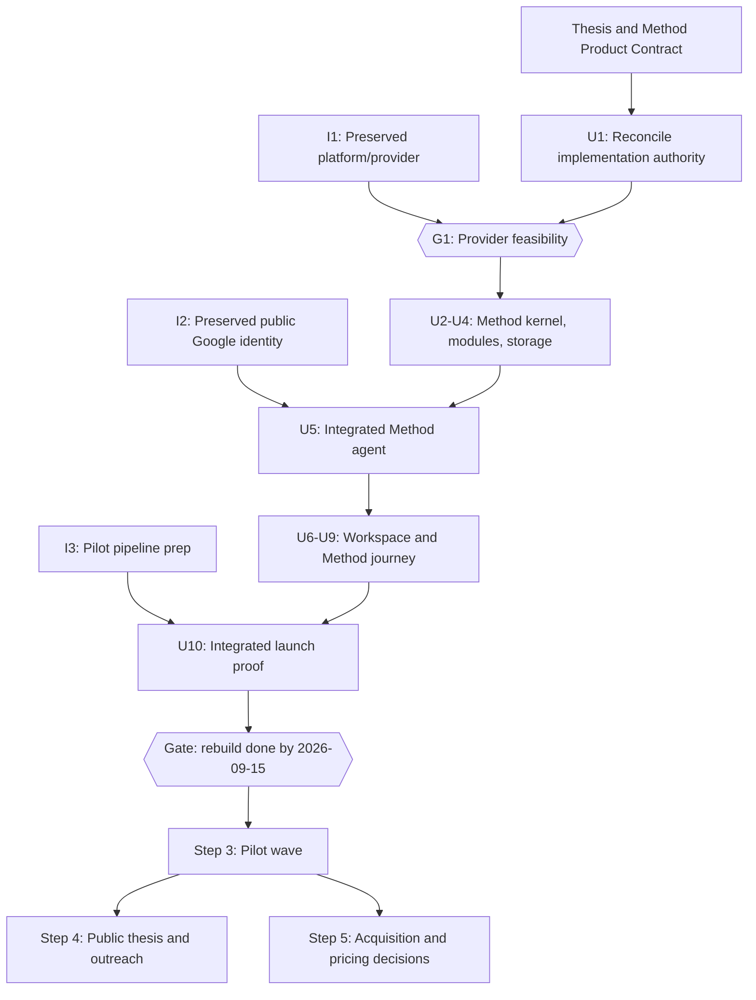
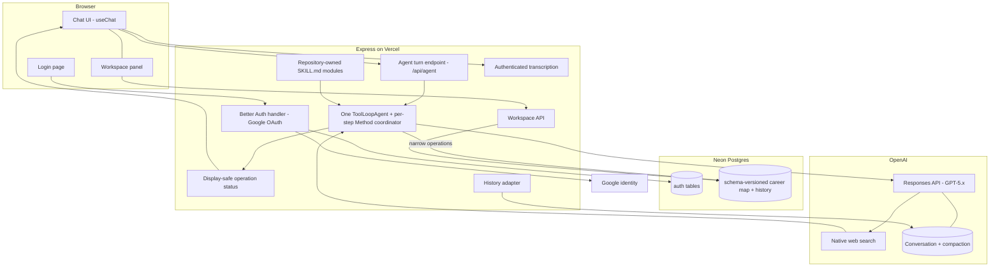
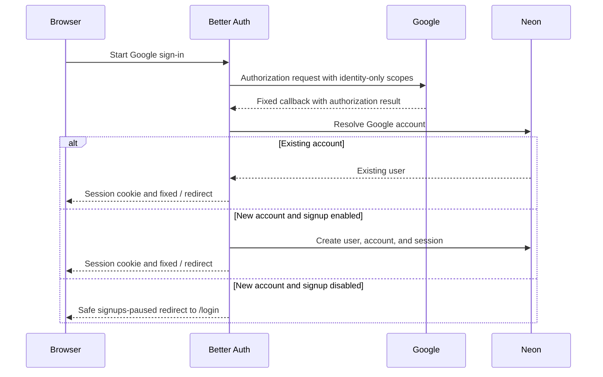
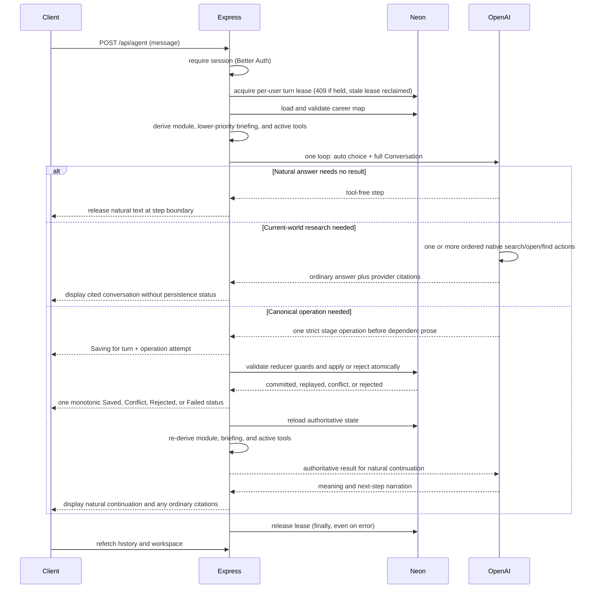
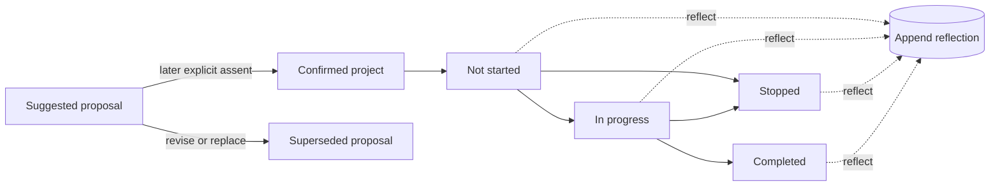

# Revelio Revamp (Claude) - Plan

## Goal Capsule

- **Objective:** Implement Steps 1–2 of the Revelio revamp to the 2026-09-15 gate: preserve the settled product shell, identity, provider, deployment, and legacy behavior; rebuild the default product around the complete Revelio Method; and prepare the pilot pipeline. Steps 3–5 stay sequenced gates, to be enriched on pilot evidence.
- **Authority hierarchy:** This plan is the implementation authority. `docs/thesis.md` is the Method authority. The tracked Product Contract at `docs/plans/2026-08-29-1133-feat-revelio-method-plan.md` must be present at that exact path and expose Method R1–R48, Method F1–F5, Method AE1–AE14, and Method KTD1–KTD12; it translates the thesis and founder-settled Method decisions into normative behavior and is incorporated here by reference. This plan owns sequencing and the preserved infrastructure contract. The explicit R9 commitment-state interpretation, R20 locale-relative canonical-copy rule, R21 limit on custom quota policy, and the 2026-09-03 MVP research simplification reconcile cross-contract differences and amend the incorporated Product Contract for implementation. The MVP amendment supersedes Method KTD10's isolated research and durable research-attempt/source machinery, extends Method KTD4 and KTD12 with one-loop authoritative-result continuation and UI-owned operation status, and replaces dependent technical language in the Method plan's G1, U4–U10, provider/data-integrity verification, privacy/risk, and Definition of Done sections. It does not change Method R1–R48, Method F1–F5, Method AE1–AE14, the seven-module KTD3 architecture, Method Foundation/reflection evidence, or any non-conflicting safety rule. Otherwise the thesis wins on Method philosophy, the Method Product Contract wins on product behavior, and this plan wins on implementation sequencing.
- **Execution profile:** Solo founder at 10–15 hours/week plus coding agents. The timebox governs optional polish, not silent contract erosion: preserve the 2026-09-15 gate by cutting only explicitly deferrable or non-normative scope. Removing or weakening any bound Method R/F/AE, unit verification, or Definition of Done item requires an explicit plan amendment.
- **Stop conditions:** Stop and surface — do not guess — if (a) the amended Sol loop cannot preserve automatic choice, native contextual search with ordinary provider citations, strict writes, lease, stream, abort, idempotency, Conversation, per-step Method refresh, result ordering, and compaction together, (b) the AI SDK v7 upgrade breaks the legacy assessment flow beyond the fallback in I1, or (c) a new production dependency beyond those named in this plan seems needed (repo rule: ask first). Isolated research, a preliminary classifier, a no-write routing tool, or any research-to-write authority layer is not an MVP fallback.
- **Tail ownership:** The founder owns gate dates, Method sign-off through the thesis and live transcripts, and pilot operations (I3, Revamp AE4). Code units are agent-executable.

---

## Product Contract

Reconciled 2026-08-29 and amended in place through 2026-09-03. The Revamp R/F/AE IDs keep their delivery, platform, access, rollout, and legacy-product meaning except for the explicit changes to R6, R17, R18, F1, and their acceptance checks below. Method behavior is governed by the Product Contract in `docs/plans/2026-08-29-1133-feat-revelio-method-plan.md`, subject to the named R9, R20, R21, and MVP research amendments in the Authority hierarchy; references in this plan are qualified as **Method R…**, **Method F…**, **Method AE…**, and **Method KTD…** so they cannot be confused with this plan's Revamp IDs. The Method contract is bound rather than copied here, and `docs/thesis.md` remains its philosophical authority. Any old active-plan unit names inside the bound Method artifact—such as its “current U2,” “U7a/U7b,” or Reconciliation Map rows—are pre-reconciliation mapping labels only; the Implementation Units in this active plan are the sole live unit IDs and sequencing. This amendment reopens affected acceptance in existing G1, U4, and U5 and updates existing dependent units; it creates no new implementation unit and preserves every U-ID.

This reconciliation replaces the earlier ikigai statement, direction path, experiment, generic confirmation, and continue/switch/new assumptions with Why I Work, Purpose Paths, Path Projects, What You Learned, user-owned Next Moves, meaningful peer exposure, and Side Doors. It preserves public Google identity, OpenAI Conversations and compaction, one active turn, the React/Vite + Express + Neon + Vercel stack, request-level provider safeguards, and the anonymous `/legacy` product.

### Summary

Revamp Revelio from a one-shot report generator into an adaptive exploration companion that carries the complete Method across sessions: form a provisional Why I Work, choose among three Purpose Paths, learn through Path Projects, decide the Next Move, and enter a provisionally chosen path through Side Doors. The settled infrastructure and parallel pilot pipeline support that Method rather than redefining it.

### Problem Frame

Revelio was built a year ago around a one-shot flow: an 8-question questionnaire produces three purpose paths and a static action plan, exported as a report. The product has had zero real users; acquisition was attempted once, with a single unanswered LinkedIn message. The December 2025 research is desk research and synthetic-persona testing (docs/research/2025-12-26-synthetic-user-feedback.md); no demand evidence exists in either direction.

The founder — himself a member of the target audience — does not believe the current product is good enough to sell. It fails his bar in three ways: outputs are static and cannot be iterated in dialogue; experiment design is generic, with no grounding in current real-world information; and the adaptive companion that guides exploration over time — judged the real, uncracked value — does not exist. The current system prompt also assumes the user "already know[s] but ha[sn't] articulated" their purpose (server/ai/prompts.ts:174), while the accumulated research concludes that decisive self-knowledge is generated by acting, not recovered by reflection.

The rethink exists but is unstructured: a 39-thread braindump spanning thesis, product form, method design, pricing, outreach, and go-to-market. The binding constraints are a solo founder at 10–15 hours/week beside a day job, and a moat thesis — a codified evidence-based method plus demonstrable results from a tight feedback loop — that cannot materialize without users.

### Key Decisions

- **Rebuild before pilots** (session-settled: user-directed — chosen over pilot-first manual validation: the current product fails the founder's own belief bar, and he will not sell what he does not believe in). Governs R3–R9.
- **Deadline gate over user-count gate** (session-settled: user-directed — chosen over gating on acquired users: the deadline is within the founder's control). Governs R3.
- **Input gates ride alongside the deadline** (session-settled: user-approved — pipeline gates bind on actions in the founder's control, countering the risk that the build absorbs the year). Governs R10.
- **Beachhead: career explorers like the founder** (session-settled: user-directed — chosen over students-now and over a criteria sprint: honest dogfooding, no gatekeepers, fastest feedback loop). Governs R6, R10, R16.
- **The thesis is the Method authority** (session-settled: user-directed — the completed `docs/thesis.md` states the philosophy the rebuild embodies; the Method Product Contract translates it into testable behavior without authoring a second thesis). Governs R1–R2 and all Method R1–R48.
- **Agent experience over web-app flow** (session-settled: user-directed — chosen over improving static generation: dialogue, iterable outputs, and persistent memory are both the 2026 baseline and the personalization mechanism). Governs R4–R5, R7.
- **Plan shape: two-track build month, thesis as asset** (session-settled: user-approved — chosen over a sequential relay and over a full public-essay program: no dead weeks after the build, without becoming a content project). Governs R10–R11, R14.
- **AI-drafted research is input, not decision** (session-settled: user-directed — the 2026-08-11 direction doc's conclusions hold only where the founder re-affirmed them in this plan). Pure framing; no governed Rs.
- **Adaptive, coverage-guided Foundation over a fixed questionnaire** (session-settled: user-directed — ask one short question per turn, reuse rich answers, and probe only until the evidence supports a Why I Work suggestion). Governs R8 and Method R5–R12.
- **English-only UI, language-mirroring agent** (session-settled: user-approved — chosen over maintaining the en/es i18n surface on the new product: pilots run in English; the model mirrors the user's language natively, so the i18n machinery buys nothing). Governs R20.
- **Three Purpose Paths, picked without interference** (session-settled: user-directed — the agent proposes three distinct, equally weighted ways to serve the confirmed Why; the explorer discusses, combines, modifies, or replaces them and explicitly chooses one. The agent recommends only when asked). Governs R9 and Method R13–R17.
- **One first Path Project; three later choices** (session-settled: user-directed — onboarding gets one thoughtfully designed project for collaborative refinement; after a learning loop, explore-further produces three equal project options and the explorer chooses one). Governs R9 and Method R18–R25, R48.
- **The explorer owns the Next Move** (session-settled: user-directed — evidence informs but never predicts the choice; no fixed project count, duration, score, or recommendation decides whether to explore further or commit provisionally). Governs R9 and Method R26–R33.
- **Public access behind Google identity** (session-settled: user-approved — chosen over invite-only magic links: a manual access gate adds acquisition and email-infrastructure work without current usage or abuse evidence; session-derived ownership, request-size bounds, one-turn concurrency, user interruption, billing alerts, and kill switches cover the observed pilot risk without limiting normal use). Governs R19, R21, AE6, AE10, AE11.
- **Contextual research belongs to the main agent loop** (session-settled: user-directed — chosen over isolated, de-identified, separately modeled research: useful Method research needs the full Conversation and focused Career Map context without a lossy public taxonomy). Governs R6, R17–R18 and Method R14, R17, R24, R35–R40, R46.
- **One intelligent loop owns conversation and state-change decisions** (session-settled: user-directed — chosen over preliminary routing/authorization model calls and an internal no-write tool: the agent should choose natural reply, search, or a stage tool and continue from authoritative results). Governs R4–R6, R17–R18 and Method R41, R44–R46.
- **The seven state-selected Method modules stay fixed** (session-settled: user-directed — chosen over reopening the module architecture: the repository-owned `SKILL.md` design is already settled, with U3 owning the first three modules and later units adding the remaining four). Governs R4, R8–R9 and Method R1–R48.

### How This Work Fits Together

<!-- ce-section: work-relationships -->

This plan owns the revamp's sequencing, scope, and gates and incorporates the Method Product Contract by reference. Steps 3–5 get their own enrichment when they start; their breakdown below is the current understanding, not a committed roadmap.

- Step 1 — Thesis and Method authority. `docs/thesis.md` is complete; U1 reconciles this implementation authority with the Method Product Contract.
- Step 2, infrastructure track — Platform preparation and identity (I1, I2) preserve the settled shell, public Google access, provider, and `/legacy` contracts.
- Step 2, Method track — G1 and U2–U10 implement the complete Method, with the first full learning loop as the initial emphasis.
- Step 2, pipeline track — I3's private candidate list and invitation proceed independently and share the R3 gate date; erasure-runbook finalization and its dry run wait for I2, U4, and U5.
- Step 3 — Pilot wave. Depends on both Step 2 tracks. Not unitized here.
- Step 4 — Public thesis and outreach. Depends on Step 3 evidence. Not unitized here.
- Step 5 — Commercialization decisions. Depends on Step 3; draws on the first-customer research in docs/research/. Not unitized here.

### Actors

- A1. Founder — solo builder-operator at 10–15 hours/week; also a member of the beachhead and the product's reference user.
- A2. Pilot explorer — an employed adult asking "what should I work on?"; recruited directly without gatekeepers; uses the agent and runs real Path Projects between sessions.
- A3. The Revelio agent — the rebuilt product: conversational, memory-bearing, guiding the Method lifecycle and learning loop.
- A4. Field contacts — the Stanford Life Design network and Bill Gurley; Step 4 outreach targets, approached with prototype and pilot evidence in hand.

### Requirements

**Step 1 — thesis and Method authority**

- R1. `docs/thesis.md` is the founder-approved Method authority. Pilot evidence may revise it later; implementation does not author a replacement thesis.
- R2. The tracked Product Contract at `docs/plans/2026-08-29-1133-feat-revelio-method-plan.md` must be present at that exact path and is bound in full as Method R1–R48, Method F1–F5, Method AE1–AE14, and Method KTD1–KTD12. It translates the thesis into testable behavior; this plan owns its implementation sequence and does not paraphrase it into a competing method specification.

**Step 2, build track — agent rebuild (timeboxed)**

- R3. The rebuild is complete by 2026-09-15. Optional polish and explicitly deferred surfaces are cut to fit the date; no bound Method requirement, flow, acceptance example, unit verification, or Definition of Done item is cut without an explicit contract amendment.
- R4. The rebuilt product is an agent the user converses with: Why I Work, Purpose Paths, Path Projects, learning, Next Moves, peer exposure, proof, and Side Doors can be questioned and refined in dialogue under Method R1–R48 rather than regenerated as a static report.
- R5. The agent has persistent memory across sessions: it retains the canonical Method state and lineage defined by Method R41–R46, and its next turn derives from that state. Stable server-derived identity owns the map; conversation and product memory remain separate stores.
- R6. Research and Path Project support are personalized and grounded under Method R14, R17, R19–R25, R34–R40, and R46. Current-world research is ordinary contextual conversation inside the main Sol `ToolLoopAgent`, with automatic native web search, the full server-owned OpenAI Conversation, the active repository module, and focused Career Map context. Provider citations remain visible in bounded conversation/history transport, but research never authorizes or becomes part of canonical Career Map state and never performs an external action for the explorer.
- R7. Input is a text box with an optional microphone button reusing the existing speech-to-text capability; text remains the primary output.
- R8. The entry experience forms the Foundation and a provisional Why I Work exactly as Method R5–R12 specify: one short question per turn, minimum sufficient coverage, doing evidence before consumption evidence, explicit confirmation before paths, and practical constraints kept outside the Why itself.
- R9. The companion supports the complete Method lifecycle in Method F1–F5: three unranked Purpose Paths; one collaboratively refined first Path Project; on-demand project guidance; What You Learned at any work status; a user-owned Next Move; three follow-on project options when exploring further; meaningful peer exposure before provisional commitment; proof; and three Side Doors. The user's “commit provisionally” Next Move first records `commitment_intent`; `provisional_commitment` is created and Side Doors begins only after the Method R34–R35 peer guard passes. The pre-guard “commit” edge in the Method lifecycle diagram is interpreted as intent, not completed commitment. Canonical state, not elapsed time or transcript parsing, determines what resumes.

**Step 2, pipeline track — pilot pipeline**

- R10. Before 2026-09-15, a named list of at least 5 pilot candidates matching A2 and a drafted pilot invitation exist (defaults; the founder may recalibrate numbers without re-scoping).
- R11. Pilot outreach is interest-led: the founder contacts suitable candidates as interest or a credible opportunity appears, without a fixed send deadline, canary schedule, or batch requirement.

**Step 3 — pilot wave**

- R12. A pilot counts as successful when the explorer completes one full learning loop through a user-owned Next Move (Method F1–F3, plus Method F4 only when peer exposure is triggered or commitment is chosen). The settled default target remains 5 completed loops by 2026-10-31. Separately, the founder reviews the first five completed or deliberately abandoned pilot sessions before expanding access so abandonment evidence can improve the Method without counting as completion. A session is deliberately abandoned only when its explorer or the founder records that decision explicitly; elapsed time, inactivity, or a timer never infer it. That review uses a privacy-safe founder artifact with an opaque session id, the explicit decision and actor, and minimum necessary status/operation metadata—not private reflection or transcript content.
- R13. Each pilot's canonical evidence is preserved with provenance and lineage — Foundation evidence, path and project revisions, reflection sessions, Next Moves, peer exposure, commitment, proof, Side Doors, and route outcomes as applicable — so later learning can inform the thesis and product without rewriting the basis of earlier decisions.

**Step 4 — public thesis and outreach**

- R14. The current thesis is matured with pilot evidence into a public one-pager without changing its Method authority implicitly.
- R15. Outreach to A4 begins only after a working prototype and at least one pilot story exist; the public thesis is the outreach vehicle.

**Step 5 — commercialization decisions**

- R16. After the pilot wave, an acquisition-and-pricing decision phase runs on pilot evidence plus the first-customer research (docs/research/first_10_customers_transcript.txt, docs/research/first_users_transcript.txt, docs/research/startup_school_first_customers_transcript.txt); the beachhead-expansion question (students, parents, schools) is decided there, not before.

**Cross-cutting product behavior (added at this enrichment)**

- R17. The explorer can inspect and correct the canonical Method state alongside the conversation. Deterministic components render the Foundation, three comparable Purpose Paths, the active Path Project, What You Learned, Next Move, and lightweight later-stage state under Method R41–R43; ordinary provider citations remain attached to conversation history rather than the map. The UI—not assistant prose—owns operation status for Saving, Saved, Conflict, Rejected, and Failed; an idempotent replay renders and announces Saved rather than exposing replay as a separate user-facing state. Suggested/Confirmed agreement remains separate from work, reflection, selection, and Method evidence status. Desktop keeps chat and Your Map side by side; phones keep the two-tab layout.
- R18. Canonical changes are never recovered by parsing prose. One `ToolLoopAgent` chooses among natural conversation, native research, and the current stage's narrow validated operations. Every accepted fact, proposal, revision, confirmation, selection, work update, reflection, Next Move, peer exposure, commitment, proof item, Side Door, and route outcome passes the auditable operation and deterministic reducer contract in Method R41–R46 before any result-dependent claim is shown. Search-only conversation cannot write. An exact current-message request may authorize its matching Suggested proposal or edit; confirmation, acceptance, and selection additionally require the completed prior presentation plus exact target and revision; an authenticated explicit UI action is the only alternate authority. Retrieved material and hostile retrieved instructions can inform conversation but cannot satisfy any of those guards or authorize canonical state, a consequential decision, explorer-authored evidence, or an external action. After a committed, replayed, conflicted, rejected, or failed result, the same loop continues from refreshed authoritative state and discusses meaning or next steps rather than persistence mechanics.
- R19. The rebuilt product lives at the canonical `/` route: signed-in visitors use the chat-and-map workspace there, while signed-out visitors are sent to `/login`. The agent accepts any Google account while the founder-controlled signup switch is enabled; disabling signup blocks new accounts without preventing existing users from signing in. The legacy questionnaire starts at `/legacy` and remains anonymous; its existing results, action-plan, API, and data behavior stay intact.
- R20. The new `/` product and `/login` UI are English-only; the legacy questionnaire retains its existing en/es UI, and the agent converses in whatever language the explorer writes in. For Method R22, R26, and R29, an English conversation uses the exact canonical English sentence; a non-English conversation uses a faithful concise translation in the explorer's language. The exact-string verification gate is therefore English-locale exactness plus semantic-equivalence fixtures for any tested non-English locale.
- R21. Normal signed-in use has no fixed daily action allowance and no Revelio-specific numeric loop-stop or tool-call quota policy. The Sol `ToolLoopAgent` uses the pinned AI SDK's standard loop behavior, while canonical state may change the available tools and active Method module on each step. Provider safety stays request-level and operational: bounded text/audio inputs, one active turn per user, a visible Stop control, the ability to interrupt a streaming reply by sending a new message, a billing alert, and the `AGENT_ENABLED` emergency switch. Missing or false `AGENT_ENABLED` fails closed before an agent turn or direct workspace domain-operation write can acquire a lease, load or write map/history/turn state, or call a provider; authenticated read-only history and map access remain available. An interruption cancels provider and tool work before the next message starts. The anonymous legacy routes keep their existing behavior until observed abuse justifies a targeted control.

### Key Flows

- F1. Method lifecycle conversation (the core product behavior)
  - **Trigger:** A pilot explorer (A2) opens Revelio for the first time or returns with canonical Method state.
  - **Steps:** The server derives the active checkpoint → loads the matching repository-owned Method module, lower-priority focused briefing, native web search, and request-scoped superset of narrow tools → one `ToolLoopAgent` automatically chooses natural text, research, or an active stage tool → the reducer applies or rejects any operation → the UI reports operation status → the loop reloads authoritative state and refreshes the next module, briefing, and active tools before continuing. The user journey and branch semantics are Method F1–F5.
  - **Outcome:** The explorer leaves each session with a clear current decision or useful next action, while the map preserves what was learned and why later choices were made.
  - **Covers:** R4–R9, R17–R18; Method R1–R48 and Method F1–F5.
- F2. Foundation and first Path Project (entry into F1)
  - **Trigger:** A Google-authenticated explorer signs in for the first time; no Method state exists for them.
  - **Steps:** `/` presents a deterministic welcome without calling a model → adaptive Foundation coverage produces a Suggested Why I Work → the explorer refines and confirms it → three equal Purpose Paths are proposed and the explorer chooses one → one first Path Project is collaboratively refined and accepted with the exact Method R22 framing.
  - **Outcome:** Confirmed Why, selected Purpose Path, and accepted first Path Project with evidence and provenance in the career map.
  - **Covers:** R4–R9, R17–R18; Method F1–F2 and Method AE1–AE6.
- F3. Google sign-in and return
  - **Trigger:** A visitor opens the canonical `/` entry.
  - **Steps:** The client resolves session state without showing the wrong surface → a signed-in visitor uses the product at `/`; a signed-out visitor enters `/login` and chooses Google sign-in → Google returns to the fixed Better Auth callback → Better Auth resolves or creates the account according to the signup switch → the client returns to `/`, now showing the product. A returning Google account resolves to the same Better Auth user and career map; sign-out ends the current session.
  - **Outcome:** One stable, server-derived user identity owns every new-product request; provider tokens never enter agent context.
  - **Covers:** R5, R19.

### Acceptance Examples

- Method AE1–AE14 replace the former behavior-level Revamp examples and are incorporated in full from the Method Product Contract. Method units cite those IDs directly; this plan does not maintain paraphrased duplicates.
- **2026-09-03 amendment to Method AE13 implementation:** A natural question enters exactly one Sol `ToolLoopAgent`, makes no preliminary classifier or authorization-model call, uses no internal no-write tool, shows no save status, and changes no canonical state. A result-dependent turn may call native search or a strict stage tool before the dependent claim; committed/replayed/conflicted/rejected results refresh state before natural continuation, while the UI alone renders the mechanical result. Direct assent in the explorer's language may select an exact prior target; questioning, quoted, negative, conditional, multi-target, same-turn, or stale assent cannot, and retrieved material supplies no authority.
- **2026-09-03 MVP research acceptance:** Search-only answers use the same stored Conversation and focused context, retain ordinary clickable provider citations in bounded history, emit no persistence status, and create no Career Map or history mutation. Search plus an independently authorized stage operation may occur in the same agent response without a research-resolution retry. Only the exact current explorer message or authenticated explicit UI action supplies write authority; same-turn self-confirmation, stale/generic/negative/conditional/quoted/multi-target assent, a search result, or hostile retrieved instructions cannot. Missing citations, search failure, and insufficient results stay conversational uncertainty and create no research record, confirmed decision, user-authored evidence, external action, or padded exact-three set.
- AE3. **Covers R3, R10, R11.** Given the rebuild lands and the pipeline gate is checked, then at least 5 named candidates and a drafted invitation already exist; the founder contacts suitable candidates as interest or a credible opportunity appears, without a seven-day or canary deadline.
- AE4. **Covers R15.** Given the rebuild is done but no pilot has completed a loop, when the founder is tempted to contact Stanford or Gurley, then outreach waits — the gate is prototype plus at least one pilot story, not the prototype alone.
- AE6. **Covers R5, R19.** Given signup is enabled and a new visitor completes Google sign-in, then one Better Auth user, account, and session are created and the product loads at `/`; signing in later with the same Google account resolves to that same user and career map.
- AE10. **Covers R19.** Given new signups are disabled, when an unseen Google account completes OAuth it is denied with safe retry copy, while an existing Revelio account using Google can still sign in.
- AE11. **Covers R21.** Given a signed-in explorer continues a long conversation on the same day, then no arbitrary daily allowance blocks normal use and the Sol `ToolLoopAgent` follows the pinned AI SDK defaults. Oversized input, a simultaneous second turn, or the emergency switch still fails safely. When a reply appears stuck, Stop cancels it, and submitting "You seem stuck" while it streams cancels that reply before sending the new message.

### Success Criteria

- Founder-belief bar: at the R3 gate, the founder — as a member of the beachhead — would personally pay for and keep using the rebuilt product.
- Adaptive-value signal: pilots' return sessions produce information that visibly changes or strengthens their next decision — the test of the companion hypothesis against a one-time report.
- Year outcome: by end of 2026, real users have completed loops and the R16 decisions are made on evidence rather than conjecture.

### Scope Boundaries

**Deferred for later**

- Beachhead expansion (students, parents, schools) and any B2B motion — a Step 5 decision made on evidence.
- Pricing and payment: pilots run free; willingness-to-pay is a Step 5 question. No payment code exists today and none is built in the rebuild.
- Proactive reminders, timers, guilt-inducing check-ins, and re-engagement email. Multi-loop journeys are in scope when the explorer chooses them; automatic cadence is not.
- Invite allowlists, magic-link email, passwords, and additional social providers — Google identity is the only sign-in method in this build.
- A controlled custom domain and Google OAuth brand/production verification — required before broad commercial launch, but not for this pilot because the External Google project stays in Testing and requests only identity scopes.
- A production eval platform. Verification uses deterministic invariant tests plus versioned golden transcripts and the Method contract's qualitative rubric; no new eval-framework dependency is added before pilot evidence shows it is needed.
- A public essay program beyond the single one-pager.
- Migrating auth to Neon Managed Better Auth if/when it reaches GA with a documented first-class Express path (see KTD8).
- A Spanish product UI; retiring the old app's en/es machinery happens when the old app itself is retired.
- A general version-history UI for the career map (history and lineage are stored from day one; focused basis-review and repair-required states are in scope, a full history browser is not).
- Pilot-ops reporting (e.g., a stall report over active Path Projects) — a Step 3 concern once pilots exist; no timer or proactive reminder belongs in the Method build.

**Outside this product's identity**

- MCP, CLI, or plugin form factors — the agent lives in Revelio's own product, usable by non-developers; agent-infrastructure surfaces would narrow the beachhead to developers.
- A comprehensive "career operating system" — the product is the complete Method through lightweight Side Doors, with the first learning loop as the implementation emphasis.
- Prestige-optimized recommendations or unsolicited rankings — the explorer owns consequential choices, and the agent recommends only when explicitly asked.

### Dependencies / Assumptions

- Assumption: the founder is representative enough of the beachhead for dogfooding to be a valid quality signal; pilot evidence is the check on this.
- Assumption: 10–15 hours/week holds through the fall; the timebox and default targets are sized to it.
- Assumption: the founder-approved `docs/thesis.md` is sufficient Method authority for implementation; pilot evidence, not another pre-build research phase, is the next planned challenge to it.
- Assumption: pilots run without payment; incentives, if any, are decided during pipeline prep.
- Dependency: the existing speech-to-text capability (docs/plans/2026-04-19-001-feat-speech-to-text-plan.md) for R7.
- Dependency: an OpenAI API account with billing (KTD3, KTD4), a Google Cloud OAuth web client configured for the exact local and production callbacks, and Vercel secrets. These are founder-provisioned in Stage 0; no OpenAI hard spend limit is required for this pilot.

### Outstanding Questions

The origin's three deferred-to-planning questions are resolved in the Planning Contract: agent runtime and architecture (KTD1–KTD7 plus Method KTD1–KTD12), model selection and modular prompt approach (KTD3, G1, U3), and reuse-vs-replace (KTD1). Sol remains selected for the MVP. Remaining questions, all deferred (non-blocking):

- Compaction threshold tuning (KTD4) — begin with the provider behavior proved in G1 and adjust from real turn sizes during dogfooding without weakening the safe-boundary rule.
- Pilot incentives — decided during I3, not a build input.

### Sources / Research

- The founder's braindump (39 threads, outside the repo at ~/Andres/Revelio.md) — organized into this plan; see the Appendix disposition map.
- `docs/thesis.md` — philosophical and Method authority.
- `docs/plans/2026-08-29-1133-feat-revelio-method-plan.md` — bound Method Product Contract, technical reconciliation, and governing Method R/F/AE/KTD IDs.
- `docs/research/2026-08-28-side-doors-career-entry.md` — Side Doors method and entry-route research.
- docs/research/2026-08-11-what-to-work-on-research.md and docs/research/2026-08-11-what-to-work-on-product-direction.md — AI-drafted synthesis and direction; inputs only, per Key Decisions.
- docs/research/2026-08-25-vocation-competitor-dossier.md — point-in-time commercial competitor research; sharpens the differentiation around representative-work evidence without changing pilot scope or treating competitor pricing as willingness-to-pay evidence.
- docs/research/2025-12-24-user-research.md and docs/research/2025-12-26-synthetic-user-feedback.md — desk research and synthetic personas; no real-user evidence exists anywhere.
- docs/research/2026-04-11-private-schools-product-direction.md and docs/research/2026-05-03-runnymede-and-parents-product-direction.md — prior directions; neither was executed.
- First-customer transcripts for Step 5: docs/research/first_10_customers_transcript.txt, docs/research/first_users_transcript.txt, docs/research/startup_school_first_customers_transcript.txt.
- Alpha School one-pager model: https://alpha.school/blog/inside-alphas-olympic-level-project-for-high-schoolers/ — spiky point of view, "best in the world" vision framing, and the why-now argument.
- Code anchors: server/ai/prompts.ts:174 (the "already know" assumption the rebuild removes); shared/streaming-schemas.ts (no hypothesis, evidence, or confidence representation); client/src/components/questionnaire/questions.ts (8 free-text questions); no payment code anywhere; no user accounts (shared/schema.ts, sessionId-keyed).
- Planning research sources are cited inline on the KTDs they justify.
- OpenAI web search, Conversations, compaction, function-calling, and agent-safety documentation at https://developers.openai.com/api/docs/guides/tools-web-search, https://developers.openai.com/api/docs/guides/conversation-state, https://developers.openai.com/api/docs/guides/compaction, https://developers.openai.com/api/docs/guides/function-calling, and https://developers.openai.com/api/docs/guides/agent-builder-safety — native search/citation shape, stored Conversation behavior, compaction, strict tools, and untrusted-data priority; re-verified 2026-09-02.
- Pinned AI SDK/OpenAI provider sources and docs at https://github.com/vercel/ai/tree/ai%407.0.66/packages/ai, https://github.com/vercel/ai/tree/%40ai-sdk%2Fopenai%404.0.42/packages/openai, https://ai-sdk.dev/docs/agents/loop-control, and https://ai-sdk.dev/providers/ai-sdk-providers/openai — `ToolLoopAgent`, `prepareStep`, `activeTools`, automatic choice, provider-executed search metadata, UI source parts, and exact version contracts; re-verified 2026-09-02.
- Auth sources verified 2026-08-17: Better Auth Express, Google provider, PostgreSQL adapter, rate-limit, and test-utils documentation at https://better-auth.com/docs; Google Auth Platform audience rules at https://support.google.com/cloud/answer/15549945; Vercel request-header behavior at https://vercel.com/docs/headers/request-headers.

---

## Planning Contract

The architecture was researched from first principles per the origin's planning question, with candidates verified against live documentation in August 2026. Facts below marked "verified" were checked against current docs or source; anything time-sensitive should be re-checked briefly at build time.

Consolidated 2026-08-14 (user-directed): a thin layer of reliability protections merged in from the parallel codex plan (docs/plans/2026-08-14-codex-1824-feat-revelio-agent-rebuild-plan.md) — live provider spike, retry idempotency, version-checked writes, compaction guard, markdown/citation rendering policy, agent kill switches, staged outreach, reviewed production migration, erasure runbook, Node 24 pin, and the native PostgreSQL auth adapter. The write model stays conversational write-through with the Suggested/Confirmed boundary (no approval cards). The 2026-08-17 auth amendment replaces the former invite and email mechanics in place.

Reconciled 2026-08-29: KTD1–KTD4 and KTD7–KTD10 remain settled and authoritative. KTD5 and KTD6 are amended below to host the Method kernel and its operations. Method KTD1–KTD12 in the bound Method Product Contract govern the domain model, module loader, research provenance, deterministic presentation, and per-step refresh without changing this plan's provider, identity, concurrency, deployment, or legacy ownership.

Amended 2026-08-31 (user-approved): KTD8 gives Better Auth its own direct/unpooled `BETTER_AUTH_DATABASE_URL` while the application's existing `DATABASE_URL` remains pooled. A disposable Neon branch proved that Neon pooled endpoints reject the `search_path` startup option required for the isolated `auth` schema; the direct endpoint preserves the settled schema-isolation design without moving application queries off the pool.

Amended 2026-09-02 (user-directed): the already implemented G1/U5 slice is reopened in place. Contextual research moves into the main `ToolLoopAgent`; preliminary routing and semantic-authorization model calls and the internal no-write tool are removed; deterministic operation status moves to the UI; and the seven repository-owned Method modules keep their existing U3/U8/U9 ownership. The amendment changes KTD3–KTD6 and dependent checks below, supersedes only the conflicting Method-plan technical clauses named in the Authority hierarchy, and adds no unit or KTD ID.

Amended 2026-09-03 (user-directed): the MVP keeps contextual search as ordinary conversation but removes the unshipped research-evidence authority layer. Provider citations remain bounded Conversation/history presentation only. Canonical saves depend solely on the current explorer message or explicit UI action plus KTD6 and KTD7's deterministic guards. Evidence handles, claim/source associations, research attempts, research-resolution retry state, the evidence-driven one-Response fallback, and their schema/migration/compatibility/provider-harness machinery are removed without adding a unit or KTD ID. Method Foundation and reflection evidence, action provenance, lineage, canonical operation history, and the seven modules remain unchanged.

### Key Technical Decisions

- KTD1. **Platform-retaining rebuild.** Keep the React/Vite client, Express server, Neon Postgres, and Vercel hosting; delete only the dead report-generation files enumerated in I1, preserve the working legacy questionnaire per KTD9, and build the agent inside the shell. (session-settled: user-approved — chosen over a greenfield Next.js rebuild or the vercel/chatbot template: the template was verified to ship four artifact subsystems, next-auth beta, and an AI-Gateway default that would all need gutting; the shell is not what failed, and nothing in this rebuild needs Next.js.) Governs the origin's reuse-vs-replace question.
- KTD2. **Agent runtime: Vercel AI SDK agent loop on v7.** Use the SDK's agent abstraction (`ToolLoopAgent`) with custom tools, streamed to the existing Express response via the SDK's UI-message stream helpers; the client uses `useChat` from `@ai-sdk/react`. Platform-prep commit `15841f8` moved the repository to `ai` v7 and matching `@ai-sdk/*` v4 packages; I1 now verifies and preserves that landed baseline. (session-settled: user-approved — chosen from a first-principles field over: OpenAI Agents SDK for JS (loop is fine but the streaming-UI and React story is thinner); Eve (a hosted-agent platform, wrong shape for an in-product companion); Mastra and LangGraph (workflow-framework weight this single-loop product does not need); a thin hand-rolled `openai` SDK loop (re-implements streaming, tool orchestration, and client wiring the SDK already owns). The incumbent won on merits, not on migration cost, which the founder ruled out as a deciding factor.) The latest v6 remains the recorded emergency fallback only if a newly discovered v7 regression makes the preserved legacy chain infeasible; exercising it requires an explicit plan amendment rather than treating the landed upgrade as pending. Repository-owned Method `SKILL.md` modules are loaded by the application per Method KTD3; this does not move skill execution to OpenAI-hosted Skills.
- KTD3. **Model: OpenAI `gpt-5.6-sol` via the `@ai-sdk/openai` Responses provider, with native non-preview web search in the main loop.** One `ToolLoopAgent` predeclares the request-scoped superset of strict Method tools plus `openai.tools.webSearch()`, uses `toolChoice: "auto"`, disables parallel custom-tool calls, and selects the stage-relevant subset through `activeTools` after every authoritative refresh. Native search and an independently authorized custom operation may occur in the same SDK loop without an evidence-specific retry. The main agent receives the full Conversation and focused Career Map and decides whether and how to search. The server does not isolate, de-identify, categorize, redact, rewrite, or separately persist search context or queries, and adds no research-specific model call, pre-search authorization gate, hardcoded research menu, or raw provider-result include used only for grounding. (session-settled: user-directed — chosen over isolated, de-identified research and a separate model call: Method research needs the whole conversational and canonical context without a lossy public taxonomy.) The existing model decision remains user-directed over Gemini because its verified tool-composition limits would force two-pass workarounds for R6. Sol is the sole Revelio model for the MVP; introducing another snapshot requires a later explicit plan amendment. Sources: OpenAI web-search and function-calling documentation and the pinned provider source.
- KTD4. **Conversation transcript lives in OpenAI Conversations, with server-side compaction and lower-priority dynamic context.** Each user gets one OpenAI conversation object; turns pass its id through first-class `@ai-sdk/openai` Responses provider options (`conversation`, `store: true`), so the one agent loop sees the full transcript. Stable Method base policy and the selected repository-owned module are refreshed as request-scoped developer instructions. User-derived Career Map briefing content is separately delimited and supplied as lower-priority, provenance-marked request input; neither map data nor retrieved content is interpolated into developer instructions, and durable item/turn provenance—not text-prefix filtering—keeps internal context out of displayed history. Apply provider compaction only on step 0 of a new turn, after the prior loop completes, and never while hosted-search or custom-tool output is pending; the exact compacted content remains provider-controlled. U5's authenticated history adapter walks provider pages newest-first only until it fills a bounded display page or reaches exhaustion, returns an opaque server cursor for older display-safe user/assistant text and ordinary provider citations, and excludes internal context, system/developer, compaction, reasoning, raw search, and tool items. Initial load and terminal refetch fetch only that newest display page; older pages load on explicit demand without changing the Conversation sent to the main agent. Erasure is separate, exhaustive, resumable work: it records progress, retries provider pagination, deletes every Conversation item—including internal Career Map context, hosted-search calls/results, and citation items—and deletes the Conversation only after every item succeeds. (session-settled: user-directed — chosen over placing dynamic personal data at developer priority: the main loop needs full context, while untrusted user/map/retrieved data must not gain policy authority.) The prior user-directed choice of OpenAI-side transcript storage and compaction over BYO transcript persistence remains unchanged. Sources: OpenAI Conversations, compaction, web-search, and agent-safety documentation and the pinned provider source.
- KTD5. **Product memory is one schema-versioned Method career-map document per user in Neon Postgres.** The `career_maps` JSONB document remains the durable product memory, composed from the established Method domain schemas. Canonical records preserve explorer-action provenance, Method Foundation and reflection evidence, basis revisions, decision lineage, presentations, and append-only operation history; changing a basis marks the dependent closure for review. Storage validates the complete map on load and before commit; unsupported or invalid state fails closed into repair-required. A focused projection is compiled for the active checkpoint and supplied to the loop under KTD4's lower-priority boundary. Provider search results, citations, source associations, handles, support grades, and research attempts never enter the map, briefing, reducer, tool input, or Neon storage. Conversation memory and product memory remain separate stores. (session-settled: user-directed — chosen over a durable research ledger: ordinary citations are sufficient for contextual MVP research and the explorer's later action, not retrieved material, authorizes canonical state.) Implements R5, R6, R13, R17, R18 and Method R11, R16, R23, R33, R35–R40, R41–R46; incorporates non-conflicting Method KTD1, KTD2, KTD7, and KTD8.
- KTD6. **One intelligent agent loop converses, researches, and requests narrow domain operations; the UI owns persistence status.** Remove `classifyMethodTurn`, `MethodTurnRoute`, `classifyConsequentialAuthorization`, `continue_natural_conversation`, and their forced routing/authorization steps. A no-tool completion is natural conversation; a current-world answer may use native search; a canonical change must use a strict stage tool whose authority comes only from the current explorer message or authenticated explicit UI action. Generic upserts, unrestricted workspace patches, generic confirmation, model-supplied authorization flags, research-source fields, and parallel canonical writes remain prohibited. Search-only conversation cannot write. An exact current-message request may authorize its matching Suggested proposal or edit; confirmation, acceptance, and selection additionally require the completed prior presentation plus exact target and revision. Deterministic whole-message vetoes plus legal-transition, reducer, lease, abort, and idempotency guards remain mandatory; ambiguous, neutral, questioning, negative, conditional, quoted, multi-target, same-turn, or stale assent rejects into the same loop for clarification. Search and an otherwise authorized operation may occur in one SDK loop without evidence handles, a same-Response research gate, `researchResolutionPending`, or reject-to-ledger retry state. A result barrier buffers each custom-tool-capable step: a tool-free or search-only step releases ordinary cited conversation at the step boundary; a custom-tool step discards pre-tool prose and continues only after committed, idempotent-replay, conflict, rejected, or tool-error state is authoritatively reloaded and the module, lower-priority briefing, and `activeTools` are re-derived. The assistant then discusses meaning and next steps. A display-safe application channel keys each custom-operation attempt by server-owned turn, message, and opaque operation/tool-call identity; it emits Saving only for that operation and exactly one monotonic terminal Saved, Conflict, Rejected, or Failed. Search and no-tool conversation emit no Saving. Retries have distinct attempts, stale/out-of-order events are ignored, and Saved never regresses if later narration/provider work fails. (session-settled: user-directed — chosen over preliminary classifiers, a no-write conversation tool, and research-evidence authorization: one context-rich loop should decide the useful action while deterministic explorer authority alone protects canonical state.) This preserves KTD7 and implements R17–R18 plus Method KTD4–KTD6 and KTD12 as amended here.
- KTD7. **Turn durability and concurrency contract.** Tool execution errors are returned into the loop as tool results (the agent sees the failure and can retry or tell the user), never thrown across the stream. One turn per user at a time, enforced with a per-user lease in Postgres: the lease carries an expiry above the platform's 300-second function cap, is released in a finally path after completion, error, or user cancellation, and a stale lease is reclaimed by the next turn — a crashed turn can never lock a user out. Every canonical write and turn/operation terminal transition revalidates the exact current unexpired user + turn + lease fence and abort state in its owner-locked transaction immediately before commit; a reclaimed or cancelled worker cannot resume, mutate state, or emit a later terminal status even when no successor write changed the map revision. Retries are idempotent at two levels: the client sends a generated message id with each turn, so a network retry attaches to the existing turn record instead of starting a new one; and each applied map write records its tool-call id in the change history with a per-map uniqueness guard, so a duplicated tool result cannot apply twice. Attaching never re-streams or re-invokes the model: a retried message id whose turn is still in flight gets the in-progress response (409 with turn status), and one whose turn already completed gets a small completed marker directing the client to refetch history and the workspace panel. A concurrent turn gets HTTP 409 and the client shows "one conversation at a time." A user interruption is sequential rather than concurrent: the client aborts the current fetch, Express bridges the closed request into an `AbortSignal` for the agent and tools, the turn is marked cancelled and its lease is released, then any queued new message is submitted with its own id. Tool writes committed before cancellation remain authoritative and deduplicated; an in-flight database transaction is atomic; the partial assistant reply is visibly marked "Stopped" and is never treated as a conclusion by itself. Stream resumption remains off because the AI SDK documents it as incompatible with manual abort; history and the workspace are refetched after cancellation. Workspace domain-operation requests count as turns for locking: they take the same per-user lease and version check, get 409 while a turn is in flight, and the client disables panel actions while a reply streams. No generic PATCH, DELETE, or raw-document mutation route exists. The client refetches the workspace panel after every completed or cancelled turn so R17's view never goes stale against tool writes.
- KTD8. **Auth: direct Better Auth 1.6.29 with Google OAuth on Express.** Install and pin Better Auth in I2, configure only the Google provider, and use its documented PostgreSQL adapter with a dedicated `pg.Pool` against a direct/unpooled `BETTER_AUTH_DATABASE_URL`; keep the application's existing `DATABASE_URL` pooled. Promote the repo's existing `pg` devDependency to production instead of using the incompatible Better Auth Drizzle adapter, whose 1.6.29 peer range requires `drizzle-orm ^0.45.2` while this repo uses `^0.39.1`. Better Auth owns an `auth` PostgreSQL schema through a pool-level search path on its direct connection, while Drizzle remains explicitly scoped to `public` through the pooled application connection; this isolates migrations without a fragile table-name exclusion list. Mount the Express v4 handler before both body parsers in `server/app.ts`, and derive protected-route sessions from request headers. The Google project stays External and in Testing for the pilot, requests only Google's identity scopes (`openid`, `userinfo.email`, and `userinfo.profile`; Better Auth emits the equivalent authorization names `openid email profile`), and uses fixed callbacks at `http://localhost:5001/api/auth/callback/google` and `https://revelio-me.vercel.app/api/auth/callback/google`; Google's current Sign in with Google exception lets any Google account use that identity-only Testing client without a test-user allowlist, warning, or seven-day expiry. Preview deployments are signed-out smoke surfaces because Google does not support wildcard callbacks. `AUTH_SIGNUPS_ENABLED` fails closed when absent or invalid and maps to provider-level signup disabling: new accounts stop, existing accounts still sign in. Account linking stays disabled while Google is the sole provider, `account.encryptOAuthTokens: true` encrypts stored OAuth tokens, and provider tokens never enter client payloads, logs, or agent context. Better Auth's IP rate limiter uses database storage; production trusts only Vercel's overwritten `x-forwarded-for`, while development and tests use the socket address instead of a client-supplied forwarded chain. It protects `/api/auth/*`; KTD10 owns the separate request-level provider safeguards. Session cookies retain HttpOnly, Secure-in-production, and SameSite=Lax defaults, and CSRF, origin, and OAuth state checks stay enabled. Better Auth CLI migration SQL is generated with the matching 1.6.29 CLI, reviewed on a disposable Neon branch, and applied separately from Drizzle. A pooled URL supplied as `BETTER_AUTH_DATABASE_URL` fails closed: Neon pooled endpoints do not support the startup `options` parameter used for `search_path`, so local and production provisioning must supply the matching direct endpoint. (session-settled: user-approved — chosen over invite-only magic links: no observed usage or abuse justifies the extra access, email, scanner, and allowlist machinery; chosen over Neon Managed Better Auth: it remains Beta and does not provide a documented first-class Express server path. A future migration remains plausible because both use Better Auth concepts.) Sources: https://better-auth.com/docs/integrations/express, https://better-auth.com/docs/authentication/google, https://better-auth.com/docs/adapters/postgresql, https://better-auth.com/docs/concepts/rate-limit, https://support.google.com/cloud/answer/15549945, https://neon.com/docs/connect/connection-errors, https://neon.com/docs/connect/connection-pooling — Better Auth and Google facts verified 2026-08-17; Neon connection split verified 2026-08-31.
- KTD9. **The rebuilt product lives at `/`; the anonymous app is preserved at `/legacy`.** `/` renders the authenticated chat-and-map workspace or sends a signed-out visitor to `/login`; there is no separate `/explore` product route. The existing questionnaire flow starts at `/legacy`; its current results and action-plan routes, tables (`assessment_sessions`, `purpose_paths`), anonymous identity model, APIs, and provider behavior continue per R19. Old assessment data is retained; no migration of it into career maps.
- KTD10. **Provider safety uses SDK defaults plus user interruption, not a Revelio usage policy.** Signed-in explorers can use the agent normally without user- or IP-based daily counters, a custom numeric loop-stop, or a custom tool-call quota. U5 leaves the pinned AI SDK's standard `ToolLoopAgent` behavior unchanged instead of retaining the evidence-driven one-Response outer loop or adding a custom numeric condition; canonical state may still determine the active module and per-step tool availability. Disabling parallel execution is an ordering invariant, not a usage quota: at most one canonical operation is accepted before authoritative refresh, while hosted search remains ordinary provider behavior. Automatic choice remains available on every eligible step. The loop ends when the model gives a final answer, the SDK default is reached, the user interrupts, a real error occurs, or the platform request ends. The provider routes enforce bounded text and audio inputs before provider work, reuse KTD7's one-active-turn and cancellation contract, emit privacy-safe operational logs, and honor the fail-closed `AGENT_ENABLED` switch before an agent turn or direct workspace domain-operation write can touch lease, map, history, turn, or provider state; authenticated read-only history and map access remain available while disabled. The founder watches the OpenAI billing alert during the pilot. The anonymous legacy provider routes remain unchanged until observed abuse justifies a targeted control. (session-settled: user-directed — chosen for simplicity over speculative persistent quotas, custom loop rules, or a fallback matrix: there is no observed usage or abuse, and the pinned SDK already supplies a reasonable default.) Implements R21. Sources: https://ai-sdk.dev/docs/agents/loop-control, https://ai-sdk.dev/docs/advanced/stopping-streams — verified 2026-09-02.

### High-Level Technical Design

Component topology:

Google sign-in (directional; Better Auth owns OAuth state and callback validation):

One agent turn (directional; the selected provider implementation must prove the ordering in G1):

Path Project state is orthogonal rather than one serialized lifecycle (Method KTD7):

- **Proposal agreement:** Suggested → Confirmed, Superseded, or Parked.
- **Work status after confirmation:** Not started → In progress, Stopped, or Completed; scope revision does not imply a fit verdict.
- **Reflection:** append-only What You Learned sessions may open while work is Not started, In progress, Stopped, or Completed and never overwrite the work or agreement status.

Purpose Paths have their own lifecycle: a valid set always contains exactly three equal Suggested options; an explicit selection activates one and parks two atomically. Why, path, project, learning, peer, commitment, proof, and Side Door records retain basis revisions so later changes invalidate dependent conclusions for review without deleting evidence. The normative lifecycle and branch semantics are Method R10–R40 and Method KTD2, KTD5–KTD9.

### Stage 0 — Founder provisioning

Stage 0 prepares external services without changing application code. Before I1 and G1, confirm OpenAI billing, configure a billing alert, and make `OPENAI_API_KEY` available locally; no hard spend limit is required. Install and authenticate the Neon CLI now; create the disposable database branch when I2 generates the auth schema. Provision the direct/unpooled Neon endpoint as `BETTER_AUTH_DATABASE_URL` for Better Auth locally and in production, while leaving the application's existing `DATABASE_URL` on the pooled endpoint. Before I2, create a Google OAuth web client with an External + Testing audience, identity-only scopes, and the local callback at `http://localhost:5001/api/auth/callback/google`. Before U10, add the production callback at `https://revelio-me.vercel.app/api/auth/callback/google` and prepare the production Vercel secrets. Better Auth itself is not a Stage 0 install: I2 pins the dependency, implements it, and reviews its migration in one unit. A controlled domain and Google's production brand verification remain a later, non-blocking milestone.

### Sequencing

The original delivery sequence was U1 + I1 → G1 → U2 → U3/U4 → U5 → U6 → U7 → U8 → U9 → U10, with I2 as U5's hard prerequisite and I3's erasure drill waiting for I2, U4, and U5. That history remains useful for dependency interpretation, but it is not an instruction to replay the already integrated U2–U5 foundation.

The live 2026-09-03 MVP amendment begins when this in-place authority change lands under U1's existing responsibility. It then verifies the simplified Sol boundary, removes U4's research-only persistence and migration machinery, simplifies U5's loop, and updates dependent U6–U10 language. Its implementation stop is amended U1 → focused G1/U4/U5 work; connected U6 and later units remain out of scope for this amendment. I1 and I2, the historical G1 receipt, and U2–U5 form the landed baseline, subject to the reopened work just named. I3 remains independently pending under its clarified notice/erasure contract; U6's connected UI remains not started; and U7–U10 remain not-started units that will execute their amended dependent checks when implemented. U2 and U3 are preserved, not reimplemented; U3 remains the integrated first-three-module boundary, while U8 and U9 still add the established remaining four modules. No new delivery unit is created.

---

## Implementation Units

Method-unit summaries below incorporate the same-ID unit contracts in `docs/plans/2026-08-29-1133-feat-revelio-method-plan.md` by reference, including their complete approach, edge cases, test matrices, and verification. The active plan adds the preserved infrastructure prerequisites and deployment tail. Qualified Method IDs are normative; unqualified R/AE/KTD IDs remain Revamp IDs.

| ID | Title | Amendment status at `43fb6aa` | Key files | Depends on |
|---|---|---|---|---|
| I1 | Platform preparation and legacy-safe provider upgrade | Landed; unchanged verification dependency | `package.json`, `server/env.ts` | — |
| I2 | Identity and public Google sign-in | Landed; unchanged | auth server/client files, `client/src/App.tsx` | I1 |
| I3 | Pilot pipeline and erasure artifacts | Not started; notice/erasure contract amended | `docs/pilots/` | — for invitation; I2, U4, U5 for erasure drill |
| U1 | Reconcile the active revamp authority | Landed baseline; 2026-09-03 in-place amendment pending commit | this plan | — |
| G1 | Verify the simplified Sol provider boundary | Historical receipt superseded; deterministic boundary reopened | agent/citation tests, provider harness deletion | U1, I1 |
| U2 | Build the Method kernel | Landed; preserved | `shared/career-map/` | U1, G1 |
| U3 | Load and evaluate the first Method modules | Landed; preserved exactly | `server/ai/method/`, evaluation script | U2, G1 |
| U4 | Persist and brief the full career map | Landed; research-only persistence removal reopened | storage, shared schema, briefing, migrations | U2, G1 |
| U5 | Integrate one-loop conversation, contextual research, and stage tools | Landed evidence-driven loop; simplified MVP loop reopened | agent, tools, route | U3, U4, I2, G1 |
| U6 | Prototype and build deterministic Method presentation | Fixture prototype landed; connected UI not started and contract amended | prototype, explore components/page | U1 for prototype; U2, U5 for connected UI |
| U7 | Ship Foundation through first Path Project | Not started; consumes amended U5/U6 | first three modules, workspace tests | U5, U6 |
| U8 | Close the learning loop and peer guard | Not started; module ownership unchanged | guidance, reflection, peer modules | U7 |
| U9 | Add the lightweight Side Doors tail | Not started; module ownership unchanged | Side Doors module and state renderer | U8 |
| U10 | Prove and deploy the complete Method journey | Not started; verification amended | e2e, evaluation, Vercel config | U7–U9, I3 |

### I1. Platform preparation and legacy-safe provider upgrade

- **Goal:** Verify and preserve the landed React/Vite, Express, Neon, Vercel, AI SDK v7, OpenAI Responses/Conversations, and anonymous legacy baseline while completing only its remaining configuration and preview evidence. Serves Revamp R3, R19–R21 and KTD1–KTD4, KTD9, KTD10.
- **Method requirements:** Method R41, R44–R46 only for provider and module compatibility; no Method behavior is implemented here.
- **Files:** Landed in `15841f8`: `package.json`; `package-lock.json`; `.nvmrc`; `server/env.ts`; `.env.example`; deletion of `server/ai/wrapper.ts`, `server/ai/schemas.ts`, `server/ai/types.ts`, `client/src/lib/gemini.ts`, and `server/cache.ts`; removal of unused `express-session`, `passport`, `passport-local`, `connect-pg-simple`, `memorystore`, and their unused `@types` packages. `AGENT_ENABLED` is already wired in `server/env.ts` and `.env.example` at the amended baseline. The historical provider spike is removed by the G1 amendment because it has no remaining release-gate caller; no other I1 code edit is planned.
- **Approach:** Treat platform-prep commit `15841f8` as the current baseline, not pending work: `engines.node` is `24.x`; `.nvmrc` exists; `ai` is v7 with matching `@ai-sdk/*` v4 packages; Zod is `^3.25.76` and remains on v3 because `zod-validation-error@3` peers on v3 and `server/env.ts` uses the removed `error.errors` API; Groq transcription and the legacy Google provider remain; and only the enumerated dead code/dependencies were removed. Verify that baseline under Node 24 and confirm `process.version` on a Vercel preview. Preserve latest v6 only as KTD2's explicit emergency fallback for the legacy chain. Existing optional `OPENAI_API_KEY`, `GOOGLE_CLIENT_ID`, `GOOGLE_CLIENT_SECRET`, `BETTER_AUTH_SECRET`, `BETTER_AUTH_URL`, and `AUTH_SIGNUPS_ENABLED` values keep safe defaults so unprovisioned agent/auth services cannot take down `/legacy`; add `AGENT_ENABLED` with the same fail-closed property. I2 and U5 fail fast at their call sites when required credentials are empty, and both switches fail closed. Secrets live only in encrypted Vercel environment variables and never in the repo or logs.
- **Test scenarios:** The existing Vitest, build, and legacy Playwright journey pass; the legacy questionnaire still streams end to end from `/legacy`.
- **Verification:** `npm run check`, `npm test`, `npm run test:e2e`, and `npm run build` preserve the landed platform and legacy behavior; a Vercel preview confirms Node 24 when I1's deployment evidence is completed.

### I2. Identity and public Google sign-in

- **Goal:** Preserve stable public Google identity, the fail-closed signup switch, server-derived ownership, and the canonical-route split. Serves Revamp R5, R19 and Revamp AE6, AE10 per KTD8 and KTD9.
- **Method requirements:** Method R41 for ownership of canonical state; otherwise this is a platform prerequisite.
- **Files:** `package.json`; Better Auth schema SQL; `server/auth.ts`; `server/auth-middleware.ts`; `server/app.ts`; `server/env.ts`; `.env.example`; `drizzle.config.ts`; `client/src/lib/auth-client.ts`; `client/src/pages/login.tsx`; `client/src/App.tsx`; focused auth tests.
- **Approach:** Preserve the original identity contract with the approved connection amendment: pin Better Auth 1.6.29; use Google as the only provider and a dedicated PostgreSQL adapter in the `auth` schema; give that adapter its own direct/unpooled `BETTER_AUTH_DATABASE_URL` and leave application/Drizzle access on the pooled `DATABASE_URL`; mount the handler before body parsers; derive protected identity only from the server session; keep identity-only scopes and the exact local/production callbacks; fail `AUTH_SIGNUPS_ENABLED` closed for new accounts while allowing existing users; encrypt OAuth tokens; keep provider tokens out of client payloads, logs, and agent context; retain Better Auth CSRF, origin, state, cookie, and database-rate-limit protections. `/` is the authenticated product, `/login` is the signed-out entry, and the anonymous existing journey starts at `/legacy` with no migration into Method maps.
- **Test scenarios:** Preserve the original auth matrix: new/repeat Google sign-in, scope set, encrypted tokens, trusted address source, OAuth failure paths, signup disabled behavior, session cookie/logout/401, mount order, canonical routing, and anonymous legacy routes.
- **Verification:** `npm run check`, `npm test`; prove that auth migration and runtime traffic use the direct `BETTER_AUTH_DATABASE_URL`, application access remains on the pooled `DATABASE_URL`, and the auth-schema search path never leaks into `public`; manual local Google smoke with an account outside the Cloud project falsifies the identity-only External + Testing assumption before U5. U10 still owns the stable production callback smoke.

### I3. Pilot pipeline and erasure artifacts

- **Goal:** Preserve the interest-led pilot pipeline and founder-run cross-store erasure contract. Serves Revamp R10–R11, Revamp AE3, and KTD4, KTD8.
- **Method requirements:** Method R41–R47 for the canonical records and sources the runbook must remove; no Method behavior is implemented here.
- **Dependencies:** Candidate-list and invitation drafting have none. Finalizing and dry-running the cross-store erasure runbook depends on I2, U4, and U5.
- **Files:** `docs/pilots/invitation.md`; `docs/pilots/erasure.md`; the private named-candidate list remains outside git.
- **Approach:** Keep at least five candidate names outside the repository, draft one invitation pointing only to the canonical `/` product, and follow interest rather than a canary calendar. Before account creation, the invitation gives a short pilot data-handling notice: personal Method answers and the Career Map are stored in Neon; the Conversation is stored and processed by OpenAI; current-world research occurs in that same context-rich OpenAI loop; citations are shown; and the explorer can request complete cross-store erasure through the reply-to contact already used for the pilot. This is an account-level pilot disclosure, not per-search consent, filtering, query transformation, or an additional model call. The erasure runbook names that request/contact intake, revokes sessions, and removes Better Auth identity/provider records, the map and canonical history, drafts, turns, leases, idempotency records, Conversation mapping, erasure state, and every paginated OpenAI Conversation item—including internal focused-context, hosted-search, citation, and tool-result items—before the Conversation itself. Partial cross-store failure remains pending until all stores confirm deletion.
- **Verification:** Revamp AE3 gate check on 2026-09-15; founder review confirms that the invitation contains the notice and usable erasure reply-to contact; and a dry run of the erasure checklist against non-production fixtures reaches a recorded complete state after any injected partial failure.

### U1. Reconcile the active revamp authority

- **Goal:** Keep one active implementation authority for the Method and record the 2026-09-03 MVP simplification without disturbing settled infrastructure or unit identity.
- **Governing Method:** Method R1–R48, Method F1–F5, Method AE1–AE14.
- **Files:** `docs/plans/2026-08-14-claude-feat-revelio-revamp-plan.md`.
- **Approach:** Preserve the original U1 reconciliation and bind `docs/thesis.md` plus the tracked, present-at-path Method Product Contract instead of duplicating either. Add the 2026-09-03 precedence clause for ordinary contextual research, no research-to-write authority, one intelligent Sol loop, UI-owned operation mechanics, and stable seven-module ownership; amend KTD3–KTD7, KTD10, and dependent existing units/checks only. Keep R9's commitment-state interpretation, R20's locale-relative canonical-copy rule, R21's quota-policy limit, KTD1–KTD2, KTD8–KTD9, all Method R/F/AE meaning, and every existing G/I/U ID stable.
- **Test scenarios:** None — this unit changes planning authority, not runtime behavior.
- **Verification:** A role-based document review confirms that the tracked Method Product Contract is present at the exact bound path and exposes Method R1–R48, Method F1–F5, Method AE1–AE14, and Method KTD1–KTD12; this plan names exact precedence for every conflicting technical clause; no live ambiguity remains among that contract, the thesis, and this plan; every changed active unit cites its governing Method requirements; and there is no U11, renumbered U-ID, or module-ownership drift.

### G1. Verify the simplified Sol provider boundary

- **Goal:** Verify the provider-facing behavior changed by the 2026-09-03 MVP amendment without reopening model selection or retaining an evidence-specific provider gate.
- **Governing Method:** Method R41, R44–R46; Method KTD3, KTD4, KTD12 as reconciled by KTD3–KTD6 and KTD10 here.
- **Files:** `server/ai/agent.ts`; `server/ai/agent.test.ts`; `server/ai/research.ts`; `server/ai/research.test.ts`; `server/ai/history.ts`; `server/ai/history.test.ts`; `scripts/openai-provider-g1-amended.mjs` (delete); `scripts/openai-provider-spike.mjs` (delete); `package.json`; `docs/evidence/revelio-provider-boundary.md` remains historical and superseded.
- **Execution note:** Prove the boundary with deterministic agent and citation/history fixtures before changing implementation.
- **Approach:** Keep `gpt-5.6-sol`, one native `ToolLoopAgent`, `toolChoice: "auto"`, native non-preview `web_search`, `parallelToolCalls: false`, a predeclared request-scoped Method-tool superset narrowed through refreshed `activeTools`, the same stored Conversation and focused Career Map context, stable base/module instructions, lower-priority dynamic input, and step-zero-only compaction. Remove the evidence-driven one-Response outer loop, fallback assertion, candidate-model matrix, raw provider-result/body includes used only for grounding, same-Response evidence gate, and provider-harness package command. Ordinary provider citation annotations remain bounded display/history transport. Search plus an independently authorized strict operation may occur in the same SDK loop, and every custom-tool result continues naturally from authoritative state.
- **Test scenarios:** Deterministic fixtures cover natural no-tool conversation; search-only cited conversation with no persistence status or map/history mutation; search plus authorized and unauthorized stage operations; hostile retrieved instructions; search outage and citation-free output as ordinary uncertainty with no Neon record or forced retry; committed, replayed, conflicted, rejected, tool-error, cancelled, and commit-then-reply-failure continuations; citation sanitization and bounded reload; module/tool/briefing refresh; Conversation ownership/de-duplication; and safe compaction. A provider smoke is optional only if deterministic verification cannot cover a changed boundary; it uses Sol once and is never retried.
- **Stop condition:** Stop the amendment before U5 only if deterministic verification and, when genuinely necessary, the single optional Sol smoke cannot preserve automatic choice, native contextual search, ordinary citations, strict writes, UI-status transport, authoritative continuation, lease, abort, idempotency, Conversation ownership/de-duplication, per-step module/tool refresh, and safe compaction. Do not restore isolated research, an evidence ledger, a preliminary classifier, a no-write tool, a fallback matrix, or research-derived write authority.
- **Verification:** Focused agent, research-display, and history tests pass. No multi-model matrix or mandatory provider smoke remains, and `gpt-5.6-sol` is the sole configured Revelio model.

### U2. Build the Method kernel

- **Goal:** Define browser-safe canonical state, narrow operations, reducer guards, lineage, and the derived checkpoint selector before database or model integration.
- **Governing Method:** Method R10–R18, R23, R26–R34, R36–R48; Method F1–F5; Method AE4, AE7, AE9, AE11–AE14; Method KTD1, KTD2, KTD5–KTD9.
- **Files:** `shared/career-map/*.ts`; reducer and selector tests.
- **Approach:** Compose the map from domain schemas; implement atomic operations and full-map validation; preserve basis revisions, provenance, idempotency, exact-three sets, and transitive invalidation; derive the active module and pending decision rather than storing a linear stage. Implement test-first. The full Method U2 contract is incorporated by reference.
- **Test scenarios:** Cover exact-three path/project/Side Door sets, user selection, project numbering, reflections independent of completion, Next Move branches, peer gating, lineage invalidation, idempotent replay, stale/illegal transitions, and selector totality with model-based state-machine tests.
- **Verification:** All Method kernel tests pass without database or model; exported schemas remain browser- and server-safe.

### U3. Load and evaluate the first Method modules

- **Goal:** Replace the monolithic prompt with a validated loader and prove Form the Foundation, Create Purpose Paths, and Design a Path Project before product integration.
- **Governing Method:** Method R1–R22, R41, R44–R46; Method F1–F2; Method AE1–AE6; Method KTD3, KTD4, KTD12. Also implements Revamp R20's language-mirroring agent contract.
- **Files:** `server/ai/method/base-instructions.ts`; registry and loader; the first three `SKILL.md` bundles; loader tests; `scripts/eval-revelio-method.mjs`; `package.json`.
- **Approach:** Load exactly one registered repository-owned module from canonical state; keep voice, anti-prestige, untrusted-data, brevity, language mirroring, and write-before-summarize invariants in the small base instructions; evaluate scripted conversations against Sol with an in-memory reducer; record model, module, and content versions. Do not expose filesystem discovery or OpenAI-hosted Skills to the model. The MVP amendment does not reopen this architecture: U3 still registers and packages exactly Form the Foundation, Create Purpose Paths, and Design a Path Project; U8/U9 own the remaining four modules.
- **Test scenarios:** Cover adaptive minimum-sufficient Foundation, doing-before-consumption fallback, ten-year meaning only when missing, confirmed Why before paths, three equal distinct paths, revision/replacement/combination without ranking, one first project, wanted outcome or firsthand beneficiary, and the Method R22 canonical line. A Spanish opening receives a Spanish reply with the faithful R20 translation, and an explicit user language change is mirrored on the next turn.
- **Verification:** Loader and production-bundle smoke tests pass; three live Foundation-to-first-project samples satisfy every hard invariant and at least two satisfy the qualitative rubric without retries.

### U4. Persist and brief the full career map

- **Goal:** Store Method state with atomic history, idempotency, ownership, repair handling, and focused briefing without a research ledger.
- **Governing Method:** Method R11, R17, R23, R26–R40, R41, R45–R46; Method F1–F5; Method AE7, AE10–AE13; Method KTD1, KTD5, KTD7–KTD10. Also implements the durable schema/storage half of Revamp KTD7.
- **Files:** `shared/career-map/common.ts`; `shared/career-map/paths.ts`; `shared/career-map/projects.ts`; `shared/career-map/peers.ts`; `shared/career-map/side-doors.ts`; `shared/career-map/research.test.ts` (delete); `shared/schema.ts`; `server/storage.ts`; `server/storage.career-map.test.ts`; `server/storage.migration.test.ts`; `server/storage.performance.test.ts`; `server/ai/briefing.ts`; `server/ai/briefing.test.ts`; `migrations/0001_typical_boom_boom.sql`; `migrations/0002_smiling_random.sql` (delete); `migrations/meta/0001_snapshot.json`; `migrations/meta/0002_snapshot.json` (delete); `migrations/meta/_journal.json`.
- **Execution note:** Amend test-first on a complete disposable local schema; preserve canonical operation safety while deleting adjacent research-only machinery.
- **Approach:** Keep the one-document Career Map, append-only canonical operation history, separate schema version and row revision, drafts, turns, leases, Conversation mapping, erasure state, full-document validation, repair-required behavior, focused briefing, compare-and-swap, unique operation identity, owner/current-turn provenance, completed-prior-presentation guards, reducer legality, abort fencing, and exact replay. Remove canonical research-source fields and variants, research limits, evidence handles, claim bindings, source associations, research attempts, storage APIs/errors/repair reasons/audit counters/fault stages, briefing source projection, and all research-only compatibility readers. Because this branch is local, unpushed, and unshipped, remove the research-attempt table from migration `0001`, delete evidence-only migration `0002`, repair the `0001` snapshot and migration journal coherently, and add no compensating drop migration or expand/contract path. Preserve `CAREER_MAP_SCHEMA_VERSION = 2`, canonical `career_map_history`, Foundation/reflection evidence, explorer action provenance, analytics reconciliation, and the real `0000` predecessor migration.
- **Test scenarios:** A fresh complete schema contains maps, history, drafts, turns, leases, Conversation mapping, and erasure state but neither removed research table; migration metadata is coherent and the real `0000` predecessor preserves its data. A normal unsourced operation validates, reduces, commits map plus one history row atomically, and rolls back at the map-before-history fault boundary. Same-payload replay, different-payload identity reuse, stale revision, illegal transition, cross-user access, invalid-row repair, dependent invalidation, lease expiry/reclaim, cancellation before and after commit, old-worker resume, duplicate races, full erasure, realistic map performance, and focused briefing retain their existing outcomes. No raw retrieved content, provider response, citation metadata, or research manifest reaches Postgres, logs, tools, the map, or the briefing.
- **Verification:** Focused storage, migration, briefing, lease, idempotency, integration, audit, erasure, and performance tests pass on the designated disposable local schema; migration generation reports no delta after metadata repair; `npm run check` passes.

### U5. Integrate one-loop conversation, contextual research, and stage tools

- **Goal:** Amend the integrated U5 route so one authenticated `ToolLoopAgent` owns natural conversation, contextual native research, and strict Method operations while the UI owns operation mechanics.
- **Governing Method:** Method R14, R17, R24, R35–R46; Method F1–F5; Method AE10, AE13; Method KTD3–KTD6, KTD10, KTD12 as reconciled by Revamp R6, R17, R18 and KTD3–KTD6. Also owns the protected server half of Revamp R7 and the history/workspace contracts in Revamp R5, R17, R21.
- **Files:** `server/ai/agent.ts`; `server/ai/agent.test.ts`; `server/ai/tools.ts`; `server/ai/tools.test.ts`; `server/ai/research.ts`; `server/ai/research.test.ts`; `server/ai/history.ts`; `server/ai/history.test.ts`; `shared/streaming-schemas.ts`; `shared/streaming-schemas.test.ts`; `server/routes/agent.ts`; `server/routes/agent.test.ts`; `server/app.ts`; `server/storage.career-map.test.ts`; U4's turn/lease/history storage.
- **Execution note:** Amend test-first: replace evidence-ledger, research-retry, and source-handle expectations with failing one-loop authority, result-order, status-channel, and ordinary citation/history cases before changing the integrated route.
- **Approach:** Keep one request-scoped Sol `ToolLoopAgent` with the strict Method-tool superset plus native non-preview `webSearch`, automatic choice, parallel calls disabled, and refreshed `activeTools`. Keep stable base/module policy in developer instructions, the focused Career Map briefing as lower-priority input, the full stored Conversation, safe compaction, cancellation, idempotency, bounded input, protected audio, and payload-free logging. Remove the evidence-driven outer Response loop, evidence options and manifest, prospective bindings, failed-attempt targeting, `nativeSearchObserved`, `researchResolutionPending`, research-write operation classes, source fields and resolvers, handle minting, durable attempts, raw result/body includes used only for grounding, and evidence-specific retries. Reduce `server/ai/research.ts` to ordinary display-citation extraction and sanitization or move that subset to a citation-named module. Keep `server/ai/history.ts` as bounded cursor-paginated display-safe conversation/citation projection. Consequential assent and Suggested proposal/edit requests use KTD6's exact current-message/UI authority; search results never satisfy it. A custom-tool step suppresses pre-tool prose, reloads authoritative state after committed, replayed, conflicted, rejected, or tool-error results, re-derives the module, briefing, and tools, then continues naturally. Search-only conversation emits no Saving; search plus one authorized custom operation emits exactly that operation's monotonic Saving then Saved, Conflict, Rejected, or Failed sequence. Preserve strict JSON, exact origin, `X-Revelio-Request: 1`, no credentialed CORS, fail-closed `AGENT_ENABLED`, and the existing lease/provider/write ordering.
- **Test scenarios:** A plain explanatory question uses one loop, zero preliminary model calls, no internal no-write tool, no status, and no mutation. A search-only or hostile-result turn retains safe ordinary citations but cannot write, while an explicit current-message request can authorize the exact Suggested proposal/edit even when search occurs in the same loop. Confirmation, acceptance, and selection preserve completed-presentation, exact target/revision, and whole-message veto tests for neutral, questioning, negative, conditional, quoted, multi-target, same-turn, stale, wrong-target, and ambiguous assent. Strict schemas reject obsolete research source/handle fields. Committed, replayed, conflicted, rejected, tool-error, cancelled, and commit-then-reply-failure paths preserve authoritative continuation and monotonic UI status. Search outage, missing citations, and insufficient results create no Neon record or forced retry. Live and paginated history sanitize HTTPS URLs/titles, reject malformed annotations, deduplicate safely, retain citations only with displayed claim text, exclude raw results/provider IDs/internal context/tool payloads, and stay bounded. Route tests preserve auth, CSRF, media-type, lease, cancellation, idempotency, recovery, and payload-free logging. No old worker may write or emit a late status after cancellation or lease reclaim.
- **Verification:** Focused agent, tool, research-display, history, streaming-schema, route, storage-composition, and logging tests pass; deterministic traces confirm one Sol `ToolLoopAgent`, automatic search/tool choice, current-message-only write authority, source-free canonical tools, authoritative post-result continuation, and no classifier, no-write tool, separate research model, ledger, or retry state.

### U6. Prototype and build deterministic Method presentation

- **Goal:** Turn validated state into a concise, accessible workspace without parsing chat or fixing the Purpose Paths layout before testing it.
- **Governing Method:** Method R15, R16, R18, R31, R37, R38, R41–R43, R47, R48; Method AE4, AE5, AE9, AE11, AE13, AE14; Method KTD11. Also implements Revamp R7, R17, and the UI half of R20.
- **Files:** `docs/prototypes/revelio-purpose-paths/`; `shared/streaming-schemas.ts`; `client/src/pages/explore.tsx`; `client/src/components/explore/*.tsx`; `client/src/hooks/use-speech-to-text.ts`; component tests; `client/src/App.tsx`.
- **Approach:** Use `ce-prototype` immediately after U1 to compare a small number of fixture-only Purpose Paths presentations and record the selected contract. Then render only validated canonical state with progressive disclosure, equal-weight option sets, and application-owned Saving, Saved, Conflict, Rejected, and Failed operation states from U5's browser-safe contract. Assistant text never supplies those statuses; an idempotent replay renders and announces Saved. The chat history separately renders ordinary provider citations as normalized HTTPS anchors with sanitized text, `rel="noopener noreferrer"`, and a no-referrer policy; each anchor's accessible name is `Source: <sanitized provider title>` or, when the title is absent, `Source: <normalized hostname>`, and it stays adjacent to the displayed claim it supports. No assistant-controlled content may cause an automatic outbound request. Correlate operation events by server-owned turn/message/operation identity, ignore stale or out-of-order events, keep terminal precedence monotonic, and preserve Saved when later narration fails. Preserve accessible focus/status behavior, the desktop split, and mobile Chat/Your Map tabs. Hydrate the newest bounded chat/citation page through U5's cursor-paginated Conversation history adapter, distinguish an empty bootstrap from fetch failure, load older display-safe pages only on demand, and refetch the newest history page plus the map after every completed, cancelled, replayed, conflicted, rejected, or failed turn. Record an interaction-ownership matrix for every canonical operation—Foundation/Why revision, Purpose Path revision/replacement/combination/selection, first and follow-on project changes, work status, reflection, Next Move, peer insight, commitment intent/completion, proof correction/confirmation, Side Door selection, and route outcomes—giving each an equivalent deterministic affordance or an explicit conversation-only reason. Record a UI state matrix for initial loading, empty map, post-turn refetch, operation Saving, Saved (including replay), Conflict or stale revision, Rejected validation, Failed before write, Saved plus failed reply after commit, cancellation before/after commit, ordinary research/provider failure, and repair-required; for every row define visible status, enabled actions, draft preservation, focus destination, recovery action, and desktop/mobile placement. Wire deterministic controls to U5's shared domain-operation endpoints under lease/revision handling. Wire the existing speech-to-text hook to the authenticated bounded-audio endpoint without affecting legacy callers. The new UI stays English; `/legacy` retains en/es. No runtime-generated HTML or visualization skill is used.
- **Test scenarios:** Cover exact-three equal paths, singular first project versus three follow-on choices, reflection at every work status, branch-specific Next Moves, lightweight proof/Side Doors, sanitized ordinary citations, title-present and hostname-fallback citation labels, repeated-link screen-reader context, complete interaction ownership and chat/map parity, refinement without implicit confirmation, and all operation/provider/repair recovery states with keyboard/focus/status semantics and responsive draft preservation. Fixtures distinguish empty bootstrap, failed fetch, Saving, Saved, idempotent replay, Conflict, Rejected, Failed before write, Saved plus failed reply after commit, cancellation before/after commit, multiple independently correlated operations, crossed-turn/out-of-order/late events, no stuck Saving, ordinary research failure, bounded newest-history fetch, opaque-cursor older-page loading, paginated cited history, post-turn bounded refetch, and stale-version draft preservation. Hostile Markdown fixtures prove raw HTML, remote images, SVG/data/JavaScript URLs, iframes, event handlers, opener access, and referrer leakage cannot execute or trigger an automatic outbound request. Mic cases cover unsupported browser, permission denial, recording/processing, successful draft insertion, empty/failed transcription, and mobile draft preservation.
- **Verification:** The prototype choice and interaction/state matrices are recorded; component, semantic, keyboard, screen-reader, and responsive checks pass.

### U7. Ship Foundation through the first Path Project

- **Goal:** Integrate the first three modules so a new explorer can confirm Why, choose among three Purpose Paths, and accept one collaboratively designed first Path Project.
- **Governing Method:** Method R1–R23, R41–R46; Method F1–F2; Method AE1–AE6, AE13; Method KTD1–KTD6, KTD11, KTD12. Also verifies Revamp R20 language mirroring through integrated live transcripts.
- **Files:** the first three Method `SKILL.md` bundles; briefing; explore components; module, route, transcript, and component tests.
- **Approach:** Persist Foundation evidence as it arrives; keep synthesized Why and agent-created options Suggested until valid later assent; preserve exact-three path sets and user-controlled revision/selection; keep one first-project proposal under collaborative refinement; use U5's contextual native search and ordinary citation transport for current path/project facts; emit the Method R22 framing once immediately before first-project acceptance—exact canonical English in English conversations, a faithful concise translation otherwise per R20—and resume every incomplete checkpoint from canonical state.
- **Test scenarios:** Method AE1–AE6 and AE13, plus reload/compaction at incomplete coverage, Suggested Why, unselected paths, revised/replaced paths, and first-project refinement; recommendation only after explicit request; rejected first projects retain one proposal and the same number. Current-world claims may use native search and ordinary citations, but retrieved material cannot authorize Why confirmation, path selection, or project acceptance.
- **Verification:** Deterministic and live harnesses complete Foundation through first-project acceptance, and the workspace matches canonical state after reload and compaction.

### U8. Close the learning loop and peer guard

- **Goal:** Support project execution, reflection at any point, a user-owned Next Move, three follow-on projects, path switching, and meaningful peer exposure before commitment.
- **Governing Method:** Method R23–R35, R41–R46, R48; Method F2–F4; Method AE7–AE10, AE13, AE14; Method KTD2, KTD5–KTD9, KTD12.
- **Files:** Guide a Path Project, Interpret a Path Project and Next Move, and Find Relevant Peers `SKILL.md` bundles under `server/ai/method/skills/`; `server/ai/method/registry.ts`; `server/ai/method/loader.test.ts`; briefing; agent and explore components/tests.
- **Approach:** Resume active work by default and allow explicit reflection/peer interrupts; help without doing the evidence-producing core work; store multiple qualitative reflections without scores or completion gates; separate desire-to-continue from the formal Next Move; produce three equal follow-on options only after a completed learning loop. Choosing commit records `commitment_intent`; only explorer-confirmed decision-relevant peer exposure may transition it to `provisional_commitment`, without requiring outreach or nagging. Guide a Path Project, Interpret a Path Project and Next Move, and Find Relevant Peers remain the next three repository-owned modules; peer/project research uses U5's same-loop native search, lower-priority context, and ordinary citations. The explorer's later message, not retrieved material, supplies authority for any canonical proposal or decision.
- **Test scenarios:** Method AE7–AE10, AE13, AE14; reflection before, during, after stopping, or after completion; evidence-basis immutability; no fit inference from skill growth alone; both continue branches; path switch; commitment pending on missing exposure; passive first-person exposure; and exact resume at every checkpoint. A golden turn where the explorer asks Revelio to perform the project's evidence-producing core work keeps that action with the explorer while offering bounded research, planning, teaching, troubleshooting, or scope reduction. Hostile or insufficient peer-search results cannot create explorer evidence or complete commitment; search-only guidance retains citations without mutation.
- **Verification:** One golden journey completes both Next Move branches; model-free tests prove peer gating, follow-on cardinality, reflection independence, and basis lineage; registry/loader/production-bundle checks prove exactly the first six established modules are present after U8.

### U9. Add the lightweight Side Doors tail

- **Goal:** Let an early explorer who commits provisionally confirm proof, compare three researched entry routes, select one, prepare a contribution, and interpret route outcomes without an elaborate dedicated workflow.
- **Governing Method:** Method R33–R40, R41–R47; Method F5; Method AE11–AE13; Method KTD5, KTD8–KTD12.
- **Files:** Enter Through Side Doors `SKILL.md` under `server/ai/method/skills/`; `server/ai/method/registry.ts`; `server/ai/method/loader.test.ts`; briefing; tools; lightweight later-stage renderer; shared, route, agent, and component tests.
- **Approach:** Draft proof only from canonical work/evidence and require confirmation before route research; keep Enter Through Side Doors as the seventh established repository-owned module; research current routes conversationally and create a Suggested route set only when the explorer's current message authorizes that exact proposal and three credible routes are available. Preserve equal weight and user selection, keep external actions human-controlled, and record route evidence separately from Path evidence. No research attempt or source association is persisted.
- **Test scenarios:** Method AE11–AE13; unsupported proof remains absent; fewer than three credible routes creates no padded set or durable research record; missing citations and hostile retrieved instructions cannot create or select routes; an exact current-message request may create the Suggested set but later explicit selection remains required; proof revision marks routes for review; drafts remain unsent; reload resumes every commitment/proof/route checkpoint while ordinary cited research stays in conversation history.
- **Verification:** The lightweight commitment transcript and deterministic state renderer cover proof through route evidence with cited provenance and no external-action capability; registry/loader/production-bundle checks prove exactly all seven established modules are present after U9.

### U10. Prove and deploy the complete Method journey

- **Goal:** Demonstrate the R3 gate in production: one complete learning loop, the early-commit Side Doors branch, resumption and cancellation safety, public Google identity, and unchanged anonymous `/legacy` behavior.
- **Governing Method:** Method R1–R48, Method F1–F5, Method AE1–AE14; preserves Revamp R19–R21 and Revamp AE6, AE10, AE11.
- **Files:** `tests/explore.spec.ts`; `tests/journey.spec.ts`; `scripts/eval-revelio-method.mjs`; `package.json`; `vercel.json`; release evidence.
- **Approach:** Keep deterministic reducer/storage/route/UI tests as the invariant gate and live transcripts as the behavioral gate. Maintain a requirement-to-check roll-up for every Method R1–R48, Method F1–F5, and Method AE1–AE14. Exercise the full first loop and a separate early-commit journey through peer exposure, proof, three Side Doors, route selection, and route evidence. Re-prove the simplified one-loop topology, automatic search/tool choice, ordinary citations after bounded reload and older-page fetch, every authoritative result class, UI-only persistence status, cancellation, safe compaction, and cross-store erasure. Re-run responsive workspace, production bundle loading for all seven unchanged modules, Better Auth, provider switches, and `/legacy` regression. Keep the existing non-production auth-test boundary, reviewed Drizzle/Better Auth migrations, integrity/fault/repair drills, final-schema erasure audit, production switches, deployment order, founder loop, and interest-led outreach contract. No research persistence/compatibility path, canary timer, daily allowance, classifier, no-write tool, or isolated research fallback is introduced.
- **Test scenarios:** Method U10's complete deterministic and live journeys, with the requirement-to-check roll-up covering every Method R/F/AE; natural, research-only, custom-tool-only, and search-then-Suggested-write turns; committed, replayed, conflicted, rejected, failed, and cancelled outcomes; the repeated fresh/stale/mixed/follow-up/multilingual/outage tool-first matrix; hostile search content and confidentiality sentinels; missing/conflicting citations; bounded newest-history and older cursor pages; reload/compaction at every checkpoint; deepest-state Why revision and downstream review; failure after commit with idempotent recovery and Saved plus reply failure; explicit privacy-safe abandonment; desktop/mobile parity; production packaging for exactly all seven modules; fail-closed auth/agent switches; stable Google callback; mic input; language mirroring; and unchanged en/es legacy journey. Authenticated Method POSTs from a sibling Vercel origin, with a missing/invalid/mismatched `Origin`, a missing/invalid `X-Revelio-Request` header, a credentialed CORS preflight, or a non-JSON media type fail before lease/provider/write state changes. A dedicated Playwright case submits a second message while a reply streams and proves provider/search/tool cancellation, preservation of any committed write, a Stopped partial reply, lease release, one new message id, and authoritative history/map refetch before the second turn.
- **Verification:** `npm run check`, `npm test`, `npm run test:e2e`, `npm run build`, reviewed migrations, founder-reviewed golden journeys, and production smoke against the founder-belief bar.

---

## Verification Contract

| Gate | Command or evidence | Applies to | Done signal |
|---|---|---|---|
| Authority coherence | Role-based document review | U1 | The tracked Method Product Contract is present at the exact bound path and exposes Method R1–R48, Method F1–F5, Method AE1–AE14, and Method KTD1–KTD12; the thesis, contract, and active plan contain no unresolved live instruction; R9/R20/R21 and the 2026-09-03 MVP research amendment have named, narrowly scoped precedence; all U-IDs and the seven-module architecture are stable; and every changed unit names its Method coverage. |
| Platform and type safety | `npm run check` | I1, I2, U2–U10 | Existing platform code plus shared schemas, operations, tools, UI messages, and components compile without errors. |
| Deterministic unit/integration tests | `npm test` | I1, I2, U2–U10 | Legacy, auth, reducer, selector, loader, registry, storage, briefing, operation authority/order/status, bounded cursor history/citations, strict origin/header/media-type routing, safe Markdown, agent, route, and component scenarios pass; hard invariants do not depend on a live model. |
| 2026-09-03 amendment stop | Focused agent/tool/research-display/history/route/storage/migration tests; `npm run check`; one full `npm test -- --run` with `NODE_ENV=test`, `U4_STORAGE_TEST_DATABASE=1`, and `U4_STORAGE_TEST_DATABASE_URL` pointing to a complete designated disposable local schema; available legacy server regressions | G1, U4, U5 | Every focused and full deterministic check is green, legacy assessment/session/app/auth behavior remains green, migration metadata is coherent, and the worktree is clean after path-limited commits. Do not run another multi-model matrix. Run at most one unretried Sol smoke only when deterministic verification cannot cover a changed boundary. |
| Method golden transcripts | `npm run eval:method` | U3, U7–U9 | Three synthetic Sol samples per core journey record provider/model/module versions; hard rules pass every run and at least two meet the qualitative rubric without retries. The rubric includes tool-first correctness, zero unauthorized writes, exact targeting, natural post-result continuation, ordinary citations for searched claims, and no persistence-status narration. |
| Simplified provider boundary | Focused deterministic agent, research-display, and history tests; at most one unretried Sol smoke when a changed boundary cannot be covered deterministically | G1, U5 | One Sol `ToolLoopAgent` preserves automatic no-tool/search/custom-tool choice, native contextual search in the stored Conversation, lower-priority focused context, ordinary citations, authoritative continuation after every result class, display-safe operation status, bounded history cursors, cancellation, idempotency, safe step-zero compaction, de-duplication, and exhaustive Conversation cleanup. No multi-model matrix, fallback assertion, preliminary/separate model call, or research-to-write authority remains. |
| Browser journey | `npm run test:e2e` | I1, U10 | Complete learning-loop, Side Doors, responsive workspace, auth, and unchanged anonymous legacy journeys pass. |
| Production build | `npm run build` | I1, U3, U6, U8–U10 | Client/server bundles build; legacy still packages; three Method bundles load at U3, six at U8, and all seven at U9 and U10. |
| Career-map shape benchmark | `server/storage.performance.test.ts` with recorded bounds | U4 | Realistic long-lived fixtures stay inside declared serialized-size, validation-time, transaction-latency, and concurrent-write bounds, or the durable design is reviewed before pilot writes. |
| Data integrity | Reviewed Drizzle SQL and complete disposable local schema | U4, U10 | Fresh schema and the real `0000` predecessor fixture pass with coherent journal/snapshot metadata and without the removed research tables; map/history commits stay atomic under the current lease fence; zero invalid/orphaned canonical records, exact-once fault injection, repair-required handling, and erasure failure/retry are proven; U10 reruns a structural erasure-completeness check against U9's final schema. |
| Auth schema | `npx auth@1.6.29` SQL generation, review, and disposable-branch apply through direct `BETTER_AUTH_DATABASE_URL` | I2, U10 | Better Auth remains isolated in the `auth` schema, application traffic remains on pooled `DATABASE_URL`, and the stable callbacks, signup switch, session ownership, and token protections work. |
| Purpose Paths presentation | `ce-prototype` artifact plus founder selection | U6 | One deterministic equal-weight comparison contract is selected before final component styling. |
| Workspace UX/accessibility | Component assertions, manual screen-reader check, and e2e | U6, U10 | Saving, Saved (including idempotent replay), Conflict, Rejected, Failed, Saved-plus-reply-failure, cancellation, citation, and ordinary provider-failure states derive from application data; hierarchy, keyboard operation, focus restoration, announcements, neutral comparison, draft preservation, and desktop/mobile behavior match U6. |
| Pilot operations | Founder artifact review and erasure dry run | I3 | Candidate list exists privately; the invitation carries the account-level pilot data notice and usable erasure reply-to contact; and cross-store erasure can be completed and retried without leaving plan-governed personal data behind. |
| Production release | Reviewed migrations, requirement-to-check roll-up, and founder smoke | U10 | Google sign-in, switches, one complete founder Method loop, `/legacy`, the deployed Vercel function, and check/evidence coverage for every Method R/F/AE pass before outreach. |

Golden transcripts assess decisions and state writes rather than generic phrasing. Method R22, R26, and R29 must appear in the required place: exact canonical text in English samples and faithful semantic-equivalence fixtures in any tested non-English locale per R20. Each passing sample records the active module, exposed tools, operation, resulting map revision, provider/model/module versions, and concise reply shape. Any state, confirmation, privacy, external-action, safety, canonical-copy/translation, permanent-calling, destiny, fit-score, prestige-ranking, unsolicited-recommendation, or agent-performed evidence-producing core-work violation fails immediately; tone, one-question brevity, and semantic distinctness use the Method contract's two-of-three qualitative threshold. Deterministic tests remain the release gate for invariants, ordering, resumption, conflicts, and failure paths.

---

## Definition of Done

- The original U1 authority gate, I1/I2, the historical G1 receipt, and U2–U5 form the landed baseline; this 2026-09-03 in-place U1 amendment lands before focused G1/U4/U5 implementation. I3 remains independently pending under its clarified notice/erasure contract; connected U6 and U7–U10 remain out of this amendment's implementation scope and execute their amended dependent checks later. U2/U3 are not replayed. Every existing unit retains its stable ID and contract, and any further reduction requires another dated plan amendment before the gate. The critical path still lands by 2026-09-15 under Revamp R3.
- `docs/thesis.md` remains the founder-approved Method authority; the tracked, present-at-path Method Product Contract remains the normative source for Method R1–R48, Method F1–F5, Method AE1–AE14, and Method KTD1–KTD12 as explicitly reconciled by Revamp R9, R20, R21, and the narrowly scoped 2026-09-03 MVP research amendment. No U-ID or seven-module ownership changed.
- Every Method requirement, flow, and acceptance example is covered by a named deterministic, transcript, prototype, or end-to-end check, while Revamp AE3, AE4, AE6, AE10, and AE11 retain their process/platform gates.
- A new explorer can confirm Why I Work, compare and revise three equal Purpose Paths, select one, accept one first Path Project, reflect at any work status, and make a user-owned Next Move.
- Explore-further presents three equal follow-on Path Projects and activates only the explorer's explicit choice; provisional commitment requires confirmed meaningful peer exposure without requiring direct outreach.
- An early committed explorer can confirm proof, compare three researched Side Doors, choose one, prepare an approach, and record route evidence separately from Path evidence.
- One `ToolLoopAgent` handles natural chat, native contextual search, and strict stage operations with automatic choice; no preliminary routing/authorization model call, internal no-write tool, separate research-model call, public research taxonomy, hardcoded category/dimension menu, or one-search-per-turn policy remains. Natural chat is never parsed to recover canonical state.
- Every result-dependent conclusion follows native search or a validated, versioned, auditable operation. Pre-result prose is not displayed. Committed, replayed, conflicted, rejected, and tool-error results refresh the map, derived Method module, lower-priority briefing, and active tools before natural continuation; cancelled work preserves exact-once canonical truth.
- The deterministic workspace renders only validated state, equal-weight choices, and application-derived Saving, Saved (including idempotent replay), Conflict, Rejected, Failed, Saved-plus-reply-failure, cancellation, and repair states with tested keyboard, screen-reader, focus, draft-preservation, and responsive behavior. Ordinary provider citations remain in bounded conversation/history transport and use sanitized HTTPS anchors with opener/referrer protections. Assistant Markdown cannot render active content or trigger automatic third-party requests, and assistant prose never owns persistence status.
- Native research runs in the main stored Conversation with the full focused Career Map context and stage-relevant tools; the main agent alone decides whether and how to search, with no server isolation, redaction, de-identification, categorization, query rewrite, pre-search authorization gate, evidence ledger, handle, source association, or durable research attempt. Retrieved material is untrusted and cannot authorize a canonical write, consequential decision, explorer-authored evidence, or external action. Failed, conflicting, or insufficient research remains conversational uncertainty and creates no Neon record or padded entity.
- Logs and retained evaluation artifacts contain no personal reflection, Foundation constraint, map, briefing, operation-argument, source-body, or provider-response payloads.
- Every map passes full-document validation; every logical operation has at most one matching history result; map/history mutation is atomic under the current lease fence; and fresh-schema, real-`0000` predecessor, repair, fault, and cross-store erasure failure/retry drills pass before pilot Method writes. The application schema contains no research-attempt or evidence-association table. Interactive history loads remain bounded while provider erasure pagination—including hosted-search, citation, and internal-context Conversation items—is exhaustive, resumable, and completion-audited.
- Authenticated agent and workspace-operation POSTs require strict JSON, an exact configured same-origin match, and `X-Revelio-Request: 1` before lease, map, or provider work, with no credentialed CORS path; sibling-origin, missing/malformed header or origin, malformed-media, and stale-session requests leave all durable/provider state unchanged.
- `/` serves the public-Google-authenticated Method experience; `/legacy` preserves its existing anonymous UX, schemas, prompts, provider behavior, APIs, and data with no migration into Method maps.
- Normal signed-in use has no daily allowance, custom numeric loop-stop, or tool-call quota and retains request bounds, one active turn, user interruption, billing alert, `AGENT_ENABLED`, and `AUTH_SIGNUPS_ENABLED`; canonical state may still alter per-step tool availability. The Sol `ToolLoopAgent` retains the pinned AI SDK defaults.
- `npm run check`, `npm test`, `npm run eval:method`, `npm run test:e2e`, and `npm run build` pass under the thresholds above; reviewed production migrations, the U10 requirement-to-check roll-up for every Method R/F/AE, and founder smoke succeed.
- Cleanup is complete: I1's dead code is gone, and no generic Method upsert bypass, runtime-generated visualization path, monolithic Method prompt, preliminary turn or semantic-authorization classifier, internal no-write conversation tool, isolated research provider, public activity taxonomy, hardcoded research category/dimension API, evidence ledger/manifest/resolver, research handle/source-reference field, durable research-attempt/association API or table, `researchResolutionPending` retry state, compatibility reader, fallback matrix, orphaned transition, dual Method code path, abandoned provider experiment, or dead prototype code remains. `gpt-5.6-sol` is the sole configured Revelio model.

---

## Risks & Dependencies

- **AI SDK v7 upgrade ripples into the legacy flow.** Mitigated by I1's explicit fallback to latest v6; both majors carry what this plan needs.
- **Provider-options drift (Conversations, search, compaction, per-step refresh).** These surfaces move; focused deterministic fixtures own the MVP boundary and a single unretried Sol smoke is allowed only when a changed boundary cannot otherwise be covered. If the Sol route cannot preserve KTD3–KTD6 and Method KTD12 together, stop before amended U5 work; do not revive the rejected architecture or a fallback matrix.
- **Ordinary provider citations are presentation, not authority.** Live and reloaded citation projection can diverge if one path depends on raw result bodies while the other trusts annotations. U5 removes evidence-only result includes and tests the same sanitized, displayed-claim-bound citation behavior live and through bounded history. Missing or malformed citations produce ordinary uncertainty and never affect the save boundary.
- **Automatic tool choice is nondeterministic.** Fresh or result-dependent claims may call search or abstain/clarify; deterministic tests protect the hard boundary that research cannot authorize a write. Later Method golden transcripts assess useful tool choice and ordinary citations without a multi-model matrix, exact-source gate, or provider-dependent release blocker.
- **Provider history grows independently of visible chat.** Initial load and terminal refetch stop after a bounded newest display page and older content uses opaque cursors; they never traverse the full Conversation just to repaint the workspace. Exhaustive provider pagination is reserved for the resumable erasure path, whose progress and terminal deletion receipt are tested against realistic item/page counts and platform-duration bounds.
- **The result barrier trades first-token latency for truth ordering.** A tool-capable step is buffered until the boundary; tool-free text may arrive as a burst, while pre-tool prose from a tool-using step is discarded. Restoring a classifier or releasing unverified state claims is not an allowed latency optimization.
- **Compaction expectation.** The provider controls which prior content is retained verbatim or represented through a compaction item; no behavior assumes item categories. U7–U10 test the invariant that validated canonical state and the current focused briefing outrank stale transcript content after safe-boundary compaction.
- **Vendor coupling on the transcript.** The conversation history is readable only via OpenAI's API. Accepted deliberately (KTD4); the career map — the durable asset — stays in Neon, and R13's pilot evidence lives there, not in the transcript.
- **Auth mount-order regression.** Any future middleware reshuffle in server/app.ts that moves `express.json()` above the auth handler silently breaks sign-in; I2 adds a comment at the mount site naming the constraint.
- **Google OAuth configuration and production status.** The pilot can use External + Testing with only Google's identity scopes, but adding scopes or moving the consent screen to In production changes the policy path. I2 asserts the outgoing scope set. Before a later public-production/brand-verification milestone, acquire a controlled domain and publish the required homepage and privacy policy; that is not a Stage 0 pilot blocker.
- **OAuth callback drift and previews.** Google callbacks are exact: local is port 5001 and production is the stable `revelio-me.vercel.app` URL. Wildcard Vercel previews are unsupported, so U10 treats them as signed-out smoke surfaces rather than partially configured auth environments.
- **Public-signup abuse and provider cost.** Removing the invite gate increases theoretical reach, but no observed usage or abuse justifies a persistent quota or custom loop policy during the pilot. The Sol route retains the pinned AI SDK's standard loop behavior. KTD10 bounds individual text/audio requests, KTD7 permits one active turn per user and supports cancellation, the founder watches the billing alert, and `AGENT_ENABLED` plus `AUTH_SIGNUPS_ENABLED` provide reversible stops. Add a targeted control only if real usage shows a specific abuse pattern; no daily allowance or hard OpenAI spend limit is required now.
- **Better Auth churn.** It was acquired by Vercel in July 2026; the library is active and self-hosting is unaffected, but pin the version and read release notes before upgrading during the build window.
- **Semantic judgment cannot be reduced to a schema.** Coverage sufficiency, distinct paths, project quality, reflection interpretation, and explicit assent remain judgments of the one main loop. Narrow operations, whole-message disqualifiers, exact-target guards, provenance, and transcripts make them inspectable without delegating authority to a second model call.
- **Same-turn transitions can use stale Method context.** KTD6 and Method KTD12 require a canonical reload and module/tool/briefing re-derivation after every result; G1 and U5 prove the provider route before downstream behavior relies on it.
- **Strict schemas can force invented content.** Operations stay narrow, obsolete research-source fields reject, unsupported fields remain absent, and failed/insufficient research never pads an exact-three set. Full-map validation and repair-required prevent invalid state from reaching the model.
- **Basis revisions can orphan active work.** KTD5 preserves history and marks the entire dependent closure for review instead of deleting evidence or silently carrying decisions forward.
- **Method modules can disappear from a serverless bundle.** The fixed registry validates startup and production packaging; U3 proves the first three bundles, U8 proves six, and U9/U10 prove all seven.
- **Contextual research deliberately widens the provider context boundary.** Pilots share personal reflection; KTD4's `store: true` retains the full Conversation, and the complete focused Career Map context reaches the same OpenAI loop that may search. This is the settled design: the main agent decides whether and how to search, and the server does not strip, transform, categorize, or gate the query/context first. Stable policy/module instructions remain separate from lower-priority user/map/retrieved data; logs/evals remain payload-free; corrected canonical state outranks stale transcript content; and I3 erases Better Auth data, Neon maps/history/drafts/turn/lease/Conversation/erasure state, every OpenAI internal-context/search/citation/tool item, and the Conversation, with partial failure tracked to completion.
- **Indirect prompt injection has a larger blast radius in one context-rich loop.** Stage-specific strict tools, current-message/UI authority, exact target/revision/presentation, reducer, current-user/lease/abort/idempotency guards, and absent external-action tools deterministically protect canonical writes and external actions; retrieved commands cannot satisfy those guards. Stable instructions tell the model to ignore retrieved commands, and G1/U5/U10 hostile-result traces fail if unrelated Conversation or Career Map sentinels appear in prose, search queries, or tool arguments. No mitigation may introduce a second context, query transformation, category menu, pre-search filter, extra model call, or research-evidence gate.
- **Pilot observability.** With ~5 users there is no monitoring stack; the ops surface is Vercel function logs (stall reporting is deferred to Step 3 — Scope Boundaries). U5 logs turn failures with an opaque request/turn correlation token, route, status, duration, provider, revision, and error class; Google identity, stable user id, prompts, map/source values, and response payloads remain absent.

---

## Appendix

Braindump disposition map — where each theme cluster landed:

| Braindump cluster | Disposition |
|---|---|
| Thesis, mission, story, "teach a class" command | `docs/thesis.md` (Revamp R1–R2); matured publicly in Step 4 (R14) |
| Agent form, voice, conversational extraction, web search | R4–R7; MCP/CLI forms excluded (Scope Boundaries) |
| Method design: question count, fascination, energy, distinct paths, anti-prestige, Why I Work | Bound Method R1–R17; repository modules in U3 and U7 |
| Model upgrade ("gpt 5.5 or 5.6") | KTD3 |
| Path Projects, guidance, "a project's goal is learning," What You Learned | Method R18–R33; U7–U8; proactive cadence deferred |
| Peers and provisional commitment | Method R34–R35; U8 |
| Proof and Side Doors | Method R36–R40; U9 |
| Pricing placement and level | Step 5 (R16); deferred boundary |
| First customers: individuals vs schools, feedback loop | Beachhead decision (Key Decisions) plus Step 5 (R16) |
| Outreach: Stanford, Gurley, friend-or-foe timing | R15 gate |
| Craft: skills, structured outputs, deterministic visuals, evals | Method R41–R47; U2–U6; deterministic tests plus golden transcripts in the Verification Contract |
