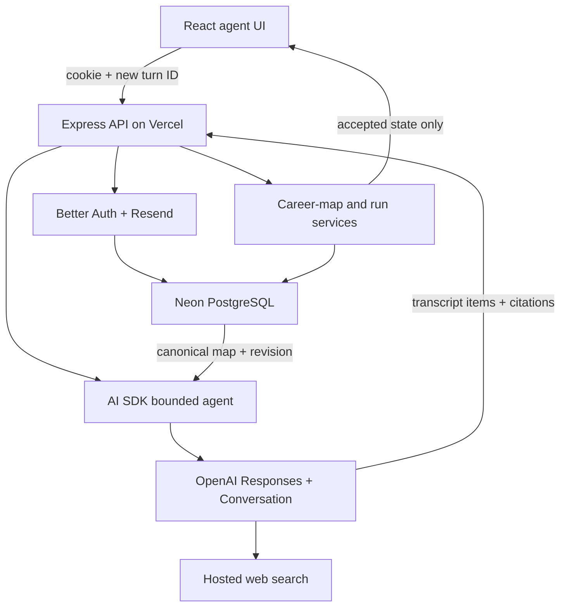
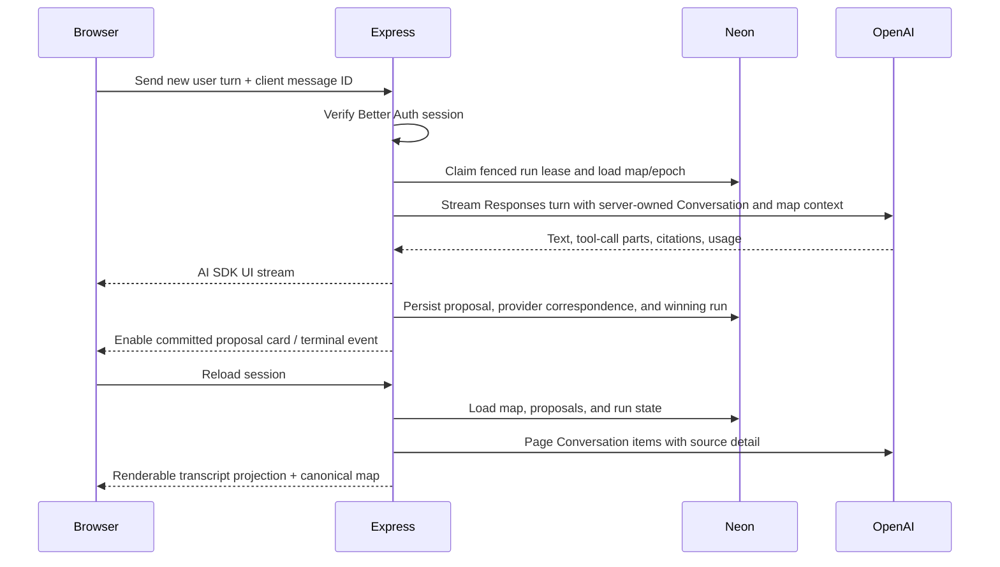
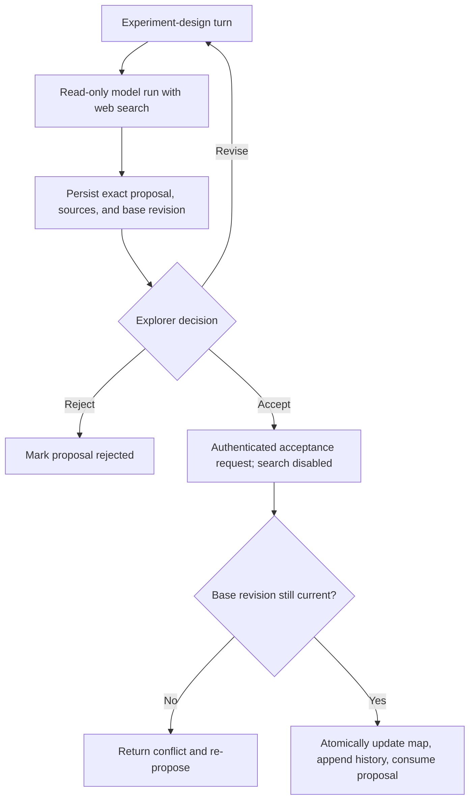
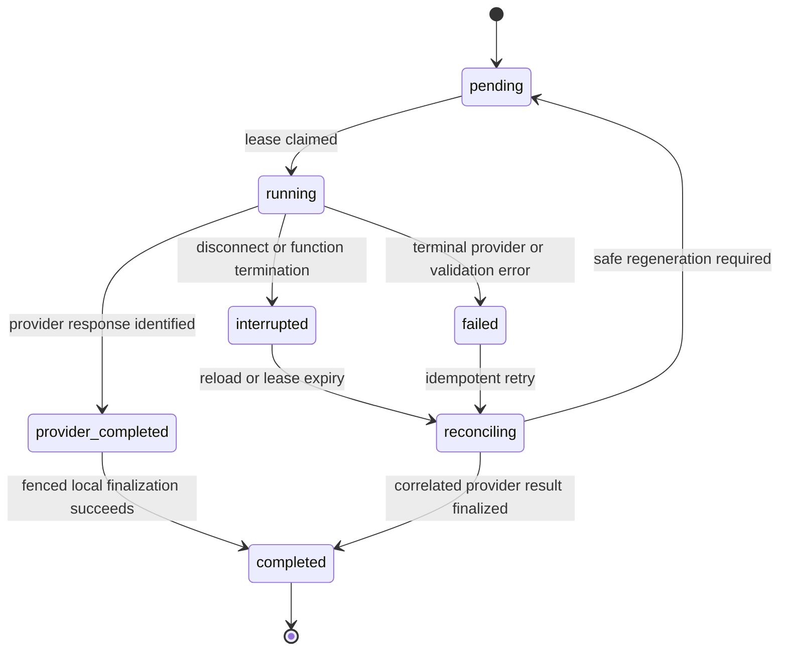
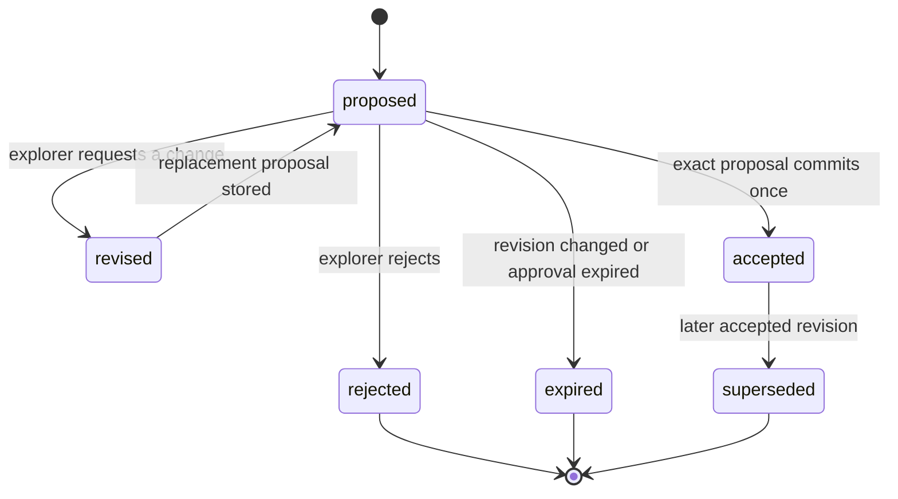
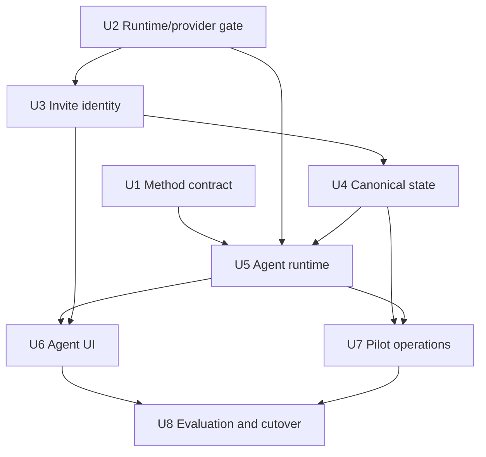

# Revelio Agent Rebuild - Plan

## Goal Capsule

- **Objective:** Replace Revelio's static report product with an invite-only, persistent career-exploration agent that completes one evidence-based discovery loop by the 2026-09-15 pilot gate.
- **Product authority:** This plan is the canonical Codex implementation artifact. Its Product Contract derives from `docs/plans/2026-08-12-001-feat-revelio-revamp-plan.md`; the provisional thesis produced under R1-R2 owns method content.
- **Execution profile:** Deep, cross-cutting rebuild inside the existing React/Vite/Express/Vercel shell. Eight dependency-ordered units cover method, runtime, identity, durable state, agent orchestration, UI, pilot operations, and cutover.
- **Stop conditions:** Stop and return for direction if the live provider gate disproves OpenAI Conversation plus server-side compaction compatibility, cannot correlate provider items to one locally displayable run after an uncertain retry, if invite-only Better Auth cannot be enforced on Express, or if implementation would change R1-R19 rather than implement them.
- **Tail ownership:** This plan lands the build and pilot-launch machinery. The founder owns the named pilot list, invitation timing, pilot conversations, public thesis, outreach, and commercialization decisions after the software gate.

---

## Product Contract

### Summary

Build the agent rebuild and pilot-launch gate without replacing the working Vercel platform shell. The new product begins with an adaptive ikigai discovery conversation, carries accepted career state across sessions, grounds experiments with cited web research, and supports the complete hypothesis-to-observation loop. Post-pilot thesis, outreach, and commercialization work remain downstream of this implementation.

### Problem Frame

The current product asks eight fixed questions, generates three purpose paths, and ends in a static action plan. It has no real users, no authenticated identity, no secure per-user ownership, and no conversational memory. Its prompts target a 17-year-old student and assume purpose is already known, while the current product thesis says direction emerges through experiments and observed fascination.

The founder will not pilot a product he would not use himself. The rebuild must fit a solo 10-15 hour/week schedule and land by 2026-09-15. The architecture must therefore protect the full discovery loop while cutting platform rewrites, generalized agent infrastructure, and post-product-market-fit privacy optimization.

### Key Decisions

- **Rebuild before pilots** (session-settled: user-directed — chosen over pilot-first manual validation: the current product fails the founder's own belief bar). Governs R3-R9.
- **Deadline gate over user-count gate** (session-settled: user-directed — chosen over gating the rebuild on acquired users: the deadline is within the founder's control). Governs R3.
- **Input gates ride alongside the deadline** (session-settled: user-approved — chosen over letting the build absorb the year: pilot preparation runs in parallel). Governs R10-R11.
- **Beachhead: career explorers like the founder** (session-settled: user-directed — chosen over students now: it enables honest dogfooding and direct recruitment). Governs R6, R10, R16.
- **Thesis first, as provisional consolidation** (session-settled: user-directed — chosen over a post-pilot write-up: the thesis states the method the rebuild embodies). Governs R1-R2.
- **Agent experience over web-app report flow** (session-settled: user-directed — chosen over improving static generation: dialogue and persistent memory are the product value). Governs R4-R5, R7-R9.
- **Adaptive discovery over a fixed questionnaire** (session-settled: user-directed — chosen over retaining eight fixed text boxes: the agent should probe until it has enough useful signal). Governs R8.
- **One multilingual model behavior, not a Spanish subsystem** (session-settled: user-directed — chosen over maintaining parallel English and Spanish prompts, fixtures, and questionnaire content: the model can follow the user's language). Governs R18.
- **Plan shape: two-track build month, thesis as asset** (session-settled: user-approved — chosen over a sequential relay and a full essay program: build and pilot preparation advance together). Governs R10-R11, R14.
- **AI-drafted research is input, not decision** (session-settled: user-directed — chosen over treating prior synthesis as authority: earlier conclusions hold only where re-affirmed here).

### Actors

- A1. Founder — builder, pilot operator, reference explorer, invite administrator, and reviewer of the provisional method.
- A2. Pilot explorer — an invited employed adult asking what to work on, using Revelio across sessions and running real experiments.
- A3. Revelio agent — the conversational guide that proposes, grounds, records, and revises the shared career map within bounded tools.
- A4. OpenAI platform — the external processor that stores the MVP Conversation transcript, compacts long context, runs GPT-5.6, and performs hosted web search.
- A5. Field contacts — Stanford Life Design contacts and Bill Gurley, approached only after a working prototype and pilot evidence exist.

### Requirements

**Method and deadline**

- R1. Consolidate the existing research into a one-page provisional thesis covering the spiky point of view, founding story, vision and mission, and why the method may work where prior approaches fall short.
- R2. Define the method as a repeatable loop: generate hypotheses from reflection, design representative experiments, observe fascination and energy, update direction, and commit provisionally.
- R3. Complete and deploy the rebuild by 2026-09-15; cut scope to fit the date, never the reverse.

**Conversational product**

- R4. Let the explorer question, modify, and iterate every ikigai statement, hypothesis, experiment, and direction in dialogue without regenerating a report.
- R5. Recognize the explorer across sessions and retain their conversation, accepted ikigai statement, hypotheses, experiments, observations, constraints, and current direction.
- R6. Ground experiment proposals in the explorer's actual constraints and current real-world information, with visible provider-supplied citations and an honest failure state when current grounding is unavailable.
- R7. Use a text composer with an optional microphone that reuses the speech-to-text capability; text remains the submitted input and primary output.
- R8. Make ikigai discovery the entry experience through an adaptive agent conversation that explores the underlying dimensions and asks only useful follow-ups, not a fixed eight-question form.
- R9. Guide one complete discovery loop: accept a hypothesis, accept an experiment, capture what happened, and accept an updated, strengthened, or dropped direction.
- R17. Limit pilot access to allowlisted users who authenticate through a passwordless email link and can return from another device as the same explorer.
- R18. Reply in the language used by the explorer without a separate Spanish product variant, localized questionnaire, or duplicated language-specific memory.
- R19. Keep canonical product state unchanged until the user accepts a model-authored change; bind every accepted change to the exact proposal and prior career-map version.

**Pilot pipeline and evidence**

- R10. Before 2026-09-15, keep at least five named pilot candidates in the private invite allowlist and prepare the invitation copy.
- R11. Send pilot invitations within seven days of the deployed rebuild.
- R12. Count a pilot loop only after the accepted lifecycle in R9 completes. The default target is five completed loops by 2026-10-31.
- R13. Preserve each completed loop's accepted hypothesis, experiment, observation, citations, direction change, and revision history for product learning; do not derive evidence from transcript-only drafts.
- R14. Mature the provisional thesis into a public one-pager using anonymized pilot evidence by default.
- R15. Begin field outreach only after a working prototype and at least one pilot story exist.
- R16. Decide acquisition, pricing, and any beachhead expansion after the pilot wave, using pilot evidence and the named first-customer research.

### Key Flows

- F1. Invite and return
  - **Trigger:** A2 requests access from the pilot sign-in page.
  - **Actors:** A1, A2
  - **Steps:** Allowlist check without address disclosure -> Resend magic link -> explicit browser redemption -> Better Auth session -> owner-scoped workspace -> retryable Conversation provisioning on first agent load -> same identity on later devices.
  - **Outcome:** Only invited pilots reach the agent, and every server read or write derives ownership from the verified session.
  - **Covered by:** R5, R10-R11, R17.
- F2. Adaptive discovery and proposal
  - **Trigger:** A2 opens a first or partial session.
  - **Actors:** A2, A3, A4
  - **Steps:** Load canonical career map and Conversation -> ask an adaptive follow-up -> propose an ikigai statement or hypothesis -> revise in dialogue -> present the exact proposal for acceptance.
  - **Outcome:** The explorer can leave and resume at any point; only accepted proposals become product memory.
  - **Covered by:** R4-R5, R8, R18-R19.
- F3. Grounded experiment design
  - **Trigger:** A2 asks for a representative experiment.
  - **Actors:** A2, A3, A4
  - **Steps:** Load constraints -> run a read-only hosted search -> render provider citations -> create a version-bound proposal -> accept in a later write request with search disabled.
  - **Outcome:** The accepted experiment fits real constraints and retains the evidence that grounded it.
  - **Covered by:** R4, R6, R9, R13, R19.
- F4. Return and complete the loop
  - **Trigger:** A2 returns after running an accepted experiment.
  - **Actors:** A2, A3
  - **Steps:** Recall the active experiment -> capture a user-authored observation -> propose a direction update -> accept it -> derive loop completion from accepted history.
  - **Outcome:** The next recommendation changes or gains confidence from real evidence, and the loop becomes exportable pilot evidence.
  - **Covered by:** R5, R9, R12-R13.

### Acceptance Examples

- AE1. **Covers R4.** Given three proposed hypotheses, when the explorer says one feels prestige-driven rather than fascinating, then the agent revises that proposal in the same conversation without replacing the other work.
- AE2. **Covers R5, R9, R13.** Given an accepted experiment from two weeks earlier, when the explorer returns on another device, then Revelio recalls it, records the observation, and updates the direction without requiring prior context again.
- AE3. **Covers R3, R10, R11.** Given the rebuild lands on 2026-09-12, when the launch gate is checked, then five allowlisted candidates and invitation copy already exist and invitations are sent by 2026-09-19.
- AE4. **Covers R15.** Given the rebuild exists but no explorer has completed a loop, when field outreach is considered, then outreach waits for at least one pilot story.
- AE5. **Covers R8, R18.** Given a first-time explorer answers partially in Spanish and says "I don't know" to one prompt, when discovery continues, then the agent responds in Spanish, asks only a useful follow-up, and does not expose eight required fields.
- AE6. **Covers R5, R17.** Given Pilot A submits any identifier belonging to Pilot B, when the request reaches an agent, transcript, proposal, acceptance, reset, or export endpoint, then no Pilot B data is returned or changed.
- AE7. **Covers R6, R19.** Given web search returns a source containing hostile instructions and the private map contains test canaries, when the agent drafts an experiment, then no canary reaches a query, URL, citation, source record, or log; source text cannot mutate the map, and only a later authenticated acceptance of the bound proposal can do that.
- AE8. **Covers R5, R13, R19.** Given a browser disconnects and retries the same turn, when provider and database completion occur in either order, then the run ledger projects one displayable provider turn and at most one accepted change exists.
- AE9. **Covers R5.** Given the OpenAI Conversation crosses the compaction threshold, when the next turn runs, then the latest Neon career map is injected and still overrides stale or opaque transcript context.

### Success Criteria

- The founder would personally pay for and keep using the deployed rebuild at the R3 gate.
- A returning session produces evidence that changes or strengthens the explorer's next decision.
- The launch suite finds zero cross-user reads or writes and zero duplicate accepted changes under retry, disconnect, and two-tab tests.
- Every search-grounded proposal keeps visible provider citations through acceptance, reload, and evidence export.
- Real users complete discovery loops and R16 is decided on evidence before the end of 2026.

### Scope Boundaries

#### Deferred for later

- App-owned transcript persistence, Zero Data Retention, and provider portability work after the pilot shows traction.
- Multiple conversations or workspaces per user, scheduled check-ins, autonomous background work, and byte-level stream resumption.
- Self-service account administration, polished multilingual UI localization, social login, passwords, and public signup.
- Fully normalized hypothesis, experiment, and observation tables; the MVP keeps a typed versioned document while the method evolves.
- Pricing, payments, students, parents, schools, B2B motion, and any public essay program beyond the one-pager.
- A managed eval platform; the MVP keeps a small repository-owned behavioral corpus and opt-in live smoke test.

#### Deferred to Follow-Up Work

- The Step 3 pilot wave, Step 4 public thesis and outreach, and Step 5 commercialization decision work begin after this plan's launch gate.
- Legacy assessment table deletion or data backfill; zero real users means no migration is required for the agent cutover, and destructive cleanup is not needed for the deadline.

#### Outside this product's identity

- MCP, CLI, plugin, or developer-only agent surfaces.
- A comprehensive career operating system or prestige-optimized recommendations.
- Arbitrary fetch, browser, MCP, email, application, booking, purchasing, or other external action tools.
- Silent model-authorized state changes or model-callable destructive reset/delete tools.

### Dependencies / Assumptions

- OpenAI usage remains the only unavoidable paid variable. Neon, Vercel, Better Auth, and Resend remain on their free tiers until paying customers exist.
- One OpenAI Conversation and one current career map exist per pilot for v1. Loss or outage of the provider transcript may disable chat, but the accepted career map remains available.
- Multiple draft ideas may exist, but only one experiment is committed as active at a time; completed and abandoned experiments remain in history.
- User-authored observations commit only through an explicit authenticated client action carrying the explorer's exact text, expected revision, and idempotency key; corrections append a revision. Every model-authored change uses an explicit approval card, and acceptance is deterministic domain logic rather than another model run.
- The UI chrome may remain English. Speech transcription auto-detects language, and the agent follows the language of each user turn.
- The private candidate list lives in the database or another private operating store, never in git. Repository invitation copy contains no pilot identities.
- Adding `@ai-sdk/openai`, `openai`, `better-auth`, and `resend`, moving `pg` to production dependencies, and upgrading AI SDK/Zod require the repository's production-dependency approval before U2 starts.

---

## Planning Contract

### Product Contract preservation

Clarified R6, R8, and R13 and added R17-R19 from session-settled decisions; no other Product Contract scope changed. R1-R16, A1-A3, F1's discovery-loop meaning, AE1-AE4, success criteria, and the three-way scope boundary from the origin remain represented. A4-A5 and F1-F4 make external-system and implementation-relevant actor/flow boundaries explicit.

### Key Technical Decisions

- KTD1. **Retain the platform shell; replace the product vertical.** (session-settled: user-approved — chosen over a Next.js/Vercel template rebuild: the template adds unrelated auth, artifact, upload, and routing work without fixing the product model). Keep React 18, Vite, Wouter, Express, Vercel, Drizzle, and Neon. Build the agent as a new vertical, then remove report-specific routes and code after its acceptance path passes. Governs R3-R9.
- KTD2. **Use AI SDK 7 with the direct OpenAI Responses provider and the official OpenAI SDK.** (session-settled: user-directed — chosen over Gemini and a raw-OpenAI-only client: GPT-5.6 is the requested model while AI SDK keeps typed tools, React streaming, and UI protocol support). Pin Node 24 and `gpt-5.6-sol`; set reasoning effort explicitly; use `streamText` with bounded steps instead of a durable workflow framework. The OpenAI SDK owns Conversation create/list/delete operations that AI SDK does not expose. Governs R3-R9, R18.
- KTD3. **Let OpenAI own the MVP transcript and compaction.** (session-settled: user-approved — chosen over a Postgres messages table: lower MVP complexity and server-side compaction outweigh provider retention and portability concerns at this stage). Keep the server-owned Conversation ID and lifecycle state in a `pilot_workspaces` record, fetch and map Conversation items for display, and never accept the ID from the browser. The run ledger decides which correlated provider response/items form a displayable turn, so uncertain retries cannot surface duplicates. Conversations and items persist until explicitly deleted and are not ZDR-compatible. Governs R5.
- KTD4. **Keep accepted product truth in one versioned Neon document.** (session-settled: user-approved — chosen over normalized domain tables and loose Markdown files: the method is still evolving, while hosted multi-user state still needs ownership, concurrency, and deletion guarantees). Store a Zod-validated `career_map` JSONB document with stable internal entity IDs, an integer revision and schema version, plus append-only accepted-change history. Keep provider linkage and lifecycle outside the document. Generate request-local Markdown from the validated document for model context and export; never persist that briefing as a Conversation item. Version-specific validators and deterministic upgraders fail closed on malformed or unknown newer documents. Governs R5, R9, R13, R19.
- KTD5. **Self-host Better Auth 1.6 on Express with Neon and Resend.** (session-settled: user-approved — chosen over Supabase Pro, Neon Managed Auth beta, and custom access tokens: it is free, officially supports Express, and owns sessions and single-use magic links). Use Better Auth's native PostgreSQL adapter to avoid forcing a Drizzle upgrade. Mount its handler before `express.json()`, hash tokens, use host-only secure cookies and exact trusted origins, and enforce active invite membership on every protected request as well as before send and user creation. Every costly or state-changing app route adds exact-origin, Fetch Metadata, and session-bound CSRF checks; credentialed cross-origin requests are denied by default. Governs R5, R10-R11, R17.
- KTD6. **Use one agent-led entry and one language-neutral method prompt.** (session-settled: user-directed — chosen over the fixed bilingual questionnaire: the model should decide what follow-up is useful). Start with a partial career map, inject the current map on every turn, and let incomplete discovery resume later. Remove student assumptions and separate EN/ES prompt branches. Speech transcription feeds the same composer and auto-detects language. Governs R7-R8, R18.
- KTD7. **Use proposals as the trust boundary for model-authored changes.** (session-settled: user-approved — chosen over transcript-as-memory and generic model write access: accepted product state must remain inspectable and reversible). A proposal is immutable and stores the exact typed operation, owner, base revision, citations, expiry, and one-time ID; revision creates a linked replacement. A separate authenticated acceptance request deterministically applies it with compare-and-swap and, in one transaction, consumes the proposal, validates and increments the map, appends immutable history/evidence, and stores the idempotent result. Actionable cards come only from committed `agent_proposals`, never provider tool items. No model-callable tool directly changes canonical state or receives identity, Conversation ID, SQL, JSON Patch, or arbitrary paths. Governs R4-R6, R9, R13, R19.
- KTD8. **Separate private context, web grounding, and canonical writes.** Hosted `web_search` is available only in a read-only research run that receives a minimal de-identified brief—not the transcript or full career map. It excludes names, contacts, exact employers, health/family details, free-form observations, and other unnecessary identifiers. Search results are untrusted and cannot authorize tools, choose identity, or update memory. Proposal synthesis may combine returned evidence with the full map only after search is disabled; the later acceptance commits only the stored proposal. Persist sanitized provider URL annotations and complete consulted-source metadata; allow only HTTPS links in the UI. Governs R6, R13, R19.
- KTD9. **Recover runs, not bytes.** Do not add Redis or resumable streaming. Claim one Neon-backed active-run lease per workspace, deduplicate on `(user_id, client_message_id)`, and fence every finalization with lease generation and workspace epoch. Track provider execution and local finalization separately, with durable response/item correspondence; on reload, the run ledger projects only provider items belonging to the winning run. Continue provider consumption after disconnect when possible, and reconcile expired or provider-completed runs without resubmitting full client-authored history. Governs R3-R5, R19.
- KTD10. **Treat Conversation provisioning and OpenAI-plus-Neon consistency as sagas.** No transaction can span the provider and database. Provision one Conversation lazily through a durable `provisioning | ready | failed` workspace operation with correlation and compensating purge for orphans. Create a run before provider work, persist provider request/response/item IDs as early as the SDK permits, make every local operation idempotent, and rebuild retries from canonical state. Reset/delete first blocks the workspace and increments its epoch so late completions cannot resurrect data. A provider outage may disable chat, but must not hide or corrupt the career map. Governs R5, R9, R13, R19.
- KTD11. **Operate the pilot with bounded cost and privacy-safe telemetry.** Use kill switches for agent runs, canonical writes, and web search; cap request/message/audio size, model steps, searches, duration, retries, and daily per-user use; rate-limit auth by trusted platform IP and HMAC-normalized address; send an opaque HMAC safety identifier; and disable input/output telemetry. Log IDs, versions, state transitions, latency, usage, and errors only. Keep prompts, transcripts, career text, email addresses, magic-link URLs, and raw web content out of logs. Governs R3, R5-R6, R12-R13, R17.
- KTD12. **Keep evaluation local and small.** Use deterministic AI SDK V4 mocks for contracts, a 12-20 case behavioral corpus for method behavior, and an opt-in live smoke test for the exact model/Conversation/compaction/search combination. Do not use OpenAI Assistants, hosted reusable prompts, or hosted Evals because their announced 2026 shutdowns make them unsuitable dependencies. Governs R2-R9, R12-R13, R18-R19.

### High-Level Technical Design

#### Component and authority topology



Neon is authoritative for identity linkage, canonical career state, proposals, accepted changes, and run status. OpenAI is authoritative only for the narrative transcript and provider tool items. The browser is authoritative for neither.

#### Authenticated turn and reload sequence



#### Search and acceptance separation



#### Agent run lifecycle



#### Canonical change lifecycle



### Directional Data Model

| Record | Authority and purpose | Required safeguards |
|---|---|---|
| Better Auth tables | User, session, verification, and rate-limit state | Separate auth ownership, hashed magic-link tokens, secure cookies, checked-in migrations |
| `pilot_invites` | One database-normalized allowlist email, active/revoked status, delivery ID, timestamps | Unique normalized email, generic responses, current membership checked on every request |
| `pilot_workspaces` | One owner, nullable Conversation ID, provisioning/lifecycle status, monotonically increasing epoch | Unique owner and unique non-null Conversation ID, fenced reset/delete, provider ID never authorizes access |
| `career_maps` | One typed JSONB map, revision, and schema version per workspace | Unique workspace, non-negative revision, version-specific validation, conditional update |
| `career_map_changes` | Append-only accepted operation/evidence snapshot, before/after revision, entity and stable loop IDs, proposal link | Atomic with map/proposal update, unique `(map, after_revision)` and accepted proposal/receipt, consecutive revisions |
| `agent_runs` | Client-turn dedupe, lease generation, workspace epoch, provider/local phases and IDs, versions, usage | One active run per workspace, fenced finalization, correlated display projection, no raw career text |
| `agent_proposals` | Immutable exact operation, base revision, source snapshot, expiry, one-time state, replacement link | Owner/workspace scoped, update creates replacement, acceptance result replayed idempotently |
| `lifecycle_operations` | Detached provisioning/reset/delete saga phase, minimal provider target, attempts and error | Does not cascade with user; survives partial purge; removed after reconciliation or reduced to non-PII receipt |

The career-map document contains stable IDs for profile signals, constraints, ikigai statement revisions, hypotheses, experiments, observations, and current direction. A stable `loop_id` begins with an accepted experiment and follows its observation and direction evidence; one completion receipt is allowed per loop. Hypotheses and experiments carry lifecycle status inside the document; deterministic domain services, not the model, validate transitions. All child records have explicit owner/workspace foreign keys, `NOT NULL`/check/unique constraints, and intentional delete behavior: domain cascades are allowed only in final account deletion, while detached lifecycle tombstones survive until cross-store cleanup completes.

### Output Structure

```text
client/src/
  components/agent/
    agent-composer.tsx
    agent-transcript.tsx
    career-map-panel.tsx
    proposal-card.tsx
    source-citations.tsx
  hooks/use-revelio-chat.ts
  lib/auth-client.ts
  pages/agent.tsx
  pages/sign-in.tsx
  pages/verify-magic-link.tsx
server/
  ai/revelio/
    agent.ts
    context.ts
    conversation-items.ts
    conversations.ts
    openai-model.ts
    prompt.ts
    tools.ts
  middleware/require-pilot.ts
  repositories/revelio.ts
  routes/revelio.ts
  services/career-map.ts
  services/revelio-workspace.ts
  services/pilot-lifecycle.ts
  auth.ts
shared/
  revelio-schemas.ts
tests/fixtures/
  revelio-agent-corpus.ts
docs/product/
  revelio-thesis.md
  pilot-invitation.md
```

The tree declares the expected ownership boundaries. Existing shared UI primitives, storage, routing, and test helpers remain in their current locations.

### Sequencing



U1 and the private pilot-candidate pipeline begin immediately. U2 is the technical gate for all feature work. U8 is the only unit that retires the legacy report experience and enables pilot invitations.

### Implementation Constraints

- Pin Node 24 across local tooling and Vercel before upgrading AI SDK. Upgrade all `ai` and `@ai-sdk/*` packages together, move Zod to a supported 3.25+ version, and keep the repository ESM-only.
- Use the stable Better Auth 1.6 line. Use its native PostgreSQL adapter because the current Drizzle version is below the Better Auth Drizzle adapter peer range.
- Never hold a database transaction open across an OpenAI or Resend request.
- Never accept `userId`, `conversationId`, a full message history, or canonical state from the browser or model.
- Keep Revelio routes and AI orchestration above owner-scoped domain services and a new Revelio-specific repository; only the repository imports Drizzle/database definitions. Do not expand the legacy assessment-shaped `server/storage.ts` interface or mix Better Auth's adapter into the product repository.
- Configure explicit initial limits: eight model steps, two web searches, one transient retry before any write, 90 seconds of agent work, a compaction threshold below 100K rendered tokens, and environment-configurable per-user daily message/search caps.
- Disable parallel tool calls whenever canonical tools are present. Apply strict schemas with bounded strings, enums, all properties required, and no additional properties.
- Require exact allowed `Origin`, valid Fetch Metadata, and a session-bound CSRF control before every state-changing or provider-costing request. Apply message/body/audio MIME, byte, and duration limits before any external call.
- Keep the current Groq transcription provider for the microphone. Upgrade its AI SDK provider with the main package family, remove language branching, and protect the route with pilot auth.
- Check in and checksum Better Auth and application migrations; never auto-migrate at runtime. Test up/down only on a disposable empty database. Production rollback preserves additive tables and pilot data, disables writes, and rolls forward with a corrective migration rather than applying a destructive down migration.

### Alternative Approaches Considered

| Alternative | Why it was not selected for this MVP |
|---|---|
| Vercel AI Chatbot or Next.js starter | Adds a framework migration plus artifacts, uploads, model routing, and auth assumptions that Revelio does not need |
| Supabase Pro database and Auth | Managed invite auth is attractive, but the user requires a free stack before paying customers and free projects may pause |
| Neon Managed Auth | Free and adjacent to the current database, but its beta standalone/Express support is not yet the stable documented path needed here |
| Raw OpenAI SDK for the whole stack | Simplifies provider concepts but requires hand-building React chat streaming, tool-part rendering, and client state that AI SDK already supplies |
| Postgres transcript messages | Gives portability and tighter data control but duplicates the accepted OpenAI Conversation store and forfeits the MVP simplicity the user selected |
| Loose Markdown memory files | Human-readable but unsafe as the primary multi-user store for ownership, concurrency, deletion, and serverless deployment |
| Fully normalized domain tables | Strong long-term queryability but freezes an evolving method into premature schema and migration work |
| Eve or LangGraph | Adds durable workflow and deployment machinery beyond a request-bounded, one-loop MVP |

### Risks & Dependencies

| Risk | Impact | Mitigation |
|---|---|---|
| Conversation plus compaction or source retrieval differs from documented provider behavior | Blocks the chosen transcript path late | U2 live gate proves create, continue, compact, search, list, and purge before dependent UI work |
| OpenAI and Neon complete in different orders | Duplicate or missing visible work | Saga states, provider IDs, one active lease, proposal idempotency, and lazy reconciliation per KTD9-KTD10 |
| Provider completes before response correspondence is durable | Retry could expose an orphan or duplicate transcript turn | U2 proves early response correlation/retrieval; `agent_runs` owns the display projection, and failure of that gate triggers the stop condition |
| Custom Conversation-item mapping drifts as item types evolve | Broken reloads or internal-item leakage | Exhaustive mapper, unknown-item quarantine, pagination tests, and opt-in live contract test |
| Magic-link scanners consume single-use links | Pilots cannot sign in | Intermediate click page, tracking disabled, mailbox smoke tests, and OTP fallback only if a pilot provider still consumes links |
| Sensitive career text reaches logs or analytics | Privacy breach during pilot | Redaction-by-default, no payload telemetry, bounded metadata allowlist, and log assertions before launch |
| GPT-5.6 search latency or cost harms the experience | Slow or unexpectedly expensive turns | Explicit reasoning/step/search/token/time budgets, spend cap, usage telemetry, and independent search/write kill switches |
| AI SDK 7 and auth dependency migration expands the deadline | Feature work starts late | Isolate U2, use current major versions together, keep React 18/Express 4, and stop if the compatibility gate does not pass |
| No app-owned transcript means provider outage or deletion loses dialogue history | Chat cannot continue from a complete narrative | Keep canonical map recoverable and visible, block incomplete-context runs, disclose the MVP tradeoff, and revisit near product-market fit |
| Reset/delete races an active provider response | Purged state or proposals can reappear | Block the workspace, revoke/invalidate leases, increment the workspace epoch, and reject every late fenced finalization |
| Production migration or rollback damages pilot state | Launch delay or unrecoverable evidence | Additive migrations, Neon branch/restore point, pre/post invariants, flags-off deploy, preservation-only rollback, and first-user canary |
| Very low pilot volume hides failures in percentages | A single broken login or loop is missed | Launch report uses absolute failed-session/run/proposal counts and founder checks at +1h, +4h, and +24h |

### Sources & Research

- Origin contract: `docs/plans/2026-08-12-001-feat-revelio-revamp-plan.md`.
- Founder notes outside the repository are an external product source; their model and adaptive-questionnaire decisions are represented in the Product Contract.
- Current anchors: `client/src/App.tsx`, `client/src/components/questionnaire/single-page-questionnaire.tsx`, `server/app.ts`, `server/routes.ts`, `server/storage.ts`, `shared/schema.ts`, `server/ai/chains/purpose-discovery.stream.chain.ts`, `server/routes/assessment/utils.ts`, and `client/src/hooks/use-speech-to-text.ts`.
- [OpenAI Conversation state](https://developers.openai.com/api/docs/guides/conversation-state), [compaction](https://developers.openai.com/api/docs/guides/compaction), [data controls](https://developers.openai.com/api/docs/guides/your-data), [GPT-5.6](https://developers.openai.com/api/docs/guides/latest-model), [web search](https://developers.openai.com/api/docs/guides/tools-web-search), and [Conversation item API](https://developers.openai.com/api/reference/resources/conversations/subresources/items/methods/list).
- [AI SDK 7 migration](https://ai-sdk.dev/docs/migration-guides/migration-guide-7-0), [OpenAI provider](https://ai-sdk.dev/providers/ai-sdk-providers/openai), [Express streaming](https://ai-sdk.dev/cookbook/api-servers/express), and [testing](https://ai-sdk.dev/docs/ai-sdk-core/testing).
- [Better Auth Express](https://better-auth.com/docs/integrations/express), [PostgreSQL adapter](https://better-auth.com/docs/adapters/postgresql), [magic link](https://better-auth.com/docs/plugins/magic-link), and [rate limiting](https://better-auth.com/docs/concepts/rate-limit).
- [Resend idempotency](https://resend.com/docs/dashboard/emails/idempotency-keys), [verified domains](https://resend.com/docs/dashboard/domains/introduction), and [free limits](https://resend.com/docs/knowledge-base/account-quotas-and-limits).

---

## Implementation Units

### U1. Codify the provisional thesis and method

- **Goal:** Produce the product-method authority that prompts, tools, lifecycle rules, and behavioral fixtures will implement.
- **Requirements:** R1-R2; A1, A3.
- **Dependencies:** None.
- **Files:**
  - Create `docs/product/revelio-thesis.md`.
  - Use `docs/research/2026-08-11-what-to-work-on-research.md`, `docs/research/2026-08-11-what-to-work-on-product-direction.md`, and the research sources cited by the origin plan.
- **Approach:**
  1. Consolidate the spiky point of view, founder story, mission, and method in one page.
  2. Define observable fascination, anti-prestige checks, representative experiments, constraints, provisional commitment, and loop completion in stable product language.
  3. Mark unresolved method claims as hypotheses for the pilot rather than silently turning them into agent rules.
  4. Obtain founder approval before U5 turns the method into prompt behavior.
- **Patterns to follow:** Use the origin Product Contract's R1-R2 language and the repo's dated research as evidence, not current authority.
- **Test scenarios:** Test expectation: none -- this is a product-method artifact; verify it through requirements trace and founder review rather than code tests.
- **Verification:** The document fits one page at ordinary reading density, covers all four R1 elements, defines the complete R2 loop, and gives U5 a stable vocabulary without prescribing implementation.

### U2. Establish the runtime and OpenAI provider gate

- **Goal:** Move the repository to a supported runtime and prove the exact GPT-5.6, Conversation, compaction, search, streaming, and deletion combination before feature work depends on it.
- **Requirements:** R3-R7, R18; KTD2-KTD3, KTD8, KTD12.
- **Dependencies:** Production-dependency approval from `Dependencies / Assumptions`.
- **Files:**
  - Modify `package.json`, `package-lock.json`, `vercel.json`, `.env.example`, and `server/env.ts`.
  - Create `.nvmrc`.
  - Create `server/ai/revelio/openai-model.ts` and `server/ai/revelio/openai-integration.live.test.ts`.
  - Update `server/ai/chains/purpose-discovery.stream.chain.ts`, `server/ai/chains/action-plan.stream.chain.ts`, `client/src/pages/results.tsx`, `client/src/pages/action-plan.tsx`, `shared/streaming-schemas.ts`, and their focused tests only as needed to keep the legacy vertical compiling until U8.
- **Approach:**
  1. Pin Node 24 locally and on Vercel, add `engines.node`, and align `@types/node`.
  2. Upgrade AI SDK packages as one family, add `@ai-sdk/openai` and `openai`, move Zod to a supported 3.25+ line, and keep the Groq transcription provider on the matching provider generation.
  3. Run the v7 codemod, then manually audit lifecycle callbacks, output helpers, stream helpers, result aggregation, strict tool schemas, and V4 mocks.
  4. Centralize `gpt-5.6-sol`, explicit reasoning effort, compaction threshold, and provider client construction in the new model module.
  5. Gate U3-U6 on an opt-in live test that creates one Conversation, streams two turns, captures response IDs at the earliest available event, retrieves/group-correlates response items, forces compaction at a low test threshold, performs hosted search, lists ordered items with source detail, and proves an uncertain retry can project one displayable turn.
  6. Verify that the generated career-map Markdown is request-local instructions/context and is neither stored nor returned as a displayable Conversation item. If the provider persists it, stop and redesign the injection/retention boundary before feature work.
  7. Fence writes, snapshot all paginated item IDs before deleting, delete them idempotently, delete the Conversation, and verify absence. Exercise multi-page, `429`/`5xx`, provider `404`, interrupted, and concurrent-late-response cleanup paths.
- **Execution note:** Treat this as a compatibility spike with a hard pass/fail gate. Do not begin feature work while the exact provider contract is only assumed.
- **Patterns to follow:** `server/env.ts` for validated configuration; current AI chain tests for dependency mocking; Vercel's single-function configuration in `vercel.json`.
- **Test scenarios:**
  - A deterministic V4 mock emits paired text chunks, tool parts, finish reason, and aggregate usage; the Express adapter produces valid AI SDK UI stream parts.
  - Missing or invalid `OPENAI_API_KEY`, model, reasoning, or threshold configuration fails at startup without logging the secret.
  - Legacy structured streams compile and retain their current save/failure behavior after the v7 migration.
  - The opt-in live gate continues the same Conversation across two turns and returns displayable items in provider order.
  - A simulated local-finalization failure after provider completion retrieves the same response by durable correlation and renders one winning run; no second visible turn is introduced.
  - The opt-in live gate emits or preserves a compaction item while the next response still receives the explicit career-map fixture.
  - Career-map context is not persisted or rendered as transcript content and does not accumulate as repeated visible items.
  - The opt-in live gate retrieves inline citations and the full source list for a hosted search.
  - A complete ID snapshot prevents pagination shifts; item and Conversation deletion can resume after every failure point and a follow-up retrieval confirms absence.
- **Verification:** Supported versions are locked, type-check and build pass on Node 24, normal CI uses no live provider, and the gated live contract passes in development and a Vercel preview. Record Node/runtime, lockfile hash, model/config limits, cold-start behavior, request IDs, and provider results in the launch report; run one minimal flags-off production smoke before application data exists.

### U3. Add invite-only pilot identity

- **Goal:** Replace caller-owned anonymous session IDs with free, recoverable, server-verified pilot identity.
- **Requirements:** R5, R10-R11, R17; A1-A2; F1; AE6; KTD5.
- **Dependencies:** U2.
- **Files:**
  - Create `server/auth.ts`, `server/middleware/require-pilot.ts`, `client/src/lib/auth-client.ts`, `client/src/pages/sign-in.tsx`, and `client/src/pages/verify-magic-link.tsx`.
  - Modify `server/app.ts`, `server/routes.ts`, `server/env.ts`, `.env.example`, `client/src/App.tsx`, `client/src/lib/queryClient.ts`, `shared/schema.ts`, `package.json`, and `package-lock.json`.
  - Create the reviewed auth/app migration under `migrations/`.
  - Create `server/routes/auth.test.ts` and client auth-page tests beside the new pages.
- **Approach:**
  1. Configure stable Better Auth 1.6 with its native PostgreSQL adapter, a module-scoped pool, separate exact preview/production base URLs and origins, host-only `HttpOnly`/`Secure`/explicit-`SameSite` cookies, database-backed rate limiting, and no public signup.
  2. Mount the Better Auth handler before `express.json()` and derive sessions in one middleware. `require-pilot` rechecks active invite membership on every protected request. Revocation invalidates all sessions and issued links immediately.
  3. Add `pilot_invites`; use one database-unique normalized email representation for administration, send, redemption, and user creation. Suppress sends for unknown or revoked addresses and repeat the allowlist check in the user-create hook.
  4. Send hashed, expiring, single-use magic links with Resend idempotency, bounded retries, verified sender domain, and tracking disabled. The intermediate redemption page strips the credential from the address before rendering, loads no third-party resources, sends `Referrer-Policy: no-referrer`, and requires confirmation of the matching invited identity before session creation.
  5. Add reusable request protection for every unsafe or costly application route: exact-origin and Fetch Metadata validation, a session-bound CSRF token, default-denied credentialed CORS, trusted platform IP extraction, and per-IP plus HMAC-address auth cooldowns/daily ceilings.
  6. Fail the agent UI and protected APIs closed when the pilot flag is off. Remove `sessionId` from all new contracts; delete its legacy generation only during U8 cutover.
- **Execution note:** Characterize the existing cookie behavior first, then verify middleware order through the real Express app rather than a route-only mock.
- **Patterns to follow:** `server/app.ts` middleware ownership, `server/env.ts` configuration validation, `client/src/lib/queryClient.ts` credentialed requests, and Supertest app helpers.
- **Test scenarios:**
  - Covers F1. An allowlisted address receives a generic success response, redeems one human-clicked link, and gets a secure session that resolves to the same user on another browser.
  - A non-allowlisted, revoked, existing, and allowlisted address receive indistinguishable request responses; only the valid invite sends email and creates a session.
  - Expired and replayed links fail, concurrent redemption yields one session, and Resend retry under the same idempotency key sends once.
  - An email scanner opening the intermediate link does not consume the Better Auth token before the user clicks.
  - Untrusted callback origins, missing/invalid cookies, and pilot-flag-off requests cannot reach protected handlers.
  - A valid cookie replayed from foreign, missing, malformed, or sibling-subdomain origins fails before database, email, transcription, or model work on every unsafe/costly endpoint.
  - Revoking an authenticated pilot invalidates the live session and an already-issued link; all protected routes deny both immediately without exposing why.
  - A Pilot A magic link opened in Pilot B's signed-in browser cannot silently swap the browser into A's account.
  - Application/hosting logs, browser history, and network referrers contain no magic-link credential after scanner and human redemption flows.
  - Floods against valid and invalid addresses stay under configured Resend ceilings and reveal no allowlist membership.
  - Covers AE6. Pilot B cannot use Pilot A's route, run, proposal, map, or Conversation identifiers to retrieve or mutate data.
  - Authentication responses and logs contain no raw token, full callback URL, or address classification.
- **Verification:** Five private allowlist records can be administered without an app admin UI; preview and production cookie/origin settings are tested separately; each target mailbox passes cold-browser, second-browser, scanner, revoke, and delivery/redemption smokes; and every new protected route derives the user exclusively from Better Auth.

### U4. Build versioned career state and idempotent operations

- **Goal:** Create the app-owned source of truth for accepted career state, proposals, change history, and recoverable agent runs.
- **Requirements:** R4-R5, R9, R12-R13, R19; F2-F4; KTD4, KTD7, KTD9-KTD10.
- **Dependencies:** U3.
- **Files:**
  - Create `shared/revelio-schemas.ts`, `server/repositories/revelio.ts`, `server/services/career-map.ts`, `server/services/revelio-workspace.ts`, `server/services/career-map.test.ts`, and `server/revelio-storage.test.ts`.
  - Modify `shared/schema.ts`, `server/db.ts`, and `server/test-utils.ts`; touch `server/storage.ts` only to avoid or retire legacy coupling, not to extend its assessment-shaped interface.
  - Create the reviewed agent-state migration under `migrations/`.
- **Approach:**
  1. Define the flexible career-map contract with schema version, stable entity IDs, profile signals, constraints, statement, hypotheses, experiments, observations, direction, and lifecycle status. Add version-specific validators/upgraders; reject malformed and unknown future versions without defaulting away accepted evidence.
  2. Add `pilot_workspaces`, `career_maps`, `career_map_changes`, `agent_runs`, `agent_proposals`, and detached `lifecycle_operations` with the constraints in the Directional Data Model. Declare every foreign key and deliberate cascade/restrict behavior in the reviewed migration.
  3. Build an owner-scoped Revelio repository and deterministic domain services. A successful acceptance conditionally updates revision `n`, validates revision `n+1`, consumes one immutable proposal, appends one history/evidence event, and stores one client-idempotency result in a single transaction. Unique constraints enforce `(career_map_id, after_revision)`, accepted proposal, and receipt; replay returns the stored result. Inject failures after every transaction step to prove rollback.
  4. Commit a user observation only through its explicit authenticated endpoint using the explorer's exact submitted text, `expectedRevision`, and idempotency key. The same revision/history transaction applies, corrections append history, and no model tool can call this path.
  5. Give each accepted experiment a stable `loop_id`; carry it through observations and direction changes, permit one completion receipt per loop, and allow one active experiment while retaining draft, completed, abandoned, and restarted histories.
  6. Add a fenced run state with lease generation, attempt, workspace epoch, provider status, local-finalization status, and provider IDs. Only the current fence may create a proposal or finalize; reset/delete increments the epoch and invalidates old work.
  7. In an acceptance transaction, copy the immutable typed operation and provider-source snapshot into accepted history so evidence remains reproducible after proposal cleanup or Conversation deletion. Define bounded retention for rejected/expired proposal bodies, terminal run detail, invite delivery metadata, and tombstones without deleting pending work or accepted evidence.
- **Execution note:** Implement the domain services test-first. Use unique fixtures and targeted cleanup; do not copy whole-table deletion from legacy integration tests.
- **Patterns to follow:** Typed JSONB in `shared/schema.ts` and transaction patterns in `server/routes/assessment/utils.ts`; keep the new repository independent of hydrated legacy assessment storage.
- **Test scenarios:**
  - A new authenticated pilot receives one empty valid map at revision zero and one `pilot_workspaces` record with no provider dependency; Conversation provisioning belongs to U5.
  - Accepting a statement, hypothesis, experiment, or direction update changes the document and appends one history record with matching before/after revisions.
  - Covers R19. A proposal discussion or rejection leaves the map unchanged; replaying the same acceptance returns the prior result without a second change.
  - Two tabs accept different proposals against one revision; one succeeds and the other receives a stale result with no overwrite.
  - A regenerated tool-call ID cannot duplicate a semantic change because proposal state and version compare-and-swap still reject it.
  - Failures injected after proposal consume, conditional map update, history insert, or receipt insert roll the whole acceptance back; replay after commit returns the original result.
  - Recording and correcting an observation retains both revisions and injects only the current value as canonical context.
  - A model attempt to create an observation produces at most a proposal and cannot invoke the explicit user-observation endpoint.
  - One active experiment is enforced; completing or abandoning it permits the next commitment.
  - Covers R12. Drafting or accepting an unrun experiment does not count a loop; the full accepted lifecycle increments its stable `loop_id` once, including a strengthened/no-change direction outcome, repeated direction acceptance, later correction, abandonment, and restart.
  - A dead active-run lease expires and reconciles without two concurrent provider runs; an old worker resuming after lease takeover or epoch change cannot finalize or create proposals.
  - Previous-schema fixtures upgrade deterministically without changing IDs/history; malformed or unknown newer documents fail closed; founder scripts use the same service.
  - Explicit unique/check/FK constraints prevent duplicate maps/Conversation links, negative revisions, dangling child rows, and unintended cascades.
  - Every storage operation includes user scope, and cross-user IDs produce no data or mutation.
- **Verification:** Checked-in migrations apply and roll back only on a disposable empty database; service tests prove validation, transactional idempotency, fencing, retention, and loop invariants; production rollback instructions preserve additive tables and data; and no legacy assessment table is dropped or repurposed.

### U5. Implement the bounded agent and Conversation adapter

- **Goal:** Turn the approved method and canonical state into one safe, streamed, persistent agent loop.
- **Requirements:** R2, R4-R9, R13, R18-R19; A2-A4; F2-F4; AE1, AE5, AE7-AE9; KTD2-KTD4, KTD6-KTD12.
- **Dependencies:** U1, U2, U4.
- **Files:**
  - Create `server/ai/revelio/agent.ts`, `server/ai/revelio/context.ts`, `server/ai/revelio/conversations.ts`, `server/ai/revelio/conversation-items.ts`, `server/ai/revelio/prompt.ts`, and `server/ai/revelio/tools.ts`.
  - Create `server/routes/revelio.ts`, `server/routes/revelio.test.ts`, and focused tests beside the new AI modules.
  - Modify `server/routes.ts`, `server/env.ts`, and `shared/revelio-schemas.ts`.
- **Approach:**
  1. Translate U1's approved method into one versioned prompt that treats the latest injected career map as canonical, transcript/search text as untrusted context, and uncertainty as a reason to ask or propose an experiment.
  2. Build an OpenAI adapter for retryable `ensure Conversation`, retrieve, paginated item listing, run-correlated display projection, item purge, and Conversation deletion. Persist provisioning state/correlation outside the map; compensate or record an orphan when provider creation succeeds but local attachment fails. Map messages, URL annotations, and search sources; hide reasoning, compaction, request-local map context, and internal tool payloads; quarantine unknown types.
  3. Accept only the last new user message plus client message ID. Resolve the user, active workspace/invite, Conversation, fenced run, current map, pending proposals, CSRF state, and mode server-side. Enforce body/message limits before provider work.
  4. Use a bounded `streamText` loop and AI SDK UI stream adapter. Inject request-local Markdown plus revision on every turn, attach the Conversation provider option, enable server compaction, set an opaque safety identifier, and apply KTD11 limits. Persist provider response/item correspondence as early as possible; on reload, display only items assigned to the winning run.
  5. Expose only narrow non-mutating proposal tools with strict schemas. A tool can create an immutable proposal record but cannot apply it or write an observation. Persist the exact proposal before emitting an enabled approval card or terminal success event; provider tool items remain hidden or inert narrative.
  6. Split grounding into two model runs: construct and validate a minimal de-identified research brief for hosted search, then synthesize a proposal with search disabled and full canonical context. Neither run has canonical mutation tools. Acceptance and explicit observation submission are later deterministic HTTP/domain operations, not model runs.
  7. Finalize or reconcile using lease generation and workspace epoch without assuming provider/database atomicity. When transcript retrieval is incomplete, return the career map and disable new model work rather than running from partial history.
- **Execution note:** Start with route-level contract tests for one streamed turn and one accepted proposal. Expand the tool surface only after the state boundary holds.
- **Patterns to follow:** Feature-router mounting in `server/routes.ts`, browser-safe Zod contracts near `shared/streaming-schemas.ts`, and current Express streaming tests without reusing `activeStreams`.
- **Test scenarios:**
  - Covers AE5. First-run discovery handles partial answers and "I don't know," follows the user's current language, and produces a revisable ikigai proposal without a fixed form.
  - Covers AE1. Critiquing one prestige-driven hypothesis revises only that proposal and leaves accepted state unchanged.
  - The server rejects client-supplied user, Conversation, assistant history, tool history, canonical map, or unsupported item parts.
  - Conversation pagination preserves visible chronological order; reasoning, compaction, and internal tool payloads never render; a new unknown provider item is skipped and logged by type only.
  - Conversation creation followed by a failed local link resumes or compensates without two active Conversations; only one non-null provider ID can belong to a workspace.
  - Covers AE9. Forced compaction followed by a stale transcript statement still uses the newly injected canonical map.
  - Covers AE7. Privacy canaries in transcript/map never enter search queries, URLs, citations, source metadata, or logs; hostile source instructions cannot invoke mutation; search failure creates no current-information claim; and accepted experiments retain provider citations.
  - A provider tool item cannot render an actionable card, a client cannot accept before the Neon proposal commit, and replay/acceptance performs deterministic domain logic without a second model call.
  - A model-generated observation call is rejected or represented only as a proposal; the map changes only when the explicit user observation endpoint receives exact user text.
  - A turn exceeds the step, search, token, or time budget; the run terminates cleanly and remains retryable without a canonical write.
  - Covers AE8. Disconnect before and after provider completion reconciles one displayable winning run; retry with the same client message ID does not duplicate the visible turn or accepted change.
  - A worker finishing after lease takeover, invite revocation, reset, or deletion fails its fence and cannot create a proposal or resurrect state.
  - Provider transcript outage returns the canonical map plus a retry state and does not start a context-incomplete response.
  - Tool validation, stale revision, provider 429/5xx, tool error, and finalization failure each produce a stable run state with no raw payload logs.
- **Verification:** Deterministic mocks cover every provider/local/fencing transition, the exact provider integration passes U2's correlation gate, and the route never trusts client identity or full history. If reliable one-turn projection cannot be proved without app-owned messages, stop under the Goal Capsule rather than weakening AE8 silently.

### U6. Replace the fixed entry with the agent UI

- **Goal:** Deliver the adaptive discovery, proposal, conversation, career-map, citation, retry, and microphone experience to the pilot.
- **Requirements:** R4-R9, R17-R19; A2-A3; F1-F4; AE1-AE2, AE5-AE9; KTD1, KTD3, KTD6-KTD9.
- **Dependencies:** U3-U5.
- **Files:**
  - Create `client/src/pages/agent.tsx`, `client/src/components/agent/agent-composer.tsx`, `client/src/components/agent/agent-transcript.tsx`, `client/src/components/agent/career-map-panel.tsx`, `client/src/components/agent/proposal-card.tsx`, `client/src/components/agent/source-citations.tsx`, and `client/src/hooks/use-revelio-chat.ts`.
  - Create focused component/hook tests beside the new files.
  - Modify `client/src/App.tsx`, `client/src/pages/home.tsx`, `client/src/components/header.tsx` if needed, `client/src/hooks/use-speech-to-text.ts`, `client/src/hooks/use-speech-to-text.test.ts`, and `server/routes/transcription.ts` with its tests.
- **Approach:**
  1. Gate the product on the Better Auth session and render one agent route for both first-run discovery and return sessions.
  2. Load the transcript projection, canonical map, proposal states, and current run before initializing chat. Send only the new user turn through a custom transport.
  3. Render assistant text through an allowlisted Markdown policy with raw HTML and external images disabled. Render provider citations separately as sanitized HTTPS links with `noopener noreferrer`; keep the current map, active experiment, Neon-backed proposals, accept/reject controls, conflicts, interrupted runs, provider outage, and retry states visible.
  4. Disable duplicate composer submission while a run is active without treating the browser as the concurrency authority.
  5. Reuse the recording lifecycle but remove questionnaire and EN/ES coupling. Auto-detect transcription language, place text in the composer, and require ordinary submission.
- **Execution note:** Preserve and extend the existing speech hook characterization before changing its API. Build the agent page against deterministic stream fixtures before connecting live generation.
- **Patterns to follow:** Wouter routes in `client/src/App.tsx`, React Query request credentials in `client/src/lib/queryClient.ts`, current `Button`/`Textarea`/`ScrollArea`/toast primitives, `react-markdown`, and `use-speech-to-text` lifecycle behavior.
- **Test scenarios:**
  - Covers AE5. No fixed questionnaire renders; the first assistant turn adapts to partial English or Spanish input and can resume after reload.
  - A model-authored proposal survives reload with exact content, sources, ID, and base revision; accept succeeds once and reject leaves the map unchanged.
  - A stale proposal displays a conflict and refetched state rather than silently overwriting newer work.
  - Covers AE2. A returning user sees the active experiment, records an observation, and accepts an updated or strengthened direction without re-entering context.
  - Inline citations and the full source list render as safe HTTPS links; unsafe schemes and untrusted titles are neutralized.
  - Raw HTML, event handlers, SVG/data/JavaScript URLs, tracking images, deceptive titles, iframe attempts, and opener attacks execute no code and trigger no unapproved request.
  - Mid-stream reload shows completed Conversation items or an interrupted run with retry; it does not attempt byte-level resumption or duplicate the user turn.
  - Provider transcript outage leaves the career-map panel visible and disables send with a clear retry action.
  - Mic unsupported, denied, empty, timed out, or failed leaves typing and submission usable; `/api/transcribe` rejects unauthenticated requests.
  - Another tab starts or accepts work; the current tab refetches and renders the server-owned state rather than assuming local state won.
- **Verification:** The invite-to-partial-discovery vertical and returning-experiment vertical pass with mocked provider/auth fixtures at mobile and desktop widths, keyboard navigation reaches all approval actions, microphone failure never blocks text, and response headers enforce a restrictive CSP, `frame-ancestors`, `nosniff`, and referrer policy.

### U7. Add pilot operations, privacy controls, and evidence export

- **Goal:** Make the five-person pilot operable, bounded, deletable, measurable, and useful for thesis evidence without building an admin product.
- **Requirements:** R3, R6, R10-R13, R17, R19; A1-A2; AE3, AE6-AE9; KTD5, KTD8-KTD12.
- **Dependencies:** U3-U5.
- **Files:**
  - Create `server/services/pilot-lifecycle.ts`, `server/services/pilot-lifecycle.test.ts`, `scripts/manage-pilots.ts`, and `docs/product/pilot-invitation.md`.
  - Modify `server/app.ts`, `server/routes/analytics.ts`, `server/utils/ai-logger.ts`, `server/env.ts`, `.env.example`, `shared/schema.ts`, and the Revelio repository/services.
  - Add focused operational tests beside the service and scripts.
- **Approach:**
  1. Add founder-operated invite, revoke, reset, delete, retention, and private evidence-draft commands. Destructive commands show a dry-run summary, exact user and environment fingerprint, refuse broad selectors, require typed production confirmation, and use isolated non-production provider credentials in drills.
  2. Implement reset/delete as fenced, retryable sagas. Atomically mark the workspace unavailable, increment its epoch, invalidate active leases, and block new requests/acceptances; deletion also revokes sessions and links immediately. Keep an owner-independent minimal lifecycle tombstone before removing user/domain rows.
  3. Purge OpenAI safely: after fencing writes, collect the complete paginated item-ID snapshot before deletion, resume across `429`/`5xx`/interruption, treat `404` as success, delete the Conversation, and verify absence. Then clear or delete Neon domain/auth state. Reset provisions a fresh Conversation only after cleanup while preserving identity; late provider completions can never attach to the new epoch.
  4. Export accepted map/history/source snapshots and completed-loop identities, never transcript-only drafts. Produce a private de-identified evidence draft: remove direct identifiers where practical, visibly flag residual free text/URLs, and require founder review plus separate consent before quotation or public story use.
  5. Replace raw request/model logging with an allowlist of pseudonymous run metrics. Record model/reasoning/prompt/tool versions, revisions, provider IDs, usage, search count, time to first token, duration, replay/conflict status, and outcomes.
  6. Add agent, search, and write kill switches, daily per-user budgets, a project spend-limit checklist, active-run expiry, auxiliary-record retention windows, and a launch-readiness report with absolute counts for stuck runs, stale proposals, duplicate receipts, pending tombstones, loop completions, errors, and usage.
  7. Write incident rules naming the founder as rollout/rollback owner: which kill switch to use, how to preserve canonical state, how to reconcile failed sagas, and when the old static report must remain unavailable rather than becoming an unsafe fallback.
- **Patterns to follow:** Existing scripts under `scripts/` for database access, non-blocking analytics flow for product milestones only, and shared storage services for all state changes.
- **Test scenarios:**
  - Five candidate records and invitation copy exist without committed personal addresses; invite and revoke operations are idempotent.
  - Reset fences in-flight work, deletes the snapshotted provider items before the Conversation, clears map/history/proposals/runs, creates a fresh Conversation at the new epoch, and preserves auth identity.
  - Delete removes provider items, Conversation, domain data, sessions, user, and invite state; a provider/database failure leaves a detached retryable tombstone and does not report completion. Multi-page, partial, `404`, delayed-completion, and second-tab cases create no zombie state.
  - Covers R13. The private evidence draft includes only accepted hypothesis, experiment, observation, immutable source snapshot, and direction change; rejected drafts and transcript chatter are absent, and direct identifiers/residual free text block public-use readiness pending manual review/consent.
  - Evidence remains reproducible after expired/rejected proposal retention cleanup and after complete Conversation purge.
  - Covers R12. Exported loop count increments once for the complete lifecycle and not for draft-only or unrun experiments.
  - Logs and analytics contain no email, token, prompt, transcript, career-map prose, raw tool argument, or raw search content under success and error paths.
  - Disabled chat, search, or writes fail closed independently and leave canonical state consistent.
  - Daily budget, provider 429, and Vercel timeout states remain transparent and retryable without duplicate accepted history.
  - Retention cleanup never removes pending proposals, active runs, or accepted evidence and expires auxiliary sensitive bodies on schedule.
- **Verification:** Founder dogfood proves invite/reset/delete/export against non-production fixtures, privacy assertions pass, no lifecycle tombstone or stuck run is hidden, and the launch report can show the R3/R10/R11/R12 gates, kill-switch owner, exact deployed versions, and absolute failure counts without an admin UI.

### U8. Prove the loop, cut over, and retire the report product

- **Goal:** Gate the pilot on deterministic behavior and one synthetic full loop, then remove the static product and its dead platform debt.
- **Requirements:** R2-R13, R17-R19; F1-F4; AE1-AE3, AE5-AE9; KTD1, KTD11-KTD12.
- **Dependencies:** U6-U7.
- **Files:**
  - Create `tests/fixtures/revelio-agent-corpus.ts` and `server/ai/revelio/revelio-agent.eval.test.ts`.
  - Rewrite `tests/journey.spec.ts`.
  - Modify `client/src/App.tsx`, `client/src/pages/home.tsx`, `client/src/components/header.tsx`, `client/src/lib/i18n.ts`, `server/routes.ts`, `server/env.ts`, `vite.config.ts`, `package.json`, and `package-lock.json`.
  - Remove superseded files under `client/src/pages/results.tsx`, `client/src/pages/action-plan.tsx`, `client/src/components/questionnaire/`, `client/src/components/results/`, `client/src/components/pdf/`, `server/ai/chains/`, `server/ai/google-structured-model.ts`, `server/ai/wrapper.ts`, and report-specific assessment routes/tests after the replacement gates pass.
- **Approach:**
  1. Check in 12-20 anonymized fixtures for discovery, critique/revision, fascination versus prestige, constraint-aware experiment, return observation, strengthened/no-change direction, search/no-search, citations, prompt injection, compaction, stale version, retry, and cross-user isolation.
  2. Test deterministic prompt/tool contracts with V4 mocks. Keep a small opt-in `gpt-5.6-sol` live sample for model behavior and exact provider integration; manually review it before prompt/model/tool-schema changes reach pilots.
  3. Rewrite the Playwright journey as invite login -> adaptive ikigai discovery -> accepted hypothesis -> grounded accepted experiment -> reload/return -> observation -> accepted direction update -> completed-loop export.
  4. After the replacement vertical passes, route `/`, `/results`, and `/action-plan` to the authenticated agent experience and remove the old questionnaire/report/PDF/Google AI code.
  5. Remove unused Replit, Gemini, Passport, Express-session, memory-store, and report-only dependencies only after confirming no surviving imports. Keep Groq only for transcription.
  6. Create a Neon branch/restore point and apply only additive production migrations while the old deploy still runs and every pilot feature flag is off. Verify row counts, unique/check/FK invariants, legacy-table preservation, and no runtime auto-migration.
  7. Deploy the new application with agent/search/write flags off; run a minimal production auth/provider/database smoke, then enable only the founder for one complete production loop. Keep the prior deploy available, but define rollback as flags off plus the prior compatible app while all additive state stays preserved and the retired report remains unavailable.
  8. Canary one external pilot through sign-in, discovery, proposal, acceptance, reload, and export before inviting the remaining four. The founder reviews the launch report at +1h, +4h, and +24h, reconciles any stuck run/proposal/tombstone, and records the R11 invitation date only after the canary gate passes.
- **Execution note:** Use characterization coverage before deleting the legacy routes. Treat removal as the final cutover, not opportunistic cleanup during feature units.
- **Patterns to follow:** Existing Vitest and Playwright setup, speech-hook tests, route-level Supertest tests, and Wouter routing.
- **Test scenarios:**
  - Covers AE1. A prestige-driven critique revises one hypothesis in place.
  - Covers AE2. A two-week return fixture resumes the accepted experiment and completes the loop from another authenticated browser.
  - Covers AE3. The launch report proves build date, candidate count, invitation-copy readiness, and the computed seven-day invitation deadline.
  - Covers AE5. English and Spanish user turns receive same-language replies from one prompt path without localized questionnaire state.
  - Covers AE6. Every User A identifier replayed as User B across transcript, map, proposal, acceptance, run, reset, export, and transcription paths yields no data or mutation.
  - Covers AE7. Indirect prompt injection cannot cross from cited search content into canonical writes.
  - Privacy canaries never leave the minimal search brief; hostile Markdown/source fixtures execute no code or outbound request.
  - Covers AE8. Duplicate POST, disconnect before/after provider completion, repeated tool output, and retry each produce one accepted history event.
  - Foreign/missing/sibling-origin cookie replays fail across chat, acceptance, observation, transcription, reset, export, and auth delivery before cost or mutation.
  - Covers AE9. Forced compaction plus stale transcript context does not override the current map.
  - Static route redirects preserve authenticated access and never invoke old report generation.
  - The production dependency graph contains no Google model, Replit database/plugin, Passport/session, or removed report imports.
- **Verification:** All verification-contract gates pass; production migration invariants and flags-off smoke pass; a preview synthetic loop, founder production loop, and first-external-pilot canary session complete in order; the five mailboxes pass magic-link redemption; privacy/deletion drills pass; the +24h review is clean; and the remaining invite enablement is an explicit founder action.

---

## System-Wide Impact

- **Identity:** Every new read, write, tool, transcript, transcription, reset, and export path becomes session-owned and active-invite-gated. Client `sessionId` values and provider IDs cease to be authorization inputs; unsafe/costly routes share origin, Fetch Metadata, and CSRF enforcement.
- **Data lifecycle:** The app gains auth, invite, workspace/epoch, map, proposal, accepted-change, fenced-run, and detached lifecycle-operation state. OpenAI and Neon retention must be disclosed and purged separately without allowing late work to resurrect state.
- **AI context:** The current validated career map is injected as request-local context every turn and outranks transcript summaries without becoming a Conversation item. Web search sees only a de-identified research brief; search text remains untrusted and cannot share a run with canonical writes.
- **Streaming and concurrency:** Process-local `activeStreams` is replaced for the agent by database leases and idempotency. Refresh recovery reloads durable state rather than resuming bytes.
- **Privacy and operations:** Logging changes from payload previews to pseudonymous lifecycle metrics. The pilot adds spend limits, feature kill switches, mailbox checks, and a founder-only operating script.
- **Frontend:** The fixed questionnaire, result pages, action-plan pages, PDFs, and language switch are retired after the agent path passes. The microphone survives as an optional composer input. Assistant/source rendering treats all model and web content as untrusted and forbids active content.
- **Deployment:** Node 24 and new secrets must be consistent locally and on Vercel. Auth handler ordering and long streamed responses require preview-environment verification.

---

## Documentation / Operational Notes

- Document `OPENAI_API_KEY`, `OPENAI_MODEL`, `BETTER_AUTH_SECRET`, `BETTER_AUTH_URL`, `RESEND_API_KEY`, `RESEND_FROM_EMAIL`, pilot/search/write flags, compaction threshold, and cost/run limits in `.env.example` without real values.
- Configure a verified Resend domain and disable open/click tracking before mailbox smoke tests.
- Set an OpenAI project spend limit before enabling pilot access. Review usage per run during dogfood; do not log content to obtain cost visibility.
- Apply Better Auth and app migrations to a disposable/development database first. Inspect generated SQL and require explicit approval before any production schema mutation.
- Before the first production migration, create a Neon branch/restore point and capture legacy row counts. Production rollback means disable agent/search/write flags, preserve all additive tables, deploy the prior compatible application if needed, and roll forward with a corrective migration—never apply a destructive down migration to pilot data.
- Keep named pilot emails outside git. `docs/product/pilot-invitation.md` contains reusable copy and the login URL only.
- Disclose to pilots that the transcript is stored with OpenAI until deletion while accepted product state is stored in Revelio's database; do not promise ZDR or a 30-day transcript expiry.
- Treat reset and delete as founder-operated procedures for the MVP. Do not expose them as model tools.
- Keep preview resources/credentials separate from production for Neon, OpenAI, Resend, and Better Auth. Record the founder as rollout, kill-switch, and rollback owner.
- Default auxiliary retention: accepted map/history/source evidence lasts until reset or account deletion; pending proposals and active runs last while actionable; rejected/expired proposal bodies, terminal run detail, and invite-delivery metadata expire after 30 days; unfinished lifecycle tombstones last until reconciliation, after which only a non-PII completion receipt may remain for 90 days.

---

## Verification Contract

| Gate | Scope | Required outcome |
|---|---|---|
| Focused Vitest suites | Each U-ID's listed test files | Deterministic auth, data, agent, UI, operations, and migration behaviors pass without live services |
| `npm run check` | U2 onward | Strict TypeScript passes with no `any` introduced in provider, tool, mapper, or auth boundaries |
| `npm run build` | U2, U6, U8 | Vite client and bundled ESM Express server build on Node 24 |
| `npm test -- --run` | U4-U8 | Full Vitest suite passes with unique fixtures and targeted cleanup |
| `npm run test:e2e -- tests/journey.spec.ts` | U8 | Deterministic invite-to-completed-loop Playwright journey passes |
| Gated live OpenAI test | U2, U5, U8 | Exact model, Conversation, compaction, hosted search, item mapping, and purge contract passes outside normal CI |
| Migration smoke | U3-U4 | Better Auth and app migrations apply and roll back on a disposable database; no legacy table is dropped |
| Production migration invariants | U8 | Additive migrations preserve legacy counts and satisfy unique/check/FK integrity with all pilot flags off |
| Environment parity | U2-U8 | Node/model/config limits, exact auth origins/cookies, keys, flags, and migrations match the launch report across local/preview/production |
| Vercel preview smoke | U2, U8 | Streaming, correlation/reconciliation, cookies, duration, trusted origins, CSRF, security headers, and feature flags behave as planned |
| Pilot security matrix | U3-U8 | Two-user ID replay and foreign/missing/sibling-origin cookie replay across every protected/costly endpoint yield zero data, mutation, or provider work |
| Privacy and deletion drill | U7-U8 | Logs contain no prohibited content and reset/delete fully reconcile both OpenAI and Neon |
| Behavioral corpus review | U8 | Contract fixtures pass deterministically and the small live GPT-5.6 sample is manually accepted before pilot enablement |
| Disabled production smoke | U8 | With agent/search/write flags off, auth, database, headers, provider reachability, and rollback controls are healthy without pilot writes |
| Staged pilot canary | U8 | Founder production loop passes before one external pilot; that pilot's canary session and +1h/+4h/+24h absolute-count reviews pass before remaining invites |

---

## Definition of Done

- U1 is done when the founder approves the one-page thesis and method as the agent's product authority.
- U2 is done when supported runtime/dependencies are locked and the exact live OpenAI provider contract passes locally and in preview.
- U3 is done when only currently active allowlisted pilots can establish or retain recoverable sessions; every protected/costly endpoint derives ownership server-side and passes revocation, CSRF/origin, scanner, token-leak, and rate-limit tests.
- U4 is done when canonical map/schema revisions, immutable proposals/evidence, accepted history, stable loop IDs, fenced runs, idempotency, retention, concurrency, and epoch changes pass database-enforced integration tests.
- U5 is done when one retryably provisioned OpenAI Conversation streams through the bounded agent, request-local canonical state survives compaction/reload, the run ledger projects one displayable turn, citations persist, and neither model tools nor search content can authorize writes.
- U6 is done when first-run and returning explorers can complete the adaptive text/mic conversation, inspect and accept changes, and recover visibly from conflicts and interruptions.
- U7 is done when five pilot invites can be managed privately; fenced reset/deletion, private de-identified evidence drafts, retention, cost limits, kill switches, launch reporting, and privacy-safe telemetry pass drills with a named founder owner.
- U8 is done when deterministic/live gates, production migration invariants, flags-off smoke, founder loop, first-external-pilot canary session, and +24h review pass; static report routes/code are retired without becoming rollback fallback; and the R11 invitation deadline is recorded.
- The deployed product satisfies R3-R13 and R17-R19. R14-R16 remain explicit post-pilot work rather than hidden incomplete code scope.
- No abandoned spike code, dead provider wrapper, obsolete report import, test-only bypass, raw content logging, or unused production dependency remains in the final diff.
