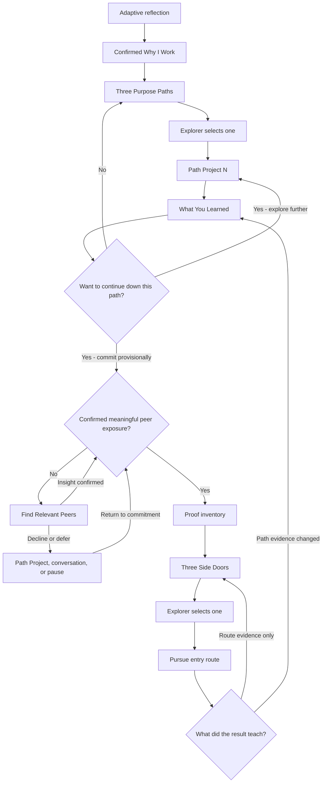
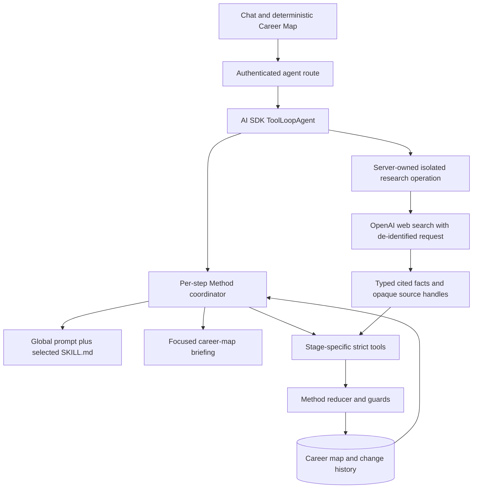
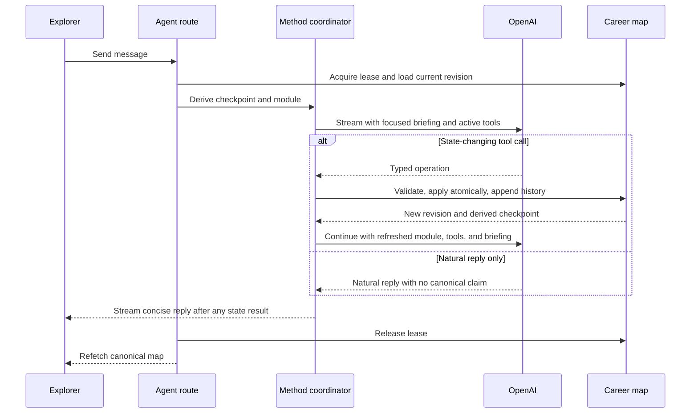
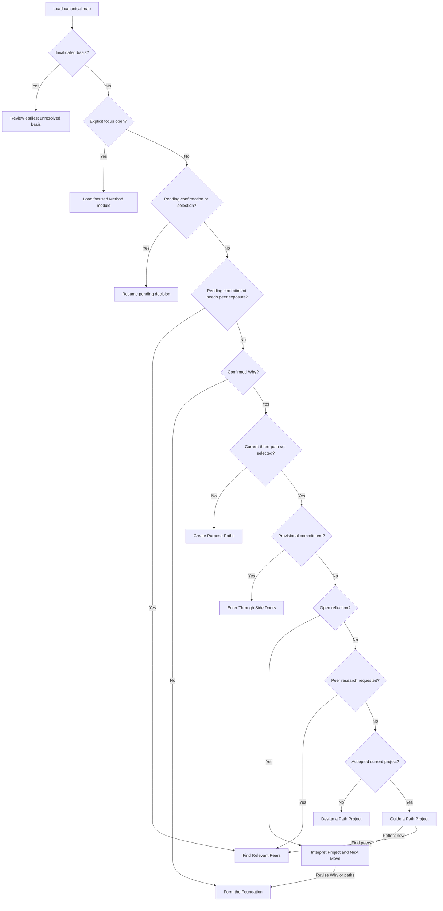
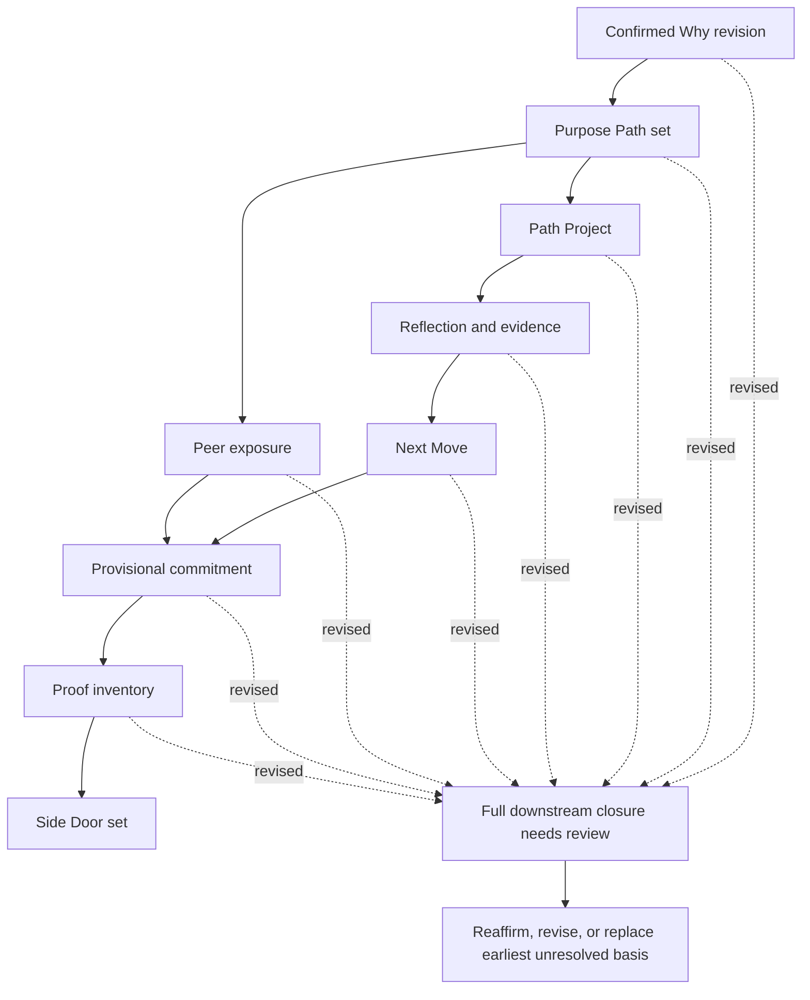

# Revelio Method - Plan

## Goal Capsule

- **Objective:** Give career explorers a personalized, repeatable way to turn reflection into firsthand evidence, use that evidence to choose what to explore next, and enter a provisionally chosen path through work they have already done.
- **Product authority:** `docs/thesis.md` remains the method authority. This Product Contract translates it and the founder-settled decisions into testable product behavior. Until its Definition of Done is met, `docs/plans/2026-08-14-claude-feat-revelio-revamp-plan.md` remains the implementation authority and must be reconciled with this contract during planning.
- **Open blockers:** None before planning. The Purpose Paths presentation remains a non-blocking prototype question.

---

## Product Contract

### Summary

Revelio will implement the full Method as an adaptive, stateful companion: form a provisional reason for working, compare three ways to serve it, learn through real projects, and either explore further or commit provisionally through Side Doors. The implementation extends the active revamp architecture with a Method kernel, repository-owned modules, typed state operations, deterministic presentation, and behavioral verification while preserving the legacy product.

Product Contract preservation note: all existing R/A/F/AE IDs retain their meaning; R48 and AE14 capture the later session-settled decision that follow-on project selection differs from the single-proposal onboarding experience.

### Problem Frame

Most career guidance tries to infer the right answer from reflection, existing skills, or current job categories. The thesis argues that decisive self-knowledge is often created by doing: reflection suggests possibilities, while real projects reveal fascination, energy, willingness to continue, environmental fit, and the difference between liking an identity and liking the work.

The existing product stops after a questionnaire, three paths, and a static action plan. It cannot help the explorer run a tight feedback loop, interpret ambiguous evidence, revise a direction, or turn accumulated work into an entry route. The method must guide that whole lifecycle without pretending to discover a permanent calling.

### Key Decisions

- **Action creates self-knowledge.** (session-settled: user-approved — chosen over treating the answer as hidden inside the explorer: reflection alone cannot supply the evidence needed to choose.) Governs R1, R2, R20-R26.
- **“Why I Work” is the provisional foundation.** (session-settled: user-directed — chosen over either a fixed ikigai analysis or paths without an accepted foundation: every path must be a different way to serve a statement the explorer recognizes.) Governs R5-R11.
- **The interview is adaptive and coverage-guided.** (session-settled: user-approved — chosen over a fixed questionnaire or a fixed question count: ask as little as possible and probe only when the evidence is insufficient.) Governs R5-R10.
- **The explorer owns consequential choices.** (session-settled: user-directed — chosen over agent ranking or unsolicited recommendations: Revelio may clarify and revise options but recommends only when asked.) Governs R15, R16, R18, R29-R31, R38.
- **The first Path Project is singular; later project choices are comparative.** (session-settled: user-directed — chosen over either three onboarding projects or one proposal forever: onboarding gets one thoughtful proposal, while a later “explore further” decision gets three options and an explicit choice.) Governs R18-R20, R31, R48.
- **Projects combine ambition with a low-stakes first version.** (session-settled: user-approved — chosen over either timid exercises or demanding first commitments: the destination should excite while the first move remains believable.) Governs R19-R22.
- **Evidence, not a quota, decides the Next Move.** (session-settled: user-directed — chosen over fixed project counts, durations, or confidence scores: different explorers need different amounts and kinds of evidence.) Governs R26-R33.
- **Current job definitions do not bound future paths.** (session-settled: user-directed — chosen over forcing each path to reproduce an existing job's “actual practice” or drudgery: real outcome-oriented projects reveal the relevant experience without excluding work that does not exist yet.) Governs R13, R17, R19.
- **Skills are application-managed method modules.** (session-settled: user-approved — chosen over one massive prompt or OpenAI-hosted shell skills: Revelio needs repository-owned guidance selected by career-map state.) Governs R44-R46.
- **The product owns presentation.** (session-settled: user-approved — chosen over runtime-generated visual interfaces: the AI supplies meaning and structured state while deterministic components supply the visual language.) Governs R41-R43.
- **Side Doors present three routes and activate one.** (session-settled: user-directed — chosen over one route after commitment: this later stage can support comparison without adding onboarding burden.) Governs R37-R40.
- **The complete method outruns the first implementation emphasis.** (session-settled: user-approved — chosen over either truncating the method at one loop or building elaborate late-stage surfaces before evidence: the full lifecycle is specified, while the initial build emphasizes one complete learning loop.) Governs R47.

<!-- ce-section: work-relationships -->
### How This Work Fits Together

This plan owns the behavior and boundaries of the Revelio Method. It does not replace the active revamp implementation plan.

- The current revamp plan in `docs/plans/2026-08-14-claude-feat-revelio-revamp-plan.md` remains the implementation authority.
  - **Depends on this contract:** U2's method specification and U7a's prompt behavior must carry these requirements forward.
  - **Needs reconciliation:** Older terms such as ikigai statement, direction path, experiment, and action plan should map to the user-facing method vocabulary in this contract.
- Purpose Paths presentation is a separate design decision.
  - **Depends on this contract:** `ce-prototype` should test whether an explorer can understand three paths, see how each serves their Why, and choose without feeling overwhelmed.
- Pilot learning follows implementation.
  - **May revise this method:** No external explorer has validated the loop yet, so pilot evidence may change the requirements while `docs/thesis.md` remains the method authority.

### Actors

- A1. **Explorer** — an employed adult trying to decide what to work on next.
- A2. **Revelio agent** — the conversational guide that elicits, proposes, researches, supports action, interprets evidence, and preserves continuity.
- A3. **Firsthand beneficiary** — the explorer or someone they know directly who wants the outcome of a Path Project.
- A4. **Peer or field contact** — a person or community whose lived experience can improve a project, a decision, or an entry route.

### Method Lifecycle



Pausing never erases the explorer's place. What You Learned may begin before a Path Project is complete.

### Requirements

**Method stance and voice**

- R1. Revelio treats reflection as a source of possibilities and firsthand action as the primary source of new self-knowledge.
- R2. Revelio never claims to reveal a permanent calling, recover something the explorer already knows, or predict fit with scientific confidence.
- R3. The agent uses an independent Revelio voice: plain, concise, concrete, encouraging without inflated praise, willing to challenge, comfortable with uncertainty, and biased toward one useful move.
- R4. The agent avoids routine recaps, guru language, destiny claims, prestige cues, and verbosity that can be summarized without losing value.

**Foundation: Why I Work**

- R5. The entry interview asks one short question per turn and continues only until it covers revealed fascination, importance and point of view, starting assets and evidence, and the explorer's reality boundary.
- R6. The default opener asks, “What activities pull you in so much that you lose track of time?” and falls back to watching, reading, or thinking only when doing evidence is absent or too weak.
- R7. The interview asks, when not already answered, “If you could fast-forward ten years, what meaningful change would you be proud you helped create?” and follows with what the explorer believes should be done differently when a point of view remains unclear.
- R8. Abilities are starting assets rather than eligibility filters; when evidence is missing, the agent asks what people already rely on the explorer for and seeks concrete support only when needed.
- R9. Before proposing paths, the agent covers what a new direction must fit around now, including income, time, location, responsibilities, health, risk, or no current constraint.
- R10. The agent drafts a concise “Why I Work” statement that names what or whom work is in service of and the explorer's point of view; the explorer may refine it until they explicitly confirm it.
- R11. The confirmed Why I Work is a provisional foundation rather than a permanent identity, excludes detailed economic constraints, and may change when later evidence warrants revision.
- R12. When status, praise, attention, or identity appears to distort the foundation, the agent may ask what the explorer would do if those needs were already satisfied; it does not ask this routinely.

**Purpose Paths**

- R13. After R10, Revelio proposes exactly three distinct Purpose Paths, each a different way to serve the confirmed Why rather than a job title or identity prediction.
- R14. Each Purpose Path contains a clear name, how it serves the Why, what could become possible, evidence for why it may fit, the central unknown, a Path Project preview, and a concise researched view of how it could fit the explorer's life.
- R15. The three paths receive equal visual weight and no ranking, highlight, preselection, or recommendation unless the explorer explicitly asks for one.
- R16. The explorer may question, rewrite, combine, or replace any path; only an explicit choice activates a path, and the current set must remain meaningfully distinct after revision.
- R17. Economic viability, access, credentials, and practical constraints are researched path by path instead of being used to define meaningful work or filter paths by prestige.

**Path Projects**

- R18. After a path is selected and before the explorer has accepted any Path Project, Revelio proposes one thoughtfully designed Path Project for collaborative refinement and offers a completely new suggestion when the explorer is unconvinced.
- R19. A Path Project produces an outcome the explorer personally wants whenever possible; otherwise it serves someone the explorer knows firsthand and can learn from directly.
- R20. Each project brief states what the explorer will make, why they might want it, what it will help them learn, the low-stakes first version, and the first step; the learning section includes one decision-relevant question and one unobtrusive evidence cue.
- R21. Each project points toward an excitingly ambitious outcome through a first version the explorer believes they can start, without turning difficulty into a test of worth.
- R22. Immediately before the first Path Project is accepted, Revelio says: “The point of a project is not to succeed, it's to learn if it's something you'd want to pursue. Think of projects like dating: you start with something chill and low commitment, then invest more only if each date makes you want another.”
- R23. The explorer may revise a project's outcome, audience, scope, medium, or first step before or during execution without restarting the path.
- R24. On request, the agent resumes the active project, finds the smallest useful next action, researches, plans, teaches, or troubleshoots, and reduces scope when needed without doing the core work whose experience would supply the evidence.
- R25. Active-project support is available on demand and when the explorer returns; Revelio does not use timers, proactive reminders, or guilt-inducing check-ins.
- R48. After any completed learning loop, every subsequent Path Project decision produces exactly three distinct follow-on options with equal weight, whether the explorer continues on the same Purpose Path or returns to Purpose Paths and selects another; the explorer may refine or replace them and explicitly chooses one to pursue first.

**What You Learned and Next Move**

- R26. What You Learned is available at any point, including before completion or after stopping, and begins with: “Which parts of Path Project N made you want to keep going, and which made you question the path?”
- R27. Reflection considers energy, absorption, voluntary pull, resistance, the desire to continue, feedback from a firsthand beneficiary or peer, and whether the project answered its learning question; improvement by itself is not treated as a fit signal.
- R28. The agent records evidence without scoring fit, probes only when the evidence is ambiguous, and distinguishes path disinterest from bad scope, a failed step, an external constraint, or a temporary obstacle.
- R29. After reflection, the agent asks, “Do you want to continue down this path?” and treats the explorer's answer as a choice rather than a prediction.
- R30. If the explorer does not want to continue, they may choose a parked Purpose Path, revise the current set, or request new paths before starting another Path Project.
- R31. If the explorer wants to continue, the only formal options are to explore further with another Path Project or commit provisionally and begin Side Doors; research, path revision, unresolved discussion, and pausing remain natural conversation rather than extra menu choices.
- R32. Evidence quality decides whether to explore again or commit; Revelio imposes no fixed project count, duration, confidence threshold, or requirement to finish an artifact.
- R33. Commitment is explicit, provisional, and focused on one Purpose Path; alternative paths are parked rather than deleted.

**Peers**

- R34. The agent introduces peer exposure when it can improve a project or decision and ensures the explorer has meaningful exposure to people in the field before provisional commitment.
- R35. When peer exposure is useful, the agent uses current web research to offer a small curated set, explains why each source or person matters and what to learn, identifies the easiest credible action and access constraints, and may draft an introduction that the explorer chooses whether to send.

**Side Doors**

- R36. After commitment, Revelio drafts a proof inventory from existing work and Path Projects, covering artifacts, problems solved, people helped, demonstrated useful qualities, relevant knowledge and relationships, points of view, and material that can be shared or extended.
- R37. Once the explorer confirms the proof inventory, Revelio researches exactly three current Side Doors with equal visual weight; each names the person, community, organization, or live problem, why the explorer's proof could matter, a useful contribution, the smallest credible first move, and material access constraints.
- R38. The explorer may question, modify, or replace routes and explicitly chooses one to pursue first; the other two remain parked, and Revelio recommends only when asked.
- R39. Revelio may research, shape proof, prepare materials, and draft outreach, but the explorer controls every message, publication, application, or other external action.
- R40. Revelio records Side Door outcomes as route evidence separately from Path evidence; a silent or failed approach does not invalidate the committed path unless doing the underlying work also changes the explorer's desire to continue.

**Conversation, state, and presentation**

- R41. Conversation remains natural streamed text, while accepted foundations, paths, projects, evidence, decisions, and routes are persisted as validated career-map state rather than recovered by parsing prose.
- R42. Deterministic visual components render the canonical state: a Why I Work foundation, three comparable Purpose Paths, the active Path Project, What You Learned, the Next Move, and later the proof inventory and Side Doors.
- R43. The interface uses progressive disclosure to keep the primary decision concise while preserving evidence, practical reality, and uncertainty for inspection; it does not use runtime-generated HTML or visualization skills.
- R44. Revelio's method modules are Form the Foundation, Create Purpose Paths, Design a Path Project, Guide a Path Project, Find Relevant Peers, Interpret a Path Project and Next Move, and Enter Through Side Doors.
- R45. Career-map state determines which method module is active; the model owns interpretation, personalization, and natural language, while deterministic behavior owns lifecycle invariants, validation, persistence, and user confirmation.
- R46. Structured model outputs or strict function calls shape stage-specific state changes and UI data; they do not replace source grounding, user confirmation, or deterministic validation and must not force unsupported content into a required field.

**Delivery scope**

- R47. The complete Method covers Foundation through Side Doors, while the initial implementation emphasizes one complete learning loop and supplies a lightweight conversational Side Doors path if an early explorer commits before dedicated late-stage surfaces exist.

### Key Flows

- F1. **Form the foundation and choose a path**
  - **Trigger:** A1 begins without a confirmed Why I Work.
  - **Actors:** A1, A2
  - **Steps:** A2 asks adaptive questions per R5-R12 → drafts the foundation → A1 revises and confirms it → A2 presents three paths per R13-R17 → A1 discusses, modifies, replaces, and explicitly selects one.
  - **Outcome:** A1 owns a provisional foundation and one active Purpose Path.
  - **Covers:** R5-R17, R41.
- F2. **Design and run a Path Project**
  - **Trigger:** A1 has selected a Purpose Path.
  - **Actors:** A1, A2, optionally A3 and A4
  - **Steps:** For the first project, A2 proposes one project per R18-R22; after a completed learning loop, A2 presents three follow-on options per R48 → A1 refines or replaces the proposal or options → A1 explicitly accepts or selects one → A2 supports execution on demand per R23-R25.
  - **Outcome:** A1 undertakes real work with a known learning question and low-stakes first version.
  - **Covers:** R18-R25, R48.
- F3. **Interpret evidence and choose the Next Move**
  - **Trigger:** A1 completes, stops, or chooses to reflect during a Path Project.
  - **Actors:** A1, A2
  - **Steps:** A2 opens What You Learned → distinguishes the source of the evidence → records what changed → asks whether A1 wants to continue → A1 explores again, returns to Purpose Paths, or commits provisionally.
  - **Outcome:** A1 knows what the project taught them and begins a next step rather than receiving a static verdict.
  - **Covers:** R26-R33, R41.
- F4. **Find relevant peers**
  - **Trigger:** Peer exposure can improve the project or decision, or A1 is nearing commitment without meaningful exposure.
  - **Actors:** A1, A2, A4
  - **Steps:** A2 researches a curated set → explains relevance and the smallest credible action → A1 chooses whether to engage → resulting evidence feeds the active project or Next Move.
  - **Outcome:** A1 learns about the people and environment without carrying the research burden alone.
  - **Covers:** R34, R35.
- F5. **Enter through a Side Door**
  - **Trigger:** A1 commits provisionally to one Purpose Path.
  - **Actors:** A1, A2, optionally A4
  - **Steps:** A2 drafts the proof inventory → A1 corrects it → A2 researches three routes → A1 refines and selects one → A2 helps prepare the contribution and approach → A1 controls external action → A2 separates route evidence from Path evidence.
  - **Outcome:** A1 pursues one concrete entry route using proof accumulated during exploration.
  - **Covers:** R36-R40, R47.

### Acceptance Examples

- AE1. **Covers R5-R10.** Given the explorer already provides strong doing, meaning, assets, and constraint evidence in one answer, when the agent continues the interview, then it does not re-ask those areas and moves toward a Why I Work draft.
- AE2. **Covers R6, R7.** Given the explorer cannot name an absorbing activity, when the agent follows up, then it asks about topics they consume or think about; if their meaningful ten-year change is already clear, it does not ask that question again.
- AE3. **Covers R12, R15-R17.** Given a path appeals mainly through status or identity, when the explorer raises the concern, then the agent investigates the distortion and revises or replaces that path without ranking the alternatives.
- AE4. **Covers R13-R16.** Given the explorer dislikes one of the three paths, when they request a replacement, then only that path changes and the resulting three remain distinct ways to serve the confirmed Why.
- AE5. **Covers R18-R23.** Given the explorer rejects the proposed project, when they ask for something different, then the agent proposes one new project rather than defending the old one or presenting a carousel of options.
- AE6. **Covers R19-R22.** Given a proposed project is a generic portfolio exercise for an imagined client, when its design is checked, then it is revised toward an outcome the explorer or a firsthand beneficiary wants.
- AE7. **Covers R24-R28.** Given the explorer stops before completing the first version, when they open What You Learned, then the unfinished project is treated as evidence and the agent distinguishes path fit from scope, execution, and external obstacles.
- AE8. **Covers R26-R32.** Given the explorer learned something but did not enjoy the project, when reflection begins, then ability growth is not treated as proof of fit and the agent asks which parts increased or reduced the desire to continue.
- AE9. **Covers R29-R33.** Given the explorer wants to continue, when the Next Move is presented, then the formal choices are another Path Project or provisional commitment; if they do not want to continue, they return to Purpose Paths instead.
- AE10. **Covers R34, R35.** Given peer exposure would resolve an important uncertainty, when the agent introduces it, then it provides researched starting points, relevance, access constraints, and a smallest credible action rather than a generic networking checklist.
- AE11. **Covers R36-R39.** Given the explorer commits, when Side Doors begins, then the agent confirms a proof inventory, presents three researched routes without ranking them, and activates only the route the explorer selects.
- AE12. **Covers R40.** Given the selected Side Door receives no response but the explorer still wants the underlying work, when the outcome is interpreted, then the agent revisits the parked routes or researches replacements without treating silence as evidence that the Purpose Path is wrong.
- AE13. **Covers R41-R46.** Given the agent proposes or changes canonical career-map information, when the turn completes, then the state change is validated and confirmed separately from the concise conversational reply, and the UI renders the validated state without parsing the reply.
- AE14. **Covers R18, R31, R48.** Given the explorer has completed a learning loop and chooses to explore further, when the next Path Project is designed, then the agent presents exactly three equal-weight options, supports refinement or replacement, and activates only the option the explorer explicitly chooses to pursue first.

### Success Criteria

- An explorer who completes a Path Project can identify what firsthand evidence changed, decide whether to continue, switch, or commit, and begin the corresponding next step.
- The method preserves evidence across projects and sessions so later paths, projects, and entry routes build on what the explorer has done rather than restarting from reflection.
- The explorer can challenge and revise every consequential output and never has to accept a ranked recommendation or unsupported certainty.
- A valid Method exit always leads somewhere actionable: another project, another path, provisional commitment through Side Doors, or a pause that preserves progress.

### Scope Boundaries

**Sequenced inside this plan**

- Final Purpose Paths layout and interaction details begin only after the U6 `ce-prototype` contract is selected; they are not deferred beyond this plan.

**Deferred for later**

- Dedicated Side Doors UI, outreach automation, and elaborate transition tracking beyond the conversational behavior in R47.
- Proactive reminders, scheduled check-ins, or notification systems.

**Outside the method's identity**

- Career fit scores, permanent declarations, prestige-based rankings, or a claim that introspection can reveal one correct answer.
- Mass outreach, generic networking scripts, autonomous messages, or publishing on the explorer's behalf.
- Generic projects built mainly to signal employability, invented clients when firsthand demand is available, or forced simulations of today's job descriptions.
- A fixed number of projects, a fixed exploration duration, or artifact completion as the universal stopping rule.

### Dependencies and Assumptions

- `docs/thesis.md` is the current method authority; dated research supplies evidence and hypotheses but cannot override it.
- The current revamp plan supplies persistent conversation, career-map state, web search, and return-session behavior that this method depends on.
- No external explorer has yet validated the complete lifecycle; the first pilot loops must be treated as method evidence rather than proof that the method works.
- Current web research is available when path economics, peers, projects, or Side Doors require facts beyond the explorer's own evidence.

### Sources and Research

- `docs/thesis.md` — method authority and source for the action-first, project-as-dating thesis.
- `docs/plans/2026-08-14-claude-feat-revelio-revamp-plan.md` — current implementation authority, including U2, U7a, and the initial discovery-loop scope.
- `docs/research/2026-08-11-what-to-work-on-research.md` — historical research on exploration, representative experiments, and provisional commitment.
- `docs/research/2026-08-11-what-to-work-on-product-direction.md` — historical product-loop framing and the contradiction in the legacy “already know” assumption.
- `docs/research/2026-08-25-vocation-competitor-dossier.md` — historical comparison between role-fit investigation and firsthand person-path evidence.
- `docs/research/2026-08-28-side-doors-career-entry.md` — historical research on proof-first, contribution-first career entry.
- `server/ai/prompts.ts` and `shared/streaming-schemas.ts` — legacy prompt and output behavior that planning must not treat as the new Method.

---

## Planning Contract

### Authority and Reconciliation

`docs/thesis.md` remains the Method authority. This artifact owns the Method Product Contract and the technical reconciliation required to implement it. `docs/plans/2026-08-14-claude-feat-revelio-revamp-plan.md` remains the repository's implementation authority until its Definition of Done is met, so U1 must amend that plan before any Method code unit begins.

The reconciliation keeps the revamp plan's platform, identity, conversation, concurrency, and rollout decisions. It replaces the Method assumptions in its R2, R6, R8, R9, R17, R18, U4-U8, and U10 with this Product Contract. If the two plans still disagree after U1, the thesis wins on Method behavior, this Product Contract wins on product behavior, and the reconciled revamp plan wins on implementation sequencing.

### Key Technical Decisions

- KTD1. **Use a Method kernel inside the existing career-map document.** One JSONB document remains the durable product memory, but its runtime model is composed from domain schemas for Foundation evidence, Why revisions, Purpose Path sets, Path Project cycles, reflections, peer exposure, commitment, proof, Side Doors, and evidence. A `schemaVersion` governs document compatibility separately from the row revision used for compare-and-swap writes. Implements R41, R42, R45, R46.
- KTD2. **Derive checkpoints instead of storing one linear stage.** A pure selector derives the current Method module and decision from canonical records. One durable focus record may open reflection, peer research, Foundation revision, or path revision without closing the underlying work. Precedence is invalidated-basis review, explicit focus, pending confirmation or selection, pending-commitment peer exposure, then the normal lifecycle; closing focus recomputes the checkpoint from current state instead of restoring a stale stage. Implements R23-R35, R44, R45.
- KTD3. **Load repository-owned `SKILL.md` modules through the application.** (session-settled: user-approved — chosen over one massive system prompt or OpenAI-hosted Skills: the Method must be versioned with the product and selected from career-map state.) A small global prompt carries voice and invariants; the loader adds one active Method module and a focused briefing. The application validates every registered bundle at startup and in tests; the final build registers and packages all seven. Implements R3, R4, R44, R45.
- KTD4. **Use strict function tools for state changes and streamed text for conversation.** (session-settled: user-approved — chosen over one structured response object: chat should remain natural while canonical changes stay typed.) Each Method module exposes a small tool set with narrow Zod schemas. The chat reply has no global `Output.object` contract. A mutation-capable step does not release state-dependent prose until its operation result is known; after a committed, conflicted, or rejected operation, a fresh narration step streams from authoritative state. An aborted request emits no further prose; retry or reload derives any later explanation from canonical state. Natural conversation that makes no canonical claim may stream normally. Implements R41, R45, R46.
- KTD5. **Route every state change through narrow domain operations.** Generic upserts, generic confirmation, and unrestricted workspace patches are replaced by the same versioned operations for agent tools and UI actions. Exact-three Purpose Path sets, exact-three follow-on project option sets, exact-three Side Door sets, path selection with sibling parking, project replacement, commitment, and transitive dependent invalidation are atomic. Combining two Purpose Paths is also one atomic set replacement: the merged path and a newly proposed third path land together, so the current set never leaves the exact-three invariant. The storage boundary validates the complete post-state before compare-and-swap commit and again on load; invalid persisted state fails closed into repair-required without entering a briefing. Implements R13-R18, R23, R31, R33, R37-R41, R48.
- KTD6. **Keep conversational confirmation and make it auditable.** (session-settled: user-approved — chosen over a mandatory extra confirmation button: the explorer should remain in conversation.) A confirm or select operation may target only one pending revision that was rendered in a completed prior assistant turn, or an explicit UI action. Its provenance is the current user action after that presentation. The reducer rejects same-turn self-confirmation, stale or edited targets, multiple-target generic assent, and illegal transitions; a valid confirmation may refresh the module and continue in the same assistant response. Implements R10, R16, R18, R22, R29, R33, R38, R45.
- KTD7. **Separate agreement, work, reflection, and evidence.** A Path Project proposal can be suggested, confirmed, parked, or superseded; its work can be not started, in progress, stopped, or completed. Each append-only reflection session has immutable identity and revision, may open at any work status, and cannot overwrite the evidence snapshot supporting an earlier choice. Replacing an unaccepted proposal keeps the same project number, while choosing to explore further creates Path Project N+1 from an atomic three-option set. Implements R18-R32, R48.
- KTD8. **Preserve lineage and invalidate downstream conclusions without deleting history.** (session-settled: user-approved — chosen over destructive cascades or silently carrying conclusions across changed foundations: completed work remains evidence, but dependent decisions must be reviewed.) Paths reference a confirmed Why revision; projects and learning choices reference path and evidence revisions; commitment references its Next Move and peer exposure; proof and Side Doors reference their supporting revisions. Changing any basis atomically marks the full downstream closure for review, disables later-stage tools, and routes to the earliest unresolved basis until the explorer reaffirms, revises, or replaces it. Implements R11, R16, R23, R33, R38, R41.
- KTD9. **Require confirmed peer exposure before commitment without requiring outreach.** (session-settled: user-approved — chosen over treating search suggestions as exposure or forcing direct contact: exposure must produce decision-relevant insight while external action remains voluntary.) A qualifying record links the active path to a real person, community, or first-person source and stores an explorer-confirmed insight. Missing exposure opens Find Relevant Peers instead of completing commitment. If the explorer declines, commitment intent remains visibly pending, other Path Projects and conversation remain available, and Revelio names the smallest passive first-person source once without repeatedly prompting on return. Implements R34, R35.
- KTD10. **Isolate research, persist cited provenance, and keep all external action human-controlled.** The main conversational loop never executes hosted search with raw Conversation or career-map context. A server-owned research operation builds and validates a minimum, de-identified request, runs web search in an isolated context, and returns typed candidate facts plus opaque source handles. Raw retrieved text is untrusted and has no tool-authorizing authority; only Suggested researched records may cite it. Before a researched claim enters canonical state, the server resolves its handle to a current provider result identifier, HTTPS URL, retrieval time, available title, and the exact citation excerpt or result content associated with the claim. If the provider cannot expose enough content to verify that association, the record is labeled cited provenance rather than server-validated support. A minimal persisted research-attempt record may hold status, query category, and validated public candidate/source references outside any exact-three proposal invariant, so insufficient or failed research survives refetch without becoming a path, project, peer, or route. User-supplied sources use a distinct provenance kind. Revelio may store drafts but exposes no tool that sends, publishes, applies, or messages. Implements R17, R35-R40, R46.
- KTD11. **Render canonical state with deterministic components.** (session-settled: user-approved — chosen over runtime-generated visualizations: the product should own hierarchy, accessibility, and visual consistency.) Purpose Paths pass through a `ce-prototype` decision before their final layout. The initial Side Doors tail uses simple validated map sections; dedicated late-stage UI remains deferred. Implements R15, R37, R38, R42, R43, R47.
- KTD12. **Refresh state, module, tools, and briefing after every committed operation.** Every tool result reports committed, idempotent replay, conflict, or rejected; it includes the authoritative map revision, derived module, and pending decision. The loop reloads and re-runs the selector before the next model step, so confirming Why can generate paths in the same turn and stale tools disappear. A conflict reloads and re-derives instead of retrying the old operation. This extends the active plan's request-scoped briefing and step-zero compaction rules without changing its provider ownership. Implements R18, R41, R44-R46.

### Operation and Invariant Ownership

| Change class | Persistence and confirmation rule | Enforcement owner |
|---|---|---|
| Explorer-reported fact or firsthand evidence | Persist immediately as user-authored with message or UI-action provenance; later corrections append supersession. | Operation schema and storage boundary |
| Model summary, interpretation, path, project, proof, or route | Persist as Suggested only; never becomes confirmed in its presentation turn. | Module tool plus KTD6 handshake |
| Consequential choice | Confirm only one previously presented target from a subsequent user action. | Reducer transition guard |
| Deterministic consequence | Park siblings, increment project number, or invalidate dependents in the same transaction as the accepted choice. | Reducer and storage transaction |
| Workspace action | Use the same operation and provenance contract as chat; disabled while the agent lease is held and revision-checked afterward. | UI, route, lease, and reducer |

| Invariant | Primary enforcement | Failure behavior |
|---|---|---|
| One map per explorer, valid row revision, unique operation identity, owned history | Database constraints and transaction | Reject transaction without changing map or history. |
| Exact-three sets, one active selection, legal lifecycle, valid basis references | Reducer and full-map validator | Reject proposed post-state. |
| Persisted document matches a supported schema version | Storage validation on load and before commit | Enter repair-required; preserve the raw record and expose no model briefing. |
| One logical operation creates one revision and one history entry | Compare-and-swap plus unique source identity and payload fingerprint | Same-payload replay returns stored result; different-payload reuse is rejected. |
| Agent and workspace see the same revision and available actions | Shared operation surface plus per-user lease | Disable workspace writes during a turn; refetch on completion, cancellation, or conflict. |

### High-Level Technical Design

Component topology:



One model turn:



Derived Method checkpoints and interrupts:



Dependency revision behavior:



### Output Structure

```text
shared/career-map/
  foundation.ts
  paths.ts
  projects.ts
  learning.ts
  peers.ts
  side-doors.ts
  operations.ts
  reducer.ts
  selector.ts
  index.ts
server/ai/method/
  base-instructions.ts
  registry.ts
  loader.ts
  skills/
    form-foundation/SKILL.md
    create-purpose-paths/SKILL.md
    design-path-project/SKILL.md
    guide-path-project/SKILL.md
    find-relevant-peers/SKILL.md
    interpret-path-project/SKILL.md
    enter-side-doors/SKILL.md
client/src/components/explore/
  foundation-card.tsx
  purpose-paths.tsx
  path-project.tsx
  learning-card.tsx
  next-move.tsx
  research-sources.tsx
  later-stage-state.tsx
```

### Reconciliation Map

| Active revamp area | Method amendment | Owned here |
|---|---|---|
| R2, U2 | Bind the existing thesis and this Product Contract as the complete Method specification; do not author a second thesis. | U1 |
| R6, R8, R9 | Replace practice-testing, ikigai vocabulary, and continue/switch/new with Why I Work, Purpose Paths, Path Projects, What You Learned, and user-owned Next Moves. | U1, U3, U7, U8 |
| KTD5, U4 | Expand the career map into the composed Method kernel with lineage, source provenance, and separate schema/revision versions. | U2, U4 |
| KTD6, U5 | Replace generic upserts and confirmation with shared domain operations and per-step state refresh. | U2, U5 |
| U6 | Render validated Method state and run the Purpose Paths prototype gate. | U6 |
| U7a, U7b | Replace the monolithic prompt with repository-owned modules and stateful golden transcripts. | U3, U5, U7-U9 |
| U8 | Replace the broad return prompt with resumable project guidance, What You Learned, conditional Next Moves, peers, and Side Doors. | U8, U9 |
| U10 | Expand the launch journey to a complete learning loop and an early-commit Side Doors branch. | U10 |

### Sequencing and Prerequisites

U1 is the authority gate. G1 then owns the pre-U2 provider spike and stop condition. The static Purpose Paths `ce-prototype` also begins after U1 and runs in parallel with G1 and U2-U5; its selected presentation contract is a prerequisite only for the connected comparison UI. After G1 passes, U2 defines the model-free Method kernel. U3 can validate the first three Method modules with an in-memory adapter while U4 implements durable storage and briefing. The module registry contains only modules that exist at each incremental step; U8 and U9 expand it atomically, and U10 requires all seven. U5 joins the kernel, registered modules, and storage in the real agent loop and re-runs G1's provider assertions against the integrated coordinator. U6 implements the deterministic presentation contract. U7 proves onboarding through the first accepted project. U8 closes the learning loop and peer guard. U9 adds the lightweight commitment tail. U10 is the integrated launch gate.

The active revamp plan's platform preparation and identity work remain prerequisites and are not duplicated here. U5 must verify that the pinned AI SDK supports per-step tool selection and instruction refresh with OpenAI Conversations. If the provider hook cannot refresh both after a committed tool result, use an explicit one-Response-per-step AI SDK loop that preserves the request lease, stream, abort signal, idempotency, Conversation ownership, and safe compaction boundary. If neither route can preserve those contracts, stop before product integration and surface the provider incompatibility.

### System-Wide Impact

- **Persistent data:** The career-map document changes shape before pilots generate durable Method records. Add explicit schema-version handling and reject unsupported versions rather than guessing migrations.
- **Concurrency:** Agent tools and workspace actions share the active plan's user lease, row revision, idempotent tool-call history, and cancellation behavior. Atomic batches must either commit in full or leave no canonical proposal.
- **Action parity:** Every consequential choice uses the shared reducer and has either an equivalent deterministic UI affordance or an explicitly documented conversation-only reason. Workspace writes are disabled while an agent lease is active; both surfaces refetch after completion, cancellation, or conflict.
- **Prompt context:** The full map can outgrow the active plan's one-page assumption. Each module receives only its relevant confirmed basis, active work, pending proposal, decision evidence, sources, and necessary parked records.
- **Privacy:** The isolated research operation sends only validated, de-identified fields. Foundation constraints such as income, health, location, and responsibilities are sensitive. Application logs and retained test artifacts never contain prompts, briefings, career-map payloads, tool arguments, source bodies, provider responses, or validation payloads; they use opaque user, turn, operation, revision, and error identifiers only. Checked-in and CI-retained transcripts use synthetic explorers. Public peer and Side Door records retain only minimum-necessary professional identity, public source, and relevance data, never scraped private contact details. Research sources and explorer evidence persist in Neon, while conversation remains in OpenAI per the active plan.
- **Erasure:** Account erasure removes the map, history, sources, drafts, leases and idempotency records, conversation mapping, and paginated OpenAI Conversation items. Tombstone preservation applies to ordinary corrections, not privacy erasure; a non-content-bearing pending marker tracks retries until both stores confirm deletion.
- **Pilot learning:** After the MVP is complete, the first consented pilot cohort is reviewed from payload-free canonical event types already present in history—checkpoint reached, proposal revised, replaced or rejected, project accepted or stopped, reflection opened, Next Move chosen, commitment pending or completed, and route selected—plus a short optional debrief. The founder reviews the first five completed or abandoned pilot sessions before expanding access; observed patterns may propose Method or module changes, but they change the live contract only through an explicit plan update.
- **Legacy isolation:** `/legacy`, its Gemini prompts, assessment schemas, anonymous routes, and current tests remain behaviorally unchanged.

### Risks and Mitigations

- **Semantic judgment cannot be reduced to a schema.** Coverage sufficiency, path distinctness, project quality, and explicit conversational assent remain model judgments. Reducer guards, provenance, and golden transcripts make those judgments inspectable without pretending they are deterministic.
- **Strict schemas can force invented values.** Keep operations small, use nullable fields only when absence is meaningful, never require a state-changing call on an unrelated message, and reject unsupported evidence instead of filling required fields with guesses.
- **Same-turn transitions can use stale context.** KTD12 requires a map reload and module re-derivation after each committed tool result; integration tests cover confirmation-to-generation transitions.
- **Hosted web-search output may not expose enough content for claim-level grounding.** The pre-U2 and U5 provider assertions verify result identifiers, URLs, optional titles, citations or snippets, and handle visibility. Missing content downgrades the record to cited provenance; a failed or insufficient search produces no padded canonical set.
- **Basis revisions can orphan active work.** KTD8 marks dependents for review and preserves their history. Destructive generic delete is outside the operation surface.
- **Deployment may meet more than one database baseline.** U4 inspects the real execution baseline. With no released career-map rows, it creates the Method schema directly; if an earlier revamp shape has shipped, it adds a fixture-backed upgrade path from that exact schema version. Writers remain gated until integrity checks pass.
- **JSONB cannot enforce every domain invariant in PostgreSQL.** KTD5 assigns nested cardinality, selection, lifecycle, and lineage to the reducer and full-map validator, then validates on both load and commit. Invalid rows enter repair-required instead of reaching the model.
- **Lease expiry is not an integrity guarantee.** Operation identity, payload fingerprint, compare-and-swap update, and history insertion share one database transaction. Fault-injection and race tests prove exact-once behavior independently of the lease.
- **A provider can emit prose before a tool result or fail after a database commit.** Mutation-capable steps hold state-dependent prose behind KTD4's result barrier. The committed map remains authoritative, and turn, message, operation, revision, and terminal status linkage lets retry or reload recover the original result without duplicate writes or treating partial prose as a conclusion.
- **Method modules can disappear from a serverless bundle.** The loader has startup validation, the existing Vercel include-files rule covers the server tree, and production-mode build verification loads every bundle.
- **Behavioral tests can become model-snapshot brittle.** Deterministic reducer, selector, storage, tool, route, UI, and fake-model tests own invariants. Live golden transcripts run three samples per core journey: state and safety rules pass every run, while qualitative tone, brevity, and distinctness must pass at least two samples without ad-hoc retries; the harness records provider, model, and module versions.

### Planning Sources

- [Vercel AI SDK Agent Skills guide](https://ai-sdk.dev/cookbook/guides/agent-skills) — `SKILL.md` format, progressive disclosure, and application-provided filesystem/load behavior.
- [Vercel AI SDK agent overview](https://ai-sdk.dev/docs/agents/overview) and [loop control](https://ai-sdk.dev/docs/agents/loop-control) — `ToolLoopAgent`, structured workflows, and per-step tool/context control.
- [OpenAI Structured Outputs](https://developers.openai.com/api/docs/guides/structured-outputs) and [function calling](https://developers.openai.com/api/docs/guides/function-calling) — strict schemas for application actions rather than a replacement for natural user-facing text.
- `scripts/openai-provider-spike.mjs` — repository proof that custom tools and OpenAI web search can coexist with request-scoped instructions and completed-turn compaction.

---

## Provider Feasibility Gate

### G1. Prove the provider boundary before the Method kernel

- **Goal:** Falsify the load-bearing OpenAI and AI SDK assumptions before U2-U4 create durable Method architecture.
- **Dependencies:** U1.
- **Files:** `scripts/openai-provider-spike.mjs`; `package.json`; recorded spike evidence in the active revamp plan.
- **Approach:** Extend the existing spike to test both the native per-step refresh route and the explicit one-Response-per-step fallback; isolated research without Conversation context; source-handle, identifier, citation-content, and optional-title availability; state-result narration gating; same-turn confirmation-to-next-module transitions; abort; idempotency; and compaction.
- **Stop condition:** If neither loop route preserves lease, streaming, abort, idempotency, Conversation ownership, same-turn module/tool refresh, and safe compaction together, stop before U2 and surface the provider incompatibility instead of weakening the Product Contract silently.
- **Verification:** `npm run spike:openai` passes against the pinned provider and the chosen native or fallback route is recorded. U5 repeats the same assertions after integration.

---

## Implementation Units

| U-ID | Title | Key files | Depends on |
|---|---|---|---|
| U1 | Reconcile the active revamp authority | active revamp plan | — |
| U2 | Build the Method kernel | `shared/career-map/` | U1, G1 |
| U3 | Load and evaluate the first Method modules | `server/ai/method/`, evaluation script | U2 |
| U4 | Persist and brief the full career map | storage, shared schema, briefing | U2 |
| U5 | Integrate stage-specific tools into the agent loop | agent, tools, route | U3, U4 |
| U6 | Prototype and build deterministic Method presentation | explore components and page | U1 for prototype; U2, U5 for connected UI |
| U7 | Ship Foundation through first Path Project | initial modules, workspace tests | U5, U6 |
| U8 | Close the learning loop and peer guard | guidance, reflection, peer modules | U7 |
| U9 | Add the lightweight Side Doors tail | Side Doors module and state renderer | U8 |
| U10 | Prove the complete Method journey | end-to-end and release verification | U7-U9 |

### U1. Reconcile the active revamp authority

- **Goal:** Amend the active implementation plan so one authority describes the new Method without disturbing its settled infrastructure decisions.
- **Requirements:** R1-R48, F1-F5, AE1-AE14.
- **Dependencies:** None.
- **Files:** `docs/plans/2026-08-14-claude-feat-revelio-revamp-plan.md`.
- **Approach:**
  1. Replace the active plan's conflicting vocabulary, method requirements, career-map shape, generic tools, monolithic prompt, return flow, test scenarios, and Definition of Done using the Reconciliation Map.
  2. Preserve the active revamp plan's KTD1-KTD4 and KTD7-KTD10 platform choices; amend that plan's KTD5 and KTD6 only where this plan's Method kernel and operations require it.
  3. Bind `docs/thesis.md` and this Product Contract rather than duplicating their normative content.
- **Patterns to follow:** The active plan's existing authority hierarchy and stable ID rules.
- **Test scenarios:** Test expectation: none — this unit changes planning authority, not runtime behavior.
- **Verification:** A role-based document review finds no remaining conflict between the active plan, the thesis, and this Product Contract; every changed active unit cites its governing Method requirements.

### U2. Build the Method kernel

- **Goal:** Define the browser-safe canonical state, operations, reducer guards, lineage, and derived checkpoint selector before database or model integration.
- **Requirements:** R10-R18, R23, R26-R34, R36-R48; F1-F5; AE4, AE7, AE9, AE11-AE14; KTD1, KTD2, KTD5-KTD9.
- **Dependencies:** U1 and a passing G1 provider-feasibility gate for either the native per-step refresh route or the explicit one-Response-per-step fallback.
- **Files:** `shared/career-map/*.ts` (new); `shared/career-map/reducer.test.ts` (new); `shared/career-map/selector.test.ts` (new).
- **Approach:**
  1. Compose the map from domain schemas instead of one monolithic Zod object or operation union.
  2. Implement narrow operations for evidence, proposals, revisions, confirmations, selections, work status, reflections, Next Moves, peer exposure, commitment, proof, Side Doors, and evidence outcomes.
  3. Make exact-cardinality sets and multi-record transitions atomic; store basis revisions, confirmation provenance, and operation source IDs.
  4. Define Purpose Path combination as an atomic three-item set replacement: merge the requested pair and propose one replacement third without ever persisting a two-item intermediate set.
  5. Derive the active module and pending decision from canonical records, with explicit interrupt focus for reflection, peers, Foundation revision, and path revision.
- **Execution note:** Implement the reducer and selector test-first; later layers must call this kernel rather than recreate lifecycle rules.
- **Patterns to follow:** Browser-safe schema separation in `shared/streaming-schemas.ts`; transaction-shaped invariants in `server/routes/assessment/utils.ts`.
- **Test scenarios:**
  - Covers AE4. Proposing or replacing one Purpose Path commits one valid three-item set and preserves equal, unranked siblings.
  - Covers AE7. Opening reflection on a stopped or in-progress project records evidence without marking work complete.
  - Covers AE9. Continue-no returns to paths; continue-yes permits only explore-further or provisional commitment as the formal Next Move.
  - Covers AE11. A Side Door selection activates one route and parks two in one operation.
  - Covers AE13. A cancelled exact-three proposal applies all or none, and a replayed operation source ID applies once.
  - Covers AE14. The first project proposal accepts one candidate; a later explore-further cycle requires three options and an explicit selection.
  - Combining two Purpose Paths produces one revised, distinct, unranked three-item set in one operation; it never activates or confirms the merged path implicitly.
  - A stale confirmation target, a second active path, a ranked path field, a fit score, or commitment without qualifying peer exposure is rejected.
  - Revising Why, the active path, or proof inventory marks dependent records for review without deleting evidence.
  - Revising Why from the deepest Side Doors state marks paths, project-dependent decisions, commitment, proof, and routes for review and disables downstream tools until the earliest basis is resolved.
  - Replacing an unaccepted project keeps its number; selecting after explore-further creates Path Project N+1.
  - Every representative canonical state resolves to one expected module under KTD2 precedence; closing an interrupt after the map changes recomputes rather than restores its prior checkpoint.
  - Model-based state-machine tests generate legal operation sequences and assert selector totality, KTD2 precedence, liveness after focus closes, complete dependent invalidation, and that every exposed operation is legal for the derived checkpoint; minimized failures become regression fixtures.
- **Verification:** All Method kernel tests pass without a database or model, and exported schemas remain safe for both browser and server bundles.

### U3. Load and evaluate the first Method modules

- **Goal:** Replace the monolithic prompt with a validated module loader and prove Form the Foundation, Create Purpose Paths, and Design a Path Project before product integration.
- **Requirements:** R1-R22, R41, R44-R46; F1, F2; AE1-AE6; KTD3, KTD4, KTD12.
- **Dependencies:** U2.
- **Files:** `server/ai/method/base-instructions.ts` (new); `server/ai/method/registry.ts` (new); `server/ai/method/loader.ts` (new); `server/ai/method/skills/form-foundation/SKILL.md` (new); `server/ai/method/skills/create-purpose-paths/SKILL.md` (new); `server/ai/method/skills/design-path-project/SKILL.md` (new); `server/ai/method/loader.test.ts` (new); `scripts/eval-revelio-method.mjs` (new); `package.json`.
- **Approach:**
  1. Validate skill frontmatter and load one full module from a fixed registry; do not expose filesystem or skill discovery to the model.
  2. Keep voice, anti-prestige, untrusted-data, brevity, and write-before-summarize invariants in the small base instructions.
  3. Run scripted conversations against the real model with an in-memory reducer, asserting both the reply behavior and committed state after each turn.
  4. Record the module key and content version with each evaluated turn so pilot evidence can be attributed later; register and package only modules that exist at this unit.
- **Patterns to follow:** AI SDK `ToolLoopAgent` usage and request instructions proven in `scripts/openai-provider-spike.mjs`; current `SKILL.md` format from the official AI SDK guide.
- **Test scenarios:**
  - Covers AE1. One rich answer advances coverage without re-asking answered areas and produces a concise suggested Why only when coverage is sufficient.
  - Covers AE2. Weak doing evidence triggers the consumption/thinking fallback, while already-supplied ten-year meaning is not re-asked.
  - Covers AE3. A prestige-distorted path is revised without ranking the alternatives.
  - Covers AE4. A replacement changes only one path and the set remains three distinct ways to serve the confirmed Why.
  - Covers AE5. Rejecting the first project produces one replacement, not a defensive explanation or three options.
  - Covers AE6. An imagined-client portfolio exercise is redirected to a wanted outcome or firsthand beneficiary.
  - Paths never appear before a confirmed Why, and the exact R22 copy appears once immediately before first-project acceptance.
  - The three registered skill bundles load in a production-mode filesystem smoke; an unregistered checkpoint fails closed instead of selecting a missing module.
- **Verification:** Loader tests pass; the live transcript harness records three Foundation-to-first-project samples with expected operations and state, all hard invariants pass, and at least two meet the qualitative rubric without retries.

### U4. Persist and brief the full career map

- **Goal:** Store Method state with atomic history, idempotency, ownership, and focused module briefings while retaining the active plan's JSONB architecture.
- **Requirements:** R11, R17, R23, R26-R40, R41, R45, R46; F1-F5; AE7, AE10-AE13; KTD1, KTD5, KTD7-KTD10.
- **Dependencies:** U2 and the active revamp plan's platform and identity prerequisites.
- **Files:** `shared/schema.ts`; `server/storage.ts`; `server/storage.test.ts`; `server/storage.performance.test.ts` (new); `server/ai/briefing.ts` (new); `server/ai/briefing.test.ts` (new); reviewed Drizzle migration files.
- **Approach:**
  1. Inspect the execution baseline. Create the Method schema directly when no career-map schema has shipped; otherwise add a fixture-backed upgrade from the exact released `schemaVersion` with no speculative backfill.
  2. Store schema version, row revision, operation source and payload fingerprint, confirmation provenance, module version, and researched-source metadata; ordinary domain operations cannot change schema version.
  3. Apply compare-and-swap update and matching history insertion in one transaction with owner scope and database-enforced operation uniqueness. Same-ID/same-payload replay returns the stored result; different-payload reuse is rejected.
  4. Validate the full document on load and before commit, then compile a module-specific briefing from confirmed basis, active work, pending decisions, relevant evidence and sources, and necessary parked or stale records.
  5. Preserve tombstones and revision lineage for normal corrections, while implementing the active plan's cross-store erasure contract for all Method records and OpenAI Conversation items.
  6. Before freezing the durable shape, benchmark realistic long-lived explorer fixtures and record falsification bounds for serialized document size, full-map validation time, transaction latency, and concurrent-write behavior. Crossing a bound triggers an append-only child-record or event/summary design review before pilot writes.
- **Execution note:** Add characterization coverage for existing storage before extending it, then land migration and transaction tests together.
- **Patterns to follow:** `IStorage`/`PostgresStorage` in `server/storage.ts`; current Drizzle schemas; the active plan's lease, turn, and change-history contracts.
- **Test scenarios:**
  - Concurrent writes with the same starting revision allow one commit and return a conflict for the other without partial history.
  - Replaying a tool-call source ID returns the original result and does not duplicate a change.
  - Selecting a path, replacing a project proposal, and selecting a Side Door commit all sibling transitions atomically.
  - An owner mismatch cannot read or mutate another explorer's map.
  - No anonymous or legacy route can read, create, or mutate a Method map, history entry, operation record, draft, or researched source.
  - Unsupported `schemaVersion` fails explicitly; row revision increments do not change schema compatibility.
  - Clean-database creation passes; if a released predecessor exists, its fixture upgrades without data loss. An interrupted or unsupported migration leaves Method writers disabled.
  - Fault injection before the map update, between update and history insertion, and at commit leaves either no change or one matching map revision and history record.
  - Same operation identity with a different payload is rejected; races after lease expiry still produce one logical commit.
  - A module briefing omits unrelated historical detail but retains the confirmed Why, relevant basis revision, active object, pending decision, sources, and stale-state warning.
  - Malformed cardinality, duplicate active selection, or dangling basis fixtures enter repair-required and never reach a briefing.
  - Erasure interrupted before provider deletion retries from a non-content-bearing pending marker and completes with no orphaned map, history, source, draft, lease, idempotency, mapping, or Conversation item.
  - After simulated compaction, a corrected map value outranks stale transcript text.
  - Storage, validation, and briefing failures log identifiers, revisions, and error classes only; sensitive payload values never enter logs or retained artifacts.
- **Verification:** Fresh-schema and any real upgrade fixtures pass; storage and briefing tests prove atomic history, exact-once replay, ownership, lineage, repair-required handling, erasure retry, and focused projection.

### U5. Integrate stage-specific tools into the agent loop

- **Goal:** Run the Method kernel through the authenticated AI SDK agent with current-state module selection, strict tools, isolated research, cancellation, and per-step refresh.
- **Requirements:** R17, R24, R35, R39-R46; F1-F5; AE10, AE13; KTD3-KTD6, KTD10, KTD12.
- **Dependencies:** U3, U4 and the active revamp plan's agent route prerequisites.
- **Files:** `server/ai/tools.ts` (new); `server/ai/research.ts` (new); `server/ai/research.test.ts` (new); `server/ai/agent.ts` (new); `server/ai/agent.test.ts` (new); `server/routes/agent.ts` (new); `server/routes/agent.test.ts` (new); `server/routes.ts`; `scripts/openai-provider-spike.mjs`.
- **Approach:**
  1. Wrap shared operations in module-specific AI SDK tools; the tool layer contains no lifecycle logic beyond mapping authenticated context and tool-call provenance.
  2. Before each model step, reload the map, derive the active module with KTD2 precedence, load its instructions, compile its briefing, and restrict active tools; operation results carry the KTD12 status and revision envelope.
  3. Preserve the active plan's OpenAI Conversation, step-zero compaction, lease, message-id idempotency, Stop control, abort propagation, and post-turn refetch contracts.
  4. Expose a server-owned research operation only for path reality, project grounding, peers, or Side Doors. It accepts a narrow research intent, builds and validates a de-identified request, invokes OpenAI web search without Conversation or raw map context, and returns typed candidate facts plus turn-local opaque source handles.
  5. Keep raw retrieved content out of the mutation-capable conversation. Validate typed research output, preserve the exact source association available from the provider, and allow search-derived writes only to Suggested records with cited handles.
  6. Hold state-dependent prose from mutation-capable steps until the operation result is known, then stream a fresh concise narration from authoritative state for committed, conflicted, or rejected results. An aborted request streams nothing further; retry or reload explains any durable result.
- **Execution note:** Start with an integration test for same-turn confirm-and-transition behavior, because stale per-step context would invalidate the architecture.
- **Patterns to follow:** `scripts/openai-provider-spike.mjs` for mixed hosted/custom tools and request instructions; Zod `safeParse` request boundaries in existing routes.
- **Test scenarios:**
  - Confirming a Why commits it, reloads state, exposes Create Purpose Paths tools, and can propose the three paths in the same turn.
  - Selecting a path parks siblings before Design a Path Project is loaded; stale path tools are unavailable on the next step.
  - A newly generated proposal cannot self-confirm in the same assistant turn; a valid later “yes, that Why is right” confirms one target and then generates paths in the same response.
  - Two pending targets plus generic assent, a stale revision, or an edited proposal is rejected without guessing intent.
  - A purely conversational question streams text without being forced into a state-change schema.
  - Ambiguous assent does not call confirmation; an exact pending revision and source message are required when confirmation is attempted.
  - An isolated research/write flow persists only typed claims associated with current opaque source handles; invented, stale-turn, duplicate, or failed-search handles are rejected. User-supplied sources remain distinguishable.
  - Attempts to place names, health, income, exact location, responsibilities, raw reflection text, or other sensitive Foundation fields in the research request are rejected before any search runs.
  - A search result containing instructions to confirm, select, record evidence, reveal data, or call tools cannot authorize a state-changing operation and cannot become user-authored evidence.
  - A source handle resolves to a provider result identifier and the exact citation or result content used by the claim; when that association is unavailable, the record is stored as cited provenance rather than validated support.
  - Prose emitted before a rejected, conflicted, or committed tool call cannot claim that canonical state changed; post-result narration matches the authoritative revision. An aborted request emits no new prose.
  - Abort before operation dispatch writes nothing; abort during the transaction commits fully or rolls back; abort after commit but before acknowledgement replays the stored result without duplication.
  - A compare-and-swap conflict reloads and re-derives the module instead of retrying stale arguments.
  - Workspace and agent operations produce the same reducer result. A workspace action is unavailable during an agent lease, and either surface's completed action refreshes the other to the same revision.
  - No tool can send a message, publish, submit an application, or perform another external action.
- **Verification:** Agent and route tests prove dynamic module/tool selection, strict state writes, isolated de-identified research, prompt-injection resistance, cited provenance, the pre-commit narration barrier, cancellation boundaries, UI/action parity, and existing provider contracts; the live spike re-proves same-turn Why-to-path and path-to-project refresh before and after simulated compaction.

### U6. Prototype and build deterministic Method presentation

- **Goal:** Turn validated career-map state into a concise, accessible workspace without parsing chat or fixing the Purpose Paths layout before testing it.
- **Requirements:** R15, R16, R18, R31, R37, R38, R41-R43, R47, R48; AE4, AE5, AE9, AE11, AE13, AE14; KTD11.
- **Dependencies:** U1 for the static prototype; U2 and U5 for the connected workspace.
- **Files:** `docs/prototypes/revelio-purpose-paths/` (new prototype artifact); `client/src/pages/explore.tsx` (new); `client/src/components/explore/*.tsx` (new); `client/src/components/explore/method-workspace.test.tsx` (new); `client/src/App.tsx`.
- **Approach:**
  1. Immediately after U1, use `ce-prototype` with fixture data to compare a small number of static Purpose Paths presentations against comprehension, equal weight, uncertainty visibility, and choice without recommendation; record the selected presentation contract while U2-U5 proceed.
  2. Define the workspace hierarchy: the derived checkpoint or pending decision is primary; confirmed Why, active path, and active project remain compact context; evidence, parked alternatives, sources, and history stay behind progressive disclosure. Record focus and scroll destinations after confirmation, selection, reflection, interruption, conflict recovery, and mobile tab return.
  3. Render Foundation, Purpose Paths, Path Project, What You Learned, Next Move, sources, and lightweight later-stage state from server-validated data only.
  4. Keep all three path, follow-on project, and Side Door options equal in size, prominence, and initial state.
  5. Record an interaction matrix for Purpose Paths, the single first Path Project, follow-on project sets, and Side Doors: revise, replace, request-new, accept or select, and cancel; which actions have deterministic controls; when an edit creates a new Suggested revision; and when selection clears or siblings park. Refinement never implies confirmation or activation.
  6. Record a UI state matrix for initial loading, empty map, post-turn refetch, operation pending, committed, conflict or stale revision, rejected validation, research failure or insufficient results, and repair-required. Define visible status, enabled actions, draft preservation, focus destination, and recovery; repair-required blocks writes without exposing raw invalid data.
  7. Preserve the active plan's desktop split and mobile Chat/Your Map tabs, post-turn refetch, correction flow, and Suggested/Confirmed language. Use semantic landmarks and headings, neutral comparison-group labels, full keyboard operation, visible and restored focus, status announcements, accessible disabled-state reasons, touch targets, and narrow-screen stacking.
  8. Give every consequential operation an equivalent deterministic affordance or explicit conversation-only reason, and disable workspace writes while an agent turn owns the lease.
- **Execution note:** The fixture-only prototype contract is selected before connected component styling. U6 may scaffold the workspace while it is pending, but the final Purpose Paths comparison cannot land without it.
- **Patterns to follow:** Presentational components in `client/src/components/results/`; existing card, accordion, tabs, scroll-area, resizable, and alert-dialog primitives.
- **Test scenarios:**
  - The map renders only persisted state and never transient streamed objects or synthetic client IDs.
  - Exactly three Purpose Paths render with no score, rank, highlight, preselection, or recommended badge.
  - The first project shows one proposal; a follow-on cycle shows three equal options and activates only the selected one.
  - What You Learned renders for not-started, in-progress, stopped, and completed projects without displaying completion as fit.
  - The Next Move UI shows different formal choices for continue-yes and continue-no while pause and discussion remain conversational.
  - Lightweight proof and Side Door sections remain usable before dedicated late-stage UI exists.
  - Mobile tab changes preserve the unsent chat draft and current map state; sources use sanitized clickable HTTPS links.
  - A UI choice refreshes the next model step to the resulting module and tools; an agent choice refetches the UI to the same map revision.
  - Loading, empty, pending, committed, conflict, rejected, research-failure, insufficient-results, and repair-required fixtures render their specified recovery actions without losing chat drafts or displaying invalid raw state.
  - Revising or replacing a path, first project, follow-on option, or Side Door creates the expected Suggested revision and never confirms or selects it implicitly.
  - Desktop and narrow-screen tests assert semantic grouping, neutral labels, keyboard selection, focus restoration, live status announcements, and the reason a disabled action is unavailable.
- **Verification:** Prototype choice and workspace hierarchy are recorded; component tests cover the interaction and state matrices; automated semantic assertions and a manual keyboard and screen-reader review confirm readable hierarchy, neutral comparison, recovery, and responsive behavior.

### U7. Ship Foundation through the first Path Project

- **Goal:** Integrate the validated first three modules so a new explorer can confirm Why, choose among three paths, and accept one collaboratively designed first project.
- **Requirements:** R1-R23, R41-R46; F1, F2; AE1-AE6, AE13; KTD1-KTD6, KTD11, KTD12.
- **Dependencies:** U5, U6.
- **Files:** `server/ai/method/skills/form-foundation/SKILL.md`; `server/ai/method/skills/create-purpose-paths/SKILL.md`; `server/ai/method/skills/design-path-project/SKILL.md`; `server/ai/briefing.ts`; `client/src/components/explore/*.tsx`; related module, route, and component tests.
- **Approach:**
  1. Integrate adaptive coverage, suggested and confirmed Why revisions, atomic Purpose Path sets, user-controlled path revision and selection, and the single first-project proposal.
  2. Persist interview evidence as it arrives, but keep synthesized Why and agent-created options Suggested until explicit conversational confirmation.
  3. Place the exact R22 project framing once, immediately before the first project confirmation operation.
  4. Resume every incomplete onboarding checkpoint from canonical state rather than replaying a fixed sequence of questions.
- **Patterns to follow:** U3 golden transcripts and U5 operation boundary.
- **Test scenarios:**
  - Covers AE1-AE6 with both reply behavior and expected state after every turn.
  - Reload during incomplete coverage asks the next missing area; reload on a suggested Why resumes refinement rather than generating paths.
  - Reload with three unselected paths resumes comparison; a replacement preserves two siblings and selection activates one.
  - Recommending a path occurs only after an explicit user request and does not persist a rank or preselection.
  - Rejecting or revising the first project keeps one proposal and the same project number until acceptance.
  - The R22 copy is emitted once before acceptance and not repeated on later projects.
- **Verification:** The live and deterministic harnesses complete Foundation through first-project acceptance, and the workspace matches canonical state after reload and compaction.

### U8. Close the learning loop and peer guard

- **Goal:** Support project execution, reflection at any point, a user-owned Next Move, three follow-on project options, path switching, and meaningful peer exposure before commitment.
- **Requirements:** R23-R35, R41-R46, R48; F2-F4; AE7-AE10, AE13, AE14; KTD2, KTD5-KTD9, KTD12.
- **Dependencies:** U7.
- **Files:** `server/ai/method/skills/guide-path-project/SKILL.md` (new); `server/ai/method/skills/interpret-path-project/SKILL.md` (new); `server/ai/method/skills/find-relevant-peers/SKILL.md` (new); `server/ai/briefing.ts`; `server/ai/agent.test.ts`; `client/src/components/explore/path-project.tsx`; `client/src/components/explore/learning-card.tsx`; `client/src/components/explore/next-move.tsx`; related tests.
- **Approach:**
  1. Resume active work by default and expose explicit interrupt operations for reflection and peer research; support scope reduction without doing the core evidence-producing work.
  2. Store multiple reflection sessions and qualitative evidence without a score, quota, duration gate, or artifact-completion requirement.
  3. Separate the desire-to-continue choice from the eventual Next Move. Do not manufacture a formal third menu option while uncertainty is still being discussed.
  4. When explore-further is chosen, propose one atomic set of three equal follow-on projects, allow revision or replacement, and activate the explorer's selection as Path Project N+1.
  5. When commitment is chosen without qualifying exposure, preserve the intent as pending and route to researched peer exposure; complete commitment only after the explorer confirms a decision-relevant insight.
  6. If the explorer declines peer research, keep commitment pending without nagging, leave further Path Projects and ordinary conversation available, and surface the smallest passive first-person source only when the explorer returns to commitment.
- **Patterns to follow:** U2 reducer and selector; U5 isolated research and cited-source validation; exact user-facing prompts in R26 and R29.
- **Test scenarios:**
  - Covers AE7. A stopped project opens with the targeted R26 question and distinguishes path fit from scope, execution, constraints, and temporary obstacles.
  - Covers AE8. Ability growth alone does not become fit evidence; optional signal fields remain absent when unsupported.
  - Covers AE9. Continue-no routes to parked, revised, or new paths; continue-yes exposes only explore-further or provisional commitment as formal choices.
  - Covers AE10. Peer research returns a small current set with relevance, access, smallest action, and an optional draft; search failure returns uncertainty instead of invented contacts.
  - Covers AE14. Explore-further produces three options after the first loop, including after switching paths, and the user selects one to pursue first.
  - Reflection can open before work starts, during work, after stopping, and after completion; repeated reflection appends evidence without overwriting earlier records.
  - A continue choice, Next Move, and commitment retain the exact reflection/evidence and peer-exposure revisions that supported them; later evidence does not rewrite the earlier basis.
  - Strong evidence can support provisional commitment from an unfinished artifact; no project count or confidence score is checked.
  - Existing confirmed firsthand exposure satisfies the commitment guard; mere suggestions do not; direct outreach is never required.
  - Declining peer research leaves commitment visibly pending, does not repeat the prompt on each return, and does not block another Path Project or a pause.
  - Reload at every project, reflection, peer, and Next Move checkpoint resumes the exact unfinished decision.
- **Verification:** A golden transcript completes one full learning loop through both continue branches, and model-free tests prove peer gating, follow-on cardinality, and reflection independence.

### U9. Add the lightweight Side Doors tail

- **Goal:** Let an early explorer who commits provisionally confirm proof, compare three researched entry routes, select one, prepare a contribution, and interpret route outcomes without dedicated late-stage UI.
- **Requirements:** R33-R40, R41-R47; F5; AE11-AE13; KTD5, KTD8-KTD12.
- **Dependencies:** U8.
- **Files:** `server/ai/method/skills/enter-side-doors/SKILL.md` (new); `server/ai/briefing.ts`; `server/ai/tools.ts`; `client/src/components/explore/later-stage-state.tsx`; related shared, agent, route, and component tests.
- **Approach:**
  1. Draft proof only from canonical work and explorer-reported evidence; keep unsupported proof absent and require confirmation before route research.
  2. Persist each Side Door research attempt separately from the route set with running, insufficient, failed, or succeeded status and only handle-resolved public candidate/source data. Only a succeeded attempt with three credible routes may create the researched exact-three set tied to the confirmed proof revision, with equal weight and no unsolicited recommendation.
  3. Store the selected route, two parked routes, prepared materials, and human-controlled next action; do not add external-action tools.
  4. Record route outcomes separately. Return to Path evidence only when the explorer reports that doing the underlying work changed their desire to continue.
- **Patterns to follow:** `docs/research/2026-08-28-side-doors-career-entry.md`; U5 research provenance; U6 generic deterministic later-stage rendering.
- **Test scenarios:**
  - Covers AE11. A confirmed proof inventory produces exactly three unranked researched routes and activates only the explorer's selection.
  - Covers AE12. Silence on a selected route revisits parked or replacement routes while leaving Path evidence unchanged.
  - Missing proof remains absent rather than being inferred to satisfy a required schema field.
  - Fewer than three credible current routes creates no canonical route set. A validated insufficient research-attempt record preserves the credible partial findings and sources for the persisted-only workspace, which reopens research instead of padding the set.
  - Revising proof marks the current Side Door set for review until reaffirmed, revised, or replaced.
  - A drafted introduction remains stored and unsent; no API or tool can perform the external action.
  - Reload after commitment, proof suggestion, proof confirmation, route proposal, route selection, or outcome resumes the exact unfinished Side Door checkpoint.
- **Verification:** The lightweight commitment transcript and deterministic state renderer cover proof through route evidence without a dedicated late-stage workflow surface.

### U10. Prove the complete Method journey

- **Goal:** Make the reconciled active plan's launch gate prove one complete learning loop, the early-commit Side Doors branch, resumption, and legacy isolation.
- **Requirements:** R1-R48; F1-F5; AE1-AE14.
- **Dependencies:** U7, U8, U9 and the active revamp plan's auth, workspace, and deployment units.
- **Files:** `tests/explore.spec.ts` (new); `tests/journey.spec.ts`; `scripts/eval-revelio-method.mjs`; `package.json`; `vercel.json`.
- **Approach:**
  1. Keep deterministic reducer, storage, route, and UI tests as the invariant gate; run live transcripts as a separate behavioral gate.
  2. Exercise the full first loop from adaptive Foundation through project reflection and both Next Move branches.
  3. Exercise an early provisional commitment through peer exposure, proof confirmation, three Side Doors, selection, and route evidence.
  4. Re-run interruption, compaction, reload, responsive workspace, build packaging, auth, and `/legacy` regression checks from the active plan.
  5. Run the pre-pilot data-integrity gate before enabling Method writers: baseline migration, zero-invalid-record audit, transaction fault injection, repair handling, writer-disable rollback, and cross-store erasure retry.
- **Execution note:** Use deterministic provider fixtures for Playwright state transitions; reserve live-model runs for the golden transcript gate so end-to-end tests remain repeatable.
- **Patterns to follow:** `tests/journey.spec.ts`, `playwright.config.ts`, and the active revamp U10 launch contract.
- **Test scenarios:**
  - A new explorer completes Foundation, replaces one path, selects another, accepts the single first project, records unfinished-project learning, and chooses explore-further from three options.
  - A separate explorer reaches pending commitment without exposure, completes a researched passive exposure, confirms proof, selects one of three Side Doors, and records a silent route outcome without changing Path evidence.
  - Reload and simulated compaction at every derived checkpoint preserve the current decision and corrected state.
  - Interrupting after a suggested write leaves recoverable canonical state; cancelled prose is marked stopped and never becomes a conclusion.
  - Desktop and mobile workspaces render the same canonical state, and the legacy anonymous journey passes unchanged at `/legacy`.
  - Production-mode build loads all seven `SKILL.md` bundles and the agent starts with provider switches disabled or enabled as configured by the active plan.
  - A deepest-state Why revision marks the full downstream closure for review, preserves evidence, disables later tools, and resumes at the earliest invalid basis.
  - Provider failure immediately after a committed operation yields one revision and one history record; retry recovers from canonical state with a stopped prior turn.
- **Verification:** All Verification Contract gates pass, the founder reviews both golden journeys, and the reconciled active plan's production smoke succeeds.

---

## Verification Contract

| Gate | Command or evidence | Applies to | Done signal |
|---|---|---|---|
| Type safety | `npm run check` | U2-U10 | Shared schemas, tools, UI messages, and components compile without errors. |
| Deterministic unit and integration tests | `npm test` | U2-U9 | Reducer, selector, module loader and registry, storage, briefing, fake-model operation order, agent, route, and component scenarios pass; hard invariants do not depend on a live model. |
| Method golden transcripts | `npm run eval:method` | U3, U7-U9 | Three synthetic live samples per core journey record provider/model/module versions; state, safety, required copy, and Method-stance rules pass every run, and at least two samples meet the qualitative rubric without retries. |
| Provider capability | `npm run spike:openai` | G1, U5 | Native or fallback per-step refresh, isolated research, source-handle/content availability, result-gated narration, same-turn transitions, and safe compaction are proven against the pinned provider. |
| Browser journey | `npm run test:e2e` | U10 | Complete learning-loop, Side Doors, responsive workspace, auth, and legacy journeys pass. |
| Production build | `npm run build` | U3, U6, U10 | Client/server bundles build and every currently registered Method bundle loads in production mode—three at U3 and all seven at U10. |
| Data integrity | Reviewed Drizzle SQL plus disposable-branch integrity drill | U4, U10 | Fresh schema and any real predecessor fixture pass; zero invalid or orphaned records, exact-once fault injection, repair-required behavior, writer-disable rollback, and erasure failure/retry are proven before pilot writes. |
| Purpose Paths presentation | `ce-prototype` artifact plus founder selection | U6 | One deterministic comparison contract is selected before final component styling. |
| Workspace UX and accessibility | Component assertions, manual screen-reader check, and `npm run test:e2e` | U6, U10 | State recovery, hierarchy, keyboard use, focus restoration, announcements, neutral comparison, and desktop/mobile behavior match the U6 contracts. |
| Authority coherence | Role-based `ce-doc-review` | U1 | Thesis, Method Product Contract, and active revamp plan contain no conflicting live instruction. |

Live transcripts assess decisions and state writes rather than general phrasing, with three declared exact-copy exceptions: the R22 project framing, the R26 reflection opener, and the R29 continue question must appear in the required place on every applicable sample. A passing sample records the active module, exposed tools, operation, resulting map revision, provider/model/module versions, and concise reply shape for each turn. Any state, confirmation, privacy, external-action, safety, exact-copy, or Method-stance violation fails the gate on its first occurrence; Method-stance violations include permanent-calling or destiny claims, fit scoring, prestige ranking, and unsolicited recommendation language. Tone, one-question brevity, and semantic distinctness use the declared two-of-three qualitative threshold. Deterministic tests remain the release gate for invariants, ordering, resumption, conflicts, and failure paths.

---

## Definition of Done

- G1 and U1-U10 are complete, and the active revamp plan is reconciled before Method code lands.
- Every existing Product Contract requirement, flow, and acceptance example plus R48 and AE14 is covered by a named deterministic, transcript, prototype, or end-to-end check.
- A new explorer can confirm Why I Work, compare and revise three Purpose Paths, select one, accept one first Path Project, reflect at any work status, and make a user-owned Next Move.
- Choosing explore-further after a learning loop presents three equal Path Project options and activates only the explorer's explicit selection as the next numbered project.
- Provisional commitment cannot complete without confirmed meaningful peer exposure, but no direct outreach or external action is required.
- An early committed explorer can confirm proof, compare three researched Side Doors, choose one, prepare an approach, and record route evidence separately from Path evidence.
- Natural chat is never parsed to recover canonical state; every consequential conclusion is applied through a validated, versioned, auditable operation before the turn summarizes it.
- A mutation-capable turn never releases a canonical-state claim before its operation result; rejected, conflicted, and committed writes are narrated from the authoritative revision, while an aborted request emits no further prose and is explained only after retry or reload.
- Every same-turn state change refreshes the Method module, tools, and briefing before the next model step.
- The workspace renders only validated canonical state, preserves equal-weight choices, uses the selected Purpose Paths prototype contract, and has tested loading, conflict, rejection, insufficient-results, repair, keyboard, screen-reader, and responsive states.
- Raw Conversation and career-map context never enters web search. Search-derived claims retain de-identified cited provenance and no tool authority; failed or insufficient research creates no fabricated or padded canonical entity.
- Logs and retained evaluation artifacts contain no personal reflection, Foundation constraint, career-map, briefing, tool-argument, source-body, or provider-response payloads.
- Every persisted map passes the full-document validator, every logical operation has at most one matching history record, and the pre-pilot integrity audit reports zero unsupported documents, dangling references, invalid cardinalities, duplicate active records, or duplicate operation identities.
- The fresh-schema or real predecessor migration, writer-disable rollback or roll-forward repair, and cross-store erasure failure-and-retry drills pass before pilot accounts receive Method write access.
- `/` serves the authenticated Method experience and `/legacy` retains its existing anonymous behavior, schemas, prompts, provider, and journey.
- `npm run check`, `npm test`, `npm run eval:method`, `npm run spike:openai`, `npm run test:e2e`, and `npm run build` pass on the final state under the Verification Contract thresholds.
- Cleanup is complete: no generic Method upsert bypass, runtime-generated visualization path, abandoned prompt experiment, orphaned state transition, or dead prototype code remains in the diff.
