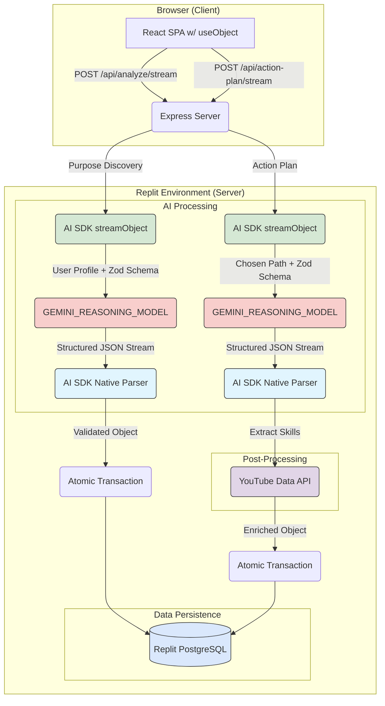

# Ikigai Finder Technical Specification

# Project Name

Ikigai Finder

## Project Description

An AI-powered web application designed to help career-switchers and students find their *ikigai* (a reason for being) and navigate their career path. The application, guided by an AI persona, will go beyond simple skills-matching to incorporate a user's core values, personality, and life priorities. The MVP will focus on delivering three distinct and actionable ikigai-aligned career paths based on a comprehensive user assessment. The user will select one and then the app will deliver an action plan for that path. The user experience is built around a real-time, word-by-word streaming interface, where results and plans are generated and displayed progressively. The platform will be fully bilingual (English and Spanish) from launch.

## Target Audience

  - Career-switchers and students, treated as a unified group for the MVP.

## Desired Features

### Purpose Discovery

  - [ ] User completes a structured, multi-part questionnaire to identify their passions, skills, values, and economic needs.
  - [ ] The AI analyzes the user's input.
  - [ ] The system generates and displays a summary of the user's core drivers.
  - [ ] The system presents three distinct "Purpose Paths" for the user to choose from.
  - [ ] Each path includes a title, a short description, and a breakdown of how it aligns with the four ikigai dimensions.
  - [ ] Each path includes a button to proceed to an action plan.
  - [ ] User can export their results page to a PDF document.

### Action Plan & Guidance

  - [ ] Once a user selects a path, the AI generates a detailed, step-by-step action plan with a timeline.
  - [ ] For each skill in the Skills section, the system recommends the 3 most relevant YouTube videos to learn that skill.
  - [ ] User can export their action plan page to a PDF document.

### Personality and Reasoning

  - [ ] AI persona's personality and writing will mimic that of Paul Graham. It will encourage and explain the why behind every suggestion made to the user in all interactions.
  - [ ] The web application will be built and deployed using Replit.

### General

  - [ ] No user accounts will be required for the MVP; user session data will be stored persistently in a PostgreSQL database, identified by an anonymous session ID.
  - [ ] Full bilingual support for English and Spanish across the entire user interface and AI interactions from day one.

## 1\. System Overview

  - **Core Purpose and Value Proposition:** An AI-powered web application to help users find their *ikigai*. It provides three personalized career paths based on a user's profile. Upon selection of a path, it generates a single, detailed, step-by-step action plan with timelines and milestones. All AI-generated content is delivered via a real-time streaming interface. The entire experience is bilingual (English/Spanish).

  - **Key Workflows:**

    1.  **Assessment & Discovery:** The user completes a questionnaire. After submission, the frontend immediately navigates to /results and initiates a connection to a streaming endpoint (POST /api/analyze/stream). The backend uses Vercel AI SDK's `streamObject` with `GEMINI_REASONING_MODEL` to generate the analysis as structured JSON. The AI generates a "Core Drivers" summary and three "Purpose Paths" with integrated career guidance. The client progressively renders this content using the AI SDK's native streaming protocol, replacing skeletons with live content as structured data arrives. Upon stream completion, the validated result is persisted to the database.
    2.  **Path Selection & Action Plan:** The user selects their preferred path, which immediately navigates them to /action-plan. This page connects to a streaming endpoint (POST /api/action-plan/stream). The backend uses Vercel AI SDK's `streamObject` with `GEMINI_REASONING_MODEL` to generate a comprehensive action plan structured around milestones. After the main content streams, the system performs post-processing to query the YouTube Data API for relevant learning resources. The client progressively renders the plan using structured data. Once streaming and enrichment are complete, the validated plan is saved to the database.
    3.  **Export:** The user can export their results or action plan to PDF.

  - **System Architecture:**

      - **Frontend:** React SPA (Vite, TypeScript), using TanStack Query for server state. UI built with shadcn/ui and Tailwind CSS.
      - **Backend:** Node.js server (Express), orchestrating the AI generation logic.
      - **AI & Data:** Uses **Vercel AI SDK** with **`GEMINI_REASONING_MODEL`** for structured object streaming via `streamObject`. Real-time video data is sourced from the YouTube Data API during post-processing phases.
      - **Data Persistence:** Session data is stored in a **Replit PostgreSQL database**. Schema management and migrations are handled by **Drizzle ORM** and **Drizzle Kit**. A two-database strategy (production and development) is employed to ensure a safe workflow.
      - **Deployment:** The application is packaged for deployment on Replit.

<!-- end list -->



## 2\. Project Structure

The project will be organized with a clear separation of concerns, adding more granularity to the server-side structure.

```
My_Directory_Structure/
├── client/ # Frontend React SPA
│ └── src/
│ ├── components/
│ ├── hooks/ # React Query hooks (split by feature)
│ ├── lib/
│ └── pages/
├── server/ # Backend Node.js/Express server
│ ├── ai/ # Modular AI logic directory
│ │ ├── chains/ # AI streaming chains
│ │ │ ├── action-plan.stream.chain.ts # Logic for streaming action plan
│ │ │ ├── index.ts
│ │ │ └── purpose-discovery.stream.chain.ts # Logic for streaming results
│ │ ├── limiter.ts # Concurrency control for AI requests
│ │ ├── prompts.ts # Manages system prompt generation & persona
│ │ ├── schemas.ts # Re-exports streaming schemas from shared location
│ │ ├── tools.ts # Function-calling tool definitions
│ │ ├── types.ts # TypeScript types for the Gemini API
│ │ └── wrapper.ts # Low-level Gemini API client wrapper
│ ├── db.ts # Drizzle client setup and export
│ ├── routes/ # Feature-based API route handlers
│ │ ├── assessment/ # Assessment-related endpoints (modular)
│ │ │ ├── action-plan.ts # Action plan generation endpoints
│ │ │ ├── assessment.stream.test.ts # Integration tests for streaming
│ │ │ ├── assessment.test.ts # Unit tests for assessment routes
│ │ │ ├── index.ts # Barrel export combining all assessment routes
│ │ │ ├── purpose-discovery.ts # Purpose discovery endpoints
│ │ │ └── utils.ts # Shared utilities for assessment routes
│ │ └── session.ts # Session management endpoints
│ ├── services/ # External API service abstractions
│ │ ├── index.ts # Service exports
│ │ └── youtube.ts # YouTube API service
│ ├── utils/ # Server utilities
│ │ ├── ai-logger.ts # Enhanced AI error logging with structured context
│ │ ├── errors.ts # Structured error handling
│ │ ├── test-app.ts # Test application utilities
│ │ └── validation.ts # Input validation utilities
│ ├── cache.ts # In-memory cache implementation
│ └── storage.ts # PostgreSQL storage class using Drizzle
├── shared/ # Isomorphic code
│ ├── schema.ts # Drizzle/Zod schemas
│ └── streaming-schemas.ts # Browser-safe Zod schemas for AI streaming (single source of truth)
└── .env.example
```

## 3\. Feature Specification

### 3.1 Purpose Discovery

  - **User Story:** As a user, I want to submit my questionnaire and instantly see my results page appear, with the analysis filling in live on the screen.

  - **Implementation Steps:**

    1.  **Navigation & Connection:** The client submits the questionnaire via `POST /api/questionnaire/save`, which saves the responses and returns success. The client then immediately navigates to `/results`. The Results page component mounts, displays a skeleton UI, and uses the Vercel AI SDK's `useObject` hook to connect to `POST /api/analyze/stream`.
    2.  **Backend Generation:** The server receives the request and invokes `streamObject` from the AI SDK with a Zod schema defining the expected structure. The prompt instructs the AI to generate the analysis as structured JSON matching the schema.
    3.  **Streaming:** The AI SDK handles the structured streaming protocol, sending partial objects that are automatically parsed and validated.
    4.  **Progressive Rendering:** The `useObject` hook provides partial data as it arrives. React components render skeleton states until their corresponding data fields become available, then progressively fill with the streamed content.
    5.  **Persistence:** When the stream completes, the server validates the final structured object against the Zod schema and persists it to the database. The client receives the complete object for sessionStorage to handle page refreshes without re-streaming.
    
### 3.2 Action Plan Generation

  - **User Story:** After choosing my path, I want a single, detailed, step-by-step action plan with a timeline, project ideas, and embedded learning resources to help me start immediately.

  - **Implementation Steps:**

    1.  **Navigation & Connection:** When the user clicks "Get Action Plan," the client immediately navigates to `/action-plan?pathId=X`. The ActionPlan page component mounts, shows a skeleton UI, and uses the Vercel AI SDK's `useObject` hook to connect to `POST /api/action-plan/stream`.
    2.  **Backend Generation:** The server invokes `streamObject` with a Zod schema for the action plan structure. The AI generates the plan as structured JSON, with YouTube video enrichment happening as post-processing after the main content streams.
    3.  **Streaming & Rendering:** The AI SDK streams partial action plan objects. The `useObject` hook provides milestone data as it becomes available, allowing React components to progressively render each milestone with its timeline and actions.
    4.  **Persistence:** Upon stream completion, YouTube videos are fetched and integrated into the plan, then the complete validated object is saved to the database. The client receives the enriched plan for sessionStorage.

-----

## **4. Database Schema**

The schema is defined in `shared/schema.ts` using Drizzle ORM syntax for PostgreSQL.

### **4.1 Tables**

  - **`assessment_sessions`**: Stores the top-level session information.
      - `id`: `serial` (PK)
      - `session_id`: `text` (UNIQUE, NOT NULL)
      - `language`: `text` (NOT NULL, 'en' or 'es')
      - `responses`: `jsonb`
      - `core_drivers_analysis`: `jsonb`
      - `chosen_path_id`: `integer` (FK to `purpose_paths.id`, NULLABLE)
      - `action_plan`: **`jsonb`** (Stores the detailed action plan with milestones, e.g., `{ milestones: [{ title: string, timeline: string, actions: string[], skills: [{...}] }] }`)
      - `created_at`: `timestamptz` (with timezone, default now)
      - `updated_at`: `timestamptz` (with timezone, default now)
  - **`purpose_paths`**: Stores the three generated paths for a session.
      - `id`: `serial` (PK)
      - `assessment_id`: `integer` (FK to `assessment_sessions.id` ON DELETE CASCADE)
      - `title`: `text`
      - `description`: `text`
      - `ikigai_alignment`: **`jsonb`** (The `pay` property within this object contains the full narrative text about salary information, including source URLs).
      - `action_strategy`: `text`

-----

## **5. Server Actions & AI Strategy**

### **5.1 AI Implementation Strategy**

The strategy is updated to leverage the best model for each task while simplifying the final output.

#### **Simplified AI Strategy with Vercel AI SDK**

| Component | Purpose | Model | Implementation |
| :--- | :--- | :--- | :--- |
| **Purpose Discovery** | • Generate structured career analysis with core drivers and three purpose paths \<br\>• Include salary information narratively embedded | **`GEMINI_REASONING_MODEL`** | Single `streamObject` call with Zod schema validation. Simplified prompt focuses on JSON structure matching UI expectations. |
| **Action Plan** | • Generate detailed milestone-based action plan \<br\>• Structure ready for YouTube video enrichment | **`GEMINI_REASONING_MODEL`** | Single `streamObject` call followed by post-processing to add YouTube videos. Maintains coherent narrative. |


### 5.3 AI SDK Integration (`server/ai/`)

  - **Description:** Simplified AI integration using Vercel AI SDK for reliable structured streaming.
  - `schemas.ts`: Re-exports streaming schemas from `shared/streaming-schemas.ts` for backward compatibility.
  - **Single Source of Truth:** All streaming schemas are defined in `shared/streaming-schemas.ts` to prevent drift between frontend and backend. This browser-safe file contains only Zod schemas with no Node.js dependencies.
  - Streaming endpoints use `streamObject` directly in route handlers, eliminating the need for complex chain orchestration.
  - Post-processing (like YouTube video enrichment) happens after the main content streams, keeping the architecture simple.

## 6\. Design System

### 6.1 Visual Style

| Token | Hex | Description |
| :--- | :--- | :--- |
| `--primary` | `#3B82F6` | Main interactive elements, links. |
| `--secondary` | `#8B5CF6` | Secondary accents, part of gradients. |
| `--accent` | `#F59E0B` | Highlighting secondary info (e.g., icons on welcome page). |
| `--success` | `#10B981` | Success states, positive feedback. |
| `--background` | `#F8FAFC` | Main page background color. |
| `--gradient-primary` | - | `linear-gradient(135deg, var(--primary), var(--secondary))` |

  - **Typography:** Inter (weights 300-700). Base size 16px, with a 1.25x scale for headings.
  - **Layout:** 4-point grid system for spacing. Cards and buttons feature a large corner radius (`--radius: 0.75rem`).

### 6.2 Core Components

  - **Layout:** `Header`, `Main Content`, `Footer` (implicit).
  - **Interactive:** `Button`, `QuestionCard`, `PurposePaths` cards.
  - **Display:** `CoreDriversSummary`, `SalaryBenchmarks` table, `ActionPlan` view.
  - **States:** Interactive components will have clear `hover`, `focus`, `active`, and `disabled` states as provided by `shadcn/ui`, ensuring accessibility (WCAG 2.1 AA).

## 7\. Component Architecture

  - **Error Handling:** Components will be wrapped in a React `<ErrorBoundary>` to gracefully handle rendering errors without crashing the application.

## 8\. Authentication & Authorization

  - **MVP Strategy:** No user accounts. Session is anonymous and identified by `sessionId`.
  - **Session Token:** The `sessionId` will be stored in both `sessionStorage` for client-side access and a `httpOnly`, `SameSite=Lax` cookie.

## 9\. Data Flow

  - **Client ↔ Server: Vercel AI SDK Protocol** powers the streaming interface using Server-Sent Events (SSE) with automatic parsing and validation. Standard REST API calls (POST, GET) are used for initial data submission (questionnaire) and session management.
  - **Server-Side:** Route handlers use `streamObject` directly with Zod schemas for validation. The AI SDK handles the streaming protocol automatically, eliminating the need for custom parsers or delimiter handling.
  - **State Management:** Client-side streaming is managed by the AI SDK's `useObject` hook, which provides partial data as it arrives. Both frontend and backend use identical Zod schemas from `shared/streaming-schemas.ts` to ensure type safety and validation consistency. TanStack Query is used for non-streaming server state. Data is persisted in sessionStorage on stream completion to handle page refreshes gracefully.

## 10\. Environment Variables

The application will require the following environment variables to be set. On Replit, these will be configured in **Secrets**. For local development, they will be in an `.env` file.

  - `DATABASE_URL`: The full connection string for the PostgreSQL database.
  - `GEMINI_API_KEY`: The API key for Google AI Studio.
  - `GEMINI_REASONING_MODEL`: The identifier for the main analysis model.
  - `YOUTUBE_API_KEY`: A valid API key from the Google Cloud Console with the YouTube Data API v3 enabled.